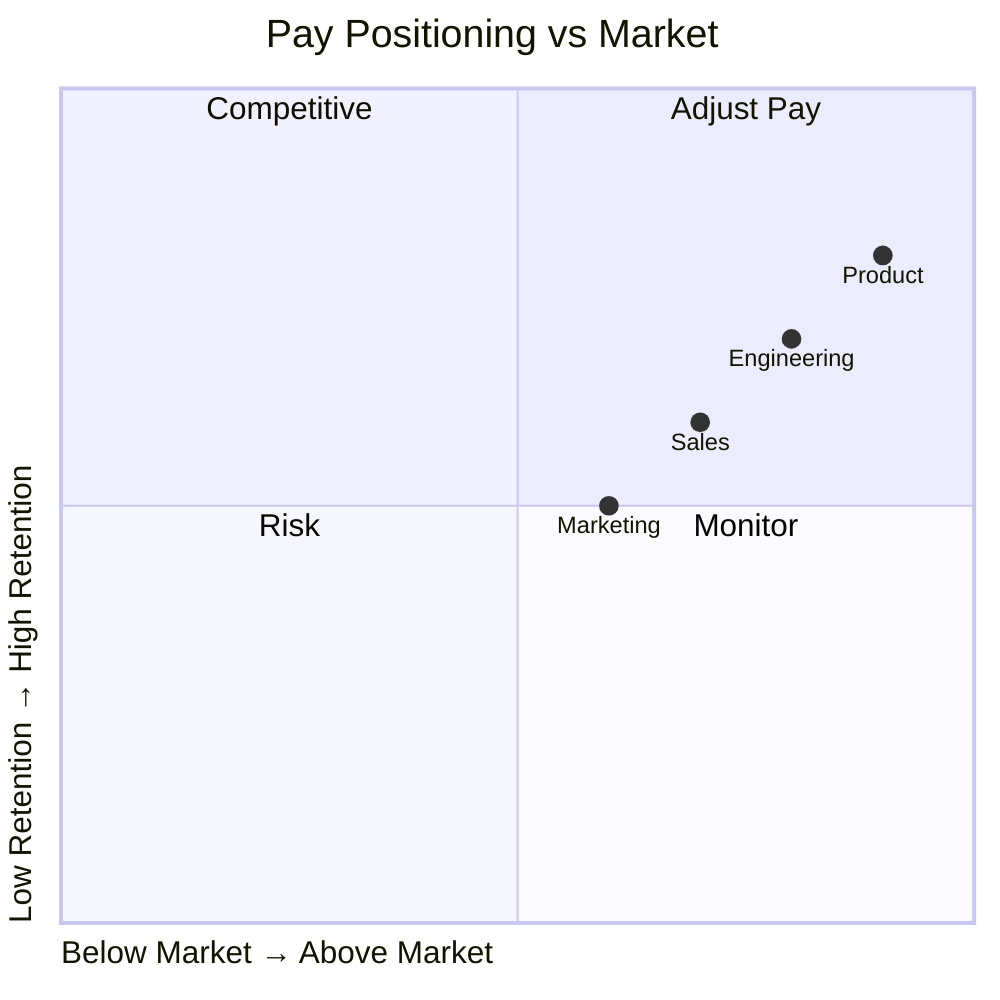

# Compensation Benchmarking Report

<!-- Salary and benefits market analysis -->

---

## Document Control

| Field           | Value           |
| --------------- | --------------- |
| **Report Date** | [DD-MMM-YYYY]   |
| **Prepared By** | HR/Compensation |
| **Market Data** | [Source]        |
| **Currency**    | [USD/EUR/etc]   |

---

## Market Overview

### Salary Benchmarks

| Role                | Level | P25  | P50 (Median) | P75  | P90  |
| ------------------- | ----- | ---- | ------------ | ---- | ---- |
| Software Engineer   | IC3   | $[X] | $[Y]         | $[Z] | $[W] |
| Software Engineer   | IC4   | $[X] | $[Y]         | $[Z] | $[W] |
| Engineering Manager | M1    | $[X] | $[Y]         | $[Z] | $[W] |
| Product Manager     | IC4   | $[X] | $[Y]         | $[Z] | $[W] |

### Geographic Differentials

| Region        | % vs National |
| ------------- | ------------- |
| San Francisco | +[X]%         |
| New York      | +[Y]%         |
| Austin        | -[Z]%         |
| Remote        | [W]%          |

---

## Company Position

### Pay Positioning

### Internal vs Market

| Role   | Internal | Market P50 | Position   | Gap  |
| ------ | -------- | ---------- | ---------- | ---- |
| [Role] | $[X]     | $[Y]       | [X]th %ile | [Z]% |

---

## Recommendations

1. [Recommendation 1]
2. [Recommendation 2]

---

**Approved:** ********\_******** Date: ****\_****
