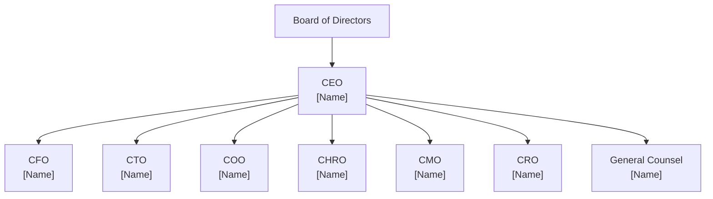
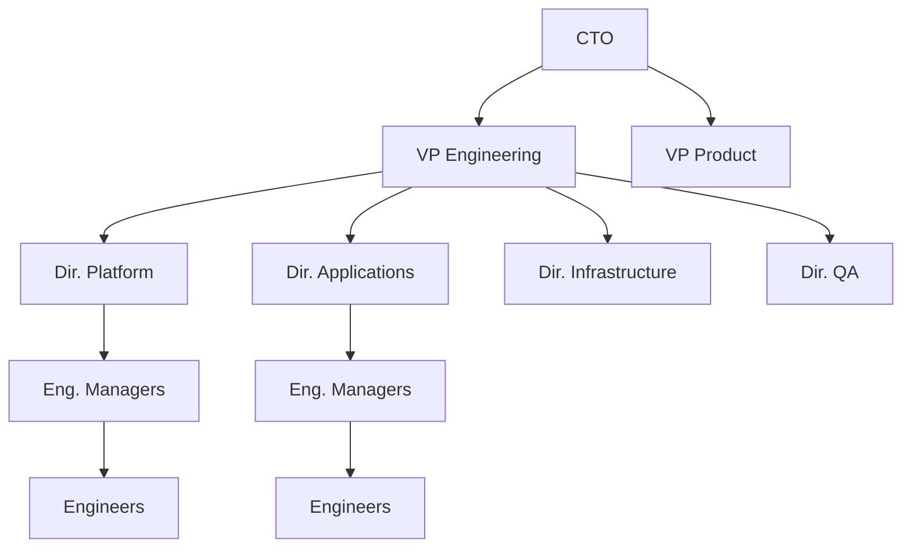
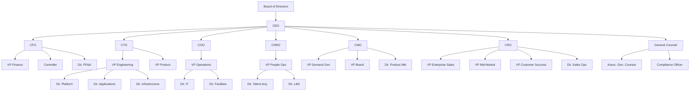

# Organizational Chart

---

## Document Control

| Field                | Value                                        |
| -------------------- | -------------------------------------------- |
| **Company Name**     | [Company Name]                               |
| **Document Title**   | Organizational Structure and Reporting Chart |
| **Version**          | [X.X]                                        |
| **Effective Date**   | [DD-MMM-YYYY]                                |
| **Last Revised**     | [DD-MMM-YYYY]                                |
| **Prepared By**      | [HR / Operations Representative]             |
| **Approved By**      | [CEO / CHRO / VP Operations]                 |
| **Next Review Date** | [DD-MMM-YYYY]                                |
| **Total Headcount**  | [X] employees                                |
| **Open Positions**   | [X] vacancies                                |

---

## Organizational Overview

[Company Name] operates under a [functional / divisional / matrix / flat] organizational structure designed to [support strategic objectives, enable cross-functional collaboration, maintain clear lines of accountability, etc.]. This document defines reporting relationships, departmental structure, and role distribution across the organization.

---

## Executive Leadership Team

| Position                             | Name   | Reports To         | Direct Reports | Location   |
| ------------------------------------ | ------ | ------------------ | -------------- | ---------- |
| Chief Executive Officer (CEO)        | [Name] | Board of Directors | [X]            | [Location] |
| Chief Financial Officer (CFO)        | [Name] | CEO                | [X]            | [Location] |
| Chief Technology Officer (CTO)       | [Name] | CEO                | [X]            | [Location] |
| Chief Operating Officer (COO)        | [Name] | CEO                | [X]            | [Location] |
| Chief Human Resources Officer (CHRO) | [Name] | CEO                | [X]            | [Location] |
| Chief Marketing Officer (CMO)        | [Name] | CEO                | [X]            | [Location] |
| Chief Revenue Officer (CRO)          | [Name] | CEO                | [X]            | [Location] |
| General Counsel                      | [Name] | CEO                | [X]            | [Location] |

---

## Executive Reporting Structure

---

## Department Structures

### Engineering / Technology

**Department Head**: [CTO Name], Chief Technology Officer

| Position                          | Name    | Reports To     | Direct Reports | Level    |
| --------------------------------- | ------- | -------------- | -------------- | -------- |
| VP Engineering                    | [Name]  | CTO            | [X]            | VP       |
| VP Product                        | [Name]  | CTO            | [X]            | VP       |
| Director, Platform Engineering    | [Name]  | VP Engineering | [X]            | Director |
| Director, Application Engineering | [Name]  | VP Engineering | [X]            | Director |
| Director, Infrastructure / DevOps | [Name]  | VP Engineering | [X]            | Director |
| Director, QA / Testing            | [Name]  | VP Engineering | [X]            | Director |
| Engineering Managers              | [Names] | Directors      | [X] each       | Manager  |
| Senior Engineers                  | [Names] | Eng. Managers  | —              | IC       |
| Engineers                         | [Names] | Eng. Managers  | —              | IC       |

**Headcount**: [X] | **Vacancies**: [X]

---

### Sales and Revenue

**Department Head**: [CRO Name], Chief Revenue Officer

| Position                          | Name    | Reports To     | Direct Reports | Level    |
| --------------------------------- | ------- | -------------- | -------------- | -------- |
| VP Enterprise Sales               | [Name]  | CRO            | [X]            | VP       |
| VP Mid-Market Sales               | [Name]  | CRO            | [X]            | VP       |
| VP Customer Success               | [Name]  | CRO            | [X]            | VP       |
| Director, Sales Operations        | [Name]  | CRO            | [X]            | Director |
| Director, Business Development    | [Name]  | VP Enterprise  | [X]            | Director |
| Regional Sales Managers           | [Names] | VPs            | [X] each       | Manager  |
| Account Executives — Enterprise   | [Names] | Regional Mgrs  | —              | IC       |
| Account Executives — Mid-Market   | [Names] | Regional Mgrs  | —              | IC       |
| Sales Development Representatives | [Names] | Dir. Sales Ops | —              | IC       |
| Customer Success Managers         | [Names] | VP CS          | —              | IC       |

**Headcount**: [X] | **Vacancies**: [X]

---

### Finance and Accounting

**Department Head**: [CFO Name], Chief Financial Officer

| Position                      | Name    | Reports To    | Direct Reports | Level    |
| ----------------------------- | ------- | ------------- | -------------- | -------- |
| VP Finance                    | [Name]  | CFO           | [X]            | VP       |
| Controller                    | [Name]  | VP Finance    | [X]            | Director |
| Director, FP&A                | [Name]  | VP Finance    | [X]            | Director |
| Accounting Manager            | [Name]  | Controller    | [X]            | Manager  |
| Senior Accountants            | [Names] | Acct. Manager | —              | IC       |
| Accounts Payable / Receivable | [Names] | Acct. Manager | —              | IC       |
| Financial Analysts            | [Names] | Dir. FP&A     | —              | IC       |
| Payroll Specialist            | [Name]  | Controller    | —              | IC       |

**Headcount**: [X] | **Vacancies**: [X]

---

### Human Resources / People Operations

**Department Head**: [CHRO Name], Chief Human Resources Officer

| Position                         | Name    | Reports To    | Direct Reports | Level    |
| -------------------------------- | ------- | ------------- | -------------- | -------- |
| VP People Operations             | [Name]  | CHRO          | [X]            | VP       |
| Director, Talent Acquisition     | [Name]  | VP People Ops | [X]            | Director |
| Director, Learning & Development | [Name]  | VP People Ops | [X]            | Director |
| HR Business Partners             | [Names] | VP People Ops | —              | Manager  |
| Recruiters                       | [Names] | Dir. TA       | —              | IC       |
| Benefits & Compensation Analyst  | [Name]  | VP People Ops | —              | IC       |
| HR Coordinator                   | [Name]  | HRBP          | —              | IC       |
| HRIS Administrator               | [Name]  | VP People Ops | —              | IC       |

**Headcount**: [X] | **Vacancies**: [X]

---

### Marketing

**Department Head**: [CMO Name], Chief Marketing Officer

| Position                    | Name    | Reports To    | Direct Reports | Level    |
| --------------------------- | ------- | ------------- | -------------- | -------- |
| VP Demand Generation        | [Name]  | CMO           | [X]            | VP       |
| VP Brand & Communications   | [Name]  | CMO           | [X]            | VP       |
| Director, Product Marketing | [Name]  | CMO           | [X]            | Director |
| Director, Content & SEO     | [Name]  | VP Demand Gen | [X]            | Director |
| Director, Digital Marketing | [Name]  | VP Demand Gen | [X]            | Director |
| Marketing Managers          | [Names] | Directors     | —              | Manager  |
| Content Specialists         | [Names] | Dir. Content  | —              | IC       |
| Graphic Designers           | [Names] | VP Brand      | —              | IC       |

**Headcount**: [X] | **Vacancies**: [X]

---

### Operations

**Department Head**: [COO Name], Chief Operating Officer

| Position                           | Name    | Reports To      | Direct Reports | Level    |
| ---------------------------------- | ------- | --------------- | -------------- | -------- |
| VP Operations                      | [Name]  | COO             | [X]            | VP       |
| Director, IT / Information Systems | [Name]  | VP Operations   | [X]            | Director |
| Director, Facilities               | [Name]  | VP Operations   | [X]            | Director |
| Director, Security                 | [Name]  | VP Operations   | [X]            | Director |
| IT Systems Administrators          | [Names] | Dir. IT         | —              | IC       |
| Help Desk / Support                | [Names] | Dir. IT         | —              | IC       |
| Facilities Coordinator             | [Name]  | Dir. Facilities | —              | IC       |

**Headcount**: [X] | **Vacancies**: [X]

---

### Legal

**Department Head**: [General Counsel Name]

| Position                  | Name   | Reports To         | Direct Reports | Level    |
| ------------------------- | ------ | ------------------ | -------------- | -------- |
| Associate General Counsel | [Name] | General Counsel    | [X]            | Director |
| Corporate Paralegal       | [Name] | General Counsel    | —              | IC       |
| Compliance Officer        | [Name] | General Counsel    | [X]            | Director |
| Compliance Analyst        | [Name] | Compliance Officer | —              | IC       |

**Headcount**: [X] | **Vacancies**: [X]

---

## Full Organization Chart

---

## Headcount Summary

| Department               | Active Employees | Open Positions | Total Budgeted | % Filled |
| ------------------------ | ---------------- | -------------- | -------------- | -------- |
| Executive Leadership     | [X]              | [X]            | [X]            | [X]%     |
| Engineering / Technology | [X]              | [X]            | [X]            | [X]%     |
| Sales and Revenue        | [X]              | [X]            | [X]            | [X]%     |
| Finance and Accounting   | [X]              | [X]            | [X]            | [X]%     |
| Human Resources          | [X]              | [X]            | [X]            | [X]%     |
| Marketing                | [X]              | [X]            | [X]            | [X]%     |
| Operations               | [X]              | [X]            | [X]            | [X]%     |
| Legal                    | [X]              | [X]            | [X]            | [X]%     |
| **Company Total**        | **[X]**          | **[X]**        | **[X]**        | **[X]%** |

---

## Level Distribution

| Level                  | Count   | % of Total |
| ---------------------- | ------- | ---------- |
| C-Suite                | [X]     | [X]%       |
| Vice President         | [X]     | [X]%       |
| Director               | [X]     | [X]%       |
| Manager                | [X]     | [X]%       |
| Individual Contributor | [X]     | [X]%       |
| **Total**              | **[X]** | **100%**   |

---

## Change Log

| Date          | Version | Change Description                                          | Changed By |
| ------------- | ------- | ----------------------------------------------------------- | ---------- |
| [DD-MMM-YYYY] | [X.X]   | [Initial creation / Reorganization / Position added / etc.] | [Name]     |
| [DD-MMM-YYYY] | [X.X]   | [Description of change]                                     | [Name]     |
| [DD-MMM-YYYY] | [X.X]   | [Description of change]                                     | [Name]     |

---

## Legal Compliance

This organizational chart is maintained for internal planning and operational purposes. It does not establish contractual obligations or guarantee continued employment in any position. [Company Name] reserves the right to reorganize, restructure, or eliminate positions at any time based on business needs.

---

**Document ID**: ORG-[YYYY]-[VERSION]
**Classification**: Internal Use Only — Management and HR
**Retention Period**: Current version plus [X] prior versions
**Review Frequency**: [Quarterly / Semi-annually / Upon organizational change]
