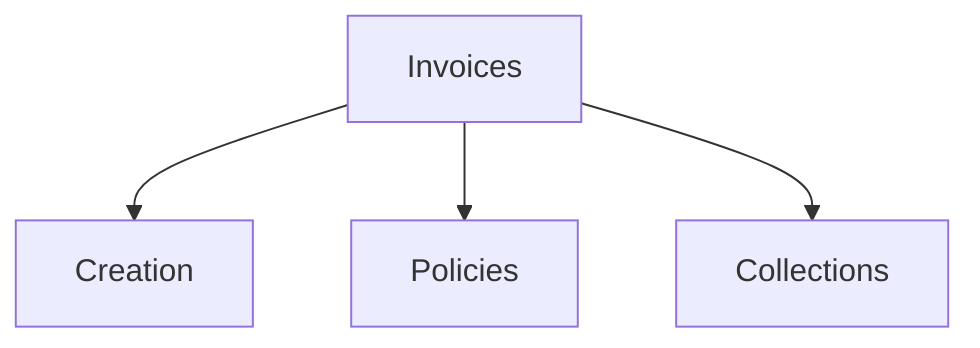

# Invoices

Billing, invoicing, and payment templates.

## Templates

| Template                                                       | Description        |
| -------------------------------------------------------------- | ------------------ |
| [invoice_template.md](invoice_template.md)                     | Invoice formatting |
| [billing_sop.md](billing_sop.md)                               | Billing procedures |
| [payment_terms_policy.md](payment_terms_policy.md)             | Payment policies   |
| [late_payment_notice.md](late_payment_notice.md)               | Payment reminders  |
| [invoice_dispute_resolution.md](invoice_dispute_resolution.md) | Dispute handling   |

## Structure

See [Parent](../SKILL.md) for all categories.
