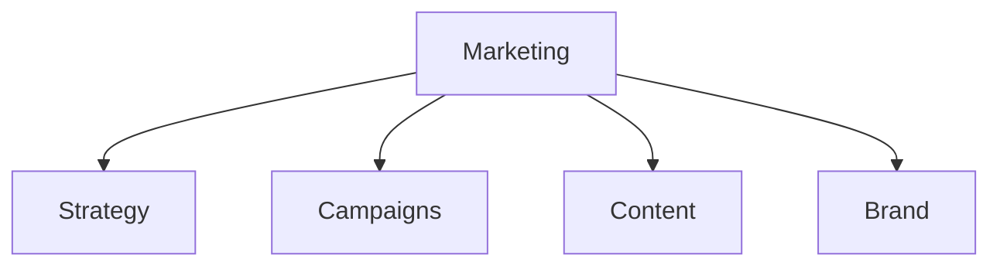

# Marketing

Marketing campaigns, content, and strategy templates.

## Templates

| Template                                                     | Description       |
| ------------------------------------------------------------ | ----------------- |
| [marketing_plan_integrated.md](marketing_plan_integrated.md) | Marketing plans   |
| [campaign_brief.md](campaign_brief.md)                       | Campaign briefs   |
| [press_release.md](press_release.md)                         | Press releases    |
| [content_calendar.md](content_calendar.md)                   | Content calendars |
| [brand_guidelines.md](brand_guidelines.md)                   | Brand guidelines  |

## Structure

See [Parent](../SKILL.md) for all categories.
