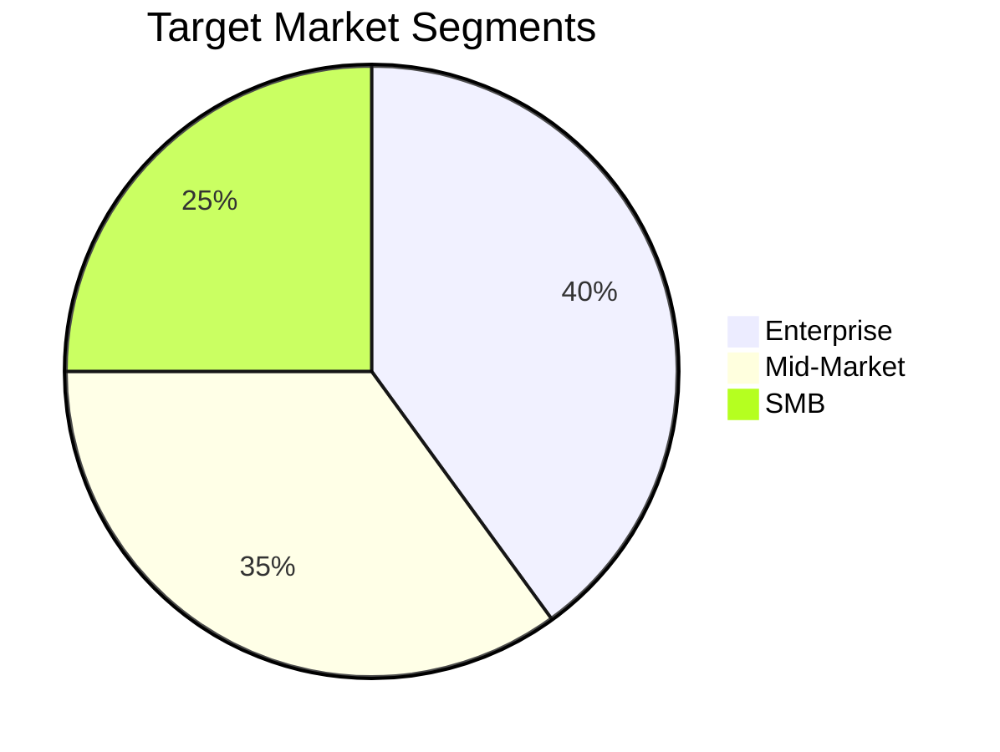

# Go-to-Market Strategy

<!-- Market entry and launch plan -->

---

## Document Control

| Field       | Value               |
| ----------- | ------------------- |
| **Product** | [Product Name]      |
| **Version** | [X.X]               |
| **Date**    | [DD-MMM-YYYY]       |
| **Owner**   | [Product Marketing] |

---

## Executive Summary

**Objective:** Launch [Product] to achieve [X] customers and $[X] revenue in [Y] months.

**Key Success Factors:**

- [Factor 1]
- [Factor 2]

---

## Target Market

### Ideal Customer Profile

| Attribute       | Definition         |
| --------------- | ------------------ |
| **Industry**    | [Industries]       |
| **Size**        | [X]-[Y] employees  |
| **Revenue**     | $[X]M-$[Y]M        |
| **Pain Points** | [Pain 1], [Pain 2] |

### Market Segmentation



---

## Competitive Positioning

**Positioning Statement:**

For [target customer], [Product] is the [category] that [key benefit], unlike [competitor], we [differentiation].

### Value Proposition

| Customer Need | Our Solution | Competitor Approach | Advantage   |
| ------------- | ------------ | ------------------- | ----------- |
| [Need]        | [Solution]   | [Their approach]    | [Advantage] |

---

## Pricing Strategy

| Tier       | Price   | Features   | Target     |
| ---------- | ------- | ---------- | ---------- |
| Starter    | $[X]/mo | [Features] | SMB        |
| Pro        | $[Y]/mo | [Features] | Mid-market |
| Enterprise | Custom  | [Features] | Enterprise |

---

## Channel Strategy

| Channel      | % of Leads | CAC  | Target     |
| ------------ | ---------- | ---- | ---------- |
| Direct Sales | [X]%       | $[Y] | Enterprise |
| Self-Service | [X]%       | $[Y] | SMB        |
| Partners     | [X]%       | $[Y] | All        |

---

## Launch Timeline

```mermaid
gantt
    title GTM Timeline
    dateFormat YYYY-MM-DD

    section Pre-Launch
    Messaging      :a1, {{START}}, 14d
    Collateral     :a2, after a1, 14d

    section Launch
    Beta Launch    :b1, after a2, 7d
    Public Launch  :milestone, after b1, 0d

    section Post-Launch
    Campaigns      :c1, after b1, 30d
```

---

## Metrics & KPIs

| Metric    | Target | Timeline |
| --------- | ------ | -------- |
| Leads     | [X]    | Month 1  |
| Trials    | [X]    | Month 1  |
| Customers | [X]    | Month 3  |
| Revenue   | $[X]   | Month 3  |

---

**Approved:** ********\_******** Date: ****\_****
