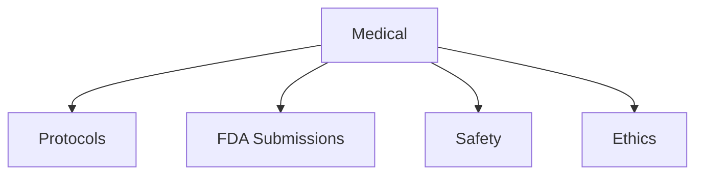

# Medical

Clinical protocols, FDA submissions, and medical templates.

## Templates

| Template                                           | Description            |
| -------------------------------------------------- | ---------------------- |
| [clinical_protocol.md](clinical_protocol.md)       | Clinical protocols     |
| [device_510k.md](device_510k.md)                   | FDA 510(k) submissions |
| [informed_consent.md](informed_consent.md)         | Consent forms          |
| [irb_application.md](irb_application.md)           | IRB applications       |
| [adverse_event_report.md](adverse_event_report.md) | Safety reporting       |

## Structure

See [Parent](../SKILL.md) for all categories.
