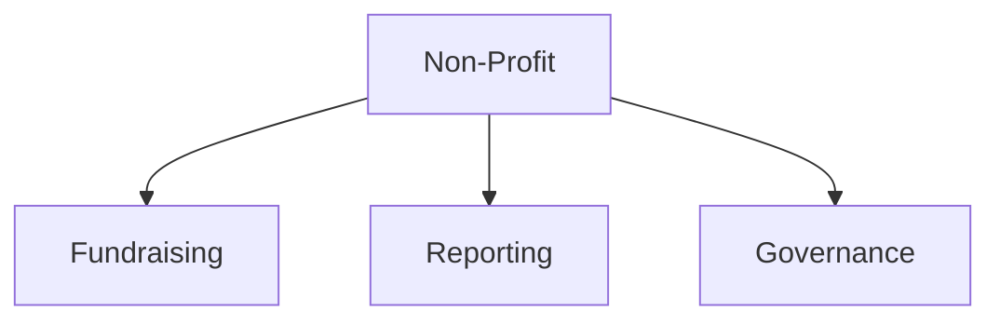

# Non-Profit

Non-profit, NGO, and charitable organization templates.

## Templates

| Template                                         | Description          |
| ------------------------------------------------ | -------------------- |
| [donor_proposal.md](donor_proposal.md)           | Donor proposals      |
| [impact_report.md](impact_report.md)             | Impact reporting     |
| [board_report.md](board_report.md)               | Board reporting      |
| [volunteer_agreement.md](volunteer_agreement.md) | Volunteer agreements |

## Structure

See [Parent](../SKILL.md) for all categories.
