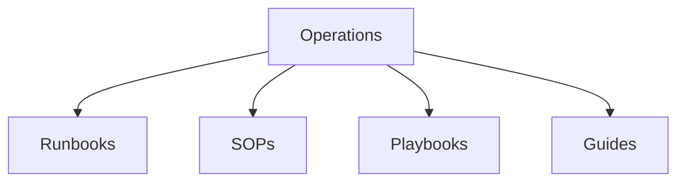

# Operations

Operations, SOPs, and process documentation templates.

## Templates

| Template                                                   | Description          |
| ---------------------------------------------------------- | -------------------- |
| [runbook.md](runbook.md)                                   | Operational runbooks |
| [sop_template_operational.md](sop_template_operational.md) | SOPs                 |
| [playbook.md](playbook.md)                                 | Operations playbooks |
| [onboarding_guide.md](onboarding_guide.md)                 | Onboarding guides    |
| [faq.md](faq.md)                                           | FAQ documents        |

## Structure

See [Parent](../SKILL.md) for all categories.
