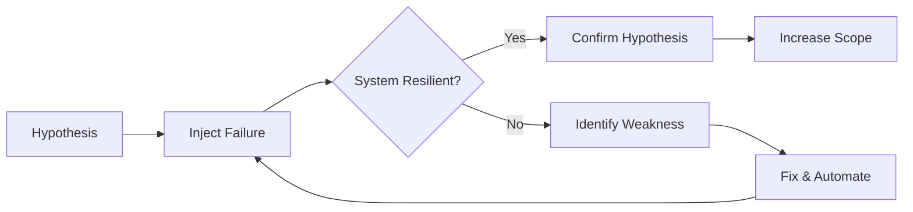
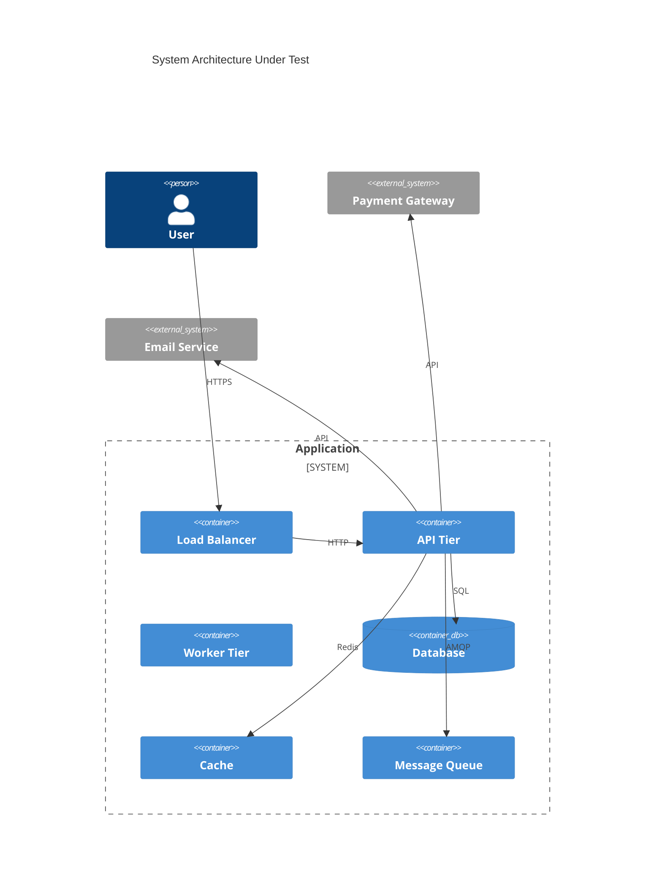
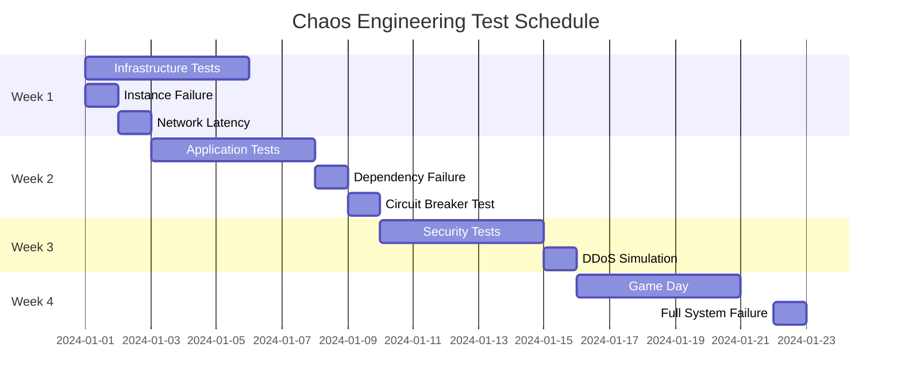
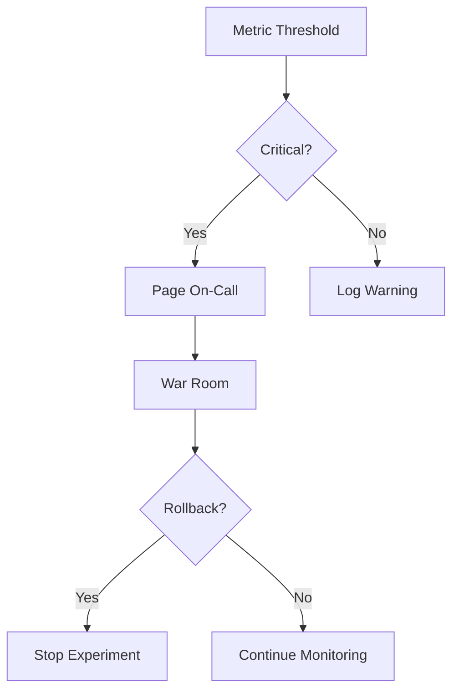

# Chaos Engineering Plan

<!-- System resilience testing through controlled failures -->

---

## Document Control

| Field                 | Value                       |
| --------------------- | --------------------------- |
| **Plan Name**         | Chaos Engineering Test Plan |
| **Version**           | [X.X]                       |
| **System Under Test** | [System Name]               |
| **Owner**             | [SRE/Platform Team]         |
| **Last Updated**      | [DD-MMM-YYYY]               |

---

## Chaos Engineering Principles



### Core Principles

1. **Build Hypothesis**: Define expected behavior under failure
2. **Run Experiments**: Inject failures in production-like environments
3. **Verify Resilience**: Confirm system behaves as expected
4. **Learn & Improve**: Fix weaknesses and automate

---

## System Architecture



### Critical Components

| Component     | Function             | SLO    | Failure Impact       |
| ------------- | -------------------- | ------ | -------------------- |
| Load Balancer | Traffic distribution | 99.99% | Complete outage      |
| API Tier      | Request processing   | 99.9%  | Degraded performance |
| Database      | Data persistence     | 99.99% | Data loss risk       |
| Cache         | Performance          | 99.5%  | Slower responses     |
| Queue         | Async processing     | 99%    | Delayed processing   |

---

## Experiment Categories

### Infrastructure Failures

| Experiment               | Target       | Blast Radius | Expected Behavior                      |
| ------------------------ | ------------ | ------------ | -------------------------------------- |
| **Instance Termination** | API server   | 1 instance   | Auto-scaling replaces within 2 min     |
| **Network Latency**      | Database     | +100ms       | Connection pooling absorbs latency     |
| **CPU Saturation**       | Worker node  | 100% CPU     | Circuit breaker triggers               |
| **Memory Pressure**      | Cache server | 90% memory   | Eviction policy activates              |
| **Disk Failure**         | Database     | 1 disk       | RAID redundancy maintains availability |

### Application Failures

| Experiment             | Target        | Blast Radius    | Expected Behavior        |
| ---------------------- | ------------- | --------------- | ------------------------ |
| **Dependency Latency** | Payment API   | +5s timeout     | Circuit breaker opens    |
| **Dependency Failure** | Email service | Complete outage | Queue messages for retry |
| **Database Slowness**  | Primary DB    | +500ms queries  | Read replica promoted    |
| **Cache Poisoning**    | Redis         | Corrupted keys  | TTL expiration cleanses  |

### Security Failures

| Experiment             | Target        | Blast Radius       | Expected Behavior               |
| ---------------------- | ------------- | ------------------ | ------------------------------- |
| **DDoS Simulation**    | Load balancer | 10x normal traffic | WAF/rate limiting activates     |
| **Certificate Expiry** | TLS certs     | 1 cert             | Monitoring alerts before expiry |
| **Credential Leak**    | API keys      | Simulated leak     | Key rotation triggers           |

---

## Test Schedule



---

## Experiment Template

### Experiment: [Name]

#### Hypothesis

```
IF [failure condition]
THEN [expected system behavior]
BECAUSE [resilience mechanism]
```

#### Safety Controls

| Control         | Threshold | Action          |
| --------------- | --------- | --------------- |
| Error rate      | > 5%      | Stop experiment |
| Latency p99     | > 10s     | Stop experiment |
| Customer impact | Any       | Stop experiment |

#### Procedure

1. [ ] Monitor baseline metrics (5 min)
2. [ ] Inject failure
3. [ ] Monitor for 15 minutes
4. [ ] Measure impact
5. [ ] Rollback failure injection
6. [ ] Verify recovery

#### Success Criteria

| Metric        | Threshold | Actual  | Pass/Fail |
| ------------- | --------- | ------- | --------- |
| Availability  | > 99.9%   | [X]%    | [ ]       |
| Error rate    | < 1%      | [X]%    | [ ]       |
| Recovery time | < 5 min   | [X] min | [ ]       |

---

## Observability

### Monitoring Dashboard

| Metric             | Baseline  | During Experiment | Recovery  |
| ------------------ | --------- | ----------------- | --------- |
| Request rate       | [X] req/s | [X] req/s         | [X] req/s |
| Error rate         | [X]%      | [X]%              | [X]%      |
| Latency p50        | [X]ms     | [X]ms             | [X]ms     |
| Latency p99        | [X]ms     | [X]ms             | [X]ms     |
| CPU utilization    | [X]%      | [X]%              | [X]%      |
| Memory utilization | [X]%      | [X]%              | [X]%      |

### Alerting



---

## Game Day

### Scenario: Full Regional Failure

**Objective**: Verify multi-region failover works as designed

**Timeline**:

| Time | Action                   | Owner          |
| ---- | ------------------------ | -------------- |
| T+0  | Announce game day start  | Facilitator    |
| T+5  | Simulate region failure  | Chaos Engineer |
| T+10 | Traffic failover         | Automated      |
| T+15 | Verify data consistency  | DBA            |
| T+30 | Full validation          | Team           |
| T+45 | Resume normal operations | Facilitator    |

**Participants**:

| Role           | Responsibility             |
| -------------- | -------------------------- |
| Facilitator    | Run the game day           |
| Observer       | Monitor metrics            |
| Decision Maker | Approve rollback if needed |
| Note Taker     | Document findings          |

---

## Lessons Learned

### Recent Experiments

| Date   | Experiment           | Result      | Action Item | Owner  |
| ------ | -------------------- | ----------- | ----------- | ------ |
| [Date] | Instance termination | [Pass/Fail] | [Action]    | [Name] |
| [Date] | Database failover    | [Pass/Fail] | [Action]    | [Name] |

### Improvements Implemented

1. [Improvement 1]
2. [Improvement 2]
3. [Improvement 3]

---

## Approval

SRE Lead: ********\_******** Date: ****\_****

Product Owner: ********\_******** Date: ****\_****

Risk/Compliance: ********\_******** Date: ****\_****
