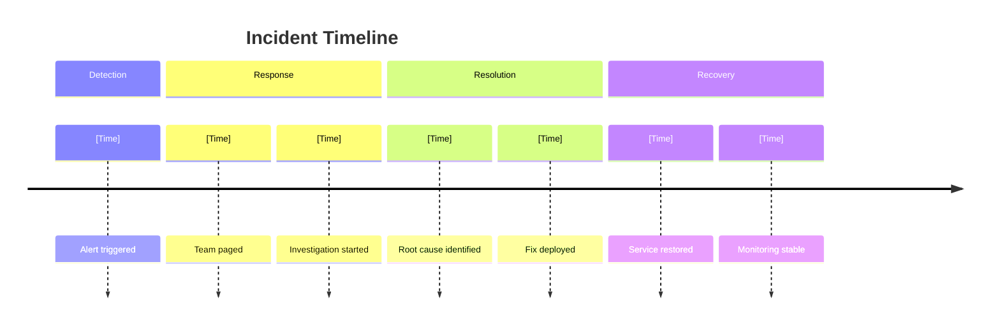

# Incident Postmortem

<!-- Incident review and learning documentation -->

---

## Document Control

| Field           | Value               |
| --------------- | ------------------- |
| **Incident ID** | [INC-XXXX]          |
| **Date**        | [DD-MMM-YYYY]       |
| **Severity**    | [P1/P2/P3/P4]       |
| **Status**      | [ ] Open [ ] Closed |
| **Owner**       | [Name]              |

---

## Incident Summary

| Attribute           | Value                 |
| ------------------- | --------------------- |
| **Start Time**      | [Date Time]           |
| **Detection Time**  | [Date Time]           |
| **Resolution Time** | [Date Time]           |
| **Duration**        | [X] hours [Y] minutes |
| **Impact**          | [Description]         |
| **Affected Users**  | [X]                   |

### Timeline

---

## Root Cause Analysis

### 5 Whys

1. **Why did the incident occur?** [Answer]
2. **Why did that happen?** [Answer]
3. **Why did that happen?** [Answer]
4. **Why did that happen?** [Answer]
5. **Why did that happen?** [Answer]

**Root Cause:** [Final root cause]

### Contributing Factors

- [Factor 1]
- [Factor 2]
- [Factor 3]

---

## Impact Assessment

| Metric             | Impact               |
| ------------------ | -------------------- |
| **Availability**   | [X]% degraded        |
| **Latency**        | +[X]ms average       |
| **Error Rate**     | [X]%                 |
| **Revenue Impact** | $[X]                 |
| **Data Loss**      | [Yes/No] - [Details] |

---

## Response Review

### What Went Well

- [ ] [Positive 1]
- [ ] [Positive 2]

### What Went Poorly

- [ ] [Negative 1]
- [ ] [Negative 2]

### Action Items

| ID  | Action   | Owner  | Due Date | Status |
| --- | -------- | ------ | -------- | ------ |
| 1   | [Action] | [Name] | [Date]   | [ ]    |

---

## Prevention Measures

1. [ ] [Prevention 1]
2. [ ] [Prevention 2]

---

**Prepared By:** ********\_******** Date: ****\_****

**Reviewed By:** ********\_******** Date: ****\_****
