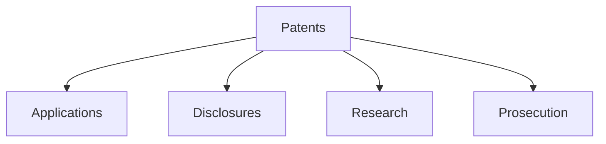

# Patents

Intellectual property and patent documentation templates.

## Templates

| Template                                           | Description           |
| -------------------------------------------------- | --------------------- |
| [patent_application.md](patent_application.md)     | Patent applications   |
| [invention_disclosure.md](invention_disclosure.md) | Invention disclosures |
| [prior_art_search.md](prior_art_search.md)         | Prior art searches    |
| [patent_claim_draft.md](patent_claim_draft.md)     | Claim drafting        |
| [patent_prosecution.md](patent_prosecution.md)     | Prosecution docs      |

## Structure

See [Parent](../SKILL.md) for all categories.
