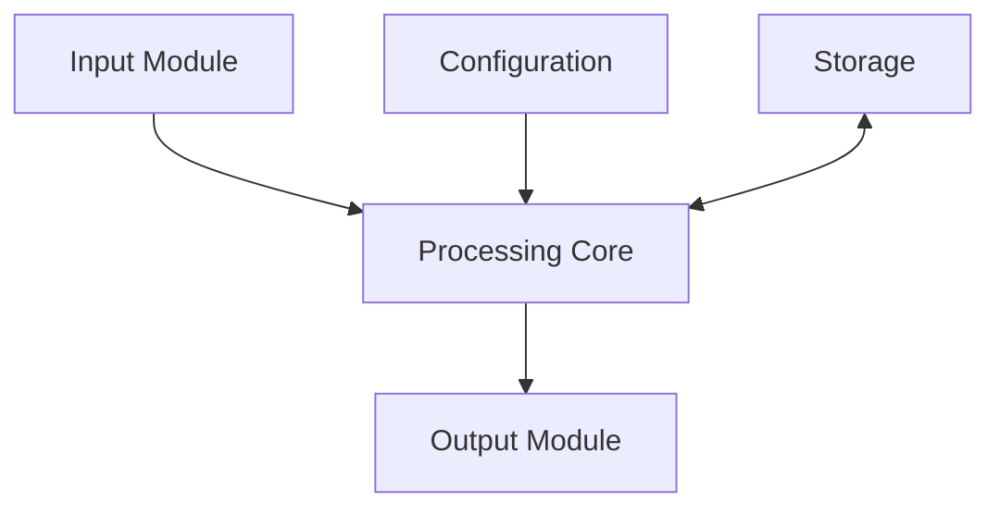
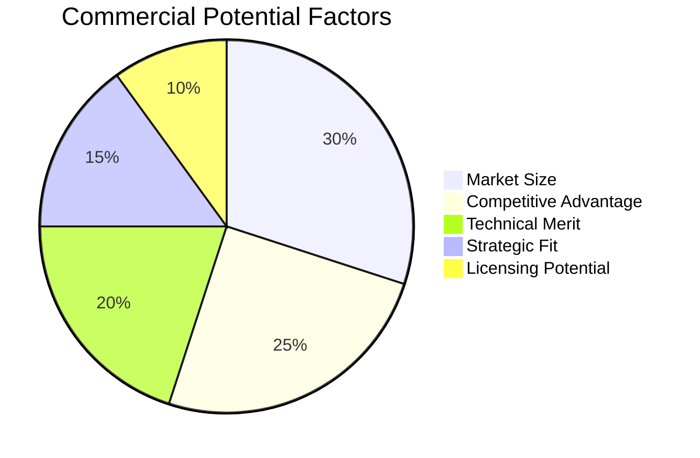

# Invention Disclosure

<!-- Initial invention documentation for patent evaluation -->

---

## Document Control

| Field                | Value                                                  |
| -------------------- | ------------------------------------------------------ |
| **Disclosure ID**    | ID-[YYYY]-[NNN]                                        |
| **Version**          | [X.Y.Z]                                                |
| **Date**             | [YYYY-MM-DD]                                           |
| **Inventor(s)**      | [Names]                                                |
| **Primary Inventor** | [Name]                                                 |
| **Department**       | [Department]                                           |
| **Reviewed By**      | [Patent Counsel]                                       |
| **Status**           | Draft / Submitted / Under Review / Approved / Declined |

> [!IMPORTANT]
> Complete this form as soon as the invention is conceived. Do not wait for reduction to practice.

---

## Invention Overview

### Title

[Descriptive title of the invention]

### Technical Field

[Field of technology, e.g., "Artificial Intelligence / Machine Learning"]

### Problem Statement

**Current Problem:**
[Description of the problem the invention solves]

**Existing Solutions:**
[Description of current approaches and their limitations]

**Consequences:**
[What happens if this problem is not solved]

### Invention Summary

**One-Sentence Summary:**
[A single sentence describing the invention]

**Detailed Description:**
[2-3 paragraphs describing the invention, how it works, and its key advantages]

### Key Advantages

| Advantage     | Description   | Quantified Benefit      |
| ------------- | ------------- | ----------------------- |
| [Advantage 1] | [Description] | [X% faster, $Y savings] |
| [Advantage 2] | [Description] | [X% more accurate]      |
| [Advantage 3] | [Description] | [Other benefit]         |

---

## Inventorship

### Inventors

| Name     | Contribution            | Citizenship | Employment |
| -------- | ----------------------- | ----------- | ---------- |
| [Name 1] | [Specific contribution] | [Country]   | [Employer] |
| [Name 2] | [Specific contribution] | [Country]   | [Employer] |
| [Name 3] | [Specific contribution] | [Country]   | [Employer] |

> [!NOTE]
> Inventorship is a legal determination based on who conceived the invention, not who implemented it.

### Conception Date

| Milestone             | Date   | Evidence                         |
| --------------------- | ------ | -------------------------------- |
| First conception      | [Date] | [Lab notebook page, email]       |
| First disclosure      | [Date] | [Meeting notes]                  |
| Reduction to practice | [Date] | [Working prototype, code commit] |

---

## Technical Description

### System Architecture



### Components

| Component     | Function   | Novel? | Critical? |
| ------------- | ---------- | ------ | --------- |
| [Component 1] | [Function] | Yes/No | Yes/No    |
| [Component 2] | [Function] | Yes/No | Yes/No    |
| [Component 3] | [Function] | Yes/No | Yes/No    |

### Method Steps


| Step | Description   | Novel Aspect |
| ---- | ------------- | ------------ |
| 1    | [Description] | [Novelty]    |
| 2    | [Description] | [Novelty]    |
| 3    | [Description] | [Novelty]    |

### Algorithms/Formulas

**Key Algorithm:**

```
[Algorithm description or pseudocode]
```

**Mathematical Formula:**

$$\text{Result} = \frac{\text{Input} \times \text{Coefficient}}{\text{Normalization Factor}}$$

---

## Novelty Assessment

### Prior Art Search

| Source           | Date Searched | Results      | Relevance |
| ---------------- | ------------- | ------------ | --------- |
| Patent databases | [Date]        | [N] patents  | [Summary] |
| Literature       | [Date]        | [N] papers   | [Summary] |
| Products         | [Date]        | [N] products | [Summary] |

### Novelty Analysis

| Feature     | Prior Art Status | Evidence      |
| ----------- | ---------------- | ------------- |
| [Feature 1] | New / Improved   | [Explanation] |
| [Feature 2] | New / Improved   | [Explanation] |
| [Feature 3] | New / Improved   | [Explanation] |

### Non-Obviousness Factors

1. **Unexpected Results:** [Description]
2. **Long-Felt Need:** [Description]
3. **Failure of Others:** [Description]
4. **Commercial Success:** [Description]

---

## Commercial Assessment

### Market Analysis

| Aspect                    | Assessment            |
| ------------------------- | --------------------- |
| **Target Market**         | [Description]         |
| **Market Size**           | $[N] (TAM/SAM/SOM)    |
| **Competitive Landscape** | [Description]         |
| **Differentiation**       | [Key differentiators] |

### Commercial Potential



### Use Cases

| Use Case     | Description   | Market   |
| ------------ | ------------- | -------- |
| [Use Case 1] | [Description] | [Market] |
| [Use Case 2] | [Description] | [Market] |

---

## Development Status

### Current Status

| Aspect            | Status         | Details         |
| ----------------- | -------------- | --------------- |
| **Conception**    | ✅ Complete    | [Date]          |
| **Documentation** | ✅ Complete    | [Lab notebook]  |
| **Prototype**     | ⬜ In Progress | [Expected date] |
| **Testing**       | ⬜ Pending     | [Plan]          |
| **Publication**   | ⬜ Planned     | [Timeline]      |

### Reduction to Practice

**Current Stage:**

- [ ] Concept only
- [ ] Working prototype
- [ ] Validated prototype
- [ ] Production ready

**Evidence:**

- [Lab notebook entries]
- [Code repository]
- [Test results]
- [Prototype photos]

---

## Disclosure History

### Public Disclosures

| Date   | Event                     | Audience   | Confidentiality |
| ------ | ------------------------- | ---------- | --------------- |
| [Date] | [Conference presentation] | [Audience] | [Status]        |
| [Date] | [Publication]             | [Journal]  | [Status]        |
| [Date] | [Product launch]          | [Public]   | [Status]        |

### Bar Date Analysis

| Jurisdiction | Grace Period | Deadline | Status   |
| ------------ | ------------ | -------- | -------- |
| US           | 1 year       | [Date]   | ✅/⚠️/❌ |
| Europe       | None         | [Date]   | ✅/⚠️/❌ |
| Japan        | None         | [Date]   | ✅/⚠️/❌ |

> [!WARNING]
> Public disclosure before filing may bar patent rights in most jurisdictions.

---

## IP Strategy

### Filing Strategy

| Jurisdiction | Priority | Timeline       | Rationale     |
| ------------ | -------- | -------------- | ------------- |
| US           | P1       | Immediate      | Home market   |
| PCT          | P1       | 12 months      | International |
| EP           | P2       | National phase | Europe        |
| CN           | P2       | National phase | China         |

### Claim Strategy

| Claim Type       | Scope  | Priority |
| ---------------- | ------ | -------- |
| System claims    | Broad  | P1       |
| Method claims    | Broad  | P1       |
| Computer program | Medium | P2       |

### Licensing Potential

| Licensee  | Interest     | Value |
| --------- | ------------ | ----- |
| [Company] | High/Med/Low | $[N]  |

---

## Supporting Materials

### Attachments

| Document       | Description             | Date   |
| -------------- | ----------------------- | ------ |
| [Lab notebook] | Experimental records    | [Date] |
| [Drawings]     | Technical diagrams      | [Date] |
| [Code]         | Software implementation | [Date] |
| [Data]         | Experimental results    | [Date] |

### References

| Reference  | Type               | Relevance   |
| ---------- | ------------------ | ----------- |
| [Citation] | Patent/Publication | [Relevance] |

---

## Review and Approval

### Inventor Certification

I certify that:

- [ ] I am the original inventor
- [ ] The disclosure is complete and accurate
- [ ] I understand the duty of disclosure to the USPTO

| Inventor | Signature      | Date   |
| -------- | -------------- | ------ |
| [Name]   | ****\_\_\_**** | [Date] |

### Management Review

| Reviewer  | Decision          | Comments   | Date   |
| --------- | ----------------- | ---------- | ------ |
| [Manager] | [Approve/Decline] | [Comments] | [Date] |

### Legal Review

| Attorney   | Decision       | Comments   | Date   |
| ---------- | -------------- | ---------- | ------ |
| [Attorney] | [File/Decline] | [Comments] | [Date] |

---

_Last updated: [Date]_

---

## See Also

- [Prior Art Search](./prior_art_search.md) — Patentability analysis
- [Patent Claim Draft](./patent_claim_draft.md) — Claim drafting
- [Patent Application](./patent_application.md) — Full application
