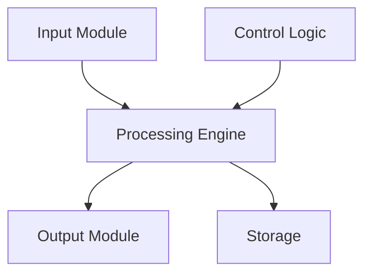
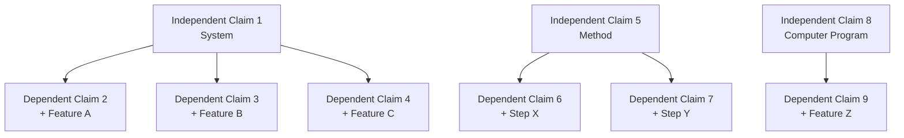
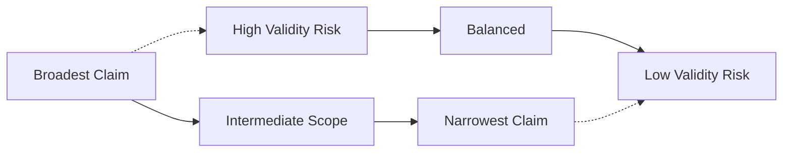

# Patent Claim Draft

<!-- Patent claim drafting following USPTO and EPO guidelines -->

---

## Document Control

| Field              | Value                    |
| ------------------ | ------------------------ |
| **Application ID** | [APP-YYYY-NNNN]          |
| **Version**        | [X.Y.Z]                  |
| **Date**           | [YYYY-MM-DD]             |
| **Drafter**        | [Name, Registration No.] |
| **Inventor(s)**    | [Names]                  |
| **Client**         | [Client Name]            |
| **Status**         | Draft / Review / Final   |

> [!IMPORTANT]
> Claims must be clear, concise, and supported by the specification. Review MPEP § 2173 for claim interpretation guidelines.

---

## Invention Summary

### Technical Field

[Field of invention, e.g., "The present invention relates to machine learning algorithms for natural language processing"]

### Background

[Prior art and problem solved]

### Invention Overview

| Aspect               | Description   |
| -------------------- | ------------- |
| **Problem Solved**   | [Description] |
| **Key Improvement**  | [Description] |
| **Technical Effect** | [Description] |

### Essential Elements



| Element     | Function   | Critical? |
| ----------- | ---------- | --------- |
| [Element 1] | [Function] | Yes/No    |
| [Element 2] | [Function] | Yes/No    |
| [Element 3] | [Function] | Yes/No    |

---

## Claim Strategy

### Claim Hierarchy



### Claim Types

| Type               | Scope        | Purpose            |
| ------------------ | ------------ | ------------------ |
| Independent        | Broadest     | Core protection    |
| Dependent          | Narrower     | Fallback positions |
| Multiple dependent | Intermediate | Efficiency         |

---

## Independent Claims

### Claim 1: System/Apparatus

**Preamble:**

```
A [system/apparatus/device] for [purpose], comprising:
```

**Body:**

```
[a first component configured to perform a first function];
[a second component configured to perform a second function]; and
[a third component configured to perform a third function],
wherein [limitation establishing relationship].
```

**Full Claim 1:**

```
1. A system for [purpose], comprising:
   a processor configured to [function];
   a memory storing instructions that, when executed by the processor, cause the system to:
      receive [input];
      process [data] using [method]; and
      generate [output];
   and a communication interface configured to [function],
   wherein [critical limitation].
```

### Claim 5: Method

**Preamble:**

```
A method for [purpose], the method comprising:
```

**Body:**

```
receiving [input];
processing [data] using [specific steps];
generating [output]; and
providing [result].
```

**Full Claim 5:**

```
5. A method for [purpose], the method comprising:
   receiving, by a processor, [input data];
   processing, by the processor, the input data using [algorithm],
   wherein processing comprises:
      [step 1];
      [step 2]; and
      [step 3];
   generating, by the processor, [output]; and
   transmitting, by the processor, the output to [destination].
```

### Claim 8: Computer Program Product

```
8. A non-transitory computer-readable medium storing instructions that,
   when executed by a processor, cause the processor to:
   receive [input];
   process [data] according to [method];
   generate [output]; and
   store [result].
```

---

## Dependent Claims

### Dependent on Claim 1

**Claim 2:**

```
2. The system of claim 1, wherein the processor is further configured to:
   [additional function].
```

**Claim 3:**

```
3. The system of claim 1, wherein [component] comprises:
   [sub-component 1];
   [sub-component 2]; and
   [sub-component 3].
```

**Claim 4:**

```
4. The system of claim 1, wherein the [limitation] is determined based on:
   [factor 1], [factor 2], and [factor 3].
```

### Dependent on Claim 5

**Claim 6:**

```
6. The method of claim 5, wherein processing the input data comprises:
   applying [specific algorithm] to [data subset].
```

**Claim 7:**

```
7. The method of claim 5, further comprising:
   validating [intermediate result] prior to generating the output.
```

---

## Claim Construction

### Claim Elements Analysis

| Element   | Claim Language | Specification Support | Prior Art |
| --------- | -------------- | --------------------- | --------- |
| [Element] | [Language]     | [Paragraph]           | [Status]  |

### Means-Plus-Function

| Function   | Structure   | Material   | Act   |
| ---------- | ----------- | ---------- | ----- |
| [Function] | [Structure] | [Material] | [Act] |

> [!WARNING]
> 35 U.S.C. § 112(f) - Means-plus-function claims must disclose corresponding structure in the specification.

---

## Claim Checking

### 35 U.S.C. § 112 Requirements

| Requirement                    | Check                      | Status |
| ------------------------------ | -------------------------- | ------ |
| § 112(a) - Written description | Full, clear, concise       | ⬜     |
| § 112(b) - Definiteness        | Clear boundaries           | ⬜     |
| § 112(c) - Claims              | Distinctly claim invention | ⬜     |
| § 112(f) - Means-plus-function | Structure disclosed        | ⬜     |

### Clarity Checklist

- [ ] Terms have consistent meaning
- [ ] No indefinite terms ("substantially", "about" justified)
- [ ] Antecedent basis established
- [ ] No unnecessary limitations
- [ ] Proper claim dependency
- [ ] No Markush groups without justification

### Antecedent Basis

| Term            | First Use     | Subsequent Use  |
| --------------- | ------------- | --------------- |
| "the processor" | "a processor" | "the processor" |
| "the memory"    | "a memory"    | "the memory"    |
| "the data"      | "data"        | "the data"      |

---

## Claim Amendments

### Amendment History

| Date   | Amendment     | Reason   | Examiner Response |
| ------ | ------------- | -------- | ----------------- |
| [Date] | [Description] | [Reason] | [Response]        |

### Claim Rejection Analysis

| Claim   | Rejection | Basis   | Response Strategy |
| ------- | --------- | ------- | ----------------- |
| [Claim] | [Type]    | [Basis] | [Strategy]        |

---

## Scope Analysis

### Claim Breadth



### Competitor Comparison

| Competitor | Product   | Claim Coverage | Infringement Risk |
| ---------- | --------- | -------------- | ----------------- |
| [Company]  | [Product] | [Analysis]     | High/Med/Low      |

---

## Appendices

### A. Claim Term Glossary

| Term   | Definition   | Source   |
| ------ | ------------ | -------- |
| [Term] | [Definition] | [Source] |

### B. Claim Dependency Chart

[Visual dependency map]

### C. Prior Art Mapping

[Claim elements vs. prior art]

---

_Last updated: [Date]_

---

## See Also

- [Prior Art Search](./prior_art_search.md) — Patentability research
- [Patent Application](./patent_application.md) — Full application
- [Invention Disclosure](./invention_disclosure.md) — Initial disclosure
