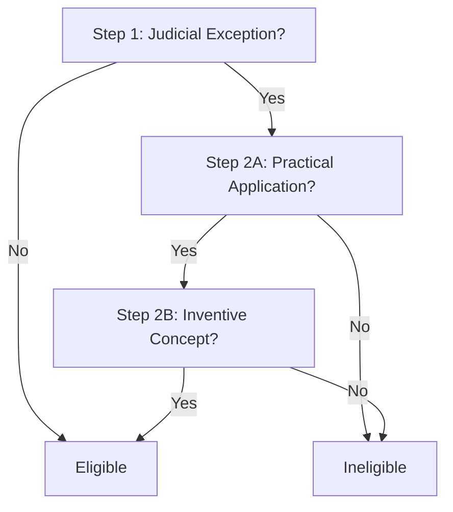
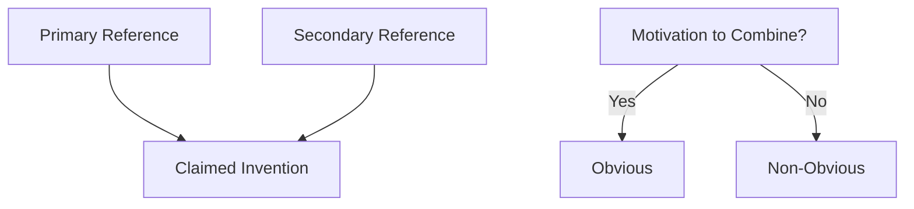

# Patentability Opinion

<!-- Legal opinion on patentability under 35 U.S.C. -->

---

## Document Control

| Field              | Value                      |
| ------------------ | -------------------------- |
| **Opinion ID**     | OP-[YYYY]-[NNN]            |
| **Version**        | [X.Y.Z]                    |
| **Date**           | [YYYY-MM-DD]               |
| **Prepared By**    | [Name, Registration No.]   |
| **Reviewed By**    | [Name, Registration No.]   |
| **Client**         | [Client Name]              |
| **Invention**      | [Invention Title]          |
| **Classification** | Attorney-Client Privileged |

> [!IMPORTANT]
> This opinion is confidential and subject to attorney-client privilege. Do not distribute without authorization.

---

## Executive Summary

### Opinion Overview

| Aspect                      | Assessment            | Confidence     |
| --------------------------- | --------------------- | -------------- |
| **Patentability (§ 101)**   | [Eligible/At Risk]    | [High/Med/Low] |
| **Novelty (§ 102)**         | [Novel/At Risk]       | [High/Med/Low] |
| **Non-Obviousness (§ 103)** | [Non-obvious/At Risk] | [High/Med/Low] |
| **Overall Recommendation**  | [File/Defer/Decline]  | -              |

### Key Findings

1. **[Finding 1]:** [Brief description]
2. **[Finding 2]:** [Brief description]
3. **[Finding 3]:** [Brief description]

### Recommendation

**File Application:** [Yes/No/Conditional]

**Conditions:**

- [Condition 1]
- [Condition 2]

---

## Invention Analysis

### Invention Summary

[Concise description of the invention]

### Claimed Subject Matter

| Claim   | Category              | Key Limitations |
| ------- | --------------------- | --------------- |
| Claim 1 | [Process/Machine/etc] | [Limitations]   |
| Claim 5 | [Method]              | [Limitations]   |

### Technical Field

| Aspect    | Classification   |
| --------- | ---------------- |
| **CPC**   | [Class/Subclass] |
| **USPC**  | [Class/Subclass] |
| **Field** | [Description]    |

---

## § 101 Analysis (Subject Matter Eligibility)

### Alice/Mayo Framework

### Step 1: Judicial Exception

| Element            | Analysis   | Conclusion |
| ------------------ | ---------- | ---------- |
| Abstract idea      | [Analysis] | [Yes/No]   |
| Law of nature      | [Analysis] | [Yes/No]   |
| Natural phenomenon | [Analysis] | [Yes/No]   |

**Conclusion:** [The claims [do/do not] recite a judicial exception]

### Step 2A: Practical Application

| Factor                    | Analysis   | Conclusion |
| ------------------------- | ---------- | ---------- |
| Improvement to technology | [Analysis] | [Yes/No]   |
| Particular application    | [Analysis] | [Yes/No]   |
| Meaningful limits         | [Analysis] | [Yes/No]   |

**Conclusion:** [The claims [do/do not] integrate the exception into a practical application]

### Step 2B: Inventive Concept

| Factor                 | Analysis   | Conclusion |
| ---------------------- | ---------- | ---------- |
| Non-conventional steps | [Analysis] | [Yes/No]   |
| Technical solution     | [Analysis] | [Yes/No]   |
| Non-generic hardware   | [Analysis] | [Yes/No]   |

**Conclusion:** [The claims [do/do not] recite an inventive concept]

### § 101 Conclusion

**Opinion:** The claimed invention [is/is not] patent eligible under 35 U.S.C. § 101.

**Rationale:** [Explanation]

---

## § 102 Analysis (Novelty)

### Prior Art Search

| Reference     | Date   | Relevance    | Disclosure |
| ------------- | ------ | ------------ | ---------- |
| [Patent 1]    | [Date] | High/Med/Low | [Elements] |
| [Patent 2]    | [Date] | High/Med/Low | [Elements] |
| [Publication] | [Date] | High/Med/Low | [Elements] |

### Novelty Comparison

| Claim Element | Invention     | Prior Art     | Disclosed? |
| ------------- | ------------- | ------------- | ---------- |
| [Element 1]   | [Description] | [Description] | [Yes/No]   |
| [Element 2]   | [Description] | [Description] | [Yes/No]   |
| [Element 3]   | [Description] | [Description] | [Yes/No]   |

### § 102 Conclusion

**Opinion:** The claimed invention [is/is not] novel under 35 U.S.C. § 102.

**Rationale:** [Explanation]

---

## § 103 Analysis (Non-Obviousness)

### Graham Factors

| Factor                       | Analysis               |
| ---------------------------- | ---------------------- |
| **Scope of prior art**       | [Description of field] |
| **Differences**              | [Specific differences] |
| **Level of skill**           | [PHOSITA description]  |
| **Secondary considerations** | [See below]            |

### Obviousness Analysis

### Combination Analysis

| Combination       | Motivation | Teaching Away? | Result                |
| ----------------- | ---------- | -------------- | --------------------- |
| [Ref A] + [Ref B] | [Reason]   | [Yes/No]       | [Obvious/Non-obvious] |

### Secondary Considerations

| Factor             | Evidence   | Weight          |
| ------------------ | ---------- | --------------- |
| Commercial success | [Evidence] | Strong/Med/Weak |
| Long-felt need     | [Evidence] | Strong/Med/Weak |
| Failure of others  | [Evidence] | Strong/Med/Weak |
| Unexpected results | [Evidence] | Strong/Med/Weak |
| Industry praise    | [Evidence] | Strong/Med/Weak |
| Licensing          | [Evidence] | Strong/Med/Weak |

### § 103 Conclusion

**Opinion:** The claimed invention [is/is not] obvious under 35 U.S.C. § 103.

**Rationale:** [Explanation]

---

## Claim Strategy

### Claim Breadth Analysis

| Claim    | Scope  | Validity Risk | Infringement Value |
| -------- | ------ | ------------- | ------------------ |
| Claim 1  | Broad  | High/Med/Low  | High/Med/Low       |
| Claim 5  | Medium | High/Med/Low  | High/Med/Low       |
| Claim 10 | Narrow | High/Med/Low  | High/Med/Low       |

### Recommended Claim Amendments

| Claim   | Current Issue | Proposed Amendment | Benefit   |
| ------- | ------------- | ------------------ | --------- |
| [Claim] | [Issue]       | [Amendment]        | [Benefit] |

---

## Freedom to Operate

### FTO Analysis

| Patent     | Owner   | Claims   | Expiration | Risk         |
| ---------- | ------- | -------- | ---------- | ------------ |
| [Patent 1] | [Owner] | [Claims] | [Date]     | High/Med/Low |
| [Patent 2] | [Owner] | [Claims] | [Date]     | High/Med/Low |

### Design-Around Options

| Blocking Patent | Design-Around | Feasibility  |
| --------------- | ------------- | ------------ |
| [Patent]        | [Strategy]    | High/Med/Low |

---

## Risk Assessment

### Risk Matrix

| Risk            | Likelihood     | Impact         | Mitigation |
| --------------- | -------------- | -------------- | ---------- |
| § 101 rejection | [High/Med/Low] | [High/Med/Low] | [Strategy] |
| § 102 rejection | [High/Med/Low] | [High/Med/Low] | [Strategy] |
| § 103 rejection | [High/Med/Low] | [High/Med/Low] | [Strategy] |

### Overall Risk Score

$$\text{Risk Score} = \sum (\text{Likelihood} \times \text{Impact})$$

---

## Recommendations

### Filing Decision

**Recommendation:** [File / Defer / Decline]

**Conditions:**

- [Condition 1]
- [Condition 2]

### Claim Drafting

1. [Recommendation 1]
2. [Recommendation 2]
3. [Recommendation 3]

### Prosecution Strategy

| Phase          | Strategy   | Expected Outcome |
| -------------- | ---------- | ---------------- |
| Initial filing | [Strategy] | [Outcome]        |
| First OA       | [Strategy] | [Outcome]        |
| Appeal         | [Strategy] | [Outcome]        |

---

## Certification

| Role               | Name   | Signature      | Date   |
| ------------------ | ------ | -------------- | ------ |
| Preparing Attorney | [Name] | ****\_\_\_**** | [Date] |
| Reviewing Attorney | [Name] | ****\_\_\_**** | [Date] |

---

_Last updated: [Date]_

---

## See Also

- [Prior Art Search](./prior_art_search.md) — Prior art research
- [Patent Claim Draft](./patent_claim_draft.md) — Claim drafting
- [Invention Disclosure](./invention_disclosure.md) — Initial disclosure
