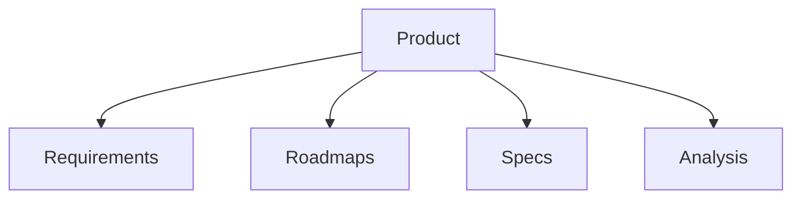

# Product

Product management, PRDs, and roadmap templates.

## Templates

| Template                                           | Description          |
| -------------------------------------------------- | -------------------- |
| [prd.md](prd.md)                                   | Product requirements |
| [product_roadmap.md](product_roadmap.md)           | Roadmaps             |
| [user_story.md](user_story.md)                     | User stories         |
| [feature_spec.md](feature_spec.md)                 | Feature specs        |
| [competitive_analysis.md](competitive_analysis.md) | Competitive analysis |

## Structure

See [Parent](../SKILL.md) for all categories.
