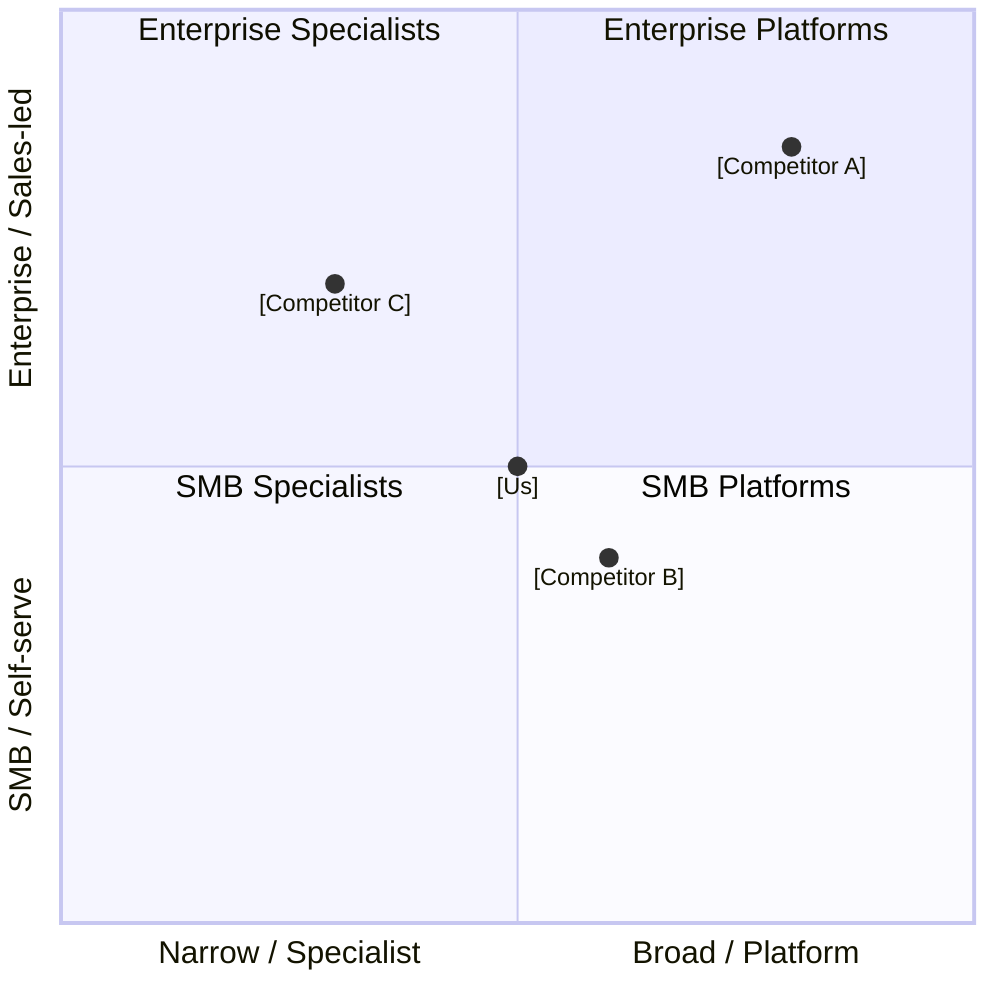

# Competitive Analysis: [Product / Feature Area]

> **Author:** [Name] · **Reviewed by:** [Name]  
> **Date:** YYYY-MM-DD · **Refresh cadence:** Quarterly  
> **Scope:** [e.g., Direct competitors in B2B project management, North America]

---

## 📋 Executive Summary

<!-- 3–5 sentences. Who are the key players, where do we win, where are we weak, and what's the strategic recommendation? -->

[Summarize the competitive landscape, our differentiated position, key threats, and the top 1–2 strategic actions this analysis recommends.]

---

## 🗺️ Competitive Landscape

---

## 🏢 Competitor Profiles

### [Competitor A]

| Attribute              | Detail                    |
| ---------------------- | ------------------------- |
| **Founded / HQ**       | [Year] / [City]           |
| **Funding / Revenue**  | $[X]M raised / ~$[X]M ARR |
| **Employees**          | ~[N]                      |
| **Primary market**     | [Segment]                 |
| **Pricing**            | [Model + range]           |
| **Key differentiator** | [One sentence]            |

**Strengths:** [Top 2–3 strengths]  
**Weaknesses:** [Top 2–3 weaknesses]  
**Recent moves:** [Last 6 months — funding, launches, partnerships]

---

### [Competitor B]

| Attribute              | Detail                    |
| ---------------------- | ------------------------- |
| **Founded / HQ**       | [Year] / [City]           |
| **Funding / Revenue**  | $[X]M raised / ~$[X]M ARR |
| **Employees**          | ~[N]                      |
| **Primary market**     | [Segment]                 |
| **Pricing**            | [Model + range]           |
| **Key differentiator** | [One sentence]            |

**Strengths:** [Top 2–3 strengths]  
**Weaknesses:** [Top 2–3 weaknesses]  
**Recent moves:** [Last 6 months — funding, launches, partnerships]

---

## ⚖️ Feature Comparison Matrix

| Feature     | Us         | [Competitor A] | [Competitor B] | [Competitor C] |
| ----------- | ---------- | -------------- | -------------- | -------------- |
| [Feature 1] | ✅ Full    | ✅ Full        | ⚠️ Partial     | ❌ None        |
| [Feature 2] | ⚠️ Partial | ✅ Full        | ✅ Full        | ❌ None        |
| [Feature 3] | ✅ Full    | ❌ None        | ⚠️ Partial     | ✅ Full        |
| [Feature 4] | ❌ None    | ✅ Full        | ✅ Full        | ✅ Full        |
| [Feature 5] | ✅ Full    | ⚠️ Partial     | ❌ None        | ❌ None        |
| [Feature 6] | ✅ Full    | ✅ Full        | ✅ Full        | ⚠️ Partial     |

> ✅ Full support · ⚠️ Partial / limited · ❌ Not available

---

## 💲 Pricing Comparison

| Tier         | Us        | [Competitor A] | [Competitor B] | [Competitor C] |
| ------------ | --------- | -------------- | -------------- | -------------- |
| Free / Trial | [Details] | [Details]      | [Details]      | [Details]      |
| Starter      | $[X]/mo   | $[X]/mo        | $[X]/mo        | $[X]/mo        |
| Growth       | $[X]/mo   | $[X]/mo        | $[X]/mo        | $[X]/mo        |
| Enterprise   | Custom    | Custom         | $[X]/mo        | Custom         |

**Pricing model:** [Per seat / Usage-based / Flat / Hybrid]

---

## 🏆 Win / Loss Analysis

| Scenario           | Win Rate | Primary Win Reason      | Primary Loss Reason        |
| ------------------ | -------- | ----------------------- | -------------------------- |
| vs. [Competitor A] | [X]%     | [e.g., Better UX]       | [e.g., Missing SSO]        |
| vs. [Competitor B] | [X]%     | [e.g., Lower price]     | [e.g., Fewer integrations] |
| vs. [Competitor C] | [X]%     | [e.g., Support quality] | [e.g., Brand recognition]  |

**Source:** [CRM data / Sales interviews / N deals analyzed]

---

## 🎯 Our Differentiation

| Dimension     | Our Advantage    | Evidence              |
| ------------- | ---------------- | --------------------- |
| [Dimension 1] | [Specific claim] | [Data point or quote] |
| [Dimension 2] | [Specific claim] | [Data point or quote] |
| [Dimension 3] | [Specific claim] | [Data point or quote] |

**Unique value proposition:** [One sentence that no competitor can honestly claim.]

---

## ⚠️ Competitive Threats & Gaps

| Gap     | Competitor Exploiting It | Priority to Close | Recommended Action |
| ------- | ------------------------ | ----------------- | ------------------ |
| [Gap 1] | [Competitor]             | 🔴 High           | [Action]           |
| [Gap 2] | [Competitor]             | 🟠 Medium         | [Action]           |
| [Gap 3] | [Competitor]             | 🟡 Low            | [Action]           |

---

## ✅ Analysis Quality Checklist

- [ ] All competitors verified with public sources (< 90 days old)
- [ ] Win/loss data pulled from CRM (≥ 20 deals)
- [ ] Pricing validated against competitor websites
- [ ] Sales team reviewed for accuracy
- [ ] Feature matrix tested hands-on (not just marketing claims)
- [ ] Linked to roadmap items addressing gaps

---

## 📎 Sources

| Source                  | Type              | Date       |
| ----------------------- | ----------------- | ---------- |
| [Competitor A website]  | Primary           | YYYY-MM-DD |
| [G2 / Capterra reviews] | Review aggregator | YYYY-MM-DD |
| [Sales CRM export]      | Internal          | YYYY-MM-DD |
| [Analyst report]        | Secondary         | YYYY-MM-DD |
