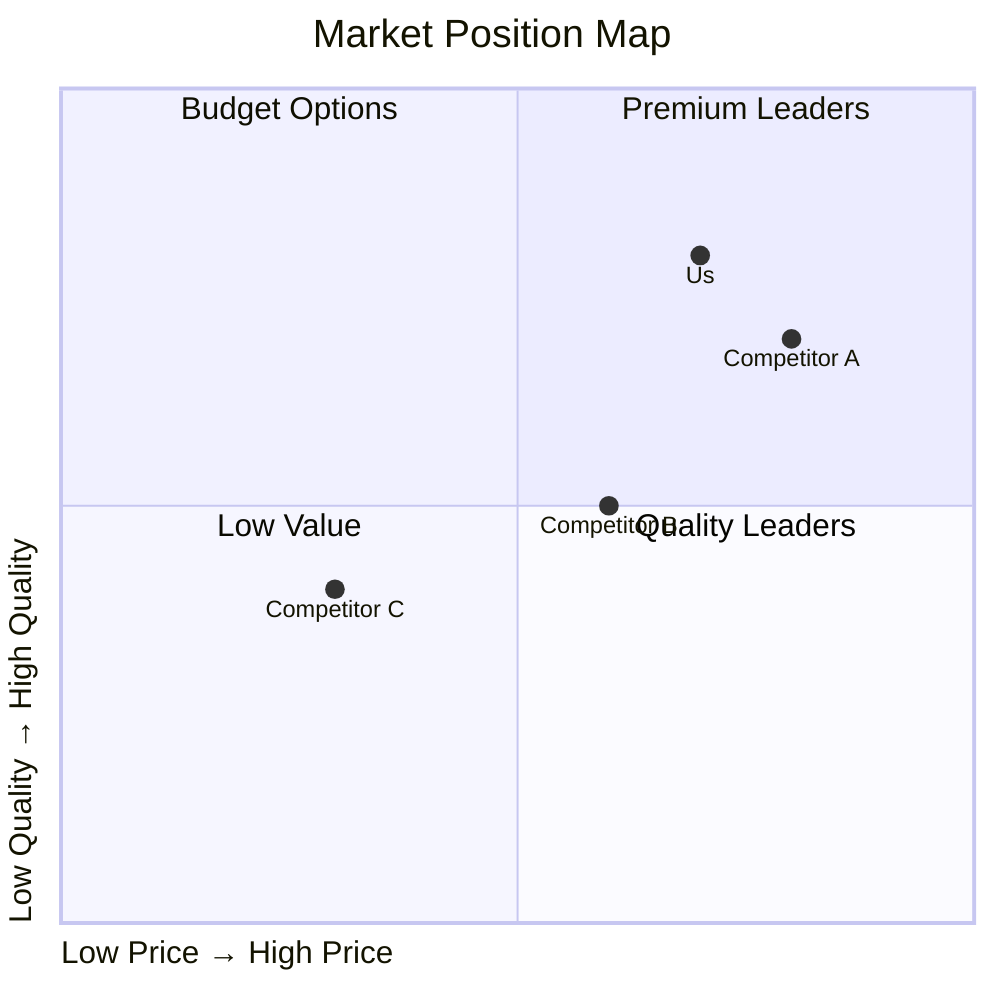

# Competitive Analysis

<!-- Market competitor evaluation -->

---

## Document Control

| Field             | Value            |
| ----------------- | ---------------- |
| **Analysis Date** | [DD-MMM-YYYY]    |
| **Market**        | [Market/Segment] |
| **Analyst**       | [Name]           |

---

## Market Overview

### Market Size

| Segment     | TAM   | SAM   | SOM   | Growth |
| ----------- | ----- | ----- | ----- | ------ |
| [Segment 1] | $[X]B | $[X]B | $[X]B | [X]%   |
| [Segment 2] | $[X]B | $[X]B | $[X]B | [X]%   |

---

## Competitor Profiles

### Competitor A

| Attribute        | Value      |
| ---------------- | ---------- |
| **Founded**      | [Year]     |
| **HQ**           | [Location] |
| **Employees**    | [X]        |
| **Revenue**      | $[X]M      |
| **Market Share** | [X]%       |
| **Target**       | [Segment]  |

**Strengths:**

- [Strength 1]
- [Strength 2]

**Weaknesses:**

- [Weakness 1]
- [Weakness 2]

**Pricing:**

- Plan 1: $[X]/month
- Plan 2: $[Y]/month

---

## Feature Comparison

| Feature   | Us  | Comp A | Comp B | Comp C |
| --------- | --- | ------ | ------ | ------ |
| Feature 1 | [✓] | [✓]    | [✗]    | [✓]    |
| Feature 2 | [✓] | [✗]    | [✓]    | [✓]    |
| Feature 3 | [✓] | [✓]    | [✓]    | [✗]    |

---

## Pricing Comparison

| Competitor | Price | Model   | Notes   |
| ---------- | ----- | ------- | ------- |
| Us         | $[X]  | [Model] | [Notes] |
| Comp A     | $[X]  | [Model] | [Notes] |
| Comp B     | $[X]  | [Model] | [Notes] |

---

## SWOT Analysis

### Us

**Strengths**

- [Strength 1]
- [Strength 2]

**Weaknesses**

- [Weakness 1]

**Opportunities**

- [Opportunity 1]

**Threats**

- [Threat 1]

---

## Strategic Recommendations

1. [Recommendation 1]
2. [Recommendation 2]
3. [Recommendation 3]

---

**Analyst:** ********\_******** Date: ****\_****
