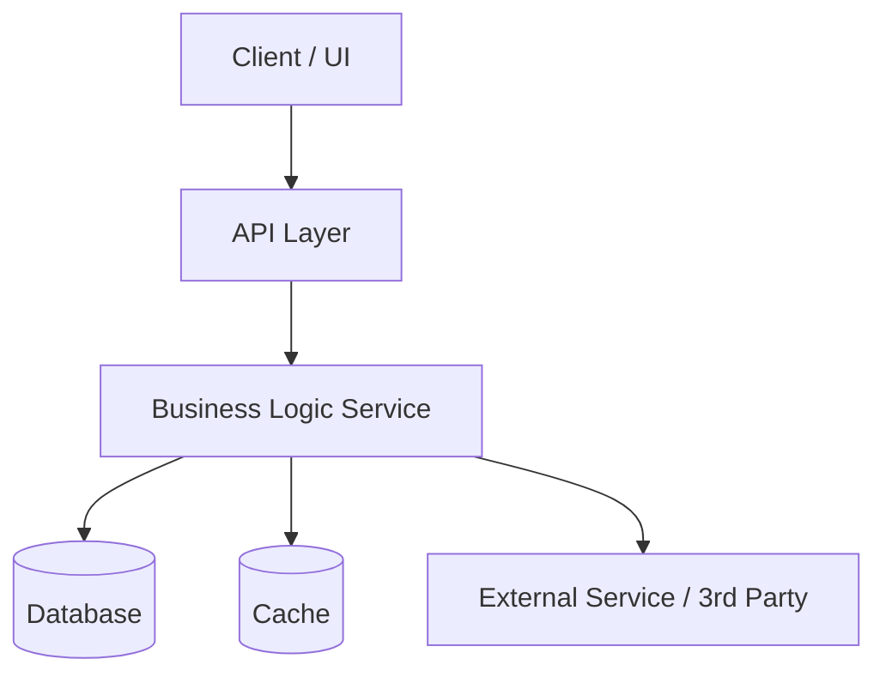

# Feature Spec: [Feature Name]

> **Spec ID:** FS-[NNN] · **PRD:** [PRD-NNN link] · **Epic:** [Epic Name]  
> **Author:** [Eng Lead] · **PM:** [Name] · **Designer:** [Name]  
> **Status:** Draft | Under Review | Approved | Implemented  
> **Created:** YYYY-MM-DD · **Approved:** YYYY-MM-DD

---

## 🎯 Overview

**One-line summary:** [What this feature does in plain English.]

**Scope:** [What is and is not included in this spec.]

**Motivation:** [Why now? Link to PRD or OKR.]

---

## 🏗️ Architecture



### Component Responsibilities

| Component     | Responsibility | Owner Team |
| ------------- | -------------- | ---------- |
| [Component A] | [What it does] | [Team]     |
| [Component B] | [What it does] | [Team]     |
| [Component C] | [What it does] | [Team]     |

---

## 📡 API Design

### Endpoint: `[METHOD] /api/v1/[resource]`

**Request:**

```json
{
  "field_1": "string",
  "field_2": 0,
  "field_3": true
}
```

**Response (200 OK):**

```json
{
  "id": "uuid",
  "field_1": "string",
  "created_at": "ISO-8601"
}
```

**Error Responses:**

| Status | Code             | Meaning                  |
| ------ | ---------------- | ------------------------ |
| 400    | `INVALID_INPUT`  | Malformed request body   |
| 401    | `UNAUTHORIZED`   | Missing or invalid token |
| 404    | `NOT_FOUND`      | Resource does not exist  |
| 429    | `RATE_LIMITED`   | Too many requests        |
| 500    | `INTERNAL_ERROR` | Unexpected server error  |

---

## 🗄️ Data Model

```
Table: [table_name]
├── id          UUID        PK
├── [field_1]   VARCHAR(N)  NOT NULL
├── [field_2]   INTEGER     DEFAULT 0
├── [field_3]   BOOLEAN     DEFAULT false
├── created_at  TIMESTAMP   NOT NULL
└── updated_at  TIMESTAMP   NOT NULL

Index: idx_[table]_[field] ON [field]
```

**Migration strategy:** [Additive / Backfill / Zero-downtime rename]

---

## ⚙️ Business Logic

### Core Algorithm / Flow

1. [Step 1: Validate input]
2. [Step 2: Check authorization]
3. [Step 3: Core operation]
4. [Step 4: Side effects / events]
5. [Step 5: Return response]

### Edge Cases

| Scenario               | Expected Behavior                   |
| ---------------------- | ----------------------------------- |
| [Empty input]          | [Return 400 with message]           |
| [Concurrent writes]    | [Last-write-wins / optimistic lock] |
| [Downstream timeout]   | [Retry with exponential backoff]    |
| [Data migration state] | [Graceful degradation]              |

---

## 🔒 Security & Privacy

- **Authentication:** [JWT / OAuth / API key]
- **Authorization:** [RBAC role required]
- **PII fields:** [List any PII; encryption at rest/transit]
- **Audit log:** [What events are logged]
- **Rate limiting:** [Requests per minute per user/IP]

---

## 📈 Performance Targets

| Metric      | Target  | Measurement |
| ----------- | ------- | ----------- |
| p50 latency | < [X]ms | Datadog APM |
| p99 latency | < [X]ms | Datadog APM |
| Throughput  | [N] RPS | Load test   |
| Error rate  | < [X]%  | Sentry      |

---

## 🧪 Testing Plan

- [ ] Unit tests for business logic (target: 90% coverage)
- [ ] Integration tests for API endpoints
- [ ] Contract tests for external dependencies
- [ ] Load test at 2× expected peak traffic
- [ ] Chaos test: downstream service failure
- [ ] Security scan (SAST / dependency audit)

---

## 🚀 Rollout Plan

| Phase            | Audience  | Criteria to Advance   |
| ---------------- | --------- | --------------------- |
| Internal dogfood | [Team]    | No P0 bugs for 48h    |
| 1% canary        | [Segment] | Error rate < baseline |
| 10% ramp         | [Segment] | KPIs on target        |
| 100% GA          | All users | Stakeholder sign-off  |

**Feature flag key:** `[flag_name]`  
**Rollback:** Disable flag → traffic returns to old path instantly.

---

## 📎 References

- **PRD:** [Link]
- **Design:** [Figma link]
- **ADR:** [Architecture Decision Record link]
- **Runbook:** [Link]


---

## See Also

- [Product Requirements Document (PRD)](./prd.md) — For product-level requirements and context
- [User Story](./user_story.md) — For agile story format of feature requirements
- [API Specification](./../software/api_spec.md) — For REST API design within features
- [Architecture Decision Record (ADR)](./../software/adr.md) — For architectural decisions affecting feature implementation
- [TDD Specification](./../software/tdd_spec.md) — For test-driven development of features