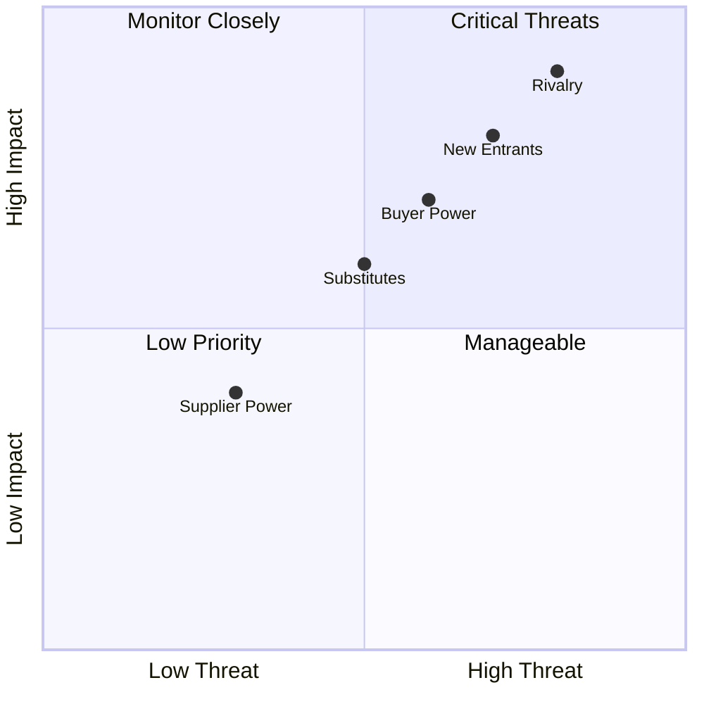

# Market Research: [Market / Segment Name]

> **Author:** [Name] · **Reviewed by:** [Name]  
> **Date:** YYYY-MM-DD · **Refresh cadence:** Quarterly  
> **Purpose:** [e.g., Inform go-to-market strategy for Q3 launch]

---

## 📋 Executive Summary

<!-- 3–5 sentences. Key finding, market size, opportunity, and recommended action. -->

[Summarize the market opportunity, primary customer segment, key trends, and the strategic recommendation this research supports.]

---

## 🌍 Market Definition

| Dimension            | Description                              |
| -------------------- | ---------------------------------------- |
| **Market name**      | [e.g., B2B Project Management Software]  |
| **Geography**        | [e.g., North America, Global]            |
| **Customer segment** | [e.g., SMBs with 10–500 employees]       |
| **Time horizon**     | [e.g., 2024–2028]                        |
| **Data sources**     | [e.g., Gartner, IDC, primary interviews] |

---

## 💰 Market Sizing

| Level                                    | Definition                           | Size  | Growth (CAGR) |
| ---------------------------------------- | ------------------------------------ | ----- | ------------- |
| **TAM** — Total Addressable Market       | All potential customers globally     | $[X]B | [X]%          |
| **SAM** — Serviceable Addressable Market | Customers we can realistically reach | $[X]B | [X]%          |
| **SOM** — Serviceable Obtainable Market  | Realistic 3-year capture             | $[X]M | [X]%          |

**Methodology:** [Bottom-up / Top-down / Value theory — explain briefly]

$$\text{TAM} = \text{Total Customers} \times \text{ARPU}$$

---

## 📈 Market Trends

| Trend                              | Direction   | Impact on Us          | Time Horizon |
| ---------------------------------- | ----------- | --------------------- | ------------ |
| [Trend 1, e.g., AI adoption]       | ↑ Growing   | [Tailwind / Headwind] | 1–2 years    |
| [Trend 2, e.g., Regulatory change] | → Stable    | [Tailwind / Headwind] | 2–3 years    |
| [Trend 3, e.g., Consolidation]     | ↓ Declining | [Tailwind / Headwind] | 3–5 years    |

---

## 👥 Customer Segments

| Segment     | Size          | Willingness to Pay  | Acquisition Channel | Priority     |
| ----------- | ------------- | ------------------- | ------------------- | ------------ |
| [Segment A] | [N customers] | High / Medium / Low | [Channel]           | 🔴 Primary   |
| [Segment B] | [N customers] | High / Medium / Low | [Channel]           | 🟡 Secondary |
| [Segment C] | [N customers] | High / Medium / Low | [Channel]           | 🟢 Future    |

---

## ⚡ Porter's Five Forces

| Force                      | Level     | Key Drivers                                              |
| -------------------------- | --------- | -------------------------------------------------------- |
| **Competitive rivalry**    | 🔴 High   | [e.g., Many funded players, low switching cost]          |
| **Threat of new entrants** | 🟠 Medium | [e.g., Low capital barrier, but network effects protect] |
| **Threat of substitutes**  | 🟡 Medium | [e.g., Spreadsheets, manual processes]                   |
| **Buyer power**            | 🟠 Medium | [e.g., SMBs price-sensitive, enterprises have leverage]  |
| **Supplier power**         | 🟢 Low    | [e.g., Cloud infra commoditized]                         |

---

## 🔍 Customer Pain Research

**Research method:** [Interviews / Surveys / Support ticket analysis / Social listening]  
**Sample size:** [N participants]

| Pain Point | Frequency           | Severity | Current Solution |
| ---------- | ------------------- | -------- | ---------------- |
| [Pain 1]   | [X% of respondents] | Critical | [Workaround]     |
| [Pain 2]   | [X% of respondents] | High     | [Workaround]     |
| [Pain 3]   | [X% of respondents] | Medium   | [Workaround]     |

---

## 🚀 Go-to-Market Implications

| Insight            | Strategic Implication |
| ------------------ | --------------------- |
| [Market finding 1] | [Recommended action]  |
| [Market finding 2] | [Recommended action]  |
| [Market finding 3] | [Recommended action]  |

---

## ✅ Research Quality Checklist

- [ ] Primary research conducted (≥ 10 interviews)
- [ ] Secondary sources cited with dates
- [ ] Market size cross-validated with 2+ methods
- [ ] Assumptions documented and labeled
- [ ] Reviewed by sales / BD for ground-truth check
- [ ] Competitive landscape cross-referenced

---

## 📎 Sources & References

| Source     | Type              | Date    | Link   |
| ---------- | ----------------- | ------- | ------ |
| [Source 1] | Analyst report    | YYYY-MM | [Link] |
| [Source 2] | Primary interview | YYYY-MM | [Link] |
| [Source 3] | Industry survey   | YYYY-MM | [Link] |
