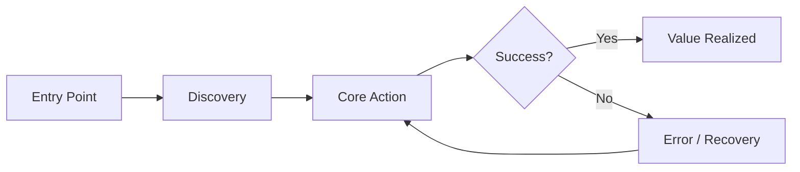

# Product Requirements Document: [Feature/Product Name]

> **Status:** Draft | In Review | Approved | Deprecated  
> **Author:** [Name] · **PM:** [Name] · **Eng Lead:** [Name]  
> **Created:** YYYY-MM-DD · **Last Updated:** YYYY-MM-DD · **Target Launch:** YYYY-QN

---

## 🎯 Problem Statement

<!-- One paragraph. What user pain or business gap does this solve? -->

**User problem:** [Describe the friction, failure mode, or unmet need.]

**Business impact:** [Revenue, retention, acquisition, or cost implication.]

---

## 📐 Goals & Non-Goals

| Goals                            | Non-Goals                   |
| -------------------------------- | --------------------------- |
| [Specific, measurable outcome 1] | [Explicitly out of scope 1] |
| [Specific, measurable outcome 2] | [Explicitly out of scope 2] |
| [Specific, measurable outcome 3] | [Explicitly out of scope 3] |

---

## 👥 Target Users

| Persona             | Need                  | Frequency                |
| ------------------- | --------------------- | ------------------------ |
| [Primary persona]   | [Core job-to-be-done] | Daily / Weekly / Monthly |
| [Secondary persona] | [Core job-to-be-done] | Daily / Weekly / Monthly |

---

## 📊 Success Metrics

| Metric             | Baseline        | Target                 | Measurement Method |
| ------------------ | --------------- | ---------------------- | ------------------ |
| [Primary KPI]      | [Current value] | [Goal value]           | [How measured]     |
| [Secondary KPI]    | [Current value] | [Goal value]           | [How measured]     |
| [Guardrail metric] | [Current value] | [Do not degrade below] | [How measured]     |

---

## 🗺️ User Journey

---

## 📋 Requirements

### Functional Requirements

| ID    | Requirement             | Priority | Notes |
| ----- | ----------------------- | -------- | ----- |
| FR-01 | [Must-have behavior]    | P0       |       |
| FR-02 | [Must-have behavior]    | P0       |       |
| FR-03 | [Should-have behavior]  | P1       |       |
| FR-04 | [Nice-to-have behavior] | P2       |       |

### Non-Functional Requirements

| Category      | Requirement                       |
| ------------- | --------------------------------- |
| Performance   | [e.g., p99 latency < 200ms]       |
| Availability  | [e.g., 99.9% uptime]              |
| Security      | [e.g., PII encrypted at rest]     |
| Accessibility | [e.g., WCAG 2.1 AA]               |
| Scalability   | [e.g., supports 10× current load] |

---

## 🔗 Dependencies & Risks

| Item           | Type                             | Owner   | Mitigation    |
| -------------- | -------------------------------- | ------- | ------------- |
| [Dependency 1] | Upstream / Downstream / External | [Team]  | [Plan]        |
| [Risk 1]       | Technical / Legal / Market       | [Owner] | [Contingency] |

---

## 🚫 Open Questions

- [ ] [Question 1] — Owner: [Name] — Due: YYYY-MM-DD
- [ ] [Question 2] — Owner: [Name] — Due: YYYY-MM-DD

---

## ✅ Launch Checklist

- [ ] Engineering design doc approved
- [ ] Legal / privacy review complete
- [ ] A/B test plan defined
- [ ] Rollout plan (% ramp) documented
- [ ] Monitoring & alerting configured
- [ ] Rollback plan documented
- [ ] Support team trained
- [ ] Documentation published

---

## 📎 Appendix

- **Mockups / Figma:** [Link]
- **Data analysis:** [Link]
- **Related PRDs:** [Link]
- **Slack channel:** #[channel]

---

## See Also

- [User Story](./user_story.md) — For breaking down PRD requirements into sprint-ready stories
- [Feature Specification](./feature_spec.md) — For engineering implementation details of PRD features
- [Sprint Planning](./../project/sprint_planning.md) — For planning development iterations based on PRD priorities
- [Product Roadmap](./product_roadmap.md) — For long-term product planning context
- [Competitive Analysis](./competitive_analysis.md) — For market research supporting PRD decisions