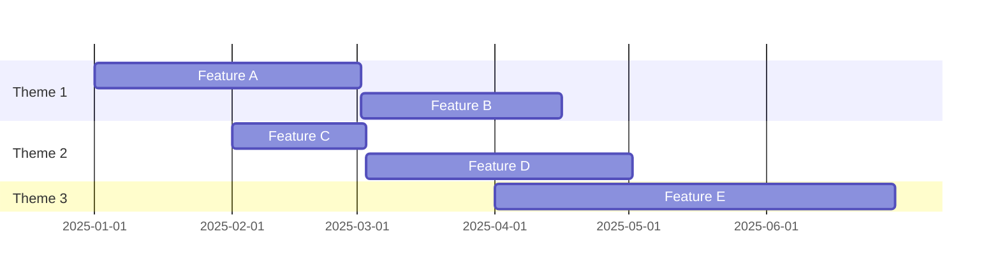
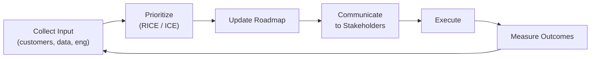

# Product Roadmap: [Product / Team Name]

> **Period:** [YYYY-QN] – [YYYY-QN] · **Owner:** [PM Name]  
> **Last Updated:** YYYY-MM-DD · **Review Cadence:** Monthly  
> **Vision:** [One sentence — the future state this roadmap builds toward.]

---

## 🧭 Strategic Themes

| Theme        | Description                | OKR Link |
| ------------ | -------------------------- | -------- |
| 🚀 [Theme 1] | [What this theme achieves] | [OKR-N]  |
| 🔒 [Theme 2] | [What this theme achieves] | [OKR-N]  |
| 📈 [Theme 3] | [What this theme achieves] | [OKR-N]  |

---

## 🗓️ Timeline Overview

---

## 🟢 Now — Current Quarter ([YYYY-QN])

> Committed. Engineering capacity allocated. Scope locked.

| Initiative            | Outcome             | Team   | Status         |
| --------------------- | ------------------- | ------ | -------------- |
| [Feature / Project 1] | [Measurable result] | [Team] | 🔵 In Progress |
| [Feature / Project 2] | [Measurable result] | [Team] | 🟡 Starting    |
| [Feature / Project 3] | [Measurable result] | [Team] | ✅ Done        |

**Key milestones this quarter:**

- [ ] [Milestone 1] — Due: YYYY-MM-DD
- [ ] [Milestone 2] — Due: YYYY-MM-DD
- [ ] [Milestone 3] — Due: YYYY-MM-DD

---

## 🔵 Next — Following Quarter ([YYYY-QN])

> Planned. Designs in progress. Scope may shift.

| Initiative            | Outcome             | Team   | Confidence |
| --------------------- | ------------------- | ------ | ---------- |
| [Feature / Project 4] | [Measurable result] | [Team] | High       |
| [Feature / Project 5] | [Measurable result] | [Team] | Medium     |
| [Feature / Project 6] | [Measurable result] | [Team] | Low        |

**Dependencies to resolve:**

- [ ] [Dependency 1] — Owner: [Name]
- [ ] [Dependency 2] — Owner: [Name]

---

## 🌅 Later — Future Quarters ([YYYY-QN+])

> Directional. Subject to change based on learnings and priorities.

| Initiative            | Strategic Theme | Rough Sizing   |
| --------------------- | --------------- | -------------- |
| [Idea / Initiative A] | [Theme]         | S / M / L / XL |
| [Idea / Initiative B] | [Theme]         | S / M / L / XL |
| [Idea / Initiative C] | [Theme]         | S / M / L / XL |
| [Idea / Initiative D] | [Theme]         | S / M / L / XL |

---

## 🚫 Not Doing (Parking Lot)

| Item     | Reason Deprioritized              | Revisit When |
| -------- | --------------------------------- | ------------ |
| [Idea X] | [Low ROI / not aligned / blocked] | [Condition]  |
| [Idea Y] | [Low ROI / not aligned / blocked] | [Condition]  |

---

## 📊 Success Metrics

| Metric              | Current | Q[N] Target | Q[N+1] Target |
| ------------------- | ------- | ----------- | ------------- |
| [North Star Metric] | [Value] | [Value]     | [Value]       |
| [Retention metric]  | [Value] | [Value]     | [Value]       |
| [Engagement metric] | [Value] | [Value]     | [Value]       |

---

## 🔄 Roadmap Process

**Prioritization framework:** RICE (Reach × Impact × Confidence ÷ Effort)

---

## 📎 References

- **OKRs:** [Link]
- **Strategy doc:** [Link]
- **Backlog:** [Jira / Linear link]
- **Stakeholder deck:** [Link]
