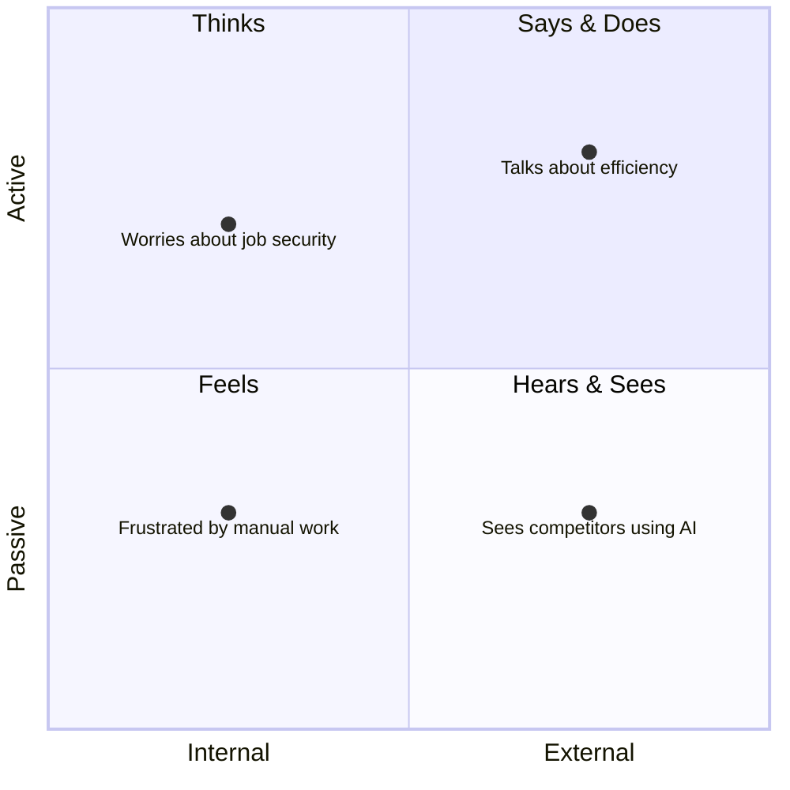

# User Persona: [Persona Name]

> **Archetype:** [Short label, e.g., "The Overwhelmed Manager"]  
> **Created:** YYYY-MM-DD · **Last Validated:** YYYY-MM-DD  
> **Research basis:** [N interviews / N survey responses / analytics cohort]

---

## 👤 Profile

| Attribute                 | Detail                                 |
| ------------------------- | -------------------------------------- |
| **Name (fictional)**      | [e.g., "Alex Chen"]                    |
| **Age range**             | [e.g., 28–38]                          |
| **Role / Title**          | [e.g., Senior Product Manager]         |
| **Industry**              | [e.g., SaaS / Healthcare / Finance]    |
| **Company size**          | [e.g., 50–500 employees]               |
| **Tech savviness**        | ⭐⭐⭐⭐☆ (1–5)                        |
| **Decision-making power** | Influencer / Decision-maker / End user |

---

## 🎯 Jobs to Be Done

> "When I [situation], I want to [motivation], so I can [outcome]."

**Primary job:** [Core functional task they need to accomplish]

**Secondary jobs:**

- [Social job: how they want to be perceived]
- [Emotional job: how they want to feel]

---

## 😤 Pains & Frustrations

| Pain     | Severity    | Current Workaround   |
| -------- | ----------- | -------------------- |
| [Pain 1] | 🔴 Critical | [What they do today] |
| [Pain 2] | 🟠 High     | [What they do today] |
| [Pain 3] | 🟡 Medium   | [What they do today] |

---

## 🌟 Gains & Motivations

- **Functional gains:** [Faster, cheaper, more accurate outcomes]
- **Social gains:** [Recognition, status, team approval]
- **Emotional gains:** [Confidence, reduced anxiety, sense of control]

---

## 🗺️ Empathy Map

**Thinks:** [Internal beliefs and assumptions]  
**Feels:** [Emotional state — fears, hopes, frustrations]  
**Says:** [Quotes from interviews / surveys]  
**Does:** [Observable behaviors and actions]

---

## 📱 A Day in the Life

| Time     | Activity               | Tool Used | Pain Point |
| -------- | ---------------------- | --------- | ---------- |
| 9:00 AM  | [Morning routine task] | [Tool]    | [Friction] |
| 11:00 AM | [Core work task]       | [Tool]    | [Friction] |
| 2:00 PM  | [Collaboration task]   | [Tool]    | [Friction] |
| 4:00 PM  | [Reporting / review]   | [Tool]    | [Friction] |

---

## 🛒 Buying Behavior

| Factor                  | Detail                                         |
| ----------------------- | ---------------------------------------------- |
| **Discovery channel**   | [e.g., G2, peer referral, LinkedIn]            |
| **Evaluation criteria** | [e.g., ease of use, integrations, price]       |
| **Decision timeline**   | [e.g., 2–4 weeks]                              |
| **Budget authority**    | [e.g., up to $500/mo self-serve]               |
| **Key objection**       | [e.g., "Will this integrate with Salesforce?"] |

---

## 💬 Representative Quotes

> "[Direct quote from user research that captures their core frustration.]"

> "[Direct quote that reveals their desired outcome.]"

---

## ✅ Validation Checklist

- [ ] Validated with ≥ 5 user interviews
- [ ] Cross-checked against quantitative analytics
- [ ] Reviewed by sales / CS for accuracy
- [ ] Distinct from other personas (no overlap)
- [ ] Linked to at least one active PRD or user story

---

## 📎 References

- **Research notes:** [Link]
- **Interview recordings:** [Link]
- **Survey data:** [Link]
- **Related personas:** [Link]
