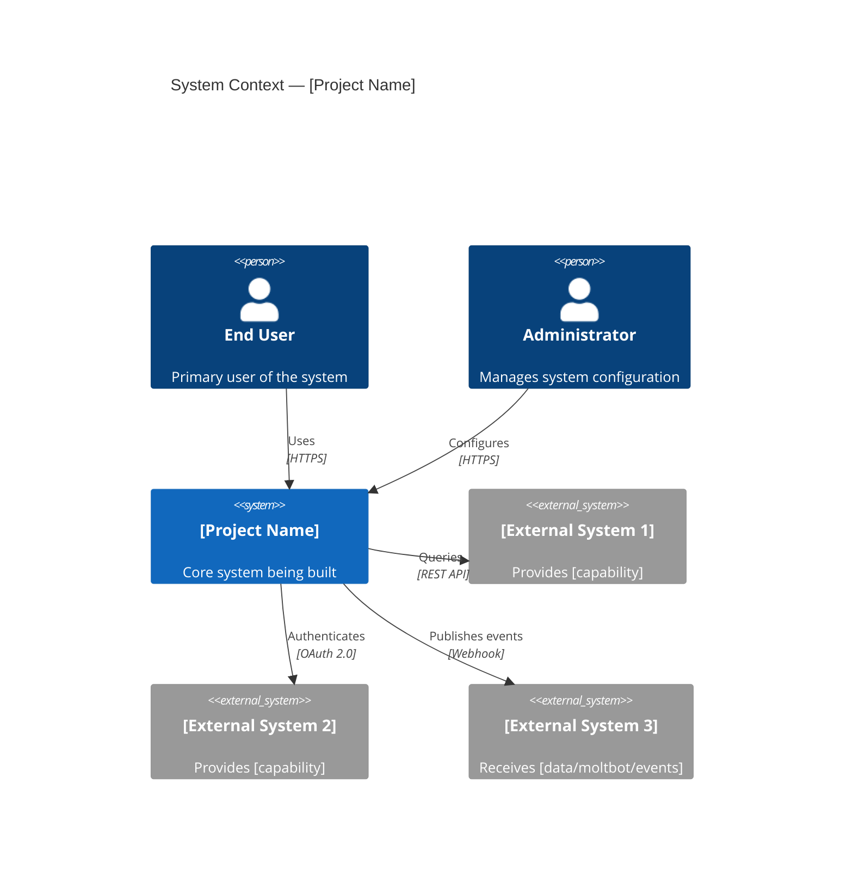
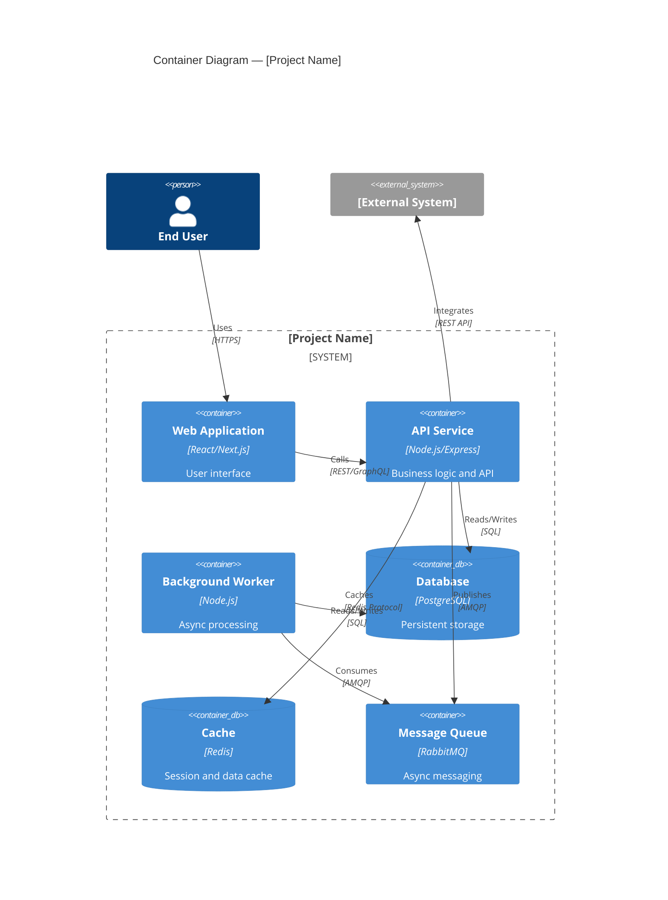
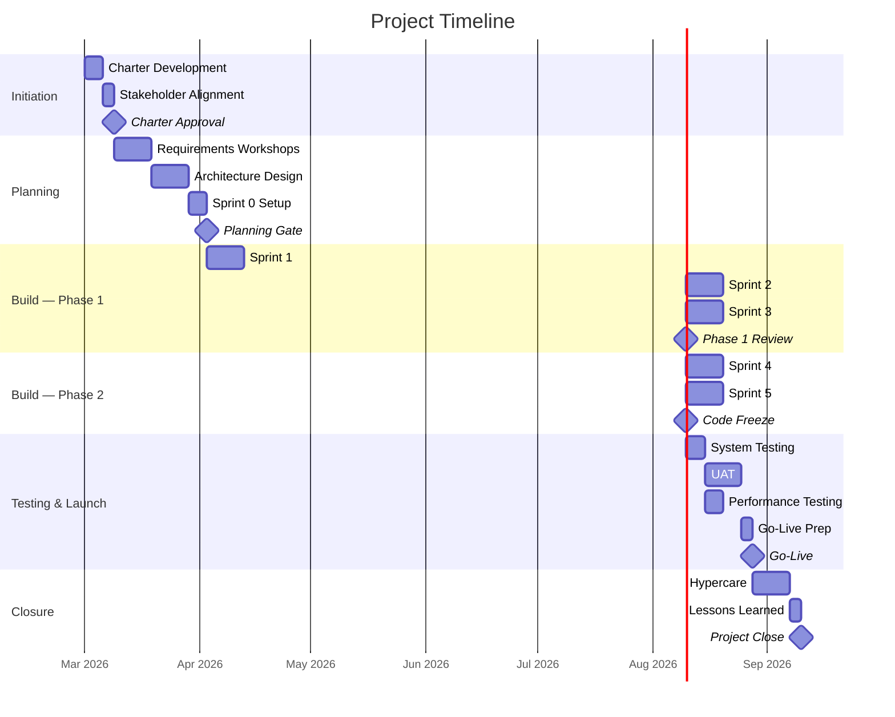

# Project Charter

| Field               | Value                                  |
| ------------------- | -------------------------------------- |
| **Document ID**     | `PC-[NNN]-[PROJECT]-[YYYY]`            |
| **Project Name**    | [Project Name]                         |
| **Version**         | 1.0                                    |
| **Classification**  | [Internal / Confidential / Restricted] |
| **Date**            | [YYYY-MM-DD]                           |
| **Sponsor**         | [Name, Title]                          |
| **Project Manager** | [Name]                                 |
| **Status**          | [Draft / Approved / Active / Closed]   |
| **Priority**        | [Critical / High / Medium / Low]       |
| **Program**         | [Parent program, if applicable]        |

---

## Document Control

| Version | Date   | Author   | Reviewer    | Approver  | Changes          |
| ------- | ------ | -------- | ----------- | --------- | ---------------- |
| 0.1     | [Date] | [Author] | —           | —         | Initial draft    |
| 0.2     | [Date] | [Author] | [Technical] | —         | Technical review |
| 1.0     | [Date] | [Author] | [QA]        | [Sponsor] | Approved         |

---

## Executive Summary

[4-5 paragraphs. Strategic context, problem statement with quantified impact, proposed approach, expected outcomes with financial projections, and recommended next steps. Written for C-suite decision makers.]

### Project at a Glance

| Dimension              | Value                            |
| ---------------------- | -------------------------------- |
| **Investment**         | $[Amount]                        |
| **Duration**           | [Months]                         |
| **Team Size**          | [FTEs]                           |
| **Expected ROI**       | [X]% within [timeframe]          |
| **Strategic Priority** | [Corporate initiative alignment] |

---

## Strategic Alignment

### Corporate Strategy Mapping

| Corporate Objective | Project Contribution           | Measurement |
| ------------------- | ------------------------------ | ----------- |
| [Strategic goal 1]  | [How this project contributes] | [KPI]       |
| [Strategic goal 2]  | [Contribution]                 | [KPI]       |
| [Strategic goal 3]  | [Contribution]                 | [KPI]       |

### Problem Statement

[Detailed problem description with quantified data. What is the current state? What evidence demonstrates the need? What is the cost of inaction?]

### Objectives & Key Results

| Objective     | Key Result | Baseline  | Target   | Timeline |
| ------------- | ---------- | --------- | -------- | -------- |
| [Objective 1] | [KR 1.1]   | [Current] | [Target] | [Date]   |
|               | [KR 1.2]   | [Current] | [Target] | [Date]   |
| [Objective 2] | [KR 2.1]   | [Current] | [Target] | [Date]   |
|               | [KR 2.2]   | [Current] | [Target] | [Date]   |
| [Objective 3] | [KR 3.1]   | [Current] | [Target] | [Date]   |

---

## Architecture Overview

### System Context (C4 Level 1)

### Container Diagram (C4 Level 2)

### Technology Stack

| Layer          | Technology   | Rationale    |
| -------------- | ------------ | ------------ |
| Frontend       | [Technology] | [Why chosen] |
| API            | [Technology] | [Why chosen] |
| Database       | [Technology] | [Why chosen] |
| Cache          | [Technology] | [Why chosen] |
| Messaging      | [Technology] | [Why chosen] |
| Infrastructure | [Technology] | [Why chosen] |
| CI/CD          | [Technology] | [Why chosen] |

---

## Scope

### Work Breakdown Structure

| WBS | Work Package         | Description                | Priority | Effort |
| --- | -------------------- | -------------------------- | -------- | ------ |
| 1.0 | **Initiation**       |                            |          |        |
| 1.1 | Charter & Planning   | Project setup and planning | Must     | [Days] |
| 2.0 | **Core Platform**    |                            |          |        |
| 2.1 | [Component 1]        | [Description]              | Must     | [Days] |
| 2.2 | [Component 2]        | [Description]              | Must     | [Days] |
| 2.3 | [Component 3]        | [Description]              | Should   | [Days] |
| 3.0 | **Integration**      |                            |          |        |
| 3.1 | [Integration 1]      | [Description]              | Must     | [Days] |
| 3.2 | [Integration 2]      | [Description]              | Should   | [Days] |
| 4.0 | **Testing & Launch** |                            |          |        |
| 4.1 | Testing              | All test phases            | Must     | [Days] |
| 4.2 | Deployment           | Production rollout         | Must     | [Days] |
| 5.0 | **Closure**          |                            |          |        |
| 5.1 | Transition           | Knowledge transfer, docs   | Must     | [Days] |

### Out of Scope

| #   | Item   | Rationale | Future Phase?      |
| --- | ------ | --------- | ------------------ |
| 1   | [Item] | [Reason]  | [Yes/No — Phase X] |
| 2   | [Item] | [Reason]  | [Yes/No]           |

### Dependencies

| ID  | Dependency    | Type      | Provider      | Required By | Status   |
| --- | ------------- | --------- | ------------- | ----------- | -------- |
| D1  | [Description] | External  | [Team/Vendor] | [Date]      | [Status] |
| D2  | [Description] | Internal  | [Team]        | [Date]      | [Status] |
| D3  | [Description] | Technical | [System]      | [Date]      | [Status] |

---

## Timeline

---

## Team & Organization

### Team Structure

| Role               | Name    | Allocation | Responsibility                           |
| ------------------ | ------- | ---------- | ---------------------------------------- |
| Executive Sponsor  | [Name]  | 5%         | Strategic direction, funding, escalation |
| Project Manager    | [Name]  | 100%       | Delivery, reporting, risk management     |
| Solution Architect | [Name]  | 75%        | Architecture, technical decisions        |
| Tech Lead          | [Name]  | 100%       | Implementation leadership                |
| Developers (x[N])  | [Names] | 100%       | Feature development                      |
| QA Lead            | [Name]  | 75%        | Test strategy and execution              |
| Business Analyst   | [Name]  | 75%        | Requirements, acceptance criteria        |
| UX Designer        | [Name]  | 50%        | User experience design                   |

### RACI Matrix

| Activity         | Sponsor | PM    | Architect | Tech Lead | BA    | QA    |
| ---------------- | ------- | ----- | --------- | --------- | ----- | ----- |
| Charter Approval | **A**   | **R** | C         | C         | C     | I     |
| Requirements     | I       | **A** | C         | C         | **R** | C     |
| Architecture     | I       | I     | **R/A**   | C         | I     | I     |
| Sprint Planning  | I       | **A** | C         | **R**     | C     | C     |
| Development      | I       | I     | C         | **R/A**   | I     | I     |
| Testing          | I       | **A** | I         | C         | C     | **R** |
| Go-Live Decision | **A**   | **R** | C         | C         | C     | C     |

---

## Financial Plan

### Budget Summary

| Category               | Amount        | % of Total |
| ---------------------- | ------------- | ---------- |
| Internal Personnel     | $[Amount]     | [X]%       |
| External Resources     | $[Amount]     | [X]%       |
| Technology & Licensing | $[Amount]     | [X]%       |
| Infrastructure         | $[Amount]     | [X]%       |
| Training & Change      | $[Amount]     | [X]%       |
| Contingency (10%)      | $[Amount]     | 10%        |
| **Total**              | **$[Amount]** | 100%       |

### ROI Projection

$$
\text{ROI} = \frac{\sum_{t=1}^{3} B_t - C_{\text{total}}}{C_{\text{total}}} \times 100
$$

| Metric         | Year 1 | Year 2 | Year 3 |
| -------------- | ------ | ------ | ------ |
| Benefits       | $[Amt] | $[Amt] | $[Amt] |
| Costs          | $[Amt] | $[Amt] | $[Amt] |
| Net Value      | $[Amt] | $[Amt] | $[Amt] |
| Cumulative ROI | [X]%   | [X]%   | [X]%   |

---

## Risk Management

| ID  | Risk          | Category  | P   | I   | Score | Response | Mitigation        | Owner  |
| --- | ------------- | --------- | --- | --- | ----- | -------- | ----------------- | ------ |
| R1  | [Description] | Schedule  | H   | H   | 9     | Mitigate | [Action plan]     | [Name] |
| R2  | [Description] | Technical | M   | H   | 6     | Mitigate | [Action plan]     | [Name] |
| R3  | [Description] | Resource  | M   | M   | 4     | Accept   | [Monitoring plan] | [Name] |
| R4  | [Description] | Scope     | H   | M   | 6     | Avoid    | [Prevention plan] | [Name] |
| R5  | [Description] | External  | L   | H   | 3     | Transfer | [Contract terms]  | [Name] |

---

## Governance

### Meeting Cadence

| Forum               | Frequency | Participants     | Purpose             |
| ------------------- | --------- | ---------------- | ------------------- |
| Daily Standup       | Daily     | Dev Team         | Coordination        |
| Sprint Planning     | Bi-weekly | Extended Team    | Sprint scope        |
| Sprint Review       | Bi-weekly | All Stakeholders | Demo, feedback      |
| Retrospective       | Bi-weekly | Dev Team         | Process improvement |
| Status Review       | Weekly    | PM, Sponsor      | Progress, risks     |
| Steering Committee  | Monthly   | Leadership       | Strategic decisions |
| Architecture Review | As needed | Tech Team        | Design decisions    |

### Escalation Path

| Level     | Timeframe | Decision Maker   | Authority            |
| --------- | --------- | ---------------- | -------------------- |
| Team      | Same day  | Tech Lead / PM   | Tactical decisions   |
| Project   | 24 hours  | Sponsor          | Budget/scope < 10%   |
| Program   | 48 hours  | Program Director | Cross-project impact |
| Executive | 72 hours  | CTO/COO          | Strategic changes    |

### Change Control

| Category | Threshold             | Approver           | Process         |
| -------- | --------------------- | ------------------ | --------------- |
| Minor    | < 5% budget or 1 week | PM                 | Change log      |
| Moderate | 5-15% or 2-4 weeks    | Sponsor            | Change request  |
| Major    | > 15% or > 4 weeks    | Steering Committee | Formal proposal |

---

## Quality Plan

### Quality Criteria

| Deliverable   | Criteria                 | Standard                          | Verification     |
| ------------- | ------------------------ | --------------------------------- | ---------------- |
| Code          | Coverage, complexity     | > [X]% coverage, < [X] complexity | CI pipeline      |
| API           | Performance, reliability | < [X]ms P95, [X]% uptime          | Load testing     |
| UX            | Usability, accessibility | WCAG 2.1 AA                       | UX review        |
| Documentation | Completeness             | All APIs documented               | Review checklist |

### Definition of Done

- [ ] Acceptance criteria verified
- [ ] Code reviewed and approved (2 reviewers)
- [ ] Unit tests (> [X]% coverage)
- [ ] Integration tests passing
- [ ] Performance benchmarks met
- [ ] Security scan clean
- [ ] Documentation updated
- [ ] Deployed to staging successfully

---

## Approval

| Role               | Name   | Signature          | Date   |
| ------------------ | ------ | ------------------ | ------ |
| Executive Sponsor  | [Name] | ********\_******** | [Date] |
| Project Manager    | [Name] | ********\_******** | [Date] |
| Solution Architect | [Name] | ********\_******** | [Date] |
| Business Lead      | [Name] | ********\_******** | [Date] |
| Finance Approver   | [Name] | ********\_******** | [Date] |
| IT Security        | [Name] | ********\_******** | [Date] |

---

_Project Charter — [Project Name] · Document ID: PC-[NNN]-[PROJECT]-[YYYY]_
_Version [X.X] · Classification: [Level] · [Date]_
