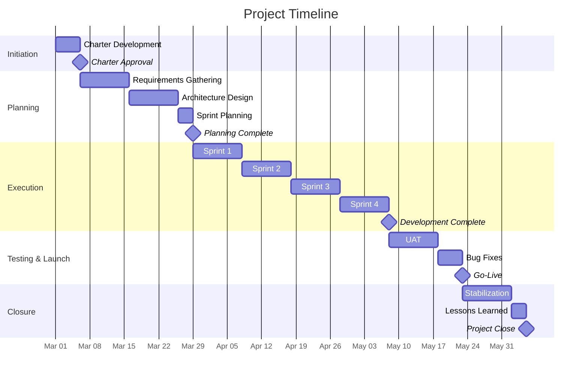

# Project Charter

| Field               | Value                                |
| ------------------- | ------------------------------------ |
| **Document ID**     | `PC-[NNN]-[PROJECT]`                 |
| **Project Name**    | [Project Name]                       |
| **Version**         | 1.0                                  |
| **Classification**  | [Internal / Confidential]            |
| **Date**            | [YYYY-MM-DD]                         |
| **Sponsor**         | [Name, Title]                        |
| **Project Manager** | [Name]                               |
| **Status**          | [Draft / Approved / Active / Closed] |
| **Priority**        | [Critical / High / Medium / Low]     |

---

## Document Control

| Version | Date   | Author   | Reviewer   | Changes          |
| ------- | ------ | -------- | ---------- | ---------------- |
| 0.1     | [Date] | [Author] | —          | Initial draft    |
| 1.0     | [Date] | [Author] | [Reviewer] | Approved version |

---

## Executive Summary

[3-4 paragraphs covering the business context, project rationale, approach, and expected outcomes. Written for an executive who needs to decide whether to fund this project.]

**Investment:** $[Amount]
**Duration:** [Months]
**Expected ROI:** [Percentage] within [timeframe]

---

## Project Overview

### Problem Statement

[What problem exists today? Be specific with data, metrics, or user feedback that demonstrates the need.]

### Objectives

| #   | Objective   | Success Metric | Baseline  | Target   | Measurement Method |
| --- | ----------- | -------------- | --------- | -------- | ------------------ |
| 1   | [Objective] | [KPI]          | [Current] | [Target] | [How measured]     |
| 2   | [Objective] | [KPI]          | [Current] | [Target] | [How measured]     |
| 3   | [Objective] | [KPI]          | [Current] | [Target] | [How measured]     |

### Business Case

| Factor              | Detail                                   |
| ------------------- | ---------------------------------------- |
| Strategic Alignment | [Which corporate strategy this supports] |
| Cost of Delay       | $[Amount] per [month/quarter]            |
| Opportunity Cost    | [What we miss by not doing this]         |
| Expected Benefit    | $[Amount] over [timeframe]               |
| Payback Period      | [Months]                                 |

### Success Criteria

The project is considered successful when:

1. [Criterion 1 — specific and measurable]
2. [Criterion 2]
3. [Criterion 3]

---

## Scope

### In Scope

| #   | Work Package   | Description   | Priority    |
| --- | -------------- | ------------- | ----------- |
| 1   | [Work package] | [Description] | Must Have   |
| 2   | [Work package] | [Description] | Must Have   |
| 3   | [Work package] | [Description] | Should Have |
| 4   | [Work package] | [Description] | Could Have  |

### Out of Scope

| #   | Item            | Rationale      |
| --- | --------------- | -------------- |
| 1   | [Excluded item] | [Why excluded] |
| 2   | [Excluded item] | [Why excluded] |

### Constraints & Assumptions

| Type       | Description                   | Impact if Wrong                 |
| ---------- | ----------------------------- | ------------------------------- |
| Constraint | [Budget cap of $X]            | [Project scope reduction]       |
| Constraint | [Must launch by Q[X]]         | [Phased delivery required]      |
| Assumption | [Team available full-time]    | [Schedule delay of X weeks]     |
| Assumption | [Existing APIs are stable]    | [Additional development effort] |
| Dependency | [Vendor delivers SDK by date] | [Phase 2 blocked]               |

---

## Stakeholders

### RACI Matrix

| Activity         | Sponsor | PM    | Tech Lead | Business | Users |
| ---------------- | ------- | ----- | --------- | -------- | ----- |
| Charter Approval | **A**   | **R** | C         | C        | I     |
| Requirements     | I       | **A** | C         | **R**    | C     |
| Architecture     | I       | I     | **R/A**   | C        | —     |
| Development      | I       | **A** | **R**     | I        | —     |
| UAT              | I       | **A** | C         | C        | **R** |
| Go-Live Decision | **A**   | **R** | C         | C        | I     |

**R** = Responsible, **A** = Accountable, **C** = Consulted, **I** = Informed

---

## Timeline

### Key Milestones

| #   | Milestone            | Target Date | Gate Criteria                                  |
| --- | -------------------- | ----------- | ---------------------------------------------- |
| M1  | Charter Approved     | [Date]      | Sponsor sign-off                               |
| M2  | Planning Complete    | [Date]      | Requirements approved, architecture reviewed   |
| M3  | Development Complete | [Date]      | All features implemented, unit tests pass      |
| M4  | Go-Live              | [Date]      | UAT signed off, deployment checklist complete  |
| M5  | Project Close        | [Date]      | Hypercare complete, lessons learned documented |

---

## Budget

### Cost Breakdown

| Category               | Q1         | Q2         | Q3         | Total      |
| ---------------------- | ---------- | ---------- | ---------- | ---------- |
| Internal Personnel     | $[Amt]     | $[Amt]     | $[Amt]     | $[Amt]     |
| External Contractors   | $[Amt]     | $[Amt]     | —          | $[Amt]     |
| Technology / Licensing | $[Amt]     | $[Amt]     | $[Amt]     | $[Amt]     |
| Infrastructure         | $[Amt]     | $[Amt]     | $[Amt]     | $[Amt]     |
| Training               | —          | —          | $[Amt]     | $[Amt]     |
| Contingency (10%)      | $[Amt]     | $[Amt]     | $[Amt]     | $[Amt]     |
| **Total**              | **$[Amt]** | **$[Amt]** | **$[Amt]** | **$[Amt]** |

### Funding Source

| Source                | Amount    | Approval Status      |
| --------------------- | --------- | -------------------- |
| [Department budget]   | $[Amount] | [Approved / Pending] |
| [Capital expenditure] | $[Amount] | [Status]             |

---

## Risk Management

| ID  | Risk               | Category  | Probability | Impact | Score | Mitigation | Owner  |
| --- | ------------------ | --------- | ----------- | ------ | ----- | ---------- | ------ |
| R1  | [Risk description] | Schedule  | H           | H      | 9     | [Strategy] | [Name] |
| R2  | [Risk description] | Technical | M           | H      | 6     | [Strategy] | [Name] |
| R3  | [Risk description] | Resource  | M           | M      | 4     | [Strategy] | [Name] |
| R4  | [Risk description] | Scope     | L           | H      | 3     | [Strategy] | [Name] |

**Risk Score:** Probability (L=1, M=2, H=3) x Impact (L=1, M=2, H=3). Scores >= 6 require active mitigation.

---

## Communication Plan

| Communication      | Frequency     | Audience         | Owner        | Format            | Channel |
| ------------------ | ------------- | ---------------- | ------------ | ----------------- | ------- |
| Daily Standup      | Daily         | Dev Team         | Scrum Master | 15-min meeting    | [Tool]  |
| Status Report      | Weekly        | Stakeholders     | PM           | Written report    | Email   |
| Steering Committee | Bi-weekly     | Leadership       | PM           | Presentation      | Meeting |
| Sprint Review      | Every 2 weeks | All stakeholders | PM           | Demo + discussion | Meeting |
| Retrospective      | Every 2 weeks | Dev Team         | Scrum Master | Workshop          | Meeting |
| Executive Update   | Monthly       | C-Suite          | Sponsor      | Dashboard         | Email   |

---

## Quality Management

### Quality Standards

| Deliverable   | Quality Criteria                | Verification Method |
| ------------- | ------------------------------- | ------------------- |
| Requirements  | Complete, testable, traced      | Peer review         |
| Code          | Passes linting, > [X]% coverage | CI pipeline         |
| Solution      | Meets functional requirements   | UAT                 |
| Documentation | Accurate, current, accessible   | Review checklist    |

### Definition of Done

- [ ] Code reviewed and approved
- [ ] Unit tests written and passing
- [ ] Integration tests passing
- [ ] Documentation updated
- [ ] Acceptance criteria met
- [ ] No critical or high-severity bugs

---

## Change Control

| Change Type                  | Approval Required  | Process                |
| ---------------------------- | ------------------ | ---------------------- |
| Minor (< 5% budget/schedule) | Project Manager    | Change log update      |
| Moderate (5-15%)             | Sponsor            | Written change request |
| Major (> 15%)                | Steering Committee | Formal change proposal |

---

## Approval

| Role              | Name   | Signature          | Date   |
| ----------------- | ------ | ------------------ | ------ |
| Executive Sponsor | [Name] | ********\_******** | [Date] |
| Project Manager   | [Name] | ********\_******** | [Date] |
| Technical Lead    | [Name] | ********\_******** | [Date] |
| Business Lead     | [Name] | ********\_******** | [Date] |
| Finance Approver  | [Name] | ********\_******** | [Date] |

---

_Project Charter — [Project Name] · Document ID: PC-[NNN] · Version [X.X] · [Date]_
