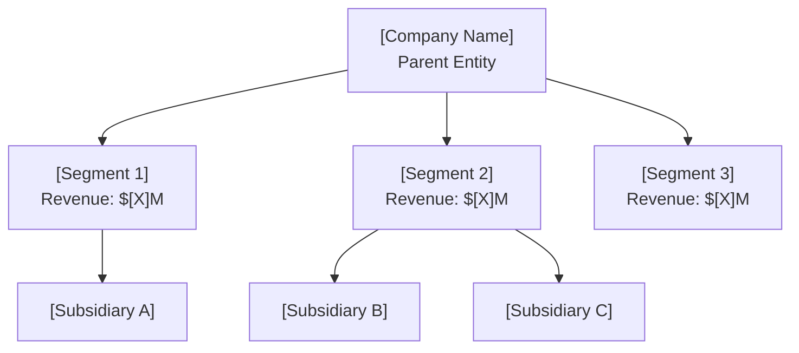
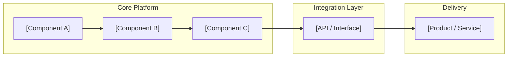

# [Company Name] ($[TICKER]) — Deep Dive Template

> **Purpose**: Comprehensive single-company research document covering technology, financials, competitive positioning, and investment thesis with structured bull/bear analysis.

## Document Control

| Field                | Value                                    |
| -------------------- | ---------------------------------------- |
| **Template**         | `company_deep_dive.md`                   |
| **Version**          | 1.0                                      |
| **Created**          | YYYY-MM-DD                               |
| **Last Updated**     | YYYY-MM-DD                               |
| **Author**           | [Name / Team]                            |
| **Status**           | Draft · In Review · Published · Archived |
| **Confidence**       | High · Medium · Low                      |
| **Parent Document**  | [Link to Master Plan]                    |
| **Review Cycle**     | Quarterly · Event-Driven                 |
| **Classification**   | Internal · Confidential · Public         |
| **Next Review Date** | YYYY-MM-DD                               |

---

## Company Identity

### Overview

| Field                | Value                    | Last Verified |
| -------------------- | ------------------------ | ------------- |
| **Legal Name**       | [Full legal entity name] | YYYY-MM-DD    |
| **Ticker**           | [EXCHANGE:TICKER]        | —             |
| **Founded**          | [Year]                   | YYYY-MM-DD    |
| **Headquarters**     | [City, State, Country]   | YYYY-MM-DD    |
| **CEO**              | [Name] (since [Year])    | YYYY-MM-DD    |
| **Employees**        | [Count]                  | YYYY-MM-DD    |
| **Website**          | [URL]                    | —             |
| **Sector**           | [GICS Sector]            | —             |
| **Industry**         | [GICS Industry]          | —             |
| **Market Cap**       | $[X]B/M                  | YYYY-MM-DD    |
| **Enterprise Value** | $[X]B/M                  | YYYY-MM-DD    |

### Company Description

<!-- 100–200 word description of what the company does, its core mission, and why it exists -->

[Describe the company's business model, primary revenue streams, target markets, and strategic positioning. Focus on what makes this company distinct in its sector.]

### Corporate Structure

### Leadership Team

| Name   | Title | Since  | Background         | Confidence |
| ------ | ----- | ------ | ------------------ | ---------- |
| [Name] | CEO   | [Year] | [Brief background] | High       |
| [Name] | CFO   | [Year] | [Brief background] | High       |
| [Name] | CTO   | [Year] | [Brief background] | High       |
| [Name] | COO   | [Year] | [Brief background] | Medium     |

### Ownership Structure

| Holder Type   | % Ownership | Notable Holders       | Last Verified |
| ------------- | ----------- | --------------------- | ------------- |
| Institutional | [X]%        | [Top 3 holders]       | YYYY-MM-DD    |
| Insider       | [X]%        | [Key insiders]        | YYYY-MM-DD    |
| Retail        | [X]%        | —                     | YYYY-MM-DD    |
| Strategic     | [X]%        | [Strategic investors] | YYYY-MM-DD    |

---

## Technology / Product

### Core Technology

<!-- Describe the fundamental technology or product that differentiates this company -->

[Explain the technology at a level suitable for a technically literate investor. Cover the underlying science/engineering, key innovations, and why they matter commercially.]

**Technology Readiness Level (TRL)**: [1–9] — [Description][^1]

### Product Portfolio

| Product / Service | Stage           | Revenue Contribution | Target Market | Competitive Advantage |
| ----------------- | --------------- | -------------------- | ------------- | --------------------- |
| [Product A]       | GA · Beta · R&D | [X]%                 | [Market]      | [Advantage]           |
| [Product B]       | GA · Beta · R&D | [X]%                 | [Market]      | [Advantage]           |
| [Product C]       | GA · Beta · R&D | [X]%                 | [Market]      | [Advantage]           |

### Technology Stack / Architecture

### Intellectual Property

| IP Type         | Count | Key Assets            | Jurisdiction    | Confidence    |
| --------------- | ----- | --------------------- | --------------- | ------------- |
| Patents Granted | [X]   | [Key patent areas]    | [US, EU, etc.]  | High · Medium |
| Patents Pending | [X]   | [Key filing areas]    | [US, EU, etc.]  | Medium        |
| Trade Secrets   | [X]   | [General description] | —               | Low           |
| Trademarks      | [X]   | [Key brands]          | [Jurisdictions] | High          |

### Competitive Moat Assessment

| Moat Source        | Strength                 | Evidence   | Durability   |
| ------------------ | ------------------------ | ---------- | ------------ |
| Technology IP      | Strong · Moderate · Weak | [Evidence] | [X] years    |
| Switching Costs    | Strong · Moderate · Weak | [Evidence] | [Assessment] |
| Network Effects    | Strong · Moderate · Weak | [Evidence] | [Assessment] |
| Cost Advantage     | Strong · Moderate · Weak | [Evidence] | [Assessment] |
| Brand / Reputation | Strong · Moderate · Weak | [Evidence] | [Assessment] |
| Regulatory         | Strong · Moderate · Weak | [Evidence] | [Assessment] |

---

## Bull Thesis

### Core Thesis Statement

> [One to three sentences articulating the affirmative investment case. Why does this company win?]

### Supporting Arguments

#### 1. [Bull Argument #1 — Title]

[Detailed explanation with supporting evidence. Include specific data points, market trends, and verifiable claims. Each argument should be 100–200 words.]

- **Evidence**: [Specific data point or source]
- **Confidence**: High · Medium · Low
- **Catalyst Timeline**: [When this should materialize]

#### 2. [Bull Argument #2 — Title]

[Detailed explanation with supporting evidence.]

- **Evidence**: [Specific data point or source]
- **Confidence**: High · Medium · Low
- **Catalyst Timeline**: [When this should materialize]

#### 3. [Bull Argument #3 — Title]

[Detailed explanation with supporting evidence.]

- **Evidence**: [Specific data point or source]
- **Confidence**: High · Medium · Low
- **Catalyst Timeline**: [When this should materialize]

### Upcoming Catalysts

| Catalyst     | Expected Date        | Impact           | Probability | Source   |
| ------------ | -------------------- | ---------------- | ----------- | -------- |
| [Catalyst A] | YYYY-MM-DD / QX YYYY | High · Med · Low | [X]%        | [Source] |
| [Catalyst B] | YYYY-MM-DD / QX YYYY | High · Med · Low | [X]%        | [Source] |
| [Catalyst C] | YYYY-MM-DD / QX YYYY | High · Med · Low | [X]%        | [Source] |

### Bull Case Valuation

| Metric              | Current | Bull Target | Basis        |
| ------------------- | ------- | ----------- | ------------ |
| Revenue (NTM)       | $[X]M   | $[X]M       | [Assumption] |
| EV/Revenue          | [X]x    | [X]x        | [Comp set]   |
| Implied Market Cap  | $[X]B   | $[X]B       | —            |
| Implied Share Price | $[X]    | $[X]        | —            |
| Upside              | —       | [X]%        | —            |

---

## Bear Case

### Core Bear Thesis

> [One to three sentences articulating the primary risks. Why could this company fail or underperform?]

### Risk Arguments

#### 1. [Bear Argument #1 — Title]

[Detailed explanation of the risk with evidence. Be intellectually honest — the best research steelmans the bear case.]

- **Evidence**: [Specific data point or source]
- **Severity**: High · Medium · Low
- **Probability**: High · Medium · Low
- **Mitigant**: [What could reduce this risk]

#### 2. [Bear Argument #2 — Title]

[Detailed explanation of the risk with evidence.]

- **Evidence**: [Specific data point or source]
- **Severity**: High · Medium · Low
- **Probability**: High · Medium · Low
- **Mitigant**: [What could reduce this risk]

#### 3. [Bear Argument #3 — Title]

[Detailed explanation of the risk with evidence.]

- **Evidence**: [Specific data point or source]
- **Severity**: High · Medium · Low
- **Probability**: High · Medium · Low
- **Mitigant**: [What could reduce this risk]

### Bear Case Valuation

| Metric              | Current | Bear Target | Basis                 |
| ------------------- | ------- | ----------- | --------------------- |
| Revenue (NTM)       | $[X]M   | $[X]M       | [Assumption]          |
| EV/Revenue          | [X]x    | [X]x        | [Comp set / distress] |
| Implied Market Cap  | $[X]B   | $[X]B       | —                     |
| Implied Share Price | $[X]    | $[X]        | —                     |
| Downside            | —       | [X]%        | —                     |

### Kill Criteria

<!-- Conditions under which the thesis is invalidated and position should be exited -->

| #   | Condition     | Threshold   | Current Value | Status                         |
| --- | ------------- | ----------- | ------------- | ------------------------------ |
| 1   | [Condition A] | [Threshold] | [Current]     | ✅ OK · ⚠️ Watch · 🔴 Breached |
| 2   | [Condition B] | [Threshold] | [Current]     | ✅ OK · ⚠️ Watch · 🔴 Breached |
| 3   | [Condition C] | [Threshold] | [Current]     | ✅ OK · ⚠️ Watch · 🔴 Breached |

---

## Financial Snapshot

### Income Statement Summary

| Metric         | FY [Y-2] | FY [Y-1] | FY [Y] (E) | FY [Y+1] (E) | Confidence |
| -------------- | -------- | -------- | ---------- | ------------ | ---------- |
| Revenue        | $[X]M    | $[X]M    | $[X]M      | $[X]M        | High · Med |
| Revenue Growth | [X]%     | [X]%     | [X]%       | [X]%         | High · Med |
| Gross Profit   | $[X]M    | $[X]M    | $[X]M      | $[X]M        | High · Med |
| Gross Margin   | [X]%     | [X]%     | [X]%       | [X]%         | High · Med |
| EBITDA         | $[X]M    | $[X]M    | $[X]M      | $[X]M        | Medium     |
| Net Income     | $[X]M    | $[X]M    | $[X]M      | $[X]M        | Medium     |
| EPS            | $[X]     | $[X]     | $[X]       | $[X]         | Medium     |

### Balance Sheet Highlights

| Metric               | Most Recent Quarter | Prior Year | Confidence |
| -------------------- | ------------------- | ---------- | ---------- |
| Cash & Equivalents   | $[X]M               | $[X]M      | High       |
| Total Debt           | $[X]M               | $[X]M      | High       |
| Net Debt             | $[X]M               | $[X]M      | High       |
| Total Assets         | $[X]M               | $[X]M      | High       |
| Stockholders' Equity | $[X]M               | $[X]M      | High       |
| Debt-to-Equity       | [X]x                | [X]x       | High       |

### Cash Flow & Runway

| Metric               | FY [Y-1]         | FY [Y] (E) | Confidence |
| -------------------- | ---------------- | ---------- | ---------- |
| Operating Cash Flow  | $[X]M            | $[X]M      | High · Med |
| Capital Expenditures | $[X]M            | $[X]M      | High · Med |
| Free Cash Flow       | $[X]M            | $[X]M      | Medium     |
| Monthly Burn Rate    | $[X]M            | $[X]M      | Medium     |
| Cash Runway          | [X] months       | [X] months | Medium     |
| Dilution Risk        | High · Med · Low | —          | Medium     |

### Valuation Multiples

| Multiple         | Current | Sector Median | Premium/Discount | Confidence |
| ---------------- | ------- | ------------- | ---------------- | ---------- |
| EV/Revenue (NTM) | [X]x    | [X]x          | [X]%             | Medium     |
| EV/EBITDA (NTM)  | [X]x    | [X]x          | [X]%             | Medium     |
| P/E (NTM)        | [X]x    | [X]x          | [X]%             | Medium     |
| P/S (NTM)        | [X]x    | [X]x          | [X]%             | Medium     |
| PEG Ratio        | [X]x    | [X]x          | [X]%             | Low        |

---

## Open Questions

<!-- Track unresolved questions that require further research -->

| #   | Question                                | Priority | Status                        | Assigned To | Due Date   |
| --- | --------------------------------------- | -------- | ----------------------------- | ----------- | ---------- |
| 1   | [Question about technology scalability] | High     | Open · In Progress · Resolved | [Name]      | YYYY-MM-DD |
| 2   | [Question about customer concentration] | High     | Open · In Progress · Resolved | [Name]      | YYYY-MM-DD |
| 3   | [Question about regulatory pathway]     | Medium   | Open · In Progress · Resolved | [Name]      | YYYY-MM-DD |
| 4   | [Question about management incentives]  | Medium   | Open · In Progress · Resolved | [Name]      | YYYY-MM-DD |
| 5   | [Question about competitive response]   | Low      | Open · In Progress · Resolved | [Name]      | YYYY-MM-DD |

### Research Gaps

| Area         | Gap Description   | Required Source                     | Priority |
| ------------ | ----------------- | ----------------------------------- | -------- |
| [Technology] | [What is unknown] | [Patent filings, expert interviews] | High     |
| [Financials] | [What is unknown] | [SEC filings, earnings calls]       | High     |
| [Market]     | [What is unknown] | [Industry reports, channel checks]  | Medium   |
| [Regulatory] | [What is unknown] | [Government filings, legal review]  | Medium   |

---

## References

### Primary Sources

| #    | Source                            | Type               | Date       | Confidence |
| ---- | --------------------------------- | ------------------ | ---------- | ---------- |
| [^1] | [SEC Filing — 10-K / 10-Q — Link] | Regulatory Filing  | YYYY-MM-DD | High       |
| [^2] | [Earnings Call Transcript — Link] | Company Disclosure | YYYY-MM-DD | High       |
| [^3] | [Investor Presentation — Link]    | Company Disclosure | YYYY-MM-DD | High       |
| [^4] | [Patent Filing — Link]            | IP Documentation   | YYYY-MM-DD | High       |

### Secondary Sources

| #    | Source                   | Type                 | Date       | Confidence |
| ---- | ------------------------ | -------------------- | ---------- | ---------- |
| [^5] | [Industry Report — Link] | Third-Party Research | YYYY-MM-DD | Medium     |
| [^6] | [News Article — Link]    | Journalism           | YYYY-MM-DD | Medium     |
| [^7] | [Analyst Report — Link]  | Sell-Side Research   | YYYY-MM-DD | Medium     |
| [^8] | [Expert Interview Notes] | Primary Research     | YYYY-MM-DD | Medium     |

### Tertiary Sources

| #     | Source                            | Type      | Date       | Confidence |
| ----- | --------------------------------- | --------- | ---------- | ---------- |
| [^9]  | [Blog Post / Social Media — Link] | Informal  | YYYY-MM-DD | Low        |
| [^10] | [Forum Discussion — Link]         | Community | YYYY-MM-DD | Low        |

[^1]: [Full citation]

[^2]: [Full citation]

[^3]: [Full citation]

[^4]: [Full citation]

[^5]: [Full citation]

[^6]: [Full citation]

[^7]: [Full citation]

[^8]: [Full citation]

[^9]: [Full citation]

[^10]: [Full citation]

---

## Revision History

| Version | Date       | Author | Changes                 |
| ------- | ---------- | ------ | ----------------------- |
| 1.0     | YYYY-MM-DD | [Name] | Initial deep dive       |
| 1.1     | YYYY-MM-DD | [Name] | [Description of update] |

---

> ⚠️ **Disclaimer**: This document is for informational and research purposes only. It does not constitute investment advice, a recommendation, or an offer to buy or sell any securities. All financial data should be independently verified against primary sources (SEC filings, company disclosures). Confidence ratings are subjective assessments by the author. Forward-looking estimates are inherently uncertain. Conduct your own due diligence before making any investment decisions.

---

_Template: `company_deep_dive.md` v1.0 — Omni Unified Writing System_
