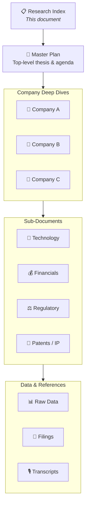
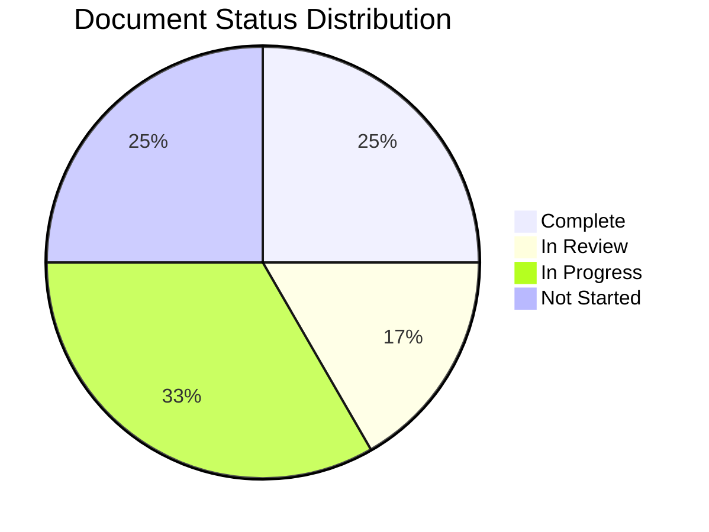
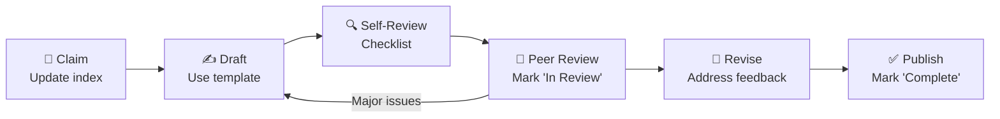

# [Research Project Name] — Research Index Template

> **Purpose**: Directory index and navigation hub for a multi-document research project. Provides structure, document registry, contributing guidelines, and quality standards.

## Document Control

| Field               | Value                            |
| ------------------- | -------------------------------- |
| **Template**        | `research_index.md`              |
| **Version**         | 1.0                              |
| **Created**         | YYYY-MM-DD                       |
| **Last Updated**    | YYYY-MM-DD                       |
| **Maintainer**      | [Name / Team]                    |
| **Status**          | Active · Archived                |
| **Classification**  | Internal · Confidential · Public |
| **Total Documents** | [X]                              |
| **Last Audit**      | YYYY-MM-DD                       |

---

## Research Structure

### Project Overview

[One paragraph describing the research project scope, objectives, and intended audience. This should orient any new reader to the purpose of the research collection.]

**Research Question**: [Core question this project addresses]

**Time Horizon**: [e.g., 3–5 year outlook]

**Universe Size**: [X] companies / topics under coverage

### Directory Layout

```
research-project/
├── README.md                    ← This index file
├── master-plan.md               ← Top-level research plan & thesis
├── companies/
│   ├── company-a.md             ← Individual deep dive
│   ├── company-b.md             ← Individual deep dive
│   └── company-c.md             ← Individual deep dive
├── subdocs/
│   ├── technology-assessment.md ← Technology sub-document
│   ├── financial-model.md       ← Financial sub-document
│   ├── regulatory-landscape.md  ← Regulatory sub-document
│   └── patent-analysis.md       ← IP sub-document
├── data/moltbot/
│   ├── raw/                     ← Unprocessed data files
│   ├── processed/               ← Cleaned data
│   └── charts/                  ← Generated visualizations
├── references/
│   ├── filings/                 ← SEC filings, regulatory docs
│   ├── transcripts/             ← Earnings call transcripts
│   └── reports/                 ← Third-party research reports
└── archive/
    └── deprecated/              ← Superseded documents
```

### Document Hierarchy



---

## Documents Table

### Master Documents

| Document                        | Type          | Status            | Confidence       | Last Updated | Author |
| ------------------------------- | ------------- | ----------------- | ---------------- | ------------ | ------ |
| [Master Plan](./master-plan.md) | Research Plan | Draft · Published | High · Med · Low | YYYY-MM-DD   | [Name] |

### Company Deep Dives

| #   | Company     | Ticker | Document                              | Status         | Confidence | Last Updated | Author |
| --- | ----------- | ------ | ------------------------------------- | -------------- | ---------- | ------------ | ------ |
| 1   | [Company A] | [TKRA] | [Deep Dive](./companies/company-a.md) | ⬜ Not Started | —          | —            | [Name] |
| 2   | [Company B] | [TKRB] | [Deep Dive](./companies/company-b.md) | 🔄 In Progress | Medium     | YYYY-MM-DD   | [Name] |
| 3   | [Company C] | [TKRC] | [Deep Dive](./companies/company-c.md) | ✅ Complete    | High       | YYYY-MM-DD   | [Name] |
| 4   | [Company D] | [TKRD] | [Deep Dive](./companies/company-d.md) | 📝 In Review   | Medium     | YYYY-MM-DD   | [Name] |
| 5   | [Company E] | [TKRE] | [Deep Dive](./companies/company-e.md) | 🗄️ Archived    | Low        | YYYY-MM-DD   | [Name] |

### Sub-Documents

| #   | Document                                                    | Parent      | Type         | Status           | Last Updated | Author |
| --- | ----------------------------------------------------------- | ----------- | ------------ | ---------------- | ------------ | ------ |
| 1   | [Technology Assessment](./subdocs/technology-assessment.md) | Master Plan | Technology   | Draft · Complete | YYYY-MM-DD   | [Name] |
| 2   | [Financial Model](./subdocs/financial-model.md)             | Company A   | Financials   | Draft · Complete | YYYY-MM-DD   | [Name] |
| 3   | [Regulatory Landscape](./subdocs/regulatory-landscape.md)   | Master Plan | Regulatory   | Draft · Complete | YYYY-MM-DD   | [Name] |
| 4   | [Patent Analysis](./subdocs/patent-analysis.md)             | Company B   | IP / Filings | Draft · Complete | YYYY-MM-DD   | [Name] |
| 5   | [Competitive Mapping](./subdocs/competitive-mapping.md)     | Master Plan | Analysis     | Draft · Complete | YYYY-MM-DD   | [Name] |

### Data Assets

| #   | Asset                   | Format     | Location          | Last Updated | Size   |
| --- | ----------------------- | ---------- | ----------------- | ------------ | ------ |
| 1   | [Financial comparisons] | CSV / XLSX | `data/moltbot/processed/` | YYYY-MM-DD   | [X] KB |
| 2   | [Market data extract]   | CSV        | `data/moltbot/raw/`       | YYYY-MM-DD   | [X] KB |
| 3   | [Visualization charts]  | PNG / SVG  | `data/moltbot/charts/`    | YYYY-MM-DD   | [X] KB |

---

## Progress Dashboard

### Overall Status



### Completion Tracker

| Phase              | Total   | Not Started | In Progress | In Review | Complete | % Done   |
| ------------------ | ------- | ----------- | ----------- | --------- | -------- | -------- |
| Master Documents   | 1       | 0           | 0           | 0         | 1        | 100%     |
| Company Deep Dives | [X]     | [X]         | [X]         | [X]       | [X]      | [X]%     |
| Sub-Documents      | [X]     | [X]         | [X]         | [X]       | [X]      | [X]%     |
| Data Assets        | [X]     | [X]         | [X]         | [X]       | [X]      | [X]%     |
| **Total**          | **[X]** | **[X]**     | **[X]**     | **[X]**   | **[X]**  | **[X]%** |

### Upcoming Deadlines

| Document              | Milestone     | Due Date   | Owner  | Status                                |
| --------------------- | ------------- | ---------- | ------ | ------------------------------------- |
| [Company A Deep Dive] | First draft   | YYYY-MM-DD | [Name] | ⬜ On Track · ⚠️ At Risk · 🔴 Overdue |
| [Financial Model]     | Peer review   | YYYY-MM-DD | [Name] | ⬜ On Track · ⚠️ At Risk · 🔴 Overdue |
| [Master Plan]         | Final publish | YYYY-MM-DD | [Name] | ⬜ On Track · ⚠️ At Risk · 🔴 Overdue |

---

## Contributing Guidelines

### Getting Started

1. **Read the Master Plan** — Understand the research thesis, scope, and methodology before contributing.
2. **Claim a document** — Update this index to mark a document as "In Progress" with your name.
3. **Use the correct template** — All documents must use the appropriate Omni research template:
   - Company analysis → `company_deep_dive.md`
   - Technology / financials / filings → `subdocument_template.md`
   - New research projects → `research_master_plan.md`
4. **Follow the style guide** — See Research Standards below.
5. **Submit for review** — Mark document as "In Review" and notify the project maintainer.

### Workflow



### Document Naming Conventions

| Type              | Pattern                        | Example                     |
| ----------------- | ------------------------------ | --------------------------- |
| Company Deep Dive | `{ticker-lowercase}.md`        | `hyln.md`, `aapl.md`        |
| Sub-Document      | `{topic-kebab-case}.md`        | `technology-assessment.md`  |
| Data File         | `{descriptor}_{date}.{ext}`    | `financials_2025-01.csv`    |
| Chart / Image     | `{descriptor}_{variant}.{ext}` | `revenue_comparison_q4.png` |

### Branching & Versioning

- Each document tracks its own version in the Document Control table.
- Major revisions (thesis changes, new data) increment the version number.
- Minor edits (typos, formatting) do not require version bumps.
- Deprecated documents are moved to `archive/deprecated/` with a note explaining the superseding document.

---

## Research Standards

### Quality Criteria

All research documents must meet the following standards before being marked "Complete":

| Criterion               | Requirement                                    | Weight      |
| ----------------------- | ---------------------------------------------- | ----------- |
| **Source Quality**      | Minimum 3 primary sources per major claim      | Required    |
| **Data Recency**        | Financial data ≤ 1 quarter old; news ≤ 30 days | Required    |
| **Confidence Ratings**  | Every data table includes confidence column    | Required    |
| **Bull/Bear Balance**   | Bear case is steelmanned, not strawmanned      | Required    |
| **Kill Criteria**       | Deep dives include measurable exit conditions  | Required    |
| **Cross-References**    | Links to related documents in the project      | Recommended |
| **Peer Review**         | At least one reviewer before publication       | Required    |
| **Spell Check**         | No typographical errors                        | Required    |
| **Template Compliance** | Uses the correct Omni template structure       | Required    |

### Confidence Rating Definitions

| Rating     | Definition                                                                                                                            | Source Requirements                   |
| ---------- | ------------------------------------------------------------------------------------------------------------------------------------- | ------------------------------------- |
| **High**   | Data from authoritative primary sources (SEC filings, audited financials, official disclosures); independently verifiable             | ≥ 2 primary sources                   |
| **Medium** | Data from credible secondary sources (analyst reports, industry publications, news); generally reliable but not independently audited | ≥ 1 primary + 1 secondary source      |
| **Low**    | Data from informal or unverified sources (social media, forums, estimates, extrapolations); treat as directional only                 | Source explicitly noted as unverified |

### Citation Standards

All claims must be cited. Use Markdown footnote syntax:

```markdown
The company reported revenue of $42M in Q3 2025[^1], representing
a 35% year-over-year increase[^2].

[^1]: Company 10-Q filing, SEC EDGAR, November 2025.

[^2]: Earnings call transcript, Q3 2025, Company IR website.
```

**Citation Priority** (prefer higher-ranked sources):

1. SEC filings (10-K, 10-Q, S-1, proxy statements)
2. Earnings call transcripts and investor presentations
3. Company press releases and IR materials
4. Peer-reviewed research and patents
5. Industry reports from recognized firms
6. News articles from established publications
7. Analyst reports (disclose conflicts of interest)
8. Informal sources (blogs, forums, social media) — use sparingly, flag confidence as Low

### Review Checklist

Reviewers should evaluate each document against:

- [ ] Template structure is followed correctly
- [ ] Document Control table is complete and current
- [ ] All data tables include confidence ratings
- [ ] Financial data is sourced and dated
- [ ] Bull thesis has ≥ 3 supporting arguments with evidence
- [ ] Bear case is genuinely adversarial (not token)
- [ ] Kill criteria are measurable and specific
- [ ] All claims are cited with footnotes
- [ ] References section is complete with full citations
- [ ] Open questions are documented with owners and due dates
- [ ] Mermaid diagrams render correctly
- [ ] No broken internal links
- [ ] Spelling and grammar are correct

---

## Maintenance

### Audit Schedule

| Audit Type          | Frequency   | Last Completed | Next Due   | Owner  |
| ------------------- | ----------- | -------------- | ---------- | ------ |
| Link verification   | Monthly     | YYYY-MM-DD     | YYYY-MM-DD | [Name] |
| Data freshness      | Quarterly   | YYYY-MM-DD     | YYYY-MM-DD | [Name] |
| Template compliance | Quarterly   | YYYY-MM-DD     | YYYY-MM-DD | [Name] |
| Full project review | Semi-Annual | YYYY-MM-DD     | YYYY-MM-DD | [Name] |

### Archive Policy

| Condition             | Action                              | Retention              |
| --------------------- | ----------------------------------- | ---------------------- |
| Thesis invalidated    | Move to `archive/deprecated/`       | Indefinite             |
| Company delisted      | Mark archived, retain for reference | 3 years                |
| Data > 2 years stale  | Flag for refresh or archive         | Archive if unrefreshed |
| Superseded by new doc | Cross-link and archive original     | Indefinite             |

---

## Revision History

| Version | Date       | Author | Changes                  |
| ------- | ---------- | ------ | ------------------------ |
| 1.0     | YYYY-MM-DD | [Name] | Initial index creation   |
| 1.1     | YYYY-MM-DD | [Name] | [Description of changes] |

---

> ⚠️ **Disclaimer**: This index and associated research documents are for informational and research purposes only. They do not constitute investment advice, a recommendation, or an offer to buy or sell any securities. Document status indicators reflect research progress, not investment conviction. All information should be independently verified. Conduct your own due diligence before making any investment decisions.

---

_Template: `research_index.md` v1.0 — Omni Unified Writing System_
