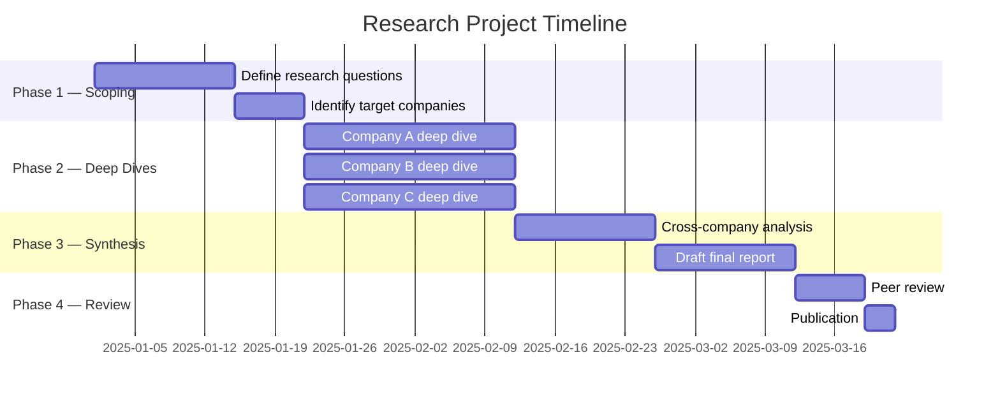
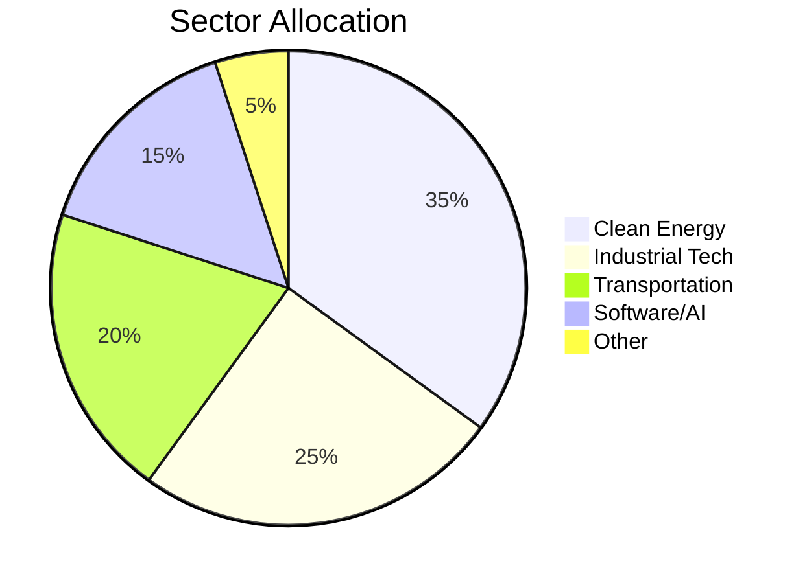
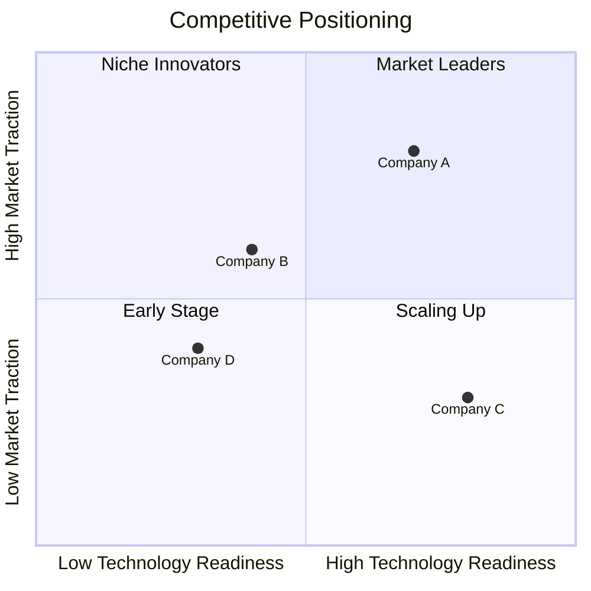
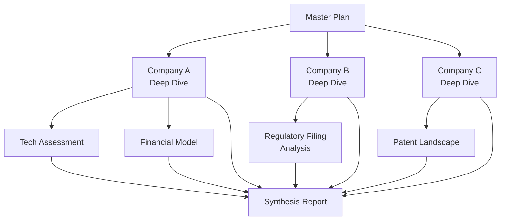

# [Research Project Name] — Master Plan Template

> **Purpose**: Top-level research project plan organizing a multi-document research effort across companies, technologies, or thematic investment areas.

## Document Control

| Field              | Value                                    |
| ------------------ | ---------------------------------------- |
| **Template**       | `research_master_plan.md`                |
| **Version**        | 1.0                                      |
| **Created**        | YYYY-MM-DD                               |
| **Last Updated**   | YYYY-MM-DD                               |
| **Author**         | [Name / Team]                            |
| **Status**         | Draft · In Review · Published · Archived |
| **Confidence**     | High · Medium · Low                      |
| **Review Cycle**   | Quarterly · Monthly · Ad Hoc             |
| **Classification** | Internal · Confidential · Public         |

---

## Abstract

<!-- 150–300 word executive summary of the research project -->

[Provide a concise summary of the research thesis, scope, and expected deliverables. State the core question the research seeks to answer and the methodology employed.]

**Core Research Question**: [What specific question does this research address?]

**Thesis Statement**: [One-sentence thesis]

**Scope**: [Boundaries — what is included and explicitly excluded]

**Time Horizon**: [Investment / research time horizon, e.g., 3–5 years]

---

## Research Agenda

### Objectives

1. [Primary objective]
2. [Secondary objective]
3. [Tertiary objective]

### Methodology

| Approach             | Description   | Status                               |
| -------------------- | ------------- | ------------------------------------ |
| Fundamental Analysis | [Description] | Not Started · In Progress · Complete |
| Technical Assessment | [Description] | Not Started · In Progress · Complete |
| Competitive Mapping  | [Description] | Not Started · In Progress · Complete |
| Expert Interviews    | [Description] | Not Started · In Progress · Complete |
| Data Collection      | [Description] | Not Started · In Progress · Complete |

### Research Timeline

### Key Milestones

| Milestone                 | Target Date | Status     | Owner  |
| ------------------------- | ----------- | ---------- | ------ |
| Research scoping complete | YYYY-MM-DD  | ⬜ Pending | [Name] |
| All deep dives drafted    | YYYY-MM-DD  | ⬜ Pending | [Name] |
| Cross-analysis complete   | YYYY-MM-DD  | ⬜ Pending | [Name] |
| Final report published    | YYYY-MM-DD  | ⬜ Pending | [Name] |

---

## Company Profiles

### Portfolio Overview

| #   | Company     | Ticker | Sector   | Market Cap | Thesis Summary    | Deep Dive Status |
| --- | ----------- | ------ | -------- | ---------- | ----------------- | ---------------- |
| 1   | [Company A] | [TKRA] | [Sector] | $[X]B      | [One-line thesis] | ⬜ Not Started   |
| 2   | [Company B] | [TKRB] | [Sector] | $[X]B      | [One-line thesis] | ⬜ Not Started   |
| 3   | [Company C] | [TKRC] | [Sector] | $[X]B      | [One-line thesis] | 🔄 In Progress   |
| 4   | [Company D] | [TKRD] | [Sector] | $[X]B      | [One-line thesis] | ✅ Complete      |

### Sector Allocation

### Selection Criteria

Companies were selected based on the following criteria:

| Criterion                  | Weight | Description                                              |
| -------------------------- | ------ | -------------------------------------------------------- |
| Technology Differentiation | 30%    | [Description of what constitutes differentiation]        |
| Market Opportunity         | 25%    | [TAM/SAM/SOM considerations]                             |
| Financial Viability        | 20%    | [Revenue trajectory, cash runway, path to profitability] |
| Management Quality         | 15%    | [Track record, domain expertise, alignment]              |
| Competitive Position       | 10%    | [Moat depth, switching costs, network effects]           |

---

## Thematic Analysis

### Industry Landscape

<!-- Describe the macro environment, regulatory trends, and structural shifts relevant to the research -->

[Provide context on the industry dynamics that frame this research. Include relevant policy tailwinds/headwinds, technological shifts, and demand drivers.]

### Competitive Dynamics

### Cross-Company Comparison

| Metric               | Company A  | Company B  | Company C  | Company D  |
| -------------------- | ---------- | ---------- | ---------- | ---------- |
| Revenue (TTM)        | $[X]M      | $[X]M      | $[X]M      | $[X]M      |
| Revenue Growth (YoY) | [X]%       | [X]%       | [X]%       | [X]%       |
| Gross Margin         | [X]%       | [X]%       | [X]%       | [X]%       |
| Cash Position        | $[X]M      | $[X]M      | $[X]M      | $[X]M      |
| Burn Rate (Monthly)  | $[X]M      | $[X]M      | $[X]M      | $[X]M      |
| Cash Runway          | [X] months | [X] months | [X] months | [X] months |
| Employees            | [X]        | [X]        | [X]        | [X]        |

---

## Risks

### Risk Matrix

| Risk               | Probability      | Impact           | Severity     | Mitigation            |
| ------------------ | ---------------- | ---------------- | ------------ | --------------------- |
| [Market risk]      | High · Med · Low | High · Med · Low | 🔴 · 🟡 · 🟢 | [Mitigation strategy] |
| [Technology risk]  | High · Med · Low | High · Med · Low | 🔴 · 🟡 · 🟢 | [Mitigation strategy] |
| [Regulatory risk]  | High · Med · Low | High · Med · Low | 🔴 · 🟡 · 🟢 | [Mitigation strategy] |
| [Competitive risk] | High · Med · Low | High · Med · Low | 🔴 · 🟡 · 🟢 | [Mitigation strategy] |
| [Execution risk]   | High · Med · Low | High · Med · Low | 🔴 · 🟡 · 🟢 | [Mitigation strategy] |
| [Financial risk]   | High · Med · Low | High · Med · Low | 🔴 · 🟡 · 🟢 | [Mitigation strategy] |

### Scenario Analysis

| Scenario      | Probability | Description   | Portfolio Impact |
| ------------- | ----------- | ------------- | ---------------- |
| **Bull Case** | [X]%        | [Description] | [Impact]         |
| **Base Case** | [X]%        | [Description] | [Impact]         |
| **Bear Case** | [X]%        | [Description] | [Impact]         |
| **Tail Risk** | [X]%        | [Description] | [Impact]         |

### Known Unknowns

1. [Key uncertainty that could materially affect the thesis]
2. [Key uncertainty that requires monitoring]
3. [Key uncertainty with upcoming catalyst / resolution date]

---

## References

### Primary Sources

| #    | Source                            | Type                 | Date Accessed | Confidence |
| ---- | --------------------------------- | -------------------- | ------------- | ---------- |
| [^1] | [SEC Filing / 10-K / 10-Q — Link] | Regulatory Filing    | YYYY-MM-DD    | High       |
| [^2] | [Earnings Call Transcript — Link] | Company Disclosure   | YYYY-MM-DD    | High       |
| [^3] | [Industry Report — Link]          | Third-Party Research | YYYY-MM-DD    | Medium     |
| [^4] | [Patent Filing — Link]            | IP Documentation     | YYYY-MM-DD    | High       |

### Secondary Sources

| #    | Source                           | Type             | Date Accessed | Confidence |
| ---- | -------------------------------- | ---------------- | ------------- | ---------- |
| [^5] | [News Article — Link]            | Journalism       | YYYY-MM-DD    | Medium     |
| [^6] | [Expert Interview Notes]         | Primary Research | YYYY-MM-DD    | Medium     |
| [^7] | [Conference Presentation — Link] | Industry Event   | YYYY-MM-DD    | Medium     |

### Data Sources

| Dataset          | Provider   | Frequency   | Last Updated | Confidence |
| ---------------- | ---------- | ----------- | ------------ | ---------- |
| [Financial data] | [Provider] | [Quarterly] | YYYY-MM-DD   | High       |
| [Market data]    | [Provider] | [Daily]     | YYYY-MM-DD   | High       |
| [Industry data]  | [Provider] | [Annual]    | YYYY-MM-DD   | Medium     |

[^1]: [Full citation for source 1]

[^2]: [Full citation for source 2]

[^3]: [Full citation for source 3]

[^4]: [Full citation for source 4]

[^5]: [Full citation for source 5]

[^6]: [Full citation for source 6]

[^7]: [Full citation for source 7]

---

## Related Research

### Internal Documents

| Document                | Type             | Status           | Link            |
| ----------------------- | ---------------- | ---------------- | --------------- |
| [Company A Deep Dive]   | Company Analysis | Draft · Complete | [Relative path] |
| [Company B Deep Dive]   | Company Analysis | Draft · Complete | [Relative path] |
| [Technology Assessment] | Sub-document     | Draft · Complete | [Relative path] |
| [Financial Model]       | Sub-document     | Draft · Complete | [Relative path] |

### External Research

| Title          | Author / Firm | Date       | Relevance           |
| -------------- | ------------- | ---------- | ------------------- |
| [Report title] | [Firm]        | YYYY-MM-DD | High · Medium · Low |
| [Report title] | [Firm]        | YYYY-MM-DD | High · Medium · Low |

### Research Dependency Map

---

## Appendices

### Appendix A: Glossary

| Term     | Definition   |
| -------- | ------------ |
| [Term 1] | [Definition] |
| [Term 2] | [Definition] |
| [Term 3] | [Definition] |

### Appendix B: Revision History

| Version | Date       | Author | Changes                  |
| ------- | ---------- | ------ | ------------------------ |
| 1.0     | YYYY-MM-DD | [Name] | Initial draft            |
| 1.1     | YYYY-MM-DD | [Name] | [Description of changes] |

---

> ⚠️ **Disclaimer**: This document is for informational and research purposes only. It does not constitute investment advice, a recommendation, or an offer to buy or sell any securities. All information is provided "as is" without warranty of any kind. Data confidence ratings reflect the author's assessment of source reliability and may not account for all material risks. Past performance is not indicative of future results. Conduct your own due diligence before making any investment decisions.

---

_Template: `research_master_plan.md` v1.0 — Omni Unified Writing System_
