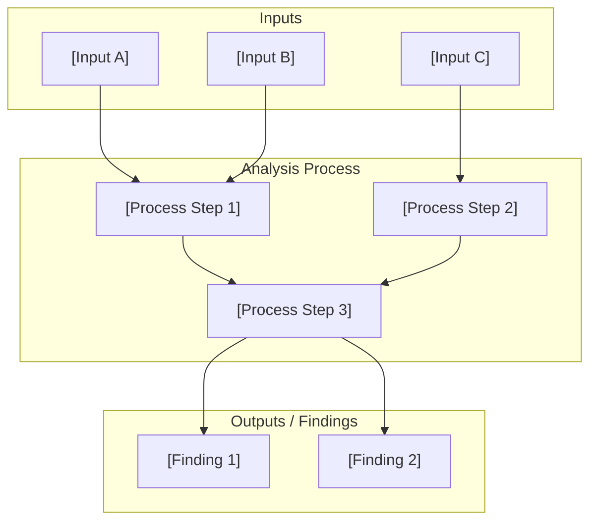
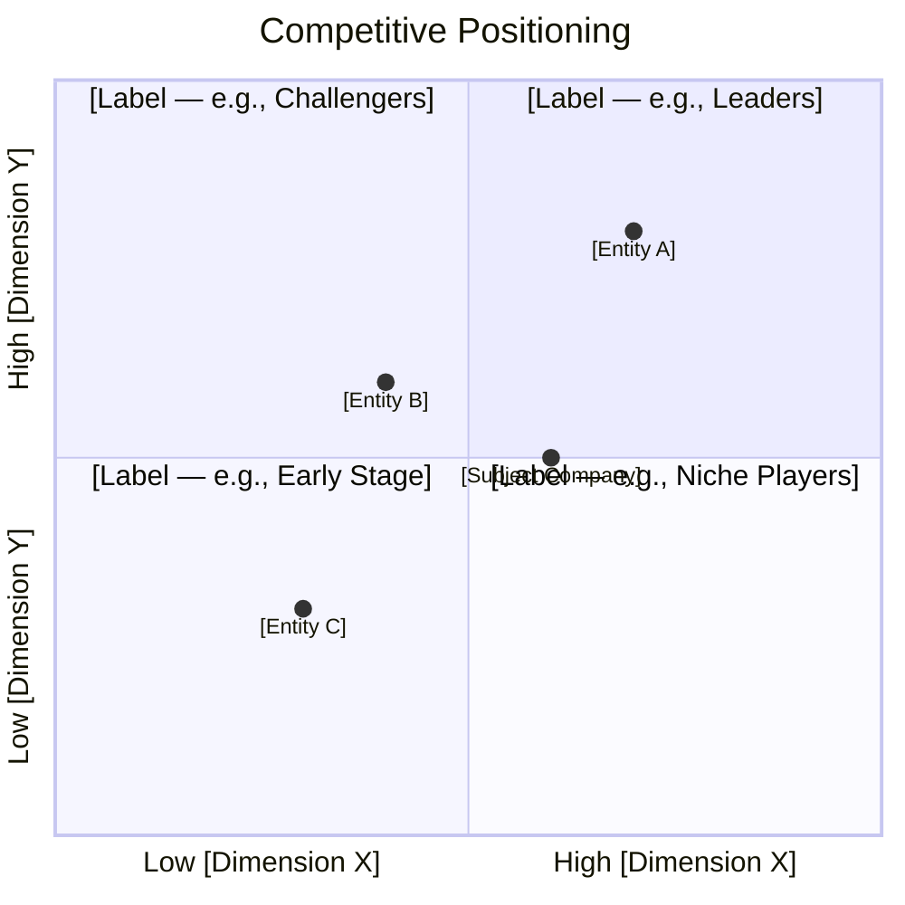
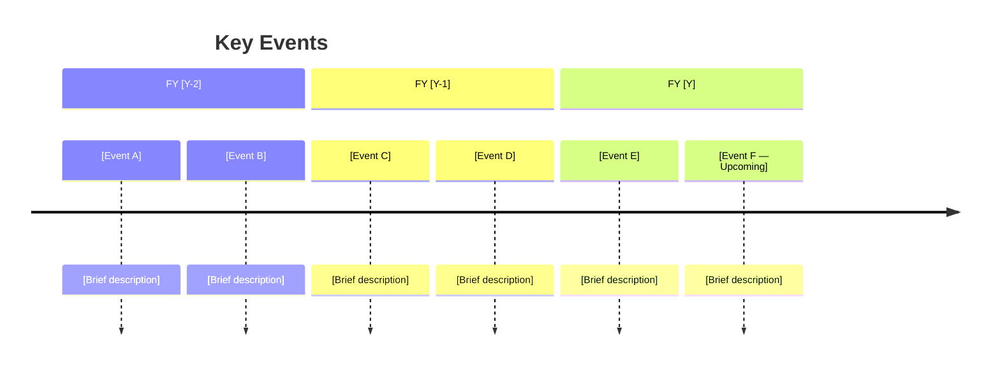

# [Topic Name] — Sub-Document Template

> **Purpose**: Focused research sub-document for deep analysis of a specific topic — technology assessments, financial analyses, regulatory filings, patent landscapes, or competitive studies — within a larger research project.

## Document Control

| Field                | Value                                                                              |
| -------------------- | ---------------------------------------------------------------------------------- |
| **Template**         | `subdocument_template.md`                                                          |
| **Version**          | 1.0                                                                                |
| **Created**          | YYYY-MM-DD                                                                         |
| **Last Updated**     | YYYY-MM-DD                                                                         |
| **Author**           | [Name / Team]                                                                      |
| **Status**           | Draft · In Review · Published · Archived                                           |
| **Confidence**       | High · Medium · Low                                                                |
| **Parent Document**  | [Link to Master Plan or Company Deep Dive]                                         |
| **Document Type**    | Technology · Financials · Regulatory · IP/Patents · Competitive · Market · Filings |
| **Classification**   | Internal · Confidential · Public                                                   |
| **Review Cycle**     | Quarterly · Event-Driven · One-Time                                                |
| **Next Review Date** | YYYY-MM-DD                                                                         |

---

## Overview

### Executive Summary

<!-- 100–200 word summary of the sub-document's scope and key findings -->

[Provide a concise summary of what this document covers, why it matters to the parent research, and the primary conclusions or findings. This should allow a reader to decide whether they need to read the full document.]

### Scope & Boundaries

| Dimension        | Included                | Excluded                          |
| ---------------- | ----------------------- | --------------------------------- |
| **Topics**       | [What is covered]       | [What is explicitly out of scope] |
| **Companies**    | [Which entities]        | [Which are excluded and why]      |
| **Time Period**  | [Date range covered]    | [Periods excluded]                |
| **Geography**    | [Regions covered]       | [Regions excluded]                |
| **Data Sources** | [Types of sources used] | [Sources intentionally omitted]   |

### Context & Motivation

[Explain why this sub-document exists. What question from the parent document does it answer? What gap in the research does it fill? How should the reader interpret the findings in the context of the broader research project?]

### Key Findings Summary

| #   | Finding                 | Confidence          | Impact on Thesis                | Reference |
| --- | ----------------------- | ------------------- | ------------------------------- | --------- |
| 1   | [Key finding statement] | High · Medium · Low | Supports · Neutral · Challenges | [^1]      |
| 2   | [Key finding statement] | High · Medium · Low | Supports · Neutral · Challenges | [^2]      |
| 3   | [Key finding statement] | High · Medium · Low | Supports · Neutral · Challenges | [^3]      |
| 4   | [Key finding statement] | High · Medium · Low | Supports · Neutral · Challenges | [^4]      |
| 5   | [Key finding statement] | High · Medium · Low | Supports · Neutral · Challenges | [^5]      |

---

## Detailed Analysis

### Section 1: [Analysis Area — e.g., Technology Architecture]

#### Background

[Provide necessary background context for this analysis area. What does the reader need to know before interpreting the findings?]

#### Methodology

| Aspect           | Description                            |
| ---------------- | -------------------------------------- |
| **Approach**     | [Qualitative · Quantitative · Mixed]   |
| **Data Sources** | [List primary data sources]            |
| **Time Period**  | [Analysis period]                      |
| **Tools Used**   | [Analysis tools, models, frameworks]   |
| **Limitations**  | [Known limitations of the methodology] |

#### Findings

[Present detailed findings with supporting evidence. Use specific data points, direct quotes from sources, and structured analysis. Each major claim should be cited.]

##### Finding 1.1: [Specific Finding Title]

[Detailed narrative explanation of the finding. Include quantitative data where available, qualitative observations, and interpretation in the context of the research thesis. 150–300 words per finding.]

**Supporting Evidence**:

- [Evidence point A][^1]
- [Evidence point B][^2]
- [Evidence point C][^3]

**Confidence Assessment**: High · Medium · Low
**Reasoning**: [Why this confidence level — source quality, corroboration, recency]

##### Finding 1.2: [Specific Finding Title]

[Detailed narrative explanation.]

**Supporting Evidence**:

- [Evidence point A][^4]
- [Evidence point B][^5]

**Confidence Assessment**: High · Medium · Low
**Reasoning**: [Why this confidence level]

#### Visual Analysis

<!-- Use Mermaid diagrams to illustrate complex relationships, processes, or architectures -->

---

### Section 2: [Analysis Area — e.g., Competitive Landscape]

#### Background

[Context for this section of the analysis.]

#### Comparative Framework

| Dimension           | [Entity A]       | [Entity B]       | [Entity C]       | [Subject Company] |
| ------------------- | ---------------- | ---------------- | ---------------- | ----------------- |
| [Metric 1]          | [Value]          | [Value]          | [Value]          | [Value]           |
| [Metric 2]          | [Value]          | [Value]          | [Value]          | [Value]           |
| [Metric 3]          | [Value]          | [Value]          | [Value]          | [Value]           |
| [Metric 4]          | [Value]          | [Value]          | [Value]          | [Value]           |
| [Metric 5]          | [Value]          | [Value]          | [Value]          | [Value]           |
| **Data Confidence** | High · Med · Low | High · Med · Low | High · Med · Low | High · Med · Low  |
| **Last Verified**   | YYYY-MM-DD       | YYYY-MM-DD       | YYYY-MM-DD       | YYYY-MM-DD        |

#### Findings

[Analysis narrative for Section 2.]

##### Finding 2.1: [Title]

[Detailed analysis with evidence and citations.]

##### Finding 2.2: [Title]

[Detailed analysis with evidence and citations.]

#### Positioning Map

---

### Section 3: [Analysis Area — e.g., Financial Deep Dive]

#### Background

[Context for the financial or quantitative analysis.]

#### Historical Trend Analysis

| Period       | [Metric A] | [Metric B] | [Metric C] | [Metric D] | Confidence |
| ------------ | ---------- | ---------- | ---------- | ---------- | ---------- |
| Q1 FY[Y-1]   | [Value]    | [Value]    | [Value]    | [Value]    | High       |
| Q2 FY[Y-1]   | [Value]    | [Value]    | [Value]    | [Value]    | High       |
| Q3 FY[Y-1]   | [Value]    | [Value]    | [Value]    | [Value]    | High       |
| Q4 FY[Y-1]   | [Value]    | [Value]    | [Value]    | [Value]    | High       |
| Q1 FY[Y]     | [Value]    | [Value]    | [Value]    | [Value]    | High       |
| Q2 FY[Y]     | [Value]    | [Value]    | [Value]    | [Value]    | High       |
| Q3 FY[Y] (E) | [Value]    | [Value]    | [Value]    | [Value]    | Medium     |
| Q4 FY[Y] (E) | [Value]    | [Value]    | [Value]    | [Value]    | Low        |

> **(E)** = Estimated. Source: [Source name and date]

#### Projection Scenarios

| Scenario | Probability | [Key Metric A] | [Key Metric B] | [Key Metric C] | Basis                |
| -------- | ----------- | -------------- | -------------- | -------------- | -------------------- |
| **Bull** | [X]%        | [Value]        | [Value]        | [Value]        | [Assumption summary] |
| **Base** | [X]%        | [Value]        | [Value]        | [Value]        | [Assumption summary] |
| **Bear** | [X]%        | [Value]        | [Value]        | [Value]        | [Assumption summary] |

#### Sensitivity Analysis

| Variable     | Base Value | -20%     | -10%     | Base     | +10%     | +20%     |
| ------------ | ---------- | -------- | -------- | -------- | -------- | -------- |
| [Variable A] | [Base]     | [Result] | [Result] | [Result] | [Result] | [Result] |
| [Variable B] | [Base]     | [Result] | [Result] | [Result] | [Result] | [Result] |
| [Variable C] | [Base]     | [Result] | [Result] | [Result] | [Result] | [Result] |

#### Timeline of Key Events

---

## Data Tables

### Primary Dataset

<!-- Comprehensive data table for the analysis. Adjust columns to fit the document type. -->

| #   | Item   | Category   | Value   | Unit   | Date       | Source | Confidence | Notes   |
| --- | ------ | ---------- | ------- | ------ | ---------- | ------ | ---------- | ------- |
| 1   | [Item] | [Category] | [Value] | [Unit] | YYYY-MM-DD | [^1]   | High       | [Notes] |
| 2   | [Item] | [Category] | [Value] | [Unit] | YYYY-MM-DD | [^2]   | High       | [Notes] |
| 3   | [Item] | [Category] | [Value] | [Unit] | YYYY-MM-DD | [^3]   | Medium     | [Notes] |
| 4   | [Item] | [Category] | [Value] | [Unit] | YYYY-MM-DD | [^4]   | Medium     | [Notes] |
| 5   | [Item] | [Category] | [Value] | [Unit] | YYYY-MM-DD | [^5]   | Low        | [Notes] |

### Secondary Dataset

| #   | Item   | Metric A | Metric B | Metric C | Source | Last Verified |
| --- | ------ | -------- | -------- | -------- | ------ | ------------- |
| 1   | [Item] | [Value]  | [Value]  | [Value]  | [^6]   | YYYY-MM-DD    |
| 2   | [Item] | [Value]  | [Value]  | [Value]  | [^7]   | YYYY-MM-DD    |
| 3   | [Item] | [Value]  | [Value]  | [Value]  | [^8]   | YYYY-MM-DD    |

### Data Quality Assessment

| Dataset              | Completeness  | Accuracy         | Timeliness                 | Overall Confidence  |
| -------------------- | ------------- | ---------------- | -------------------------- | ------------------- |
| Primary Dataset      | [X]% complete | High · Med · Low | Current · Stale · Outdated | High · Medium · Low |
| Secondary Dataset    | [X]% complete | High · Med · Low | Current · Stale · Outdated | High · Medium · Low |
| External Comparisons | [X]% complete | High · Med · Low | Current · Stale · Outdated | High · Medium · Low |

---

## Implications for Parent Research

### Impact Assessment

| Parent Document Section | Impact                          | Description                                     |
| ----------------------- | ------------------------------- | ----------------------------------------------- |
| Bull Thesis             | Strengthens · Neutral · Weakens | [How these findings affect the bull case]       |
| Bear Case               | Strengthens · Neutral · Weakens | [How these findings affect the bear case]       |
| Valuation               | Raises · Neutral · Lowers       | [How these findings affect valuation estimates] |
| Risk Assessment         | Increases · Neutral · Decreases | [How these findings affect perceived risk]      |
| Timeline                | Accelerates · Neutral · Delays  | [How these findings affect expected timelines]  |

### Recommendations

1. **[Recommendation A]** — [Actionable recommendation based on findings. Include priority and owner if applicable.]
2. **[Recommendation B]** — [Actionable recommendation.]
3. **[Recommendation C]** — [Actionable recommendation.]

### Open Questions Raised

| #   | Question                              | Priority | Suggested Approach | Owner  |
| --- | ------------------------------------- | -------- | ------------------ | ------ |
| 1   | [Question arising from this analysis] | High     | [How to resolve]   | [Name] |
| 2   | [Question arising from this analysis] | Medium   | [How to resolve]   | [Name] |
| 3   | [Question arising from this analysis] | Low      | [How to resolve]   | [Name] |

---

## Sources

### Primary Sources

| #    | Source                                  | Type                  | Date Accessed | Confidence |
| ---- | --------------------------------------- | --------------------- | ------------- | ---------- |
| [^1] | [SEC Filing / Official Document — Link] | Regulatory / Official | YYYY-MM-DD    | High       |
| [^2] | [Company Disclosure — Link]             | Company               | YYYY-MM-DD    | High       |
| [^3] | [Patent / Technical Document — Link]    | Technical             | YYYY-MM-DD    | High       |
| [^4] | [Government Database — Link]            | Government            | YYYY-MM-DD    | High       |

### Secondary Sources

| #    | Source                   | Type        | Date Accessed | Confidence |
| ---- | ------------------------ | ----------- | ------------- | ---------- |
| [^5] | [Industry Report — Link] | Third-Party | YYYY-MM-DD    | Medium     |
| [^6] | [Academic Paper — Link]  | Academic    | YYYY-MM-DD    | Medium     |
| [^7] | [News Article — Link]    | Journalism  | YYYY-MM-DD    | Medium     |
| [^8] | [Analyst Report — Link]  | Sell-Side   | YYYY-MM-DD    | Medium     |

### Tertiary Sources

| #     | Source                           | Type       | Date Accessed | Confidence |
| ----- | -------------------------------- | ---------- | ------------- | ---------- |
| [^9]  | [Blog / Forum — Link]            | Informal   | YYYY-MM-DD    | Low        |
| [^10] | [Social Media / Estimate — Link] | Unverified | YYYY-MM-DD    | Low        |

### Full Citations

[^1]: [Full bibliographic citation — Author, Title, Publisher/Platform, Date, URL]

[^2]: [Full bibliographic citation]

[^3]: [Full bibliographic citation]

[^4]: [Full bibliographic citation]

[^5]: [Full bibliographic citation]

[^6]: [Full bibliographic citation]

[^7]: [Full bibliographic citation]

[^8]: [Full bibliographic citation]

[^9]: [Full bibliographic citation]

[^10]: [Full bibliographic citation]

---

## Revision History

| Version | Date       | Author | Changes                                       |
| ------- | ---------- | ------ | --------------------------------------------- |
| 1.0     | YYYY-MM-DD | [Name] | Initial analysis                              |
| 1.1     | YYYY-MM-DD | [Name] | [Description of update — e.g., added Q3 data] |

---

> ⚠️ **Disclaimer**: This sub-document is part of a larger research project and is intended for informational and research purposes only. It does not constitute investment advice, a recommendation, or an offer to buy or sell any securities. All data should be independently verified against the cited primary sources. Confidence ratings and projections are subjective assessments. Forward-looking estimates are inherently uncertain. Conduct your own due diligence before making any investment decisions.

---

_Template: `subdocument_template.md` v1.0 — Omni Unified Writing System_
