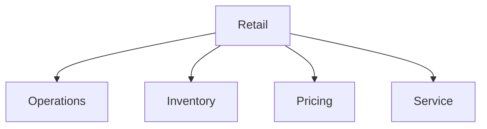

# Retail

Retail operations, inventory, and management templates.

## Templates

| Template                                                   | Description        |
| ---------------------------------------------------------- | ------------------ |
| [retail_operations_manual.md](retail_operations_manual.md) | Operations manuals |
| [inventory_management.md](inventory_management.md)         | Inventory tracking |
| [pricing_strategy.md](pricing_strategy.md)                 | Pricing strategies |
| [customer_service_policy.md](customer_service_policy.md)   | Service policies   |
| [loss_prevention.md](loss_prevention.md)                   | Loss prevention    |

## Structure

See [Parent](../SKILL.md) for all categories.
