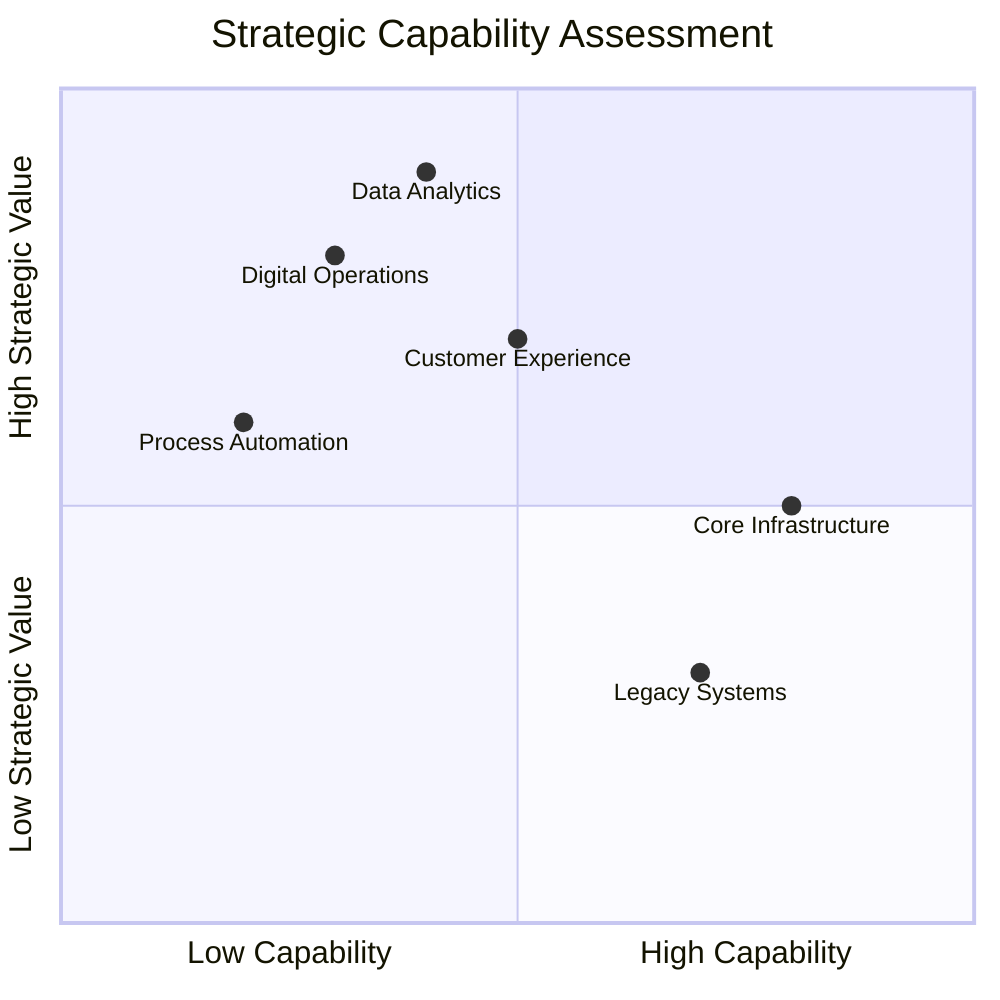
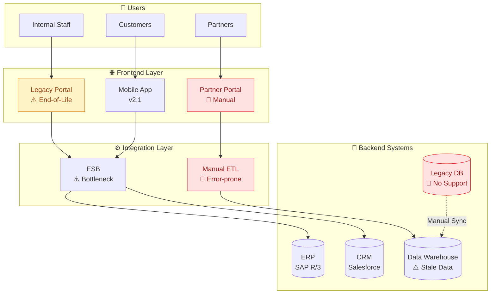
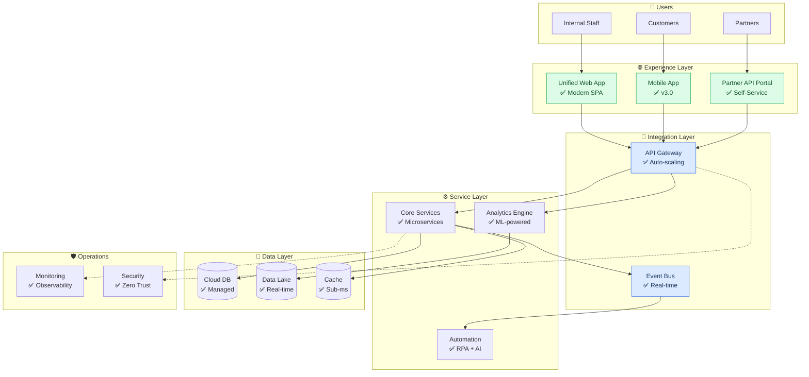
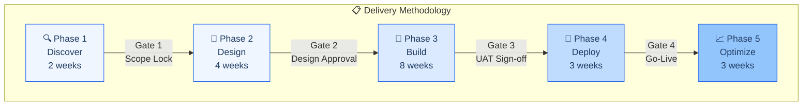
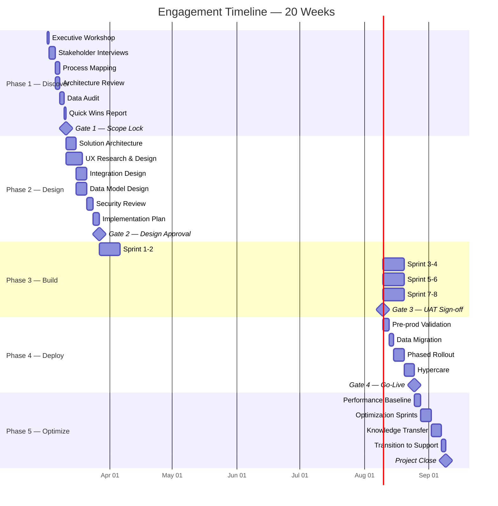
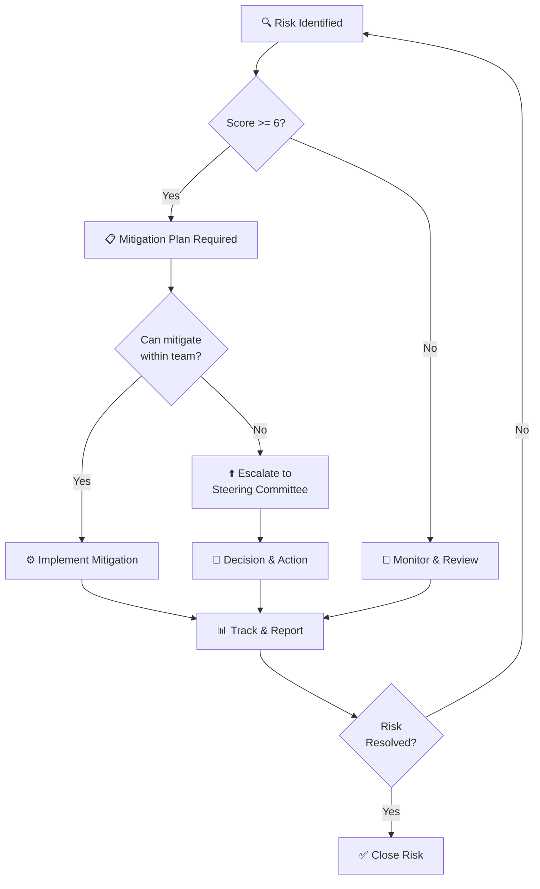
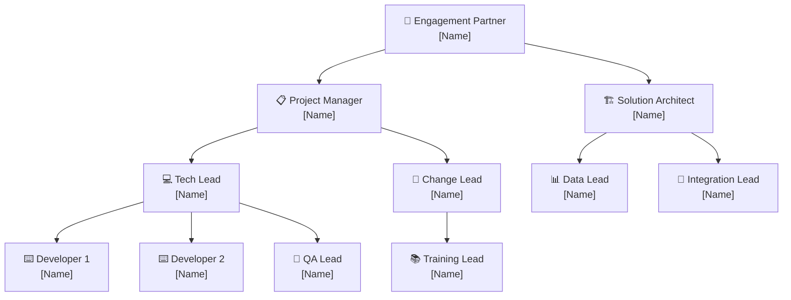
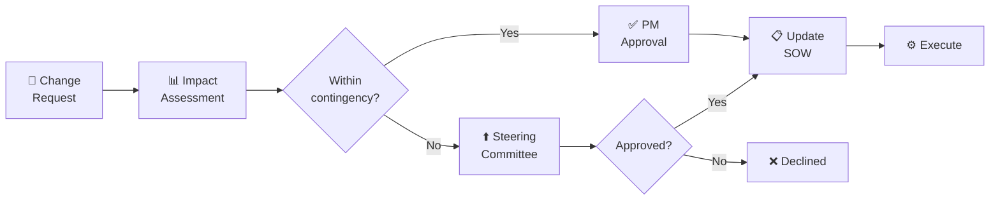

# Sales Proposal

| Field              | Value                                   |
| ------------------ | --------------------------------------- |
| **Document ID**    | `SP-[NNN]-[CLIENT]-[YYYY]`              |
| **Version**        | 1.0                                     |
| **Classification** | Confidential — Restricted Distribution  |
| **Date**           | [YYYY-MM-DD]                            |
| **Valid Until**    | [YYYY-MM-DD]                            |
| **Prepared By**    | [Name, Title, Practice]                 |
| **Prepared For**   | [Client Name, Organization]             |
| **Opportunity ID** | [CRM Reference]                         |
| **Deal Size**      | [Tier: Strategic / Enterprise / Growth] |

---

## Document Control

| Version | Date   | Author   | Reviewer     | Approver  | Changes            |
| ------- | ------ | -------- | ------------ | --------- | ------------------ |
| 0.1     | [Date] | [Author] | —            | —         | Initial draft      |
| 0.2     | [Date] | [Author] | [Technical]  | —         | Technical review   |
| 0.3     | [Date] | [Author] | [Commercial] | —         | Pricing validation |
| 1.0     | [Date] | [Author] | [QA]         | [Partner] | Final approved     |

### Distribution List

| Name   | Role          | Organization | Access Level             |
| ------ | ------------- | ------------ | ------------------------ |
| [Name] | [Sponsor]     | [Client]     | Full                     |
| [Name] | [IT Director] | [Client]     | Full                     |
| [Name] | [Procurement] | [Client]     | Commercial sections only |

---

## Executive Summary

[4-5 paragraphs crafted for C-suite consumption. Open with a market or competitive insight that frames the urgency. Transition to the client's specific situation with quantified pain. Present the solution as a strategic investment rather than a cost. Quantify expected returns with clear methodology. Close with a compelling call to action that creates urgency without pressure.]

### Investment at a Glance

| Dimension               | Value      |
| ----------------------- | ---------- |
| **Total Investment**    | $[Amount]  |
| **Timeline**            | [Duration] |
| **Expected Year 1 ROI** | [X]%       |
| **Payback Period**      | [X] months |
| **3-Year NPV**          | $[Amount]  |
| **Risk-Adjusted IRR**   | [X]%       |

---

## Strategic Context

### Market Landscape

[Describe the market dynamics, competitive pressures, and industry trends that make this initiative time-sensitive. Reference industry data, analyst reports, or market benchmarks.]

### Client Strategic Position

[Describe the client's position within their market, recent strategic moves, and how this initiative aligns with their stated priorities. Reference annual reports, press releases, or stakeholder conversations.]



---

## Current State Analysis

### Operational Assessment

[Detailed assessment of the client's current operations based on discovery findings. Include quantified metrics, benchmark comparisons, and specific observations from stakeholder interviews.]

### Current State Architecture



### Pain Point Analysis

| #   | Pain Point                 | Category   | Current Impact      | Annual Cost      | Evidence                   |
| --- | -------------------------- | ---------- | ------------------- | ---------------- | -------------------------- |
| 1   | [Description]              | Process    | [Quantified impact] | $[Amount]        | [Source: interviews, data] |
| 2   | [Description]              | Technology | [Quantified impact] | $[Amount]        | [Source]                   |
| 3   | [Description]              | People     | [Quantified impact] | $[Amount]        | [Source]                   |
| 4   | [Description]              | Data       | [Quantified impact] | $[Amount]        | [Source]                   |
| 5   | [Description]              | Compliance | [Quantified impact] | $[Amount]        | [Source]                   |
|     | **Total Cost of Inaction** |            |                     | **$[Amount]/yr** |                            |

### Maturity Assessment

| Capability     | Current Level | Industry Benchmark | Target Level | Gap     |
| -------------- | ------------- | ------------------ | ------------ | ------- |
| [Capability 1] | [1-5]         | [1-5]              | [1-5]        | [Delta] |
| [Capability 2] | [1-5]         | [1-5]              | [1-5]        | [Delta] |
| [Capability 3] | [1-5]         | [1-5]              | [1-5]        | [Delta] |
| [Capability 4] | [1-5]         | [1-5]              | [1-5]        | [Delta] |

---

## Proposed Solution

### Solution Vision

[Articulate the target state vision in business terms. How will the client's operations differ after implementation? What new capabilities will they have? How does this position them competitively?]

### Target State Architecture



### Solution Components

```mermaid
mindmap
    accTitle: Solution Component Breakdown
    accDescr: Hierarchical view of all solution components organized by domain

    root((Solution))
        Experience
            Unified Portal
            Mobile v3
            Partner APIs
        Integration
            API Gateway
            Event Bus
            Data Pipelines
        Services
            Core Platform
            Analytics
            Automation
        Data
            Cloud Database
            Data Lake
            Cache Layer
        Operations
            Monitoring
            Security
            DR/BC
```

### Engagement Methodology



### Phase Details

#### Phase 1: Discover & Validate (Weeks 1-2)

**Objective:** Validate assumptions, complete current state mapping, define success criteria.

| Activity                       | Duration | Deliverable             | RACI                       |
| ------------------------------ | -------- | ----------------------- | -------------------------- |
| Executive alignment workshop   | 1 day    | Aligned vision document | R: Lead, A: Sponsor        |
| Stakeholder interviews (N=[X]) | 3 days   | Interview synthesis     | R: BA, A: PM               |
| Process mapping workshops      | 2 days   | Current state maps      | R: BA, A: PM               |
| Technical architecture review  | 2 days   | Architecture assessment | R: Architect, A: Tech Lead |
| Data landscape audit           | 2 days   | Data quality report     | R: Data Lead, A: Architect |
| Quick wins identification      | 1 day    | Quick wins roadmap      | R: Lead, A: Sponsor        |

**Gate 1 Criteria:** Scope document signed, success metrics agreed, risks identified.

#### Phase 2: Design (Weeks 3-6)

**Objective:** Design the target solution, validate feasibility, plan implementation.

| Activity                     | Duration | Deliverable                  | RACI                |
| ---------------------------- | -------- | ---------------------------- | ------------------- |
| Solution architecture design | 5 days   | Architecture design document | R: Architect        |
| UX research and design       | 8 days   | Wireframes, prototypes       | R: UX Lead          |
| Integration design           | 5 days   | Integration specifications   | R: Integration Lead |
| Data model design            | 5 days   | Data architecture            | R: Data Lead        |
| Security review              | 3 days   | Security assessment          | R: Security Lead    |
| Implementation planning      | 3 days   | Detailed project plan        | R: PM               |

**Gate 2 Criteria:** Architecture approved, prototype validated, plan accepted.

#### Phase 3: Build (Weeks 7-14)

**Objective:** Implement the solution in iterative sprints.

| Sprint     | Focus                         | Deliverable             |
| ---------- | ----------------------------- | ----------------------- |
| Sprint 1-2 | Core platform, data migration | Foundation deployed     |
| Sprint 3-4 | Integration, automation       | Connected systems       |
| Sprint 5-6 | Analytics, reporting          | Intelligence layer      |
| Sprint 7-8 | UAT, performance tuning       | Production-ready system |

**Gate 3 Criteria:** UAT passed, performance benchmarks met, security audit clean.

#### Phase 4: Deploy (Weeks 15-17)

**Objective:** Production deployment, cutover, and stabilization.

| Activity                    | Duration | Deliverable                 |
| --------------------------- | -------- | --------------------------- |
| Pre-production validation   | 3 days   | Go/no-go decision           |
| Data migration (production) | 2 days   | Migrated and validated data |
| Phased rollout              | 5 days   | Production system live      |
| Hypercare support           | 5 days   | Stabilized environment      |

**Gate 4 Criteria:** System stable for 5 days, SLA targets met, rollback not triggered.

#### Phase 5: Optimize & Transition (Weeks 18-20)

**Objective:** Measure outcomes, optimize performance, transition to steady state.

| Activity              | Duration | Deliverable             |
| --------------------- | -------- | ----------------------- |
| Performance baseline  | 3 days   | Baseline metrics report |
| Optimization sprints  | 5 days   | Tuned configurations    |
| Knowledge transfer    | 5 days   | Runbooks, training      |
| Transition to support | 2 days   | Support model activated |

---

## Financial Analysis

### Investment Summary

| Category                  | Component                   | Investment    |
| ------------------------- | --------------------------- | ------------- |
| **Professional Services** |                             |               |
|                           | Phase 1: Discover           | $[Amount]     |
|                           | Phase 2: Design             | $[Amount]     |
|                           | Phase 3: Build              | $[Amount]     |
|                           | Phase 4: Deploy             | $[Amount]     |
|                           | Phase 5: Optimize           | $[Amount]     |
|                           | _Subtotal Services_         | _$[Amount]_   |
| **Technology**            |                             |               |
|                           | Platform licensing (Year 1) | $[Amount]     |
|                           | Infrastructure (Year 1)     | $[Amount]     |
|                           | _Subtotal Technology_       | _$[Amount]_   |
| **Change Management**     |                             |               |
|                           | Training and enablement     | $[Amount]     |
|                           | Communications              | $[Amount]     |
|                           | _Subtotal Change_           | _$[Amount]_   |
| **Contingency**           | 10% buffer                  | $[Amount]     |
| **Total Investment**      |                             | **$[Amount]** |

### ROI Analysis

The return on investment is calculated using the following methodology:

$$
\text{ROI} = \frac{\text{Net Benefits} - \text{Total Investment}}{\text{Total Investment}} \times 100
$$

Where Net Benefits include quantified cost savings, revenue uplift, and productivity gains, discounted at the client's weighted average cost of capital (WACC).

**Net Present Value (NPV):**

$$
\text{NPV} = \sum_{t=0}^{n} \frac{B_t - C_t}{(1 + r)^t}
$$

Where $B_t$ = benefits in period $t$, $C_t$ = costs in period $t$, $r$ = discount rate, $n$ = analysis horizon.

### Financial Projection

| Metric                | Year 0   | Year 1   | Year 2   | Year 3   | Total      |
| --------------------- | -------- | -------- | -------- | -------- | ---------- |
| **Investment**        |          |          |          |          |            |
| Professional Services | $[Amt]   | —        | —        | —        | $[Amt]     |
| Technology (annual)   | $[Amt]   | $[Amt]   | $[Amt]   | $[Amt]   | $[Amt]     |
| Ongoing Support       | —        | $[Amt]   | $[Amt]   | $[Amt]   | $[Amt]     |
| _Total Costs_         | _$[Amt]_ | _$[Amt]_ | _$[Amt]_ | _$[Amt]_ | _$[Amt]_   |
| **Benefits**          |          |          |          |          |            |
| Cost Savings          | —        | $[Amt]   | $[Amt]   | $[Amt]   | $[Amt]     |
| Revenue Uplift        | —        | $[Amt]   | $[Amt]   | $[Amt]   | $[Amt]     |
| Productivity Gains    | —        | $[Amt]   | $[Amt]   | $[Amt]   | $[Amt]     |
| Risk Avoidance        | —        | $[Amt]   | $[Amt]   | $[Amt]   | $[Amt]     |
| _Total Benefits_      | —        | _$[Amt]_ | _$[Amt]_ | _$[Amt]_ | _$[Amt]_   |
| **Net Cash Flow**     | ($[Amt]) | $[Amt]   | $[Amt]   | $[Amt]   | $[Amt]     |
| **Cumulative ROI**    | —        | [X]%     | [X]%     | [X]%     | [X]%       |
| **NPV (@ [X]%)**      |          |          |          |          | **$[Amt]** |

### Sensitivity Analysis

| Scenario      | Assumption Change | NPV Impact | ROI Impact |
| ------------- | ----------------- | ---------- | ---------- |
| Conservative  | Benefits -20%     | $[Amount]  | [X]%       |
| Base Case     | As modeled        | $[Amount]  | [X]%       |
| Optimistic    | Benefits +15%     | $[Amount]  | [X]%       |
| Delayed Start | +3 months delay   | $[Amount]  | [X]%       |

### Payment Schedule

| Milestone          | %   | Amount    | Trigger                | Target Date |
| ------------------ | --- | --------- | ---------------------- | ----------- |
| Contract Execution | 25% | $[Amount] | Signed SOW             | [Date]      |
| Phase 2 Gate       | 25% | $[Amount] | Design approval        | [Date]      |
| UAT Sign-off       | 25% | $[Amount] | UAT acceptance         | [Date]      |
| Go-Live + 30 days  | 15% | $[Amount] | Stabilization complete | [Date]      |
| Project Close      | 10% | $[Amount] | Final acceptance       | [Date]      |

---

## Timeline



---

## Risk Management

### Risk Register

| ID  | Risk                     | Category  | Probability | Impact | Score | Mitigation                    | Owner       | Status |
| --- | ------------------------ | --------- | ----------- | ------ | ----- | ----------------------------- | ----------- | ------ |
| R1  | [Scope creep]            | Scope     | High        | High   | 9     | [Change control, fixed scope] | PM          | Open   |
| R2  | [Data quality]           | Technical | Medium      | High   | 6     | [Phase 1 audit, cleansing]    | Data Lead   | Open   |
| R3  | [Resource availability]  | People    | Medium      | Medium | 4     | [Cross-training, backups]     | PM          | Open   |
| R4  | [Integration complexity] | Technical | Medium      | High   | 6     | [Spike, contingency]          | Architect   | Open   |
| R5  | [Change resistance]      | People    | High        | Medium | 6     | [Change management plan]      | Change Lead | Open   |

Risk Score: Probability (1-3) x Impact (1-3). Scores >= 6 require active mitigation plans.

### Risk Mitigation Process



---

## Why Us

### Firm Overview

[2-3 sentences about the firm's positioning, size, and core capabilities. Focus on relevance to this engagement.]

### Relevant Case Studies

<details>
<summary><strong>Case Study 1: [Client Name] — [Industry]</strong></summary>

**Challenge:** [Description of similar challenge]
**Solution:** [What was implemented]
**Results:**

- [Quantified result 1]
- [Quantified result 2]
- [Quantified result 3]

**Timeline:** [Duration]
**Investment:** $[Range]

</details>

---

<details>
<summary><strong>Case Study 2: [Client Name] — [Industry]</strong></summary>

**Challenge:** [Description]
**Solution:** [Implementation]
**Results:**

- [Result 1]
- [Result 2]

**Timeline:** [Duration]

</details>

---

### Differentiators

| Dimension   | Our Approach            | Why It Matters         | Evidence                  |
| ----------- | ----------------------- | ---------------------- | ------------------------- |
| Methodology | [Proprietary framework] | [Faster time to value] | [X engagements delivered] |
| Technology  | [Platform capabilities] | [Lower TCO]            | [Benchmark data]          |
| Team        | [Domain expertise]      | [Reduced risk]         | [Years of experience]     |
| IP          | [Accelerators/tools]    | [30% faster delivery]  | [Reusable components]     |
| Support     | [24/7 model]            | [Business continuity]  | [SLA track record]        |

### Awards & Recognition

- [Industry recognition 1]
- [Analyst ranking — e.g., Gartner Magic Quadrant position]
- [Certification or partnership status]

---

## Team

### Engagement Team Structure



### Team Allocation

| Role               | Name    | Phase 1 | Phase 2 | Phase 3 | Phase 4 | Phase 5 |
| ------------------ | ------- | ------- | ------- | ------- | ------- | ------- |
| Engagement Partner | [Name]  | 20%     | 10%     | 10%     | 10%     | 20%     |
| Project Manager    | [Name]  | 100%    | 100%    | 100%    | 100%    | 50%     |
| Solution Architect | [Name]  | 100%    | 100%    | 50%     | 25%     | 25%     |
| Tech Lead          | [Name]  | 50%     | 100%    | 100%    | 100%    | 50%     |
| Developers (x2)    | [Names] | —       | 50%     | 100%    | 50%     | —       |
| Data Lead          | [Name]  | 50%     | 100%    | 50%     | 25%     | —       |
| QA Lead            | [Name]  | —       | 25%     | 100%    | 100%    | 25%     |
| Change Lead        | [Name]  | 25%     | 50%     | 50%     | 100%    | 100%    |

### Key Biographies

**[Name], Engagement Partner**
[3-4 sentences: years of experience, industry expertise, notable engagements, certifications. Focus on relevance to this client's challenges.]

**[Name], Solution Architect**
[3-4 sentences: technical depth, architecture experience, platform certifications.]

**[Name], Project Manager**
[3-4 sentences: delivery track record, methodology expertise, similar project scale.]

---

## Governance & Communication

### Governance Structure

| Forum              | Frequency | Chair   | Participants        | Purpose             |
| ------------------ | --------- | ------- | ------------------- | ------------------- |
| Daily Standup      | Daily     | PM      | Delivery team       | Task coordination   |
| Sprint Review      | Bi-weekly | PM      | Extended team       | Demo and feedback   |
| Status Review      | Weekly    | PM      | PM, Client PM       | Progress, risks     |
| Steering Committee | Bi-weekly | Partner | Sponsors, Directors | Strategic decisions |
| Gate Review        | Phase end | Partner | All stakeholders    | Phase acceptance    |
| Executive Briefing | Monthly   | Partner | C-suite             | Strategic update    |

### Escalation Path

| Level                | Timeframe | Escalated To                   | Decision Authority |
| -------------------- | --------- | ------------------------------ | ------------------ |
| Level 1 — Team       | Same day  | Project Manager                | Tactical decisions |
| Level 2 — Management | 24 hours  | Engagement Partner + Client PM | Budget/scope < 10% |
| Level 3 — Executive  | 48 hours  | Practice Lead + Client Sponsor | Strategic changes  |

### Reporting Cadence

- **Daily:** Stand-up notes (Slack/Teams)
- **Weekly:** Status report (email with dashboard)
- **Bi-weekly:** Sprint review presentation
- **Monthly:** Executive dashboard with KPIs
- **Phase-end:** Gate review package with go/no-go recommendation

---

## Terms & Conditions

### Contract Structure

| Element        | Detail                                          |
| -------------- | ----------------------------------------------- |
| Agreement Type | [Master Services Agreement + Statement of Work] |
| Pricing Model  | [Fixed Price / T&M / Outcome-based / Hybrid]    |
| Term           | [Duration]                                      |
| Renewal        | [Auto-renew / Annual review]                    |
| Governing Law  | [Jurisdiction]                                  |

### Change Control Process



### Intellectual Property

| Category                   | Ownership  | Rights                      |
| -------------------------- | ---------- | --------------------------- |
| Pre-existing [Provider] IP | [Provider] | License to Client for use   |
| Pre-existing Client IP     | Client     | No transfer                 |
| Custom deliverables        | Client     | Full ownership upon payment |
| Methodologies & frameworks | [Provider] | Retained, license granted   |

### Warranty & Support

- **Warranty Period:** [90] days post-acceptance
- **Warranty Scope:** Defects in deliverables, not requirement changes
- **Post-Warranty Support:** Available under separate support agreement
- **SLA during Hypercare:** [Response times by severity]

### Confidentiality & Data Protection

- Mutual NDA in effect for [X] years
- GDPR/CCPA compliance as applicable
- Data handling per client security policies
- Background checks for all team members with system access

### Limitation of Liability

[Standard limitation language — total liability capped at [X]x contract value, excluding gross negligence and IP infringement.]

---

## Appendices

<details>
<summary><strong>Appendix A: Detailed Technical Specifications</strong></summary>

### Platform Architecture Details

[Detailed technical specifications, API definitions, data models, infrastructure requirements.]

### Performance Requirements

| Metric              | Target           | Measurement Method |
| ------------------- | ---------------- | ------------------ |
| Response Time (P95) | < [X]ms          | APM monitoring     |
| Throughput          | [X] requests/sec | Load testing       |
| Availability        | [X]%             | Uptime monitoring  |
| Recovery Time       | < [X] minutes    | DR testing         |

</details>

---

<details>
<summary><strong>Appendix B: Assumptions Log</strong></summary>

| #   | Assumption   | Category       | Impact if False | Validation Date |
| --- | ------------ | -------------- | --------------- | --------------- |
| A1  | [Assumption] | Technical      | [Impact]        | [Date]          |
| A2  | [Assumption] | Commercial     | [Impact]        | [Date]          |
| A3  | [Assumption] | Organizational | [Impact]        | [Date]          |

</details>

---

<details>
<summary><strong>Appendix C: Glossary</strong></summary>

| Term   | Definition   |
| ------ | ------------ |
| [Term] | [Definition] |
| [Term] | [Definition] |
| [Term] | [Definition] |

</details>

---

## Next Steps

| #   | Action                                 | Owner                    | Target Date | Dependencies |
| --- | -------------------------------------- | ------------------------ | ----------- | ------------ |
| 1   | Proposal review and internal alignment | Client Team              | [Date]      | —            |
| 2   | Technical deep-dive session            | Both Teams               | [Date]      | Step 1       |
| 3   | Commercial negotiation                 | Procurement + [Provider] | [Date]      | Step 1       |
| 4   | Legal review of MSA/SOW                | Legal teams              | [Date]      | Step 3       |
| 5   | Contract execution                     | Authorized signatories   | [Date]      | Step 4       |
| 6   | Kickoff planning                       | PM teams                 | [Date]      | Step 5       |
| 7   | Project kickoff                        | All teams                | [Date]      | Step 6       |

---

## Acceptance

This proposal, upon acceptance, constitutes authorization to proceed with the engagement as described herein. Acceptance is subject to execution of the Master Services Agreement and Statement of Work.

|                  | Client                | Provider                |
| ---------------- | --------------------- | ----------------------- |
| **Organization** | [Client Organization] | [Provider Organization] |
| **Name**         | [Name]                | [Name]                  |
| **Title**        | [Title]               | [Title]                 |
| **Signature**    | ********\_********    | ********\_********      |
| **Date**         | [Date]                | [Date]                  |

|               | Client Procurement | Provider Finance   |
| ------------- | ------------------ | ------------------ |
| **Name**      | [Name]             | [Name]             |
| **Title**     | [Title]            | [Title]            |
| **Signature** | ********\_******** | ********\_******** |
| **Date**      | [Date]             | [Date]             |

---

_This proposal is valid for 30 days from the date of issue._
_Prepared by [Company Name] · [Division/Practice] · [Contact Email] · [Phone] · [Website]_
_Document ID: SP-[NNN]-[CLIENT]-[YYYY] · Version [X.X] · Classification: Confidential_
