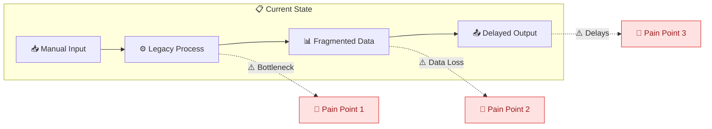
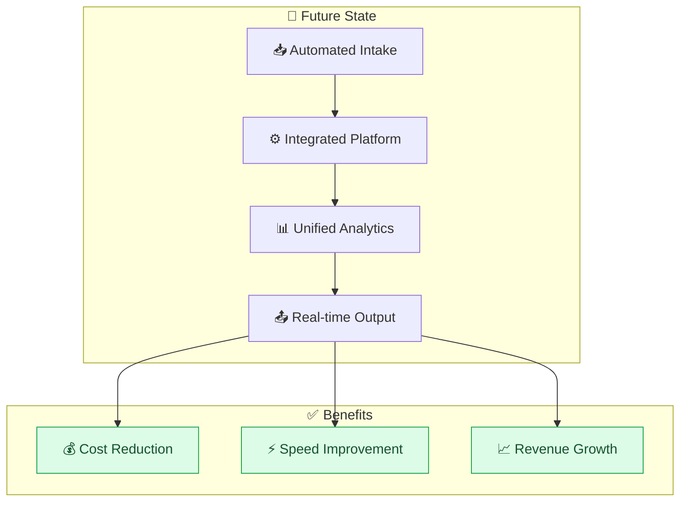
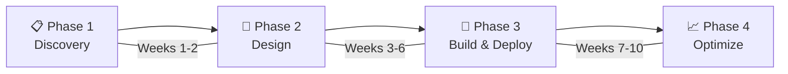
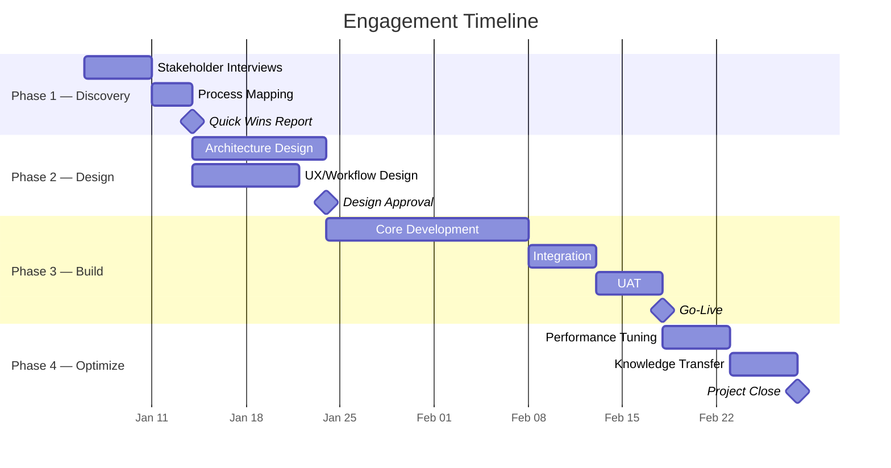

# Sales Proposal

| Field              | Value                       |
| ------------------ | --------------------------- |
| **Document ID**    | `SP-[NNN]-[CLIENT]`         |
| **Version**        | 1.0                         |
| **Classification** | Confidential                |
| **Date**           | [YYYY-MM-DD]                |
| **Valid Until**    | [YYYY-MM-DD]                |
| **Prepared By**    | [Name, Title]               |
| **Prepared For**   | [Client Name, Organization] |
| **Opportunity ID** | [CRM Reference]             |

---

## Document Control

| Version | Date   | Author   | Reviewer   | Changes                |
| ------- | ------ | -------- | ---------- | ---------------------- |
| 0.1     | [Date] | [Author] | —          | Initial draft          |
| 0.2     | [Date] | [Author] | [Reviewer] | Incorporated feedback  |
| 1.0     | [Date] | [Author] | [Approver] | Final approved version |

---

## Executive Summary

[3-4 paragraphs. Open with the client's strategic challenge, transition to the proposed solution, quantify the expected impact, and close with a call to action. This section should compel a C-level reader to continue reading or approve on the spot.]

**Investment:** $[Amount] — $[Amount]
**Timeline:** [Duration]
**Expected ROI:** [X]x within [timeframe]
**Payback Period:** [Months]

---

## Client Situation

### Organization Overview

[Brief description of the client's business, market position, and strategic context. Demonstrate that you understand their world, not just their problem.]

### Current State Assessment

[Describe the current environment based on discovery findings. Reference specific data, metrics, or conversations.]

### Challenges & Business Impact

| #   | Challenge                  | Current Impact      | Annual Cost   |
| --- | -------------------------- | ------------------- | ------------- |
| 1   | [Challenge description]    | [Quantified impact] | $[Amount]     |
| 2   | [Challenge description]    | [Quantified impact] | $[Amount]     |
| 3   | [Challenge description]    | [Quantified impact] | $[Amount]     |
|     | **Total Cost of Inaction** |                     | **$[Amount]** |

### Strategic Objectives

| Objective     | Success Metric | Target         |
| ------------- | -------------- | -------------- |
| [Objective 1] | [KPI]          | [Target value] |
| [Objective 2] | [KPI]          | [Target value] |
| [Objective 3] | [KPI]          | [Target value] |

---

## Proposed Solution

### Solution Overview

[Describe the overall solution architecture and approach. Explain why this solution addresses the root causes, not just symptoms.]

### Solution Architecture

### Engagement Process

### Phase Details

#### Phase 1: Discovery & Assessment (Weeks 1-2)

**Objective:** Validate assumptions, map processes, identify quick wins.

| Activity                  | Duration | Deliverable                |
| ------------------------- | -------- | -------------------------- |
| Stakeholder interviews    | [Days]   | Interview synthesis report |
| Process mapping           | [Days]   | Current state process maps |
| Data audit                | [Days]   | Data quality assessment    |
| Quick wins identification | [Days]   | Quick wins roadmap         |

#### Phase 2: Solution Design (Weeks 3-6)

**Objective:** Design the target architecture and implementation plan.

| Activity            | Duration | Deliverable                |
| ------------------- | -------- | -------------------------- |
| Architecture design | [Days]   | Technical design document  |
| UX/workflow design  | [Days]   | Wireframes and user flows  |
| Integration mapping | [Days]   | Integration specifications |
| Implementation plan | [Days]   | Detailed project plan      |

#### Phase 3: Build & Deploy (Weeks 7-10)

**Objective:** Implement, test, and deploy the solution.

| Activity                | Duration | Deliverable               |
| ----------------------- | -------- | ------------------------- |
| Core implementation     | [Days]   | Working solution          |
| Integration development | [Days]   | Connected systems         |
| UAT and testing         | [Days]   | Test results and sign-off |
| Deployment              | [Days]   | Production deployment     |

#### Phase 4: Optimize & Transition (Weeks 11-12)

**Objective:** Measure results, optimize performance, transition to BAU.

| Activity               | Duration | Deliverable                     |
| ---------------------- | -------- | ------------------------------- |
| Performance monitoring | [Days]   | Performance baseline report     |
| Optimization cycles    | [Days]   | Tuned configurations            |
| Knowledge transfer     | [Days]   | Training materials and sessions |
| Transition planning    | [Days]   | Ongoing support plan            |

### Key Deliverables Summary

| #   | Deliverable   | Phase   | Business Value    |
| --- | ------------- | ------- | ----------------- |
| 1   | [Deliverable] | Phase 1 | [Value statement] |
| 2   | [Deliverable] | Phase 2 | [Value statement] |
| 3   | [Deliverable] | Phase 3 | [Value statement] |
| 4   | [Deliverable] | Phase 4 | [Value statement] |

### Assumptions & Dependencies

| #   | Assumption / Dependency                                    | Impact if Not Met                  |
| --- | ---------------------------------------------------------- | ---------------------------------- |
| 1   | [Client provides access to systems within 5 business days] | [Schedule delay of X weeks]        |
| 2   | [Key stakeholders available for weekly reviews]            | [Risk of rework]                   |
| 3   | [Existing data meets minimum quality standards]            | [Additional data cleansing effort] |

### Out of Scope

- [Explicitly excluded item with rationale]
- [Explicitly excluded item with rationale]
- [Explicitly excluded item with rationale]

---

## Investment & Value

### Pricing

| Component                            | Description        | Investment    |
| ------------------------------------ | ------------------ | ------------- |
| Phase 1: Discovery                   | [Scope summary]    | $[Amount]     |
| Phase 2: Design                      | [Scope summary]    | $[Amount]     |
| Phase 3: Build & Deploy              | [Scope summary]    | $[Amount]     |
| Phase 4: Optimize                    | [Scope summary]    | $[Amount]     |
| **Subtotal — Professional Services** |                    | **$[Amount]** |
| Technology Licensing (Year 1)        | [Platform / tools] | $[Amount]     |
| **Total Investment**                 |                    | **$[Amount]** |

### Payment Schedule

| Milestone          | Percentage | Amount    | Trigger               |
| ------------------ | ---------- | --------- | --------------------- |
| Contract Execution | 30%        | $[Amount] | Signed SOW            |
| Phase 2 Complete   | 30%        | $[Amount] | Design approval       |
| Go-Live            | 30%        | $[Amount] | Production deployment |
| Project Close      | 10%        | $[Amount] | Final acceptance      |

### Value Projection

| Benefit Area       | Year 1        | Year 2        | Year 3        |
| ------------------ | ------------- | ------------- | ------------- |
| Cost savings       | $[Amount]     | $[Amount]     | $[Amount]     |
| Revenue uplift     | $[Amount]     | $[Amount]     | $[Amount]     |
| Productivity gains | $[Amount]     | $[Amount]     | $[Amount]     |
| **Total Benefit**  | **$[Amount]** | **$[Amount]** | **$[Amount]** |
| **Cumulative ROI** | [X]%          | [X]%          | [X]%          |

---

## Timeline

---

## Risk Management

| Risk                                        | Likelihood | Impact | Mitigation                                | Owner           |
| ------------------------------------------- | ---------- | ------ | ----------------------------------------- | --------------- |
| [Scope creep due to undefined requirements] | Medium     | High   | [Fixed scope with change control process] | PM              |
| [Key resource unavailability]               | Low        | High   | [Cross-trained team, backup resources]    | Engagement Lead |
| [Integration complexity exceeds estimates]  | Medium     | Medium | [Spike in Phase 1, contingency buffer]    | Tech Lead       |
| [Data quality issues]                       | Medium     | Medium | [Data audit in Phase 1, cleansing budget] | Data Lead       |

---

## Why Us

### Relevant Experience

| Client     | Industry   | Challenge           | Solution      | Result              |
| ---------- | ---------- | ------------------- | ------------- | ------------------- |
| [Client A] | [Industry] | [Similar challenge] | [What we did] | [Quantified result] |
| [Client B] | [Industry] | [Similar challenge] | [What we did] | [Quantified result] |
| [Client C] | [Industry] | [Similar challenge] | [What we did] | [Quantified result] |

### Differentiators

| Capability      | Our Approach             | Market Standard            |
| --------------- | ------------------------ | -------------------------- |
| [Methodology]   | [What we do differently] | [What others typically do] |
| [Technology]    | [Our advantage]          | [Standard approach]        |
| [Team]          | [Our advantage]          | [Standard approach]        |
| [Support Model] | [Our advantage]          | [Standard approach]        |

### Client Testimonials

> "[Testimonial from a similar engagement, with attribution.]"
> — [Name, Title, Company]

> "[Second testimonial.]"
> — [Name, Title, Company]

---

## Team

### Proposed Team Structure

| Role               | Name   | Allocation | Key Responsibility              |
| ------------------ | ------ | ---------- | ------------------------------- |
| Engagement Partner | [Name] | [%]        | Executive oversight, escalation |
| Project Manager    | [Name] | [%]        | Day-to-day delivery, reporting  |
| Solution Architect | [Name] | [%]        | Technical design, integration   |
| Lead Developer     | [Name] | [%]        | Implementation, testing         |
| Change Management  | [Name] | [%]        | Training, adoption              |

### Key Biographies

**[Name], [Title]**
[2-3 sentences: relevant experience, certifications, similar engagements completed.]

**[Name], [Title]**
[2-3 sentences: relevant experience and credentials.]

---

## Governance & Communication

| Cadence   | Meeting            | Participants              | Purpose                          |
| --------- | ------------------ | ------------------------- | -------------------------------- |
| Weekly    | Status Review      | PM, Client PM             | Progress, risks, decisions       |
| Bi-weekly | Steering Committee | Partners, Client Sponsors | Strategic alignment, escalations |
| Phase End | Gate Review        | Full team, Stakeholders   | Phase acceptance, go/no-go       |
| Ad Hoc    | Escalation         | As needed                 | Issue resolution                 |

### Reporting

- Weekly status report (email)
- Monthly executive dashboard
- Phase-end gate review presentations

---

## Terms & Conditions

### Contract Structure

- **Agreement Type:** [Fixed Price / Time & Materials / Hybrid]
- **Term:** [Duration]
- **Renewal:** [Terms]

### Change Control

All changes to scope, timeline, or budget must follow the change control process:

1. Change request submitted in writing
2. Impact assessment within [X] business days
3. Mutual written approval before work begins
4. Updated SOW addendum

### Intellectual Property

- Pre-existing IP remains with originating party
- Work product developed under this engagement transfers to [Client] upon final payment
- Methodologies and frameworks remain with [Provider]

### Confidentiality

Both parties agree to maintain confidentiality of all proprietary information shared during this engagement. Standard NDA terms apply.

### Warranty

[Provider] warrants deliverables for [X] days following acceptance. Warranty covers defects in workmanship, not changes in requirements.

---

## Next Steps

| #   | Action                      | Owner        | Target Date |
| --- | --------------------------- | ------------ | ----------- |
| 1   | Review and discuss proposal | Client Team  | [Date]      |
| 2   | Address clarifications      | [Provider]   | [Date]      |
| 3   | Commercial negotiation      | Both parties | [Date]      |
| 4   | Contract execution          | Legal teams  | [Date]      |
| 5   | Project kickoff             | Both teams   | [Date]      |

---

## Acceptance

This proposal, upon acceptance, constitutes authorization to proceed with the engagement as described.

|                  | Client             | Provider           |
| ---------------- | ------------------ | ------------------ |
| **Organization** | [Client Org]       | [Provider Org]     |
| **Name**         | [Name]             | [Name]             |
| **Title**        | [Title]            | [Title]            |
| **Signature**    | ********\_******** | ********\_******** |
| **Date**         | [Date]             | [Date]             |

---

_This proposal is valid for 30 days from the date of issue._
_Prepared by [Company Name] · [Contact Email] · [Phone] · [Website]_
