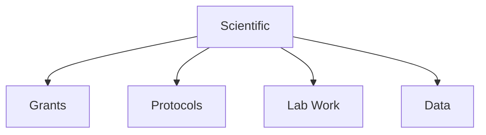

# Scientific

Scientific research, grants, and lab documentation templates.

## Templates

| Template                                           | Description         |
| -------------------------------------------------- | ------------------- |
| [grant_proposal.md](grant_proposal.md)             | Grant applications  |
| [study_protocol.md](study_protocol.md)             | Study protocols     |
| [lab_notebook.md](lab_notebook.md)                 | Lab documentation   |
| [experimental_design.md](experimental_design.md)   | Experimental design |
| [data_management_plan.md](data_management_plan.md) | Data management     |

## Structure

See [Parent](../SKILL.md) for all categories.
