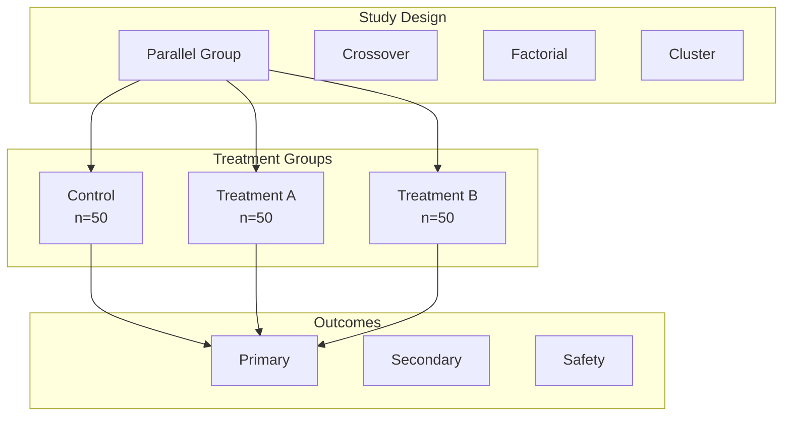
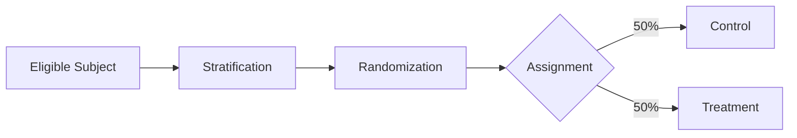
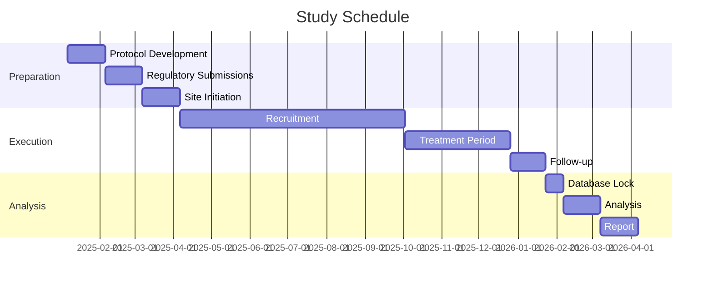

# Experimental Design Document

<!-- Scientific experiment design following best practices -->

---

## Document Control

| Field                      | Value                                     |
| -------------------------- | ----------------------------------------- |
| **Study ID**               | EXP-[YYYY]-[NNN]                          |
| **Version**                | [X.Y.Z]                                   |
| **Date**                   | [YYYY-MM-DD]                              |
| **Principal Investigator** | [Name]                                    |
| **Study Coordinator**      | [Name]                                    |
| **Status**                 | Draft / Approved / In Progress / Complete |

---

## Executive Summary

### Study Overview

| Attribute            | Value                                           |
| -------------------- | ----------------------------------------------- |
| **Study Title**      | [Title]                                         |
| **Study Type**       | Basic / Translational / Clinical                |
| **Design**           | Randomized / Observational / Quasi-experimental |
| **Duration**         | [Start] to [End]                                |
| **Sample Size**      | [N]                                             |
| **Primary Endpoint** | [Endpoint]                                      |

### Hypothesis

**Null Hypothesis ($H_0$):**
$$H_0: \mu_{treatment} = \mu_{control}$$

**Alternative Hypothesis ($H_1$):**
$$H_1: \mu_{treatment} \neq \mu_{control}$$

---

## Study Design

### Design Type

### Study Schema

| Phase     | Activity     | Duration | Population |
| --------- | ------------ | -------- | ---------- |
| Screening | Eligibility  | 2 weeks  | [N]        |
| Baseline  | Assessments  | 1 week   | [N]        |
| Treatment | Intervention | 12 weeks | [N]        |
| Follow-up | Monitoring   | 4 weeks  | [N]        |

---

## Population

### Inclusion Criteria

1. [Criterion 1]
2. [Criterion 2]
3. [Criterion 3]

### Exclusion Criteria

1. [Criterion 1]
2. [Criterion 2]
3. [Criterion 3]

### Sample Size Calculation

**Parameters:**

- Effect size ($d$): [Value]
- Significance level ($\alpha$): 0.05
- Power ($1 - \beta$): 0.80
- Allocation ratio: 1:1

**Formula:**

$$n = \frac{2(Z_{1-\alpha/2} + Z_{1-\beta})^2 \sigma^2}{\delta^2}$$

**Calculation:**
$$n = \frac{2(1.96 + 0.84)^2 \times 10^2}{5^2} = 63 \text{ per group}$$

**Total sample size:** 126 (accounting for 20% dropout: 158)

---

## Randomization

### Randomization Method

| Method     | Description       | Implementation          |
| ---------- | ----------------- | ----------------------- |
| Simple     | Equal probability | Random number generator |
| Block      | Balanced blocks   | Block size 4, 6, 8      |
| Stratified | By strata         | Age, sex                |

### Randomization Sequence

### Allocation Concealment

- Sequentially numbered opaque envelopes
- Centralized web-based system
- [Other method]

---

## Interventions

### Control Group

| Parameter        | Specification              |
| ---------------- | -------------------------- |
| **Intervention** | Placebo / Standard of care |
| **Dose**         | [Dose]                     |
| **Frequency**    | [Frequency]                |
| **Duration**     | [Duration]                 |

### Treatment Group

| Parameter        | Specification    |
| ---------------- | ---------------- |
| **Intervention** | [Treatment name] |
| **Dose**         | [Dose]           |
| **Frequency**    | [Frequency]      |
| **Duration**     | [Duration]       |

### Blinding

| Aspect            | Method           |
| ----------------- | ---------------- |
| Participants      | Double-blind     |
| Investigators     | Double-blind     |
| Outcome assessors | Double-blind     |
| Data analysts     | Blinded to group |

---

## Outcomes

### Primary Outcome

| Attribute      | Specification        |
| -------------- | -------------------- |
| **Measure**    | [Measure name]       |
| **Instrument** | [Tool/assay]         |
| **Timepoint**  | [Time]               |
| **Analysis**   | [Statistical method] |

### Secondary Outcomes

| Outcome     | Measure   | Timepoint | Analysis |
| ----------- | --------- | --------- | -------- |
| [Outcome 1] | [Measure] | [Time]    | [Method] |
| [Outcome 2] | [Measure] | [Time]    | [Method] |

### Safety Outcomes

| Outcome           | Definition             | Reporting  |
| ----------------- | ---------------------- | ---------- |
| Adverse events    | Any untoward event     | Continuous |
| Serious AEs       | Hospitalization, death | Immediate  |
| Lab abnormalities | Outside normal range   | Per visit  |

---

## Statistical Analysis

### Analysis Populations

| Population      | Definition             | Analysis  |
| --------------- | ---------------------- | --------- |
| Intent-to-treat | All randomized         | Primary   |
| Per-protocol    | Completed per protocol | Secondary |
| Safety          | Received any treatment | Safety    |

### Statistical Methods

**Primary Analysis:**

- Test: Two-sample t-test / Mann-Whitney U
- Adjustment: Baseline covariates (ANCOVA)
- Missing data: Multiple imputation

**Secondary Analyses:**

- Subgroup analyses
- Sensitivity analyses
- Exploratory analyses

### Interim Analysis

| Interim | Timing         | Stopping Rules      |
| ------- | -------------- | ------------------- |
| 1       | 50% enrollment | Efficacy / Futility |
| 2       | 75% enrollment | Safety              |

---

## Data Collection

### Schedule of Assessments

| Visit             | Screening | Baseline | Week 4 | Week 8 | Week 12 |
| ----------------- | --------- | -------- | ------ | ------ | ------- |
| Informed consent  | ✅        |          |        |        |         |
| Demographics      | ✅        |          |        |        |         |
| Medical history   | ✅        |          |        |        |         |
| Physical exam     | ✅        | ✅       | ✅     | ✅     | ✅      |
| Vital signs       |           | ✅       | ✅     | ✅     | ✅      |
| Lab tests         | ✅        | ✅       |        |        | ✅      |
| Efficacy measures |           | ✅       | ✅     | ✅     | ✅      |
| Adverse events    |           |          | ✅     | ✅     | ✅      |

### Data Management

| System     | Purpose     | Access      |
| ---------- | ----------- | ----------- |
| REDCap     | CRF data    | Study team  |
| Lab system | Lab results | Lab staff   |
| Imaging    | Radiology   | Radiologist |

---

## Risk Management

### Risk Assessment

| Risk               | Likelihood | Impact | Mitigation     |
| ------------------ | ---------- | ------ | -------------- |
| Recruitment delay  | Medium     | High   | Multiple sites |
| Protocol deviation | Medium     | Medium | Training       |
| Data quality       | Low        | Medium | Monitoring     |

### Data Safety Monitoring

| Role            | Responsibility    | Frequency |
| --------------- | ----------------- | --------- |
| DSMB            | Safety review     | Quarterly |
| Medical Monitor | SAE review        | Real-time |
| Sponsor         | Overall oversight | Monthly   |

---

## Ethics

### Regulatory Approvals

| Approval   | Number   | Date   | Expiry |
| ---------- | -------- | ------ | ------ |
| IRB/IEC    | [Number] | [Date] | [Date] |
| Regulatory | [Number] | [Date] | [Date] |

### Informed Consent

- Written informed consent required
- Consent form version: [Version]
- Assent for minors: [Yes/No]

---

## Timeline

---

## Appendices

### A. Case Report Forms

[CRF templates]

### B. Laboratory Manual

[Lab procedures]

### C. Statistical Analysis Plan

[SAP document]

---

_Last updated: [Date]_

---

## See Also

- [Lab Notebook](./lab_notebook.md) — Experimental documentation
- [Statistical Analysis](./statistical_analysis.md) — Data analysis
- [Study Protocol](./study_protocol.md) — Clinical procedures
