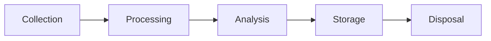

# Laboratory Notebook Protocol

<!-- Electronic lab notebook following GLP standards -->

---

## Document Control

| Field              | Value             |
| ------------------ | ----------------- |
| **Notebook ID**    | NB-[YYYY]-[NNN]   |
| **Version**        | [X.Y.Z]           |
| **Date**           | [YYYY-MM-DD]      |
| **Researcher**     | [Name]            |
| **Project**        | [Project Name]    |
| **Study Director** | [Name]            |
| **Status**         | Active / Archived |

> [!IMPORTANT]
> All entries must be contemporaneous, attributable, legible, complete, and accurate (ALCOA).

---

## Experiment Entry

### Entry Header

| Field                  | Value             |
| ---------------------- | ----------------- |
| **Entry ID**           | [NB-YYYY-NNN-XXX] |
| **Date**               | [YYYY-MM-DD]      |
| **Time**               | [HH:MM]           |
| **Experiment Title**   | [Title]           |
| **Protocol Reference** | [Protocol ID]     |
| **Objective**          | [Brief objective] |

### Materials & Reagents

| Item        | Catalog # | Lot #      | Expiry | Amount Used |
| ----------- | --------- | ---------- | ------ | ----------- |
| [Reagent 1] | [Cat#]    | [Lot]      | [Date] | [Amount]    |
| [Reagent 2] | [Cat#]    | [Lot]      | [Date] | [Amount]    |
| [Equipment] | [ID]      | [Cal date] | -      | [Settings]  |

### Procedure

**Step-by-step protocol:**

1. [Step 1 with specific parameters]
2. [Step 2 with specific parameters]
3. [Step 3 with specific parameters]

**Deviations from protocol:**

- [Any deviations with justification]

### Observations

| Time    | Observation   | Notes   |
| ------- | ------------- | ------- |
| [HH:MM] | [Observation] | [Notes] |
| [HH:MM] | [Observation] | [Notes] |

### Raw Data

| Sample ID | Measurement 1 | Measurement 2 | Measurement 3 | Unit   |
| --------- | ------------- | ------------- | ------------- | ------ |
| [S-001]   | [Value]       | [Value]       | [Value]       | [Unit] |
| [S-002]   | [Value]       | [Value]       | [Value]       | [Unit] |

### Calculations

**Formula used:**

$$\text{Concentration} = \frac{\text{Absorbance} \times \text{Dilution Factor}}{\text{Extinction Coefficient} \times \text{Path Length}}$$

**Calculation example:**

$$C = \frac{0.45 \times 10}{21000 \times 1} = 2.14 \times 10^{-4} \text{ M}$$

### Results Summary

| Parameter     | Value   | Unit   | Acceptance Criteria | Pass/Fail |
| ------------- | ------- | ------ | ------------------- | --------- |
| [Parameter 1] | [Value] | [Unit] | [Criteria]          | ✅/❌     |
| [Parameter 2] | [Value] | [Unit] | [Criteria]          | ✅/❌     |

### Conclusions

[Summary of findings and interpretation]

### Next Steps

- [Next experiment or action]

### Signatures

| Role         | Name   | Signature      | Date/Time   |
| ------------ | ------ | -------------- | ----------- |
| Experimenter | [Name] | ****\_\_\_**** | [Date/Time] |
| Reviewer     | [Name] | ****\_\_\_**** | [Date/Time] |

---

## Sample Tracking

### Sample Chain of Custody

| Sample ID | Description   | Collected | Location   | Status   |
| --------- | ------------- | --------- | ---------- | -------- |
| [S-001]   | [Description] | [Date]    | [Location] | Active   |
| [S-002]   | [Description] | [Date]    | [Location] | Archived |

---

## Equipment Log

| Equipment ID | Description   | Calibration Date | Next Due | Status |
| ------------ | ------------- | ---------------- | -------- | ------ |
| [EQ-001]     | [Description] | [Date]           | [Date]   | ✅     |
| [EQ-002]     | [Description] | [Date]           | [Date]   | ⚠️     |

---

## Reagent Preparation

### Preparation Log

| Reagent      | Prepared By | Date   | Expiry | Storage |
| ------------ | ----------- | ------ | ------ | ------- |
| [Buffer A]   | [Name]      | [Date] | [Date] | 4°C     |
| [Solution B] | [Name]      | [Date] | [Date] | -20°C   |

### Preparation Protocol

**[Reagent Name]**

1. Weigh [amount] of [compound]
2. Dissolve in [volume] of [solvent]
3. Adjust pH to [value] using [acid/base]
4. Bring to final volume of [volume]
5. Filter through [filter type]
6. Store at [temperature]

---

## Data Integrity

### ALCOA+ Compliance

| Principle       | Implementation      | Evidence          |
| --------------- | ------------------- | ----------------- |
| Attributable    | User authentication | Login logs        |
| Legible         | Electronic entry    | Audit trail       |
| Contemporaneous | Timestamp           | System time       |
| Original        | First recording     | Version control   |
| Accurate        | Validation          | Review signatures |
| Complete        | All data captured   | Checklist         |
| Consistent      | Standard procedures | SOPs              |
| Enduring        | Backup systems      | Backup logs       |
| Available       | Retrievable         | Archive system    |

### Audit Trail

| Entry ID | Action   | User   | Timestamp | Reason        |
| -------- | -------- | ------ | --------- | ------------- |
| [ID]     | Created  | [User] | [Time]    | Initial entry |
| [ID]     | Modified | [User] | [Time]    | [Reason]      |
| [ID]     | Reviewed | [User] | [Time]    | [Comments]    |

---

## Attachments

| File Name   | Description   | Size   | Hash     |
| ----------- | ------------- | ------ | -------- |
| [file.pdf]  | [Description] | [Size] | [SHA256] |
| [data.xlsx] | [Description] | [Size] | [SHA256] |

---

_Last updated: [Date]_

---

## See Also

- [Experimental Design](./experimental_design.md) — Study planning
- [Statistical Analysis](./statistical_analysis.md) — Data analysis
- [Study Protocol](./study_protocol.md) — Clinical protocols
