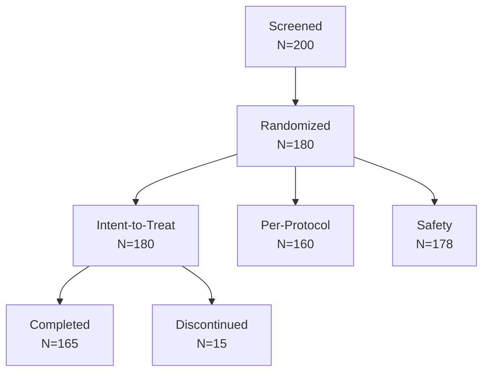

# Statistical Analysis Plan

<!-- Statistical methodology for research data analysis -->

---

## Document Control

| Field                      | Value            |
| -------------------------- | ---------------- |
| **SAP ID**                 | SAP-[YYYY]-[NNN] |
| **Version**                | [X.Y.Z]          |
| **Date**                   | [YYYY-MM-DD]     |
| **Statistician**           | [Name]           |
| **Principal Investigator** | [Name]           |
| **Study ID**               | [Study ID]       |
| **Status**                 | Draft / Final    |

---

## Executive Summary

### Analysis Overview

| Attribute              | Value            |
| ---------------------- | ---------------- |
| **Study Design**       | [Design]         |
| **Primary Objective**  | [Objective]      |
| **Primary Endpoint**   | [Endpoint]       |
| **Analysis Software**  | R / SAS / Python |
| **Significance Level** | $\alpha = 0.05$  |

### Analysis Populations



---

## Descriptive Statistics

### Summary Statistics

| Statistic          | Formula                                     | Application          |
| ------------------ | ------------------------------------------- | -------------------- |
| Mean               | $\bar{x} = \frac{1}{n}\sum_{i=1}^{n} x_i$   | Continuous variables |
| Standard Deviation | $s = \sqrt{\frac{\sum(x_i - \bar)^2}{n-1}}$ | Variability          |
| Median             | $Q_2$                                       | Central tendency     |
| IQR                | $Q_3 - Q_1$                                 | Spread               |

### Categorical Variables

| Statistic  | Formula                                               | Application |
| ---------- | ----------------------------------------------------- | ----------- |
| Frequency  | $n$                                                   | Count       |
| Percentage | $\frac{n}{N} \times 100$                              | Proportion  |
| 95% CI     | $\hat{p} \pm 1.96\sqrt{\frac{\hat{p}(1-\hat{p})}{n}}$ | Precision   |

---

## Primary Analysis

### Hypothesis Testing

**Null Hypothesis:**
$$H_0: \mu_T = \mu_C$$

**Alternative Hypothesis:**
$$H_1: \mu_T \neq \mu_C$$

**Test Statistic:**

$$t = \frac{\bar{X}_T - \bar{X}_C}{\sqrt{\frac{s_T^2}{n_T} + \frac{s_C^2}{n_C}}}$$

**Decision Rule:**

- Reject $H_0$ if $|t| > t_{1-\alpha/2, df}$ or $p < 0.05$

### Effect Size

**Cohen's d:**
$$d = \frac{\bar{X}_T - \bar{X}_C}{s_{pooled}}$$

| Effect Size | d   | Interpretation     |
| ----------- | --- | ------------------ |
| Small       | 0.2 | Minimal effect     |
| Medium      | 0.5 | Moderate effect    |
| Large       | 0.8 | Substantial effect |

---

## Secondary Analyses

### Subgroup Analyses

| Subgroup | Factor     | Test        | Adjustment |
| -------- | ---------- | ----------- | ---------- |
| Age      | <65 vs ≥65 | Interaction | Bonferroni |
| Sex      | M vs F     | Interaction | Bonferroni |
| Baseline | Severity   | ANCOVA      | None       |

### Sensitivity Analyses

| Analysis            | Method     | Purpose         |
| ------------------- | ---------- | --------------- |
| Worst case          | LOCF       | Robustness      |
| Best case           | Completers | Bias assessment |
| Multiple imputation | MI         | Missing data    |

---

## Regression Models

### Linear Regression

**Model:**
$$Y_i = \beta_0 + \beta_1 X_{1i} + \beta_2 X_{2i} + \epsilon_i$$

**Assumptions:**

1. Linearity
2. Independence
3. Homoscedasticity
4. Normality of residuals

**Diagnostics:**

- Residual plots
- Q-Q plots
- Influence statistics

### Logistic Regression

**Model:**
$$\log\left(\frac{p}{1-p}\right) = \beta_0 + \beta_1 X_1 + \beta_2 X_2$$

**Odds Ratio:**
$$OR = e^{\beta}$$

**95% CI:**
$$e^{\beta \pm 1.96 \times SE(\beta)}$$

### Survival Analysis

**Kaplan-Meier Estimator:**
$$\hat{S}(t) = \prod_{t_i \leq t} \left(1 - \frac{d_i}{n_i}\right)$$

**Log-rank Test:**
$$\chi^2 = \sum_{k} \frac{(O_k - E_k)^2}{E_k}$$

**Cox Proportional Hazards:**
$$h(t|X) = h_0(t) \exp(\beta X)$$

---

## Multiple Comparisons

### Adjustment Methods

| Method     | Formula              | Use Case        |
| ---------- | -------------------- | --------------- |
| Bonferroni | $\alpha' = \alpha/m$ | Few comparisons |
| Holm       | Step-down            | FWER control    |
| FDR        | Benjamini-Hochberg   | Many tests      |

### Family-wise Error Rate

$$FWER = P(\text{at least one false positive})$$

---

## Missing Data

### Missing Data Mechanisms

| Mechanism | Description                  | Method        |
| --------- | ---------------------------- | ------------- |
| MCAR      | Missing completely at random | Complete case |
| MAR       | Missing at random            | MI, ML        |
| MNAR      | Missing not at random        | Sensitivity   |

### Imputation Methods

| Method          | Description               | Software |
| --------------- | ------------------------- | -------- |
| Mean imputation | Replace with mean         | Simple   |
| Regression      | Predict from covariates   | R mice   |
| Multiple        | Multiple imputed datasets | R mice   |

---

## Power Analysis

### Sample Size Formula

**Two-sample t-test:**
$$n = \frac{2(Z_{1-\alpha/2} + Z_{1-\beta})^2 \sigma^2}{\delta^2}$$

**Survival analysis:**
$$n = \frac{(Z_{1-\alpha/2} + Z_{1-\beta})^2}{p(1-p)(\log HR)^2}$$

### Power Curves

```mermaid
xychart-beta
    title "Power vs Sample Size"
    x-axis [20, 40, 60, 80, 100, 120]
    y-axis "Power" 0 --> 1
    line [0.3, 0.5, 0.7, 0.85, 0.92, 0.96]
```

---

## Quality Control

### Data Validation

| Check       | Method       | Threshold    |
| ----------- | ------------ | ------------ |
| Range       | Min/max      | Per variable |
| Consistency | Cross-check  | 100%         |
| Missing     | Completeness | > 95%        |
| Outliers    | IQR method   | > 1.5 × IQR  |

### Statistical Review

| Review        | Frequency       | Responsible         |
| ------------- | --------------- | ------------------- |
| Syntax check  | Before analysis | Statistician        |
| Output review | After analysis  | Senior statistician |
| Report review | Final           | PI + Statistician   |

---

## Reporting

### Tables

| Table | Content                  | Population |
| ----- | ------------------------ | ---------- |
| 1     | Baseline characteristics | ITT        |
| 2     | Primary analysis         | ITT        |
| 3     | Secondary outcomes       | ITT        |
| 4     | Safety                   | Safety     |

### Figures

| Figure | Type        | Description       |
| ------ | ----------- | ----------------- |
| 1      | CONSORT     | Subject flow      |
| 2      | KM plot     | Survival curves   |
| 3      | Forest plot | Subgroup analyses |
| 4      | Residuals   | Model diagnostics |

---

## Software & Reproducibility

### Analysis Software

| Software | Version | Purpose          |
| -------- | ------- | ---------------- |
| R        | 4.3.0   | Primary analysis |
| SAS      | 9.4     | Validation       |
| Python   | 3.11    | Data processing  |

### Reproducibility

| Element         | Implementation    |
| --------------- | ----------------- |
| Version control | Git               |
| Environment     | renv / conda      |
| Documentation   | R Markdown        |
| Archive         | Zenodo / Figshare |

---

## Appendices

### A. Analysis Code

[Statistical code]

### B. Mock Tables

[Table shells]

### C. Variable Dictionary

[Data dictionary]

---

_Last updated: [Date]_

---

## See Also

- [Experimental Design](./experimental_design.md) — Study design
- [Lab Notebook](./lab_notebook.md) — Data collection
- [Study Protocol](./study_protocol.md) — Clinical procedures
