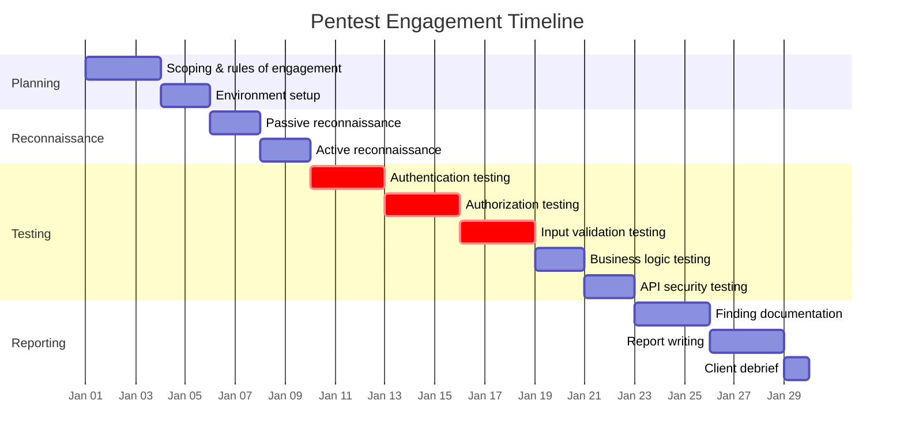
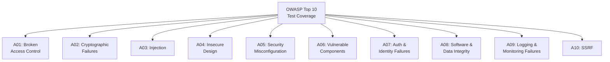
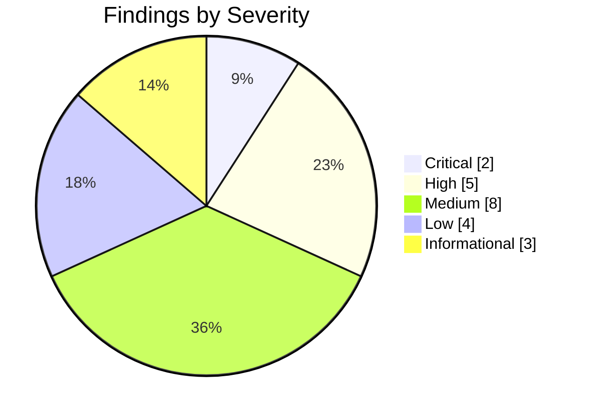
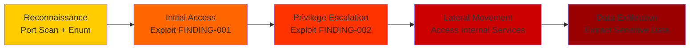
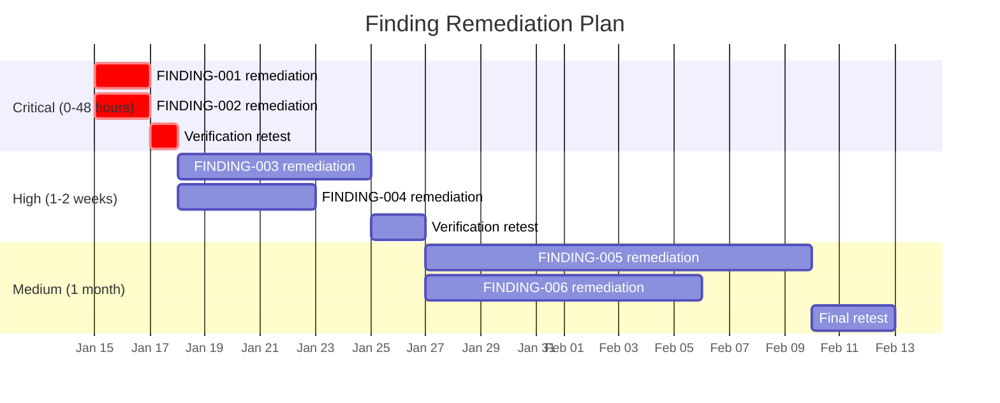

# Penetration Test Report

## Document Control

| Field              | Value                        |
| ------------------ | ---------------------------- |
| **Document ID**    | PTR-001                      |
| **Version**        | 1.0                          |
| **Classification** | Confidential                 |
| **Author**         | `[Penetration Tester Name]`  |
| **Reviewer**       | `[Security Lead]`            |
| **Approver**       | `[CISO / Security Director]` |
| **Created**        | `YYYY-MM-DD`                 |
| **Last Updated**   | `YYYY-MM-DD`                 |
| **Test Period**    | `YYYY-MM-DD` to `YYYY-MM-DD` |
| **Status**         | Draft / Final                |

---

## Executive Summary

A penetration test was conducted against `[Target System/Application]` during the period `[Start Date]` to `[End Date]`. The assessment identified **`___` critical**, **`___` high**, **`___` medium**, and **`___` low** severity findings. This report details all findings, their potential business impact, and recommended remediations.

### Overall Risk Rating: `[Critical / High / Medium / Low]`

### Finding Summary

| Severity      | Count     | Remediated | Open      |
| ------------- | --------- | ---------- | --------- |
| Critical      | `___`     | `___`      | `___`     |
| High          | `___`     | `___`      | `___`     |
| Medium        | `___`     | `___`      | `___`     |
| Low           | `___`     | `___`      | `___`     |
| Informational | `___`     | `___`      | `___`     |
| **Total**     | **`___`** | **`___`**  | **`___`** |

---

## Engagement Details

### Scope

| Attribute                | Details                           |
| ------------------------ | --------------------------------- |
| **Target**               | `[Application / Network / API]`   |
| **URLs/IPs in Scope**    | `[List targets]`                  |
| **Out of Scope**         | `[List exclusions]`               |
| **Test Type**            | Black Box / Grey Box / White Box  |
| **Methodology**          | OWASP Testing Guide / PTES / NIST |
| **Testing Environment**  | Production / Staging / Dedicated  |
| **Credentials Provided** | `[None / User / Admin]`           |

### Testing Timeline



### Tools Used

| Tool                    | Purpose                 | Version     |
| ----------------------- | ----------------------- | ----------- |
| Burp Suite Professional | Web application testing | `[Version]` |
| Nmap                    | Network scanning        | `[Version]` |
| SQLMap                  | SQL injection testing   | `[Version]` |
| Nuclei                  | Vulnerability scanning  | `[Version]` |
| ffuf                    | Directory/API fuzzing   | `[Version]` |
| Custom scripts          | Targeted exploitation   | N/A         |

---

## Testing Methodology

### OWASP Top 10 Coverage



### Test Coverage Matrix

| OWASP Category                 | Tests Performed | Findings | Coverage              |
| ------------------------------ | --------------- | -------- | --------------------- |
| A01: Broken Access Control     | `___`           | `___`    | `[Full/Partial/None]` |
| A02: Cryptographic Failures    | `___`           | `___`    | `[Full/Partial/None]` |
| A03: Injection                 | `___`           | `___`    | `[Full/Partial/None]` |
| A04: Insecure Design           | `___`           | `___`    | `[Full/Partial/None]` |
| A05: Security Misconfiguration | `___`           | `___`    | `[Full/Partial/None]` |
| A06: Vulnerable Components     | `___`           | `___`    | `[Full/Partial/None]` |
| A07: Auth & Identity Failures  | `___`           | `___`    | `[Full/Partial/None]` |
| A08: Software & Data Integrity | `___`           | `___`    | `[Full/Partial/None]` |
| A09: Logging & Monitoring      | `___`           | `___`    | `[Full/Partial/None]` |
| A10: SSRF                      | `___`           | `___`    | `[Full/Partial/None]` |

---

## Findings

### Finding Severity Distribution



---

### Finding Template

> Repeat this section for each finding.

#### [FINDING-001]: `[Finding Title]`

| Attribute              | Value                                            |
| ---------------------- | ------------------------------------------------ |
| **Severity**           | `[Critical / High / Medium / Low / Info]`        |
| **CVSS Score**         | `[0.0 - 10.0]`                                   |
| **CVSS Vector**        | `[CVSS:3.1/AV:N/AC:L/PR:N/UI:N/S:U/C:H/I:H/A:H]` |
| **OWASP Category**     | `[A01-A10]`                                      |
| **CWE**                | `[CWE-XXX: Name]`                                |
| **Affected Component** | `[URL / Endpoint / System]`                      |
| **Status**             | `[Open / Remediated / Accepted Risk]`            |

**Description**:
`[Detailed description of the vulnerability]`

**Impact**:
`[Business and technical impact if exploited]`

**Proof of Concept**:

```
[Steps to reproduce or code snippet demonstrating the vulnerability]
```

**Evidence**:
`[Screenshots, HTTP requests/responses, or other evidence - reference attachments]`

**Recommendation**:
`[Specific remediation steps]`

**References**:

- `[Link to relevant CWE, CVE, or documentation]`

---

### Finding: [FINDING-002] `[Finding Title]`

| Attribute              | Value                                     |
| ---------------------- | ----------------------------------------- |
| **Severity**           | `[Critical / High / Medium / Low / Info]` |
| **CVSS Score**         | `[0.0 - 10.0]`                            |
| **OWASP Category**     | `[A01-A10]`                               |
| **CWE**                | `[CWE-XXX: Name]`                         |
| **Affected Component** | `[URL / Endpoint / System]`               |
| **Status**             | `[Open / Remediated / Accepted Risk]`     |

**Description**: `[Description]`

**Impact**: `[Impact]`

**Recommendation**: `[Remediation]`

---

### Finding: [FINDING-003] `[Finding Title]`

| Attribute              | Value                                     |
| ---------------------- | ----------------------------------------- |
| **Severity**           | `[Critical / High / Medium / Low / Info]` |
| **CVSS Score**         | `[0.0 - 10.0]`                            |
| **OWASP Category**     | `[A01-A10]`                               |
| **CWE**                | `[CWE-XXX: Name]`                         |
| **Affected Component** | `[URL / Endpoint / System]`               |
| **Status**             | `[Open / Remediated / Accepted Risk]`     |

**Description**: `[Description]`

**Impact**: `[Impact]`

**Recommendation**: `[Remediation]`

---

## Attack Path Analysis

### Critical Attack Chain



### Attack Surface Summary

| Surface                  | Endpoints Tested | Vulnerabilities Found | Risk      |
| ------------------------ | ---------------- | --------------------- | --------- |
| External Web App         | `___`            | `___`                 | `[H/M/L]` |
| REST API                 | `___`            | `___`                 | `[H/M/L]` |
| Authentication System    | `___`            | `___`                 | `[H/M/L]` |
| File Upload              | `___`            | `___`                 | `[H/M/L]` |
| Admin Interface          | `___`            | `___`                 | `[H/M/L]` |
| Third-Party Integrations | `___`            | `___`                 | `[H/M/L]` |

---

## Remediation Priorities

### Remediation Roadmap

| Priority         | Finding(s)  | Action     | Owner     | Deadline     | Status     |
| ---------------- | ----------- | ---------- | --------- | ------------ | ---------- |
| P1 - Immediate   | FINDING-001 | `[Action]` | `[Owner]` | `YYYY-MM-DD` | `[Status]` |
| P1 - Immediate   | FINDING-002 | `[Action]` | `[Owner]` | `YYYY-MM-DD` | `[Status]` |
| P2 - Short Term  | FINDING-003 | `[Action]` | `[Owner]` | `YYYY-MM-DD` | `[Status]` |
| P2 - Short Term  | FINDING-004 | `[Action]` | `[Owner]` | `YYYY-MM-DD` | `[Status]` |
| P3 - Medium Term | FINDING-005 | `[Action]` | `[Owner]` | `YYYY-MM-DD` | `[Status]` |

### Remediation Timeline



---

## Positive Observations

Items that were properly implemented and should be maintained:

| Area     | Observation          |
| -------- | -------------------- |
| `[Area]` | `[Positive finding]` |
| `[Area]` | `[Positive finding]` |
| `[Area]` | `[Positive finding]` |
| `[Area]` | `[Positive finding]` |

---

## Retesting Requirements

| Finding      | Retest Type          | Estimated Effort | Retest Date  |
| ------------ | -------------------- | ---------------- | ------------ |
| FINDING-001  | Targeted retest      | 2 hours          | `YYYY-MM-DD` |
| FINDING-002  | Targeted retest      | 2 hours          | `YYYY-MM-DD` |
| FINDING-003  | Targeted retest      | 1 hour           | `YYYY-MM-DD` |
| All findings | Comprehensive retest | 3-5 days         | `YYYY-MM-DD` |

---

## Approval & Sign-Off

| Role                    | Name              | Signature         | Date         |
| ----------------------- | ----------------- | ----------------- | ------------ |
| Lead Penetration Tester | `_______________` | `_______________` | `YYYY-MM-DD` |
| Security Lead           | `_______________` | `_______________` | `YYYY-MM-DD` |
| CISO                    | `_______________` | `_______________` | `YYYY-MM-DD` |
| Engineering Lead        | `_______________` | `_______________` | `YYYY-MM-DD` |

---

## Revision History

| Version | Date         | Author     | Changes                   |
| ------- | ------------ | ---------- | ------------------------- |
| 0.1     | `YYYY-MM-DD` | `[Author]` | Initial findings draft    |
| 0.2     | `YYYY-MM-DD` | `[Author]` | Added remediation roadmap |
| 1.0     | `YYYY-MM-DD` | `[Author]` | Final report              |
