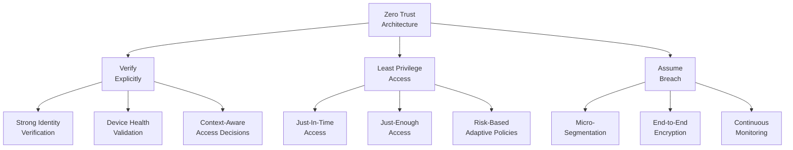
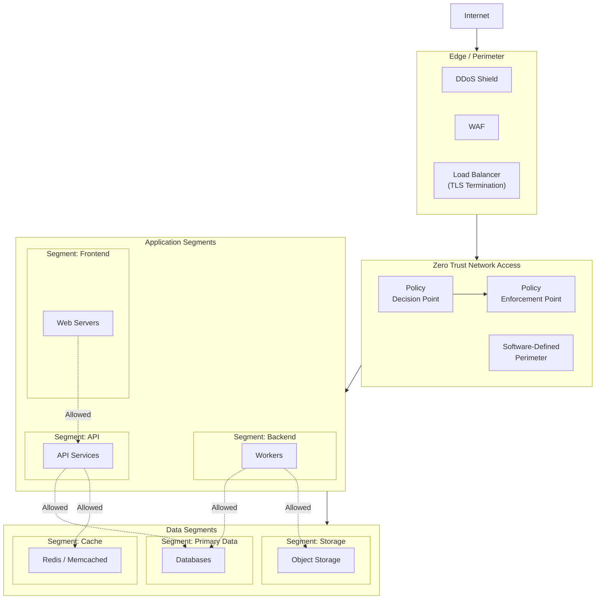
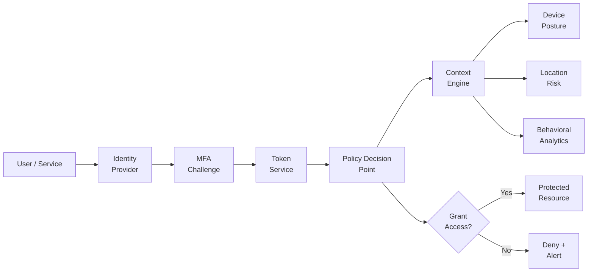
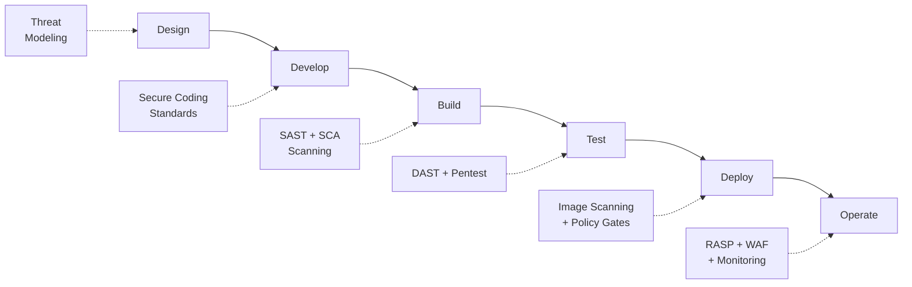
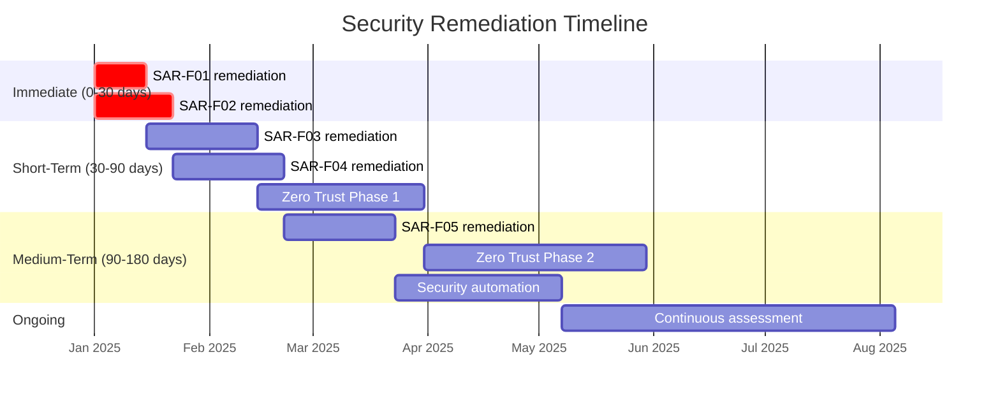

# Security Architecture Review

## Document Control

| Field              | Value                        |
| ------------------ | ---------------------------- |
| **Document ID**    | SAR-001                      |
| **Version**        | 1.0                          |
| **Classification** | Confidential                 |
| **Author**         | `[Author Name]`              |
| **Reviewer**       | `[Security Architect]`       |
| **Approver**       | `[CISO / Approver Name]`     |
| **Created**        | `YYYY-MM-DD`                 |
| **Last Updated**   | `YYYY-MM-DD`                 |
| **Next Review**    | `YYYY-MM-DD`                 |
| **Status**         | Draft / In Review / Approved |

---

## Executive Summary

This document provides a comprehensive security architecture review of `[System/Application Name]`, evaluating its alignment with Zero Trust principles, defense-in-depth strategies, and industry security frameworks. The review covers identity management, network security, data protection, and operational security controls.

---

## Zero Trust Architecture Overview

### Zero Trust Principles

### Zero Trust Maturity Assessment

| Pillar                     | Current Level                    | Target Level | Gap     | Priority  |
| -------------------------- | -------------------------------- | ------------ | ------- | --------- |
| Identity                   | `[Traditional/Advanced/Optimal]` | `[Target]`   | `[Gap]` | `[H/M/L]` |
| Devices                    | `[Traditional/Advanced/Optimal]` | `[Target]`   | `[Gap]` | `[H/M/L]` |
| Networks                   | `[Traditional/Advanced/Optimal]` | `[Target]`   | `[Gap]` | `[H/M/L]` |
| Applications               | `[Traditional/Advanced/Optimal]` | `[Target]`   | `[Gap]` | `[H/M/L]` |
| Data                       | `[Traditional/Advanced/Optimal]` | `[Target]`   | `[Gap]` | `[H/M/L]` |
| Visibility & Analytics     | `[Traditional/Advanced/Optimal]` | `[Target]`   | `[Gap]` | `[H/M/L]` |
| Automation & Orchestration | `[Traditional/Advanced/Optimal]` | `[Target]`   | `[Gap]` | `[H/M/L]` |

---

## Security Architecture Diagram

### Defense-in-Depth Layers

```mermaid
flowchart TB
    accTitle: Defense-in-Depth Security Architecture
    accDescr: Layered security controls from perimeter to data protection

    subgraph L1["Layer 1: Perimeter Security"]
        direction LR
        DNS["DNS<br/>Filtering"]
        DDOS["DDoS<br/>Protection"]
        WAF["Web Application<br/>Firewall"]
        CDN["CDN with<br/>Edge Security"]
    end

    subgraph L2["Layer 2: Network Security"]
        direction LR
        FW["Network<br/>Firewall"]
        SEG["Micro-<br/>Segmentation"]
        VPN["VPN / Zero Trust<br/>Network Access"]
        IDS["IDS / IPS"]
    end

    subgraph L3["Layer 3: Identity & Access"]
        direction LR
        IDP["Identity<br/>Provider"]
        MFA["Multi-Factor<br/>Authentication"]
        PAM["Privileged Access<br/>Management"]
        RBAC["Role-Based<br/>Access Control"]
    end

    subgraph L4["Layer 4: Application Security"]
        direction LR
        SAST["Static Analysis<br/>(SAST)"]
        DAST["Dynamic Analysis<br/>(DAST)"]
        SCA["Software Composition<br/>Analysis"]
        RASP["Runtime App<br/>Self-Protection"]
    end

    subgraph L5["Layer 5: Data Security"]
        direction LR
        ENC["Encryption<br/>(Rest + Transit)"]
        DLP["Data Loss<br/>Prevention"]
        MASK["Data<br/>Masking"]
        KMS["Key<br/>Management"]
    end

    subgraph L6["Layer 6: Monitoring & Response"]
        direction LR
        SIEM["SIEM"]
        SOC["SOC<br/>Operations"]
        IR["Incident<br/>Response"]
        TI["Threat<br/>Intelligence"]
    end

    L1 --> L2 --> L3 --> L4 --> L5 --> L6
```

### Network Security Architecture

---

## Identity & Access Management

### Identity Architecture

### IAM Controls Assessment

| Control                      | Implementation | Status                          | Notes     |
| ---------------------------- | -------------- | ------------------------------- | --------- |
| Single Sign-On (SSO)         | `[Provider]`   | `[Implemented/Partial/Missing]` | `[Notes]` |
| Multi-Factor Authentication  | `[Method]`     | `[Implemented/Partial/Missing]` | `[Notes]` |
| Role-Based Access Control    | `[System]`     | `[Implemented/Partial/Missing]` | `[Notes]` |
| Privileged Access Management | `[Tool]`       | `[Implemented/Partial/Missing]` | `[Notes]` |
| Service Account Management   | `[Process]`    | `[Implemented/Partial/Missing]` | `[Notes]` |
| Access Reviews               | `[Frequency]`  | `[Implemented/Partial/Missing]` | `[Notes]` |
| Just-In-Time Access          | `[Mechanism]`  | `[Implemented/Partial/Missing]` | `[Notes]` |
| API Key Management           | `[Vault/KMS]`  | `[Implemented/Partial/Missing]` | `[Notes]` |

---

## Data Protection

### Encryption Standards

| Data State            | Method                           | Algorithm     | Key Length     | Key Management      |
| --------------------- | -------------------------------- | ------------- | -------------- | ------------------- |
| At Rest (Database)    | Transparent Data Encryption      | AES-256       | 256-bit        | `[KMS Provider]`    |
| At Rest (Storage)     | Server-Side Encryption           | AES-256       | 256-bit        | `[KMS Provider]`    |
| In Transit (External) | TLS                              | TLS 1.3       | 256-bit        | Certificate Manager |
| In Transit (Internal) | mTLS                             | TLS 1.3       | 256-bit        | Service Mesh CA     |
| In Use                | `[N/A / Confidential Computing]` | `[Algorithm]` | `[Key Length]` | `[Method]`          |
| Backups               | Encrypted snapshots              | AES-256       | 256-bit        | `[KMS Provider]`    |

### Data Classification Controls

| Classification | Access Control        | Encryption             | Logging    | Retention  |
| -------------- | --------------------- | ---------------------- | ---------- | ---------- |
| Public         | None required         | Optional               | Standard   | Per policy |
| Internal       | RBAC                  | Required in transit    | Standard   | Per policy |
| Confidential   | RBAC + approval       | Required everywhere    | Enhanced   | Per policy |
| Restricted     | RBAC + MFA + approval | Required + field-level | Full audit | Regulatory |

---

## Application Security

### Secure Development Lifecycle

### Security Controls by SDLC Phase

| Phase   | Control                   | Tool/Process    | Status     | Owner     |
| ------- | ------------------------- | --------------- | ---------- | --------- |
| Design  | Threat modeling           | `[Tool]`        | `[Status]` | `[Owner]` |
| Design  | Security requirements     | `[Process]`     | `[Status]` | `[Owner]` |
| Develop | Secure coding standards   | `[Standard]`    | `[Status]` | `[Owner]` |
| Develop | Pre-commit hooks          | `[Tool]`        | `[Status]` | `[Owner]` |
| Build   | SAST scanning             | `[Tool]`        | `[Status]` | `[Owner]` |
| Build   | SCA / dependency scanning | `[Tool]`        | `[Status]` | `[Owner]` |
| Build   | Container image scanning  | `[Tool]`        | `[Status]` | `[Owner]` |
| Test    | DAST scanning             | `[Tool]`        | `[Status]` | `[Owner]` |
| Test    | Penetration testing       | `[Vendor/Team]` | `[Status]` | `[Owner]` |
| Deploy  | Policy-as-code gates      | `[Tool]`        | `[Status]` | `[Owner]` |
| Deploy  | Secrets scanning          | `[Tool]`        | `[Status]` | `[Owner]` |
| Operate | Runtime protection (RASP) | `[Tool]`        | `[Status]` | `[Owner]` |
| Operate | Vulnerability management  | `[Tool]`        | `[Status]` | `[Owner]` |

---

## Security Monitoring & Operations

### Detection & Response Architecture

```mermaid
flowchart LR
    accTitle: Security Monitoring Architecture
    accDescr: Log collection, analysis, alerting, and response workflow

    subgraph Sources["Log Sources"]
        direction TB
        APP_LOG["Application<br/>Logs"]
        NET_LOG["Network<br/>Logs"]
        IAM_LOG["IAM<br/>Logs"]
        CLOUD_LOG["Cloud<br/>Audit Logs"]
        EP_LOG["Endpoint<br/>Logs"]
    end

    subgraph Collection["Collection & Processing"]
        AGG["Log<br/>Aggregator"]
        NORM["Normalize<br/>& Enrich"]
    end

    subgraph Analysis["Analysis"]
        SIEM2["SIEM<br/>Platform"]
        RULES["Detection<br/>Rules"]
        ML_DET["ML-Based<br/>Anomaly Detection"]
    end

    subgraph Response["Response"]
        ALERT2["Alert &<br/>Triage"]
        SOAR["SOAR<br/>Playbooks"]
        IR2["Incident<br/>Response"]
    end

    Sources --> Collection --> Analysis --> Response
```

### Monitoring Coverage

| Control                  | Covered            | Tool     | Alert SLA | Notes     |
| ------------------------ | ------------------ | -------- | --------- | --------- |
| Authentication events    | `[Yes/Partial/No]` | `[Tool]` | `[SLA]`   | `[Notes]` |
| Authorization failures   | `[Yes/Partial/No]` | `[Tool]` | `[SLA]`   | `[Notes]` |
| Data access patterns     | `[Yes/Partial/No]` | `[Tool]` | `[SLA]`   | `[Notes]` |
| Network anomalies        | `[Yes/Partial/No]` | `[Tool]` | `[SLA]`   | `[Notes]` |
| Configuration changes    | `[Yes/Partial/No]` | `[Tool]` | `[SLA]`   | `[Notes]` |
| Vulnerability detections | `[Yes/Partial/No]` | `[Tool]` | `[SLA]`   | `[Notes]` |
| Malware/threat detection | `[Yes/Partial/No]` | `[Tool]` | `[SLA]`   | `[Notes]` |
| Compliance violations    | `[Yes/Partial/No]` | `[Tool]` | `[SLA]`   | `[Notes]` |

---

## Compliance Mapping

### Framework Alignment

| Framework     | Scope                | Coverage | Last Audit   | Next Audit   | Status     |
| ------------- | -------------------- | -------- | ------------ | ------------ | ---------- |
| SOC 2 Type II | Full platform        | `___`%   | `YYYY-MM-DD` | `YYYY-MM-DD` | `[Status]` |
| ISO 27001     | Information security | `___`%   | `YYYY-MM-DD` | `YYYY-MM-DD` | `[Status]` |
| NIST CSF      | Cybersecurity        | `___`%   | `YYYY-MM-DD` | `YYYY-MM-DD` | `[Status]` |
| PCI DSS       | Payment processing   | `___`%   | `YYYY-MM-DD` | `YYYY-MM-DD` | `[Status]` |
| HIPAA         | Health data          | `___`%   | `YYYY-MM-DD` | `YYYY-MM-DD` | `[Status]` |

---

## Findings & Recommendations

### Findings Summary

| ID      | Finding     | Severity                     | Category     | Recommendation     | Priority     |
| ------- | ----------- | ---------------------------- | ------------ | ------------------ | ------------ |
| SAR-F01 | `[Finding]` | `[Critical/High/Medium/Low]` | `[Category]` | `[Recommendation]` | `[P1/P2/P3]` |
| SAR-F02 | `[Finding]` | `[Critical/High/Medium/Low]` | `[Category]` | `[Recommendation]` | `[P1/P2/P3]` |
| SAR-F03 | `[Finding]` | `[Critical/High/Medium/Low]` | `[Category]` | `[Recommendation]` | `[P1/P2/P3]` |
| SAR-F04 | `[Finding]` | `[Critical/High/Medium/Low]` | `[Category]` | `[Recommendation]` | `[P1/P2/P3]` |
| SAR-F05 | `[Finding]` | `[Critical/High/Medium/Low]` | `[Category]` | `[Recommendation]` | `[P1/P2/P3]` |

### Remediation Roadmap

---

## Approval & Sign-Off

| Role               | Name              | Signature         | Date         |
| ------------------ | ----------------- | ----------------- | ------------ |
| Security Architect | `_______________` | `_______________` | `YYYY-MM-DD` |
| CISO               | `_______________` | `_______________` | `YYYY-MM-DD` |
| CTO                | `_______________` | `_______________` | `YYYY-MM-DD` |
| Compliance Officer | `_______________` | `_______________` | `YYYY-MM-DD` |

---

## Revision History

| Version | Date         | Author     | Changes                         |
| ------- | ------------ | ---------- | ------------------------------- |
| 0.1     | `YYYY-MM-DD` | `[Author]` | Initial architecture review     |
| 0.2     | `YYYY-MM-DD` | `[Author]` | Added Zero Trust assessment     |
| 1.0     | `YYYY-MM-DD` | `[Author]` | Approved by security leadership |
