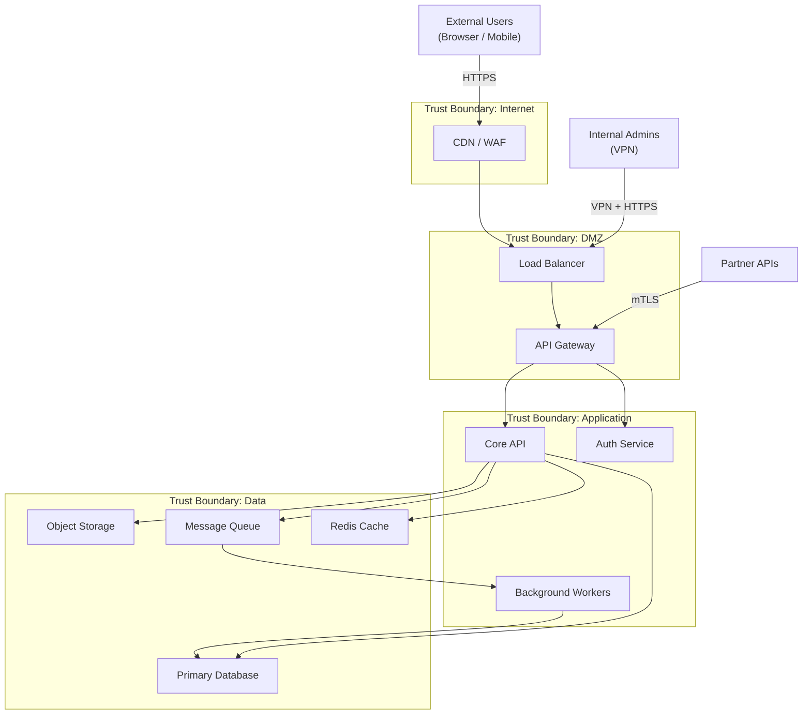
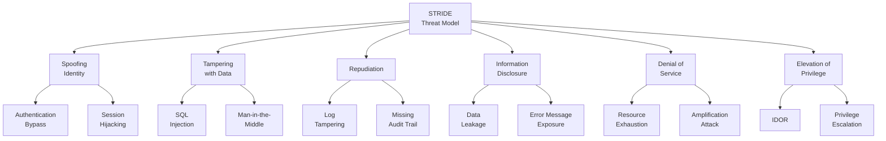
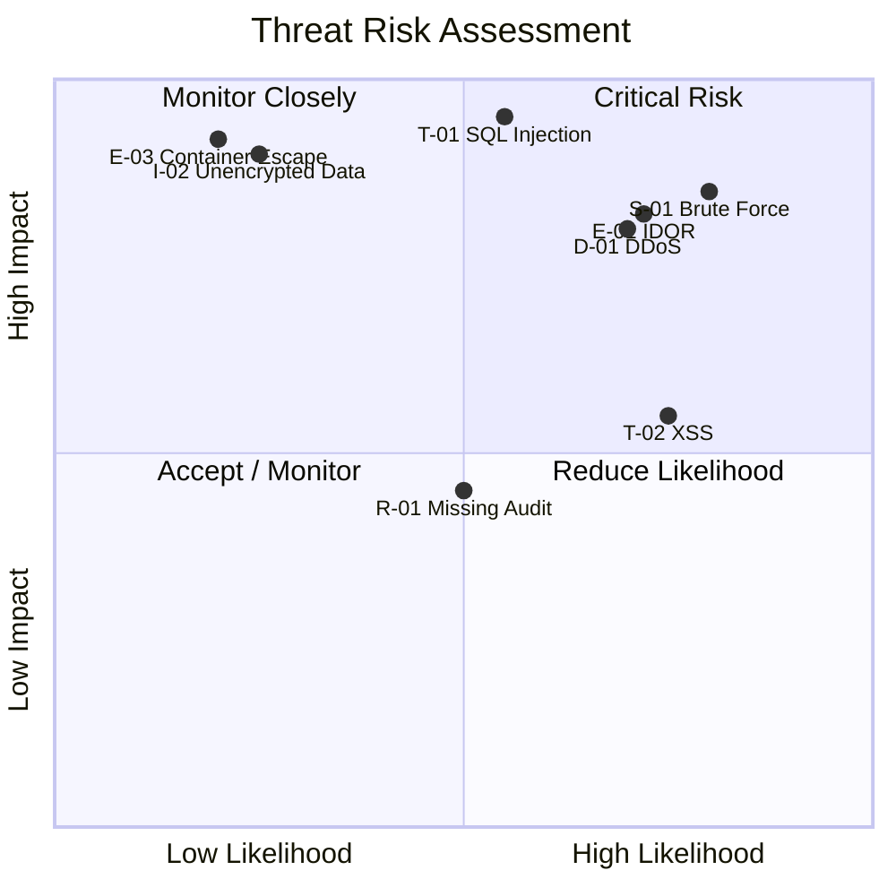
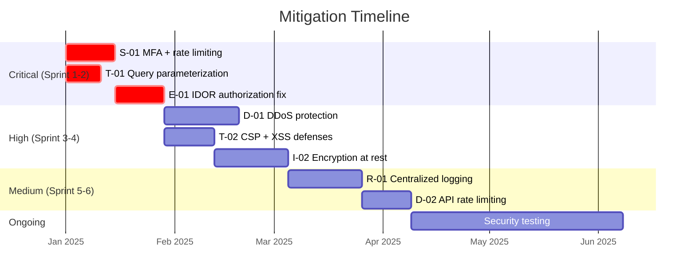
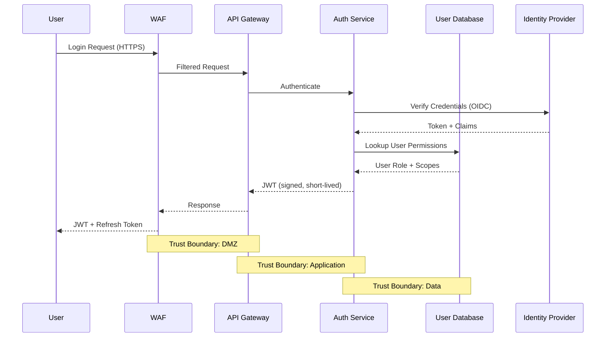

# Threat Model

## Document Control

| Field              | Value                        |
| ------------------ | ---------------------------- |
| **Document ID**    | TM-001                       |
| **Version**        | 1.0                          |
| **Classification** | Confidential                 |
| **Author**         | `[Author Name]`              |
| **Reviewer**       | `[Security Reviewer]`        |
| **Approver**       | `[Approver Name]`            |
| **Created**        | `YYYY-MM-DD`                 |
| **Last Updated**   | `YYYY-MM-DD`                 |
| **Next Review**    | `YYYY-MM-DD`                 |
| **Status**         | Draft / In Review / Approved |

---

## Executive Summary

This threat model documents the systematic analysis of security threats to `[System/Application Name]` using the STRIDE methodology. It identifies threat actors, attack surfaces, potential threats, and corresponding mitigations to reduce risk to an acceptable level.

---

## System Overview

### System Description

| Attribute                   | Details                                           |
| --------------------------- | ------------------------------------------------- |
| **System Name**             | `[System Name]`                                   |
| **System Type**             | `[Web App / API / Microservices / Mobile / IoT]`  |
| **Environment**             | `[Cloud / On-Prem / Hybrid]`                      |
| **Data Classification**     | `[Public / Internal / Confidential / Restricted]` |
| **User Base**               | `[Estimated users and roles]`                     |
| **Compliance Requirements** | `[SOC 2 / HIPAA / PCI DSS / GDPR / etc.]`         |

### System Architecture

---

## Threat Actors

| Actor                   | Motivation                    | Capability  | Likelihood | Target                 |
| ----------------------- | ----------------------------- | ----------- | ---------- | ---------------------- |
| External Attacker       | Financial gain                | Medium-High | High       | User data, credentials |
| Insider Threat          | Disgruntlement, espionage     | High        | Medium     | Sensitive data, IP     |
| Automated Bot           | Credential stuffing, scraping | Medium      | High       | Auth endpoints, APIs   |
| Nation-State APT        | Espionage, disruption         | Very High   | Low        | Infrastructure, data   |
| Competitor              | Business intelligence         | Low-Medium  | Low        | Proprietary data       |
| Disgruntled Ex-Employee | Revenge, sabotage             | Medium      | Medium     | Systems, data          |

---

## Attack Surface Analysis

### Entry Points

| Entry Point     | Protocol    | Authentication | Exposed Data     | Risk Level |
| --------------- | ----------- | -------------- | ---------------- | ---------- |
| Web Application | HTTPS       | Session/JWT    | User interface   | High       |
| REST API        | HTTPS       | API Key + JWT  | Business data    | High       |
| Admin Panel     | HTTPS + VPN | MFA + RBAC     | System config    | Critical   |
| WebSocket       | WSS         | JWT            | Real-time events | Medium     |
| File Upload     | HTTPS       | JWT            | User files       | High       |
| Database Port   | TCP         | Certificate    | All data         | Critical   |
| SSH Access      | SSH         | Key-based      | System access    | Critical   |

---

## STRIDE Analysis

### STRIDE Threat Matrix

### Detailed STRIDE Findings

#### S - Spoofing

| ID   | Threat                      | Component     | Likelihood | Impact   | Risk     | Mitigation                              | Status     |
| ---- | --------------------------- | ------------- | ---------- | -------- | -------- | --------------------------------------- | ---------- |
| S-01 | Credential brute force      | Auth endpoint | High       | High     | Critical | Rate limiting, account lockout, MFA     | `[Status]` |
| S-02 | JWT token forgery           | API Gateway   | Low        | Critical | High     | Strong signing key, short TTL, rotation | `[Status]` |
| S-03 | Session hijacking           | Web app       | Medium     | High     | High     | Secure cookies, SameSite, HTTPS-only    | `[Status]` |
| S-04 | OAuth redirect manipulation | Auth flow     | Medium     | High     | High     | Strict redirect URI validation          | `[Status]` |

#### T - Tampering

| ID   | Threat                  | Component        | Likelihood | Impact   | Risk     | Mitigation                                 | Status     |
| ---- | ----------------------- | ---------------- | ---------- | -------- | -------- | ------------------------------------------ | ---------- |
| T-01 | SQL injection           | Database queries | Medium     | Critical | Critical | Parameterized queries, ORM, WAF rules      | `[Status]` |
| T-02 | XSS (stored/reflected)  | Web application  | High       | Medium   | High     | CSP headers, output encoding, sanitization | `[Status]` |
| T-03 | API parameter tampering | REST API         | High       | High     | Critical | Server-side validation, schema enforcement | `[Status]` |
| T-04 | File upload malware     | File processing  | Medium     | High     | High     | File scanning, type validation, sandboxing | `[Status]` |

#### R - Repudiation

| ID   | Threat                | Component          | Likelihood | Impact   | Risk   | Mitigation                               | Status     |
| ---- | --------------------- | ------------------ | ---------- | -------- | ------ | ---------------------------------------- | ---------- |
| R-01 | Missing audit trail   | All services       | Medium     | Medium   | Medium | Centralized logging, immutable audit log | `[Status]` |
| R-02 | Log tampering         | Log infrastructure | Low        | High     | Medium | Append-only logging, log signing, SIEM   | `[Status]` |
| R-03 | Unsigned transactions | Payment flow       | Low        | Critical | High   | Digital signatures, blockchain receipt   | `[Status]` |

#### I - Information Disclosure

| ID   | Threat                           | Component          | Likelihood | Impact   | Risk   | Mitigation                                | Status     |
| ---- | -------------------------------- | ------------------ | ---------- | -------- | ------ | ----------------------------------------- | ---------- |
| I-01 | Sensitive data in error messages | API responses      | High       | Medium   | High   | Custom error handlers, no stack traces    | `[Status]` |
| I-02 | Unencrypted data at rest         | Database, S3       | Low        | Critical | High   | AES-256 encryption, KMS key management    | `[Status]` |
| I-03 | PII in application logs          | Log infrastructure | Medium     | High     | High   | Log scrubbing, PII detection, masking     | `[Status]` |
| I-04 | API enumeration                  | REST API           | Medium     | Medium   | Medium | Rate limiting, consistent error responses | `[Status]` |

#### D - Denial of Service

| ID   | Threat                     | Component     | Likelihood | Impact | Risk     | Mitigation                                | Status     |
| ---- | -------------------------- | ------------- | ---------- | ------ | -------- | ----------------------------------------- | ---------- |
| D-01 | Volumetric DDoS            | Network edge  | High       | High   | Critical | CDN, WAF, DDoS protection, auto-scaling   | `[Status]` |
| D-02 | Application-layer DoS      | API endpoints | Medium     | High   | High     | Rate limiting, request throttling, queue  | `[Status]` |
| D-03 | Resource exhaustion        | Compute, DB   | Medium     | High   | High     | Resource limits, circuit breakers, alerts | `[Status]` |
| D-04 | Dependency failure cascade | Microservices | Medium     | Medium | Medium   | Bulkhead pattern, timeouts, fallbacks     | `[Status]` |

#### E - Elevation of Privilege

| ID   | Threat                                     | Component   | Likelihood | Impact   | Risk     | Mitigation                                | Status     |
| ---- | ------------------------------------------ | ----------- | ---------- | -------- | -------- | ----------------------------------------- | ---------- |
| E-01 | IDOR (insecure direct object reference)    | API         | High       | High     | Critical | Authorization checks, UUID, RBAC          | `[Status]` |
| E-02 | Privilege escalation via role manipulation | Admin panel | Low        | Critical | High     | Server-side role enforcement, audit       | `[Status]` |
| E-03 | Container escape                           | Kubernetes  | Low        | Critical | High     | Pod security policies, non-root, seccomp  | `[Status]` |
| E-04 | SSRF (server-side request forgery)         | API         | Medium     | High     | High     | URL allowlisting, metadata endpoint block | `[Status]` |

---

## Risk Assessment Summary

### Risk Heat Map

### Risk Summary by Category

| Risk Level   | Count | Threats             |
| ------------ | ----- | ------------------- |
| **Critical** | `___` | `[List threat IDs]` |
| **High**     | `___` | `[List threat IDs]` |
| **Medium**   | `___` | `[List threat IDs]` |
| **Low**      | `___` | `[List threat IDs]` |

---

## Mitigation Priorities

### Remediation Roadmap

---

## Data Flow Diagrams

### Authentication Flow

---

## Assumptions & Constraints

### Assumptions

1. Cloud provider (AWS/Azure/GCP) infrastructure security is maintained by the provider
2. TLS 1.2+ is enforced on all external communications
3. Internal network is not assumed to be trusted (zero-trust model)
4. All third-party dependencies are regularly scanned for vulnerabilities

### Out of Scope

| Item                      | Reason                                         |
| ------------------------- | ---------------------------------------------- |
| Physical security         | Managed by cloud provider                      |
| Social engineering        | Covered by separate security awareness program |
| Supply chain attacks      | Covered by separate vendor risk assessment     |
| Insider threat (detailed) | Covered by separate insider threat program     |

---

## Approval & Sign-Off

| Role                  | Name              | Signature         | Date         |
| --------------------- | ----------------- | ----------------- | ------------ |
| Security Lead         | `_______________` | `_______________` | `YYYY-MM-DD` |
| Application Architect | `_______________` | `_______________` | `YYYY-MM-DD` |
| Engineering Lead      | `_______________` | `_______________` | `YYYY-MM-DD` |
| CISO                  | `_______________` | `_______________` | `YYYY-MM-DD` |

---

## Revision History

| Version | Date         | Author     | Changes                   |
| ------- | ------------ | ---------- | ------------------------- |
| 0.1     | `YYYY-MM-DD` | `[Author]` | Initial threat model      |
| 0.2     | `YYYY-MM-DD` | `[Author]` | Completed STRIDE analysis |
| 1.0     | `YYYY-MM-DD` | `[Author]` | Approved by security team |
