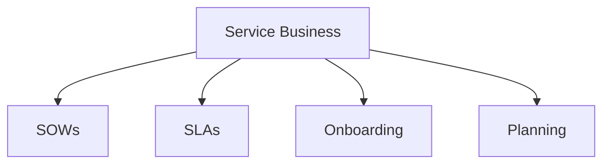

# Service Business

Service business SOWs, SLAs, and client management templates.

## Templates

| Template                                                 | Description         |
| -------------------------------------------------------- | ------------------- |
| [statement_of_work.md](statement_of_work.md)             | SOWs                |
| [service_level_agreement.md](service_level_agreement.md) | SLAs                |
| [client_onboarding.md](client_onboarding.md)             | Client onboarding   |
| [capacity_planning.md](capacity_planning.md)             | Capacity planning   |
| [resource_allocation.md](resource_allocation.md)         | Resource allocation |

## Structure

See [Parent](../SKILL.md) for all categories.
