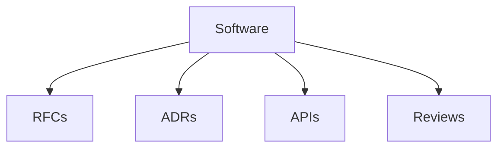

# Software

Software development, RFCs, and ADR templates.

## Templates

| Template                           | Description            |
| ---------------------------------- | ---------------------- |
| [rfc.md](rfc.md)                   | RFCs                   |
| [adr.md](adr.md)                   | Architecture decisions |
| [api_spec.md](api_spec.md)         | API specifications     |
| [pull_request.md](pull_request.md) | PR templates           |
| [code_review.md](code_review.md)   | Code reviews           |

## Structure

See [Parent](../SKILL.md) for all categories.
