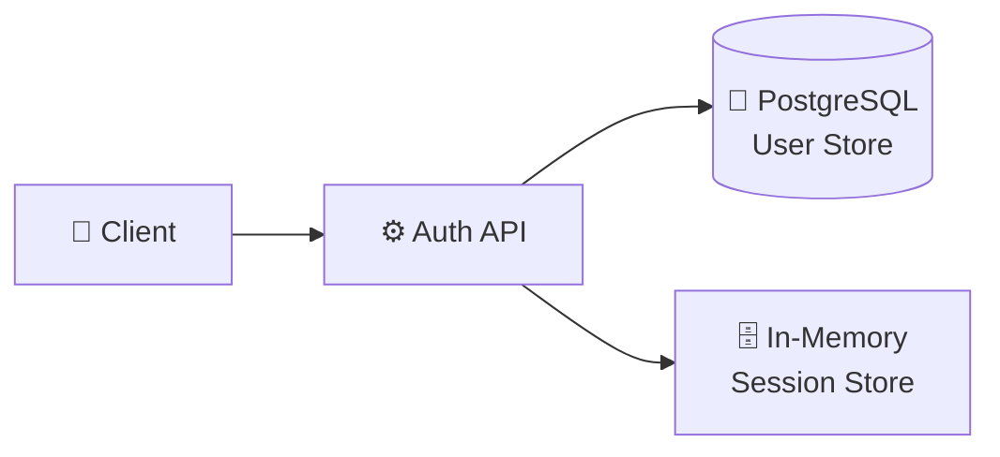
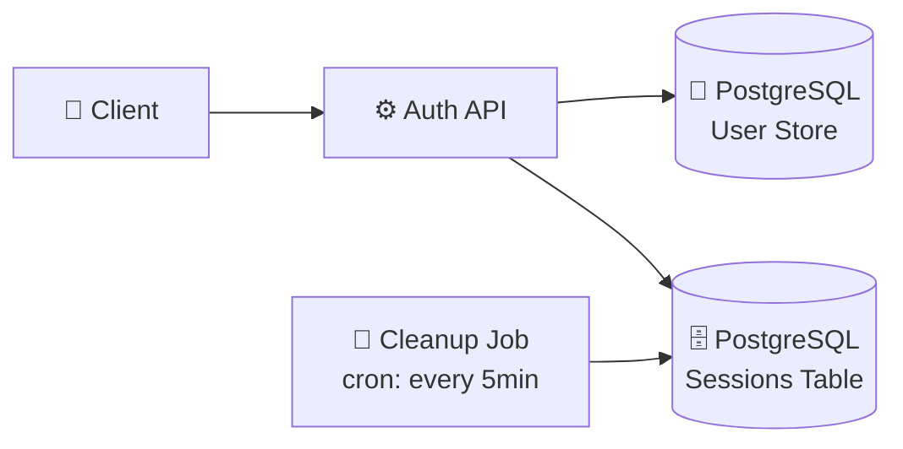

# ADR-[NNN]: [Decision Title — Verb + Noun, e.g., "Use PostgreSQL for Primary Storage"]

> [!NOTE]
> ADRs capture the _why_ behind architectural decisions. They are written at decision time, not after the fact. A good ADR should allow a new team member to understand the decision without needing to ask anyone.

| Field               | Value                                                      |
| ------------------- | ---------------------------------------------------------- |
| **Status**          | Proposed / Accepted / Deprecated / Superseded by ADR-[NNN] |
| **Date**            | [YYYY-MM-DD]                                               |
| **Decision makers** | [Names or roles]                                           |
| **Consulted**       | [Who provided input]                                       |
| **Informed**        | [Who needs to know]                                        |

---

## 📋 Context

> [!IMPORTANT]
> The context section must describe the situation _as it existed at the time of the decision_. Do not revise it to reflect what you know now. Future readers need to understand the constraints that existed when the decision was made.

### Situation

[What is happening that requires a decision? Describe the technical or organizational forces at play. Include relevant constraints: team size, timeline, compliance requirements, existing system state.]

**Example:** _We are building a new user authentication service that will handle 50,000 concurrent sessions at peak. The service must be GDPR-compliant with data residency in the EU. Our team of 4 engineers has strong PostgreSQL experience but no production Redis experience. We need to choose a session storage backend._

### Current architecture

### Forces

- **[Force 1]:** [e.g., "We need sub-100ms p99 latency for session validation — called on every API request"]
- **[Force 2]:** [e.g., "Team has no operational experience with Redis in production"]
- **[Force 3]:** [e.g., "Must be GDPR-compliant with data residency in EU-West-1"]
- **[Force 4]:** [e.g., "Sessions must survive service restarts — in-memory is not acceptable"]

---

## 🎯 Decision

> [!TIP]
> State the decision in the first sentence. Reviewers should not have to read the entire ADR to find out what was decided. The rationale follows the decision, not the other way around.

**We will use PostgreSQL with a dedicated `sessions` table for session storage, using a partial index on `expires_at` for efficient cleanup.**

We chose PostgreSQL over Redis because our team's operational expertise eliminates a significant risk factor, and our p99 latency target of 100ms is achievable with proper indexing. The GDPR data residency requirement is already satisfied by our existing PostgreSQL deployment in EU-West-1. We accept the tradeoff of slightly higher latency compared to Redis in exchange for operational simplicity and team confidence.

### Options considered

| Option                  | Pros                                    | Cons                                      | Rejected because                             |
| ----------------------- | --------------------------------------- | ----------------------------------------- | -------------------------------------------- |
| **PostgreSQL — chosen** | Team expertise; GDPR-compliant; durable | Higher latency than Redis (~5ms vs ~1ms)  | — (chosen)                                   |
| **Redis**               | Sub-millisecond latency; purpose-built  | No team expertise; separate GDPR concern  | Operational risk outweighs latency benefit   |
| **DynamoDB**            | Managed; auto-scaling                   | Vendor lock-in; EU data residency complex | Adds AWS dependency; GDPR compliance unclear |
| **In-memory (current)** | Zero latency; zero ops                  | Lost on restart; no horizontal scaling    | Does not meet durability requirement         |

---

## ⚡ Consequences

> [!WARNING]
> Document negative consequences honestly. An ADR that only lists benefits is not trustworthy. Future engineers need to know what tradeoffs were accepted so they can make informed decisions about whether to revisit this ADR.

### Positive

- Team can operate and debug session storage using existing PostgreSQL skills
- GDPR data residency is automatically satisfied — no additional configuration
- Session data is durable across service restarts and deployments
- Unified backup and monitoring with existing PostgreSQL infrastructure

### Negative

- Session validation adds ~5ms database round-trip vs. ~1ms for Redis — acceptable for our 100ms SLA but leaves less headroom
- PostgreSQL session table will grow; requires a cleanup job for expired sessions
- At very high scale (>500k concurrent sessions), we may need to revisit this decision

### Risks

| Risk                              | Likelihood | Impact | Mitigation                                                 |
| --------------------------------- | ---------- | ------ | ---------------------------------------------------------- |
| PostgreSQL becomes a bottleneck   | Low        | High   | Monitor session query latency; add read replica if needed  |
| Session table grows unbounded     | Medium     | Medium | Implement cleanup job; add `expires_at` index from day one |
| Team outgrows PostgreSQL at scale | Low        | Medium | Review trigger: if concurrent sessions exceed 200k         |

### Future architecture

---

## 📋 Implementation Notes

- **Migration path:** Add `sessions` table to existing PostgreSQL instance. No data migration required — existing in-memory sessions will expire naturally.
- **Rollback plan:** If session latency exceeds 50ms p99, fall back to in-memory sessions (acceptable for short-term) while evaluating Redis migration.
- **Review trigger:** Revisit this ADR if: (1) p99 session validation latency exceeds 50ms, (2) concurrent sessions exceed 200,000, or (3) team hires engineers with Redis production experience.

---

## 🔗 References

- [Session Storage Requirements](../rfcs/RFC-012-auth-service.md)
- [PostgreSQL Performance Benchmarks](../../docs/postgres-benchmarks.md)
- [GDPR Data Residency Policy](../../compliance/gdpr-data-residency.md)
- [Fowler — Patterns of Enterprise Application Architecture](https://martinfowler.com/books/eaa.html)

---

_Last updated: [Date] — ADRs are immutable after acceptance. Append a new ADR to supersede._

---

## See Also

- [Request for Comments (RFC)](./rfc.md) — For larger, cross-team technical proposals requiring broader consensus
- [API Specification](./api_spec.md) — For REST API design decisions that may follow from ADRs
- [Feature Specification](./../product/feature_spec.md) — For implementing features based on architectural decisions
- [Code Review](./code_review.md) — For reviewing code that implements ADR decisions
- [Security Review](./security_review.md) — For security-focused architectural decisions