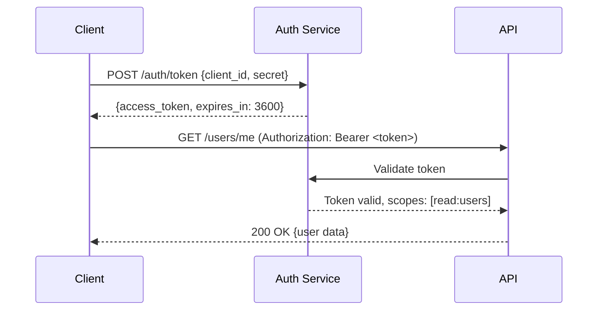

# [Service Name] API — v[N.N]

> [!NOTE]
> This spec follows the OpenAPI 3.0 conventions. All endpoints are versioned under `/v1`. Breaking changes require a new major version. Non-breaking additions (new optional fields, new endpoints) may be added without a version bump.

| Field            | Value                        |
| ---------------- | ---------------------------- |
| **Base URL**     | `https://api.example.com/v1` |
| **Version**      | `v1`                         |
| **Auth**         | Bearer token (JWT)           |
| **Content-Type** | `application/json`           |
| **Status**       | Draft / Stable / Deprecated  |
| **Owner**        | [Team name]                  |

> [!TIP]
> Use the [Postman collection](./postman/[service]-api.json) or [OpenAPI spec](./openapi/[service]-v1.yaml) to explore and test endpoints interactively. The spec is the source of truth; this document is the human-readable companion.

---

## 🔐 Authentication



### Token request

```http
POST /auth/token
Content-Type: application/json

{
  "client_id": "app_prod_abc123",
  "client_secret": "sk_prod_...",
  "grant_type": "client_credentials"
}
```

**Response:**

```json
{
  "access_token": "eyJhbGciOiJSUzI1NiIsInR5cCI6IkpXVCJ9...",
  "token_type": "Bearer",
  "expires_in": 3600,
  "scope": "read:users write:orders"
}
```

**Rate limits:** 100 requests/minute per token. Headers returned on every response:

- `X-RateLimit-Limit: 100`
- `X-RateLimit-Remaining: 87`
- `X-RateLimit-Reset: 1704067200`

> [!WARNING]
> Never log or expose access tokens. Tokens are valid for 1 hour. Implement token refresh before expiry to avoid request failures. Store tokens in secure storage (not localStorage in browsers).

---

## 📡 Endpoints

### Users

#### `GET /users`

List users with optional filtering and pagination.

**Query parameters:**

| Parameter | Type    | Required | Description                                       |
| --------- | ------- | -------- | ------------------------------------------------- |
| `limit`   | integer | No       | Max results (default: 20, max: 100)               |
| `offset`  | integer | No       | Pagination offset (default: 0)                    |
| `status`  | string  | No       | Filter by status: `active`, `inactive`, `pending` |
| `role`    | string  | No       | Filter by role: `admin`, `member`, `viewer`       |
| `q`       | string  | No       | Full-text search on name and email                |

**Response `200 OK`:**

```json
{
  "data": [
    {
      "id": "usr_01HXYZ123ABC",
      "email": "alice@example.com",
      "name": "Alice Chen",
      "role": "admin",
      "status": "active",
      "created_at": "2024-01-15T09:30:00Z",
      "updated_at": "2024-03-20T14:22:00Z"
    }
  ],
  "meta": {
    "total": 142,
    "limit": 20,
    "offset": 0,
    "has_more": true
  }
}
```

---

#### `POST /users`

Create a new user. Requires `write:users` scope.

**Request body:**

```json
{
  "email": "bob@example.com",
  "name": "Bob Smith",
  "role": "member",
  "send_invite": true
}
```

| Field         | Type    | Required | Validation                              |
| ------------- | ------- | -------- | --------------------------------------- |
| `email`       | string  | ✅       | Valid email format; unique in workspace |
| `name`        | string  | ✅       | 1–100 characters                        |
| `role`        | string  | No       | `admin`, `member` (default), `viewer`   |
| `send_invite` | boolean | No       | Send welcome email (default: `true`)    |

**Response `201 Created`:**

```json
{
  "id": "usr_01HXYZ456DEF",
  "email": "bob@example.com",
  "name": "Bob Smith",
  "role": "member",
  "status": "pending",
  "created_at": "2024-03-21T10:00:00Z",
  "updated_at": "2024-03-21T10:00:00Z"
}
```

---

#### `GET /users/{id}`

Retrieve a single user by ID.

**Path parameters:** `id` — User ID (format: `usr_[ULID]`)

**Response `200 OK`:** Same schema as list item above, plus:

```json
{
  "id": "usr_01HXYZ123ABC",
  "email": "alice@example.com",
  "name": "Alice Chen",
  "role": "admin",
  "status": "active",
  "last_login_at": "2024-03-20T08:15:00Z",
  "created_at": "2024-01-15T09:30:00Z",
  "updated_at": "2024-03-20T14:22:00Z"
}
```

---

#### `PATCH /users/{id}`

Partial update of a user. Only provided fields are updated. Requires `write:users` scope.

**Request body:** Any subset of POST fields except `email`.

```json
{
  "name": "Alice Chen-Wong",
  "role": "viewer"
}
```

**Response `200 OK`:** Updated user object.

---

#### `DELETE /users/{id}`

Deactivate a user. Soft-delete — sets `status: "inactive"` and `deleted_at`. Data is retained for 90 days.

**Response `204 No Content`:** Empty body.

> [!IMPORTANT]
> Deletion is soft — the user record is retained for 90 days for audit purposes. To permanently delete user data (GDPR right to erasure), use `DELETE /users/{id}/purge` which requires the `admin:purge` scope and triggers a 24-hour confirmation window.

---

### Orders

#### `GET /orders`

List orders with filtering.

**Query parameters:**

| Parameter   | Type   | Required | Description                                                  |
| ----------- | ------ | -------- | ------------------------------------------------------------ |
| `user_id`   | string | No       | Filter by user                                               |
| `status`    | string | No       | `pending`, `processing`, `shipped`, `delivered`, `cancelled` |
| `from_date` | string | No       | ISO-8601 date — orders created on or after                   |
| `to_date`   | string | No       | ISO-8601 date — orders created on or before                  |

**Response `200 OK`:**

```json
{
  "data": [
    {
      "id": "ord_01HXYZ789GHI",
      "user_id": "usr_01HXYZ123ABC",
      "status": "shipped",
      "total_cents": 4999,
      "currency": "USD",
      "items": [
        {
          "sku": "WIDGET-PRO-L",
          "quantity": 2,
          "unit_price_cents": 2499
        }
      ],
      "created_at": "2024-03-19T14:00:00Z"
    }
  ],
  "meta": {
    "total": 38,
    "limit": 20,
    "offset": 0
  }
}
```

---

## ⚠️ Error Responses

> [!IMPORTANT]
> All errors follow a consistent envelope. Always check the `error.code` field for programmatic error handling — do not parse `error.message` as it may change between versions.

All errors follow a consistent envelope:

```json
{
  "error": {
    "code": "VALIDATION_ERROR",
    "message": "The request body contains invalid fields.",
    "details": [
      {
        "field": "email",
        "issue": "Invalid email format",
        "value": "not-an-email"
      },
      {
        "field": "role",
        "issue": "Must be one of: admin, member, viewer",
        "value": "superuser"
      }
    ],
    "request_id": "req_01HXYZ000AAA",
    "docs_url": "https://docs.example.com/errors/VALIDATION_ERROR"
  }
}
```

| HTTP Status | Code               | When                                                  |
| ----------- | ------------------ | ----------------------------------------------------- |
| `400`       | `VALIDATION_ERROR` | Request body fails validation                         |
| `401`       | `UNAUTHORIZED`     | Missing or invalid token                              |
| `403`       | `FORBIDDEN`        | Token lacks required scope                            |
| `404`       | `NOT_FOUND`        | Resource does not exist                               |
| `409`       | `CONFLICT`         | Duplicate resource (e.g., email already used)         |
| `422`       | `UNPROCESSABLE`    | Semantically invalid (e.g., invalid state transition) |
| `429`       | `RATE_LIMITED`     | Too many requests — retry after `Retry-After` header  |
| `500`       | `INTERNAL_ERROR`   | Unexpected server error — contact support             |

---

## 🔄 Webhooks

Subscribe to real-time events via webhooks. Configure endpoints in the dashboard.

**Event types:**

| Event                  | Trigger                      |
| ---------------------- | ---------------------------- |
| `user.created`         | New user created             |
| `user.updated`         | User profile or role changed |
| `user.deleted`         | User deactivated             |
| `order.status_changed` | Order status transitions     |

**Webhook payload:**

```json
{
  "id": "evt_01HXYZ111BBB",
  "type": "user.created",
  "created_at": "2024-03-21T10:00:00Z",
  "data": {
    "object": {
      /* full user object */
    }
  }
}
```

**Signature verification:** Each webhook includes `X-Signature-256: sha256=<hmac>`. Verify using your webhook secret to prevent spoofing.

---

## 📋 Changelog

| Version | Date       | Changes                                    |
| ------- | ---------- | ------------------------------------------ |
| `v1.1`  | 2024-03-01 | Added `q` search parameter to `GET /users` |
| `v1.0`  | 2024-01-15 | Initial release                            |

---

_Last updated: [Date]_


---

## See Also

- [Request for Comments (RFC)](./rfc.md) — For proposing API changes requiring team consensus
- [Architecture Decision Record (ADR)](./adr.md) — For documenting API architecture decisions
- [Feature Specification](./../product/feature_spec.md) — For implementing API features end-to-end
- [TDD Specification](./tdd_spec.md) — For test-driven API development
- [Code Review](./code_review.md) — For reviewing API implementations