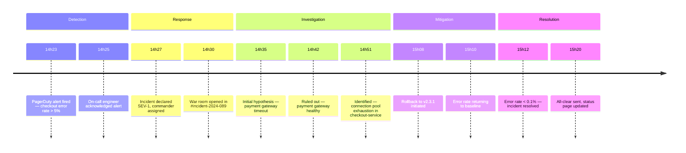

# INC-[NUMBER]: [Short Description — e.g., "Checkout Service 503s — Payment Processing Unavailable"]

> [!NOTE]
> This document is the authoritative record of the incident. It should be created within 30 minutes of incident declaration and updated in real time. The post-mortem (linked below) is a separate document written after resolution.

| Field                  | Value                                            |
| ---------------------- | ------------------------------------------------ |
| **Severity**           | SEV-1 (Critical) / SEV-2 (Major) / SEV-3 (Minor) |
| **Status**             | Active / Mitigated / Resolved                    |
| **Incident commander** | [Name]                                           |
| **Started**            | [YYYY-MM-DD HH:MM UTC]                           |
| **Mitigated**          | [YYYY-MM-DD HH:MM UTC]                           |
| **Resolved**           | [YYYY-MM-DD HH:MM UTC]                           |
| **Duration**           | [N hours N minutes]                              |
| **Post-mortem**        | [Link to post_mortem.md when complete]           |

---

## 📊 Impact Summary

> [!IMPORTANT]
> Fill in the impact summary as soon as possible — even rough estimates. Stakeholders need this information to make decisions about customer communication and escalation. Update with precise numbers once the incident is resolved.

| Dimension             | Value                                             |
| --------------------- | ------------------------------------------------- |
| **Users affected**    | [Count or percentage]                             |
| **Services affected** | [List of services]                                |
| **Error rate**        | [e.g., "100% of /checkout requests returned 503"] |
| **Revenue impact**    | [Estimated $N or N transactions lost]             |
| **SLA breach**        | Yes / No — [SLA target vs actual]                 |

**Example impact:**
| Dimension | Value |
| --------------------- | -------------------------------------------------------- |
| **Users affected** | ~8,400 users (all checkout attempts during window) |
| **Services affected** | checkout-service, payment-gateway-proxy |
| **Error rate** | 100% of POST /checkout requests returned 503 for 47 min |
| **Revenue impact** | ~$127,000 in lost transactions (estimated) |
| **SLA breach** | Yes — SLA: 99.9% uptime; actual: 96.7% for the hour |

---

## ⏱️ Timeline

> [!TIP]
> Record events as they happen, not after. Timestamps should be in UTC. Include the actor for each event — this helps the post-mortem identify where communication broke down.



| Time (UTC) | Event                                             | Actor      |
| ---------- | ------------------------------------------------- | ---------- |
| [HH:MM]    | [Alert fired: describe alert name and threshold]  | PagerDuty  |
| [HH:MM]    | [Incident declared, commander paged]              | [Name]     |
| [HH:MM]    | [Initial hypothesis: describe what was suspected] | [Name]     |
| [HH:MM]    | [Action taken: describe what was tried]           | [Name]     |
| [HH:MM]    | [Root cause identified: describe finding]         | [Name]     |
| [HH:MM]    | [Mitigation applied: describe fix]                | [Name]     |
| [HH:MM]    | [Error rate returned to baseline]                 | Monitoring |
| [HH:MM]    | [Incident resolved, all-clear sent]               | [Name]     |

---

## 🔍 Root Cause

**What failed:** [The specific component, service, or configuration that caused the incident]

**Why it failed:** [The underlying technical reason — not "the server crashed" but "a memory leak in the connection pool caused OOM after 6 hours of traffic"]

**Why it wasn't caught earlier:** [What monitoring, testing, or process gap allowed this to reach production]

**Example:**

- **What failed:** The `checkout-service` connection pool to the payment gateway proxy
- **Why it failed:** v2.4.0 introduced a new retry mechanism that held connections open during retries instead of releasing them. Under normal load this was invisible; a 3× traffic spike from a flash sale exhausted the pool (max: 50 connections) within 8 minutes.
- **Why it wasn't caught:** Load testing was run at 1.5× normal load, not 3×. The connection pool metric was not on the checkout team's dashboard.

---

## 🛠️ Resolution

**Immediate fix applied:**

```bash
# Rolled back checkout-service to last known good version
kubectl set image deployment/checkout-service \
  checkout=registry.example.com/checkout-service:v2.3.1

# Verified rollout
kubectl rollout status deployment/checkout-service
# Waiting for deployment "checkout-service" rollout to finish: 2 out of 3 new replicas have been updated...
# deployment "checkout-service" successfully rolled out
```

[Describe what was done and why it worked]

**Verification:** [How we confirmed the fix worked — metrics, error rate, user reports]

**Example verification:** _Error rate dropped from 100% to 0.08% within 90 seconds of rollback completing. Confirmed via Datadog dashboard and manual checkout test. Payment gateway logs show normal transaction volume resumed at 15:11 UTC._

---

## ⚡ Immediate Action Items

> [!WARNING]
> These action items must be completed within 48 hours. They are the minimum required to prevent recurrence. Longer-term improvements are tracked in the post-mortem.

These must be completed within 48 hours:

- [ ] **Add connection pool exhaustion alert** — Owner: [Name] — Due: [Date]
- [ ] **Add connection pool metrics to checkout dashboard** — Owner: [Name] — Due: [Date]
- [ ] **Update load test to cover 3× traffic scenarios** — Owner: [Name] — Due: [Date]

_Long-term improvements tracked in the post-mortem._

---

## 📣 Communications Log

| Time (UTC) | Channel               | Message summary                                           | Sent by |
| ---------- | --------------------- | --------------------------------------------------------- | ------- |
| [HH:MM]    | [Slack #incidents]    | Incident declared — investigating checkout 503s           | [Name]  |
| [HH:MM]    | [Status page]         | "We are investigating reports of checkout failures"       | [Name]  |
| [HH:MM]    | [Slack #incidents]    | Root cause identified — rolling back v2.4.0               | [Name]  |
| [HH:MM]    | [Status page]         | "Mitigation applied — monitoring recovery"                | [Name]  |
| [HH:MM]    | [Status page / Email] | "Resolved — post-mortem to follow within 5 business days" | [Name]  |

---

## 🔗 References

- [Runbook used](../runbooks/checkout-service.md)
- [Dashboard](https://grafana.example.com/d/checkout-overview)
- [Alert definition](../alerts/checkout-error-rate.yaml)
- [Post-mortem](./post_mortem/INC-[NUMBER]-post-mortem.md)
- [Deployment that caused the incident](https://github.com/example/checkout-service/releases/tag/v2.4.0)

---

_Last updated: [Date] by [Name]_


---

## See Also

- [Incident Playbook](./../operations/playbook.md) — For incident response procedures used during the incident
- [Runbook](./../operations/runbook.md) — For operational procedures referenced during response
- [Post-Mortem](./post_mortem.md) — For deep-dive analysis after incident resolution
- [Sprint Retrospective](./../project/retrospective.md) — For team reflection on incident handling
- [Security Review](./security_review.md) — For security-related incident analysis