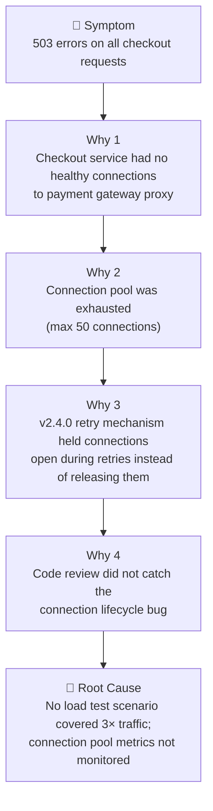

# Post-Mortem: INC-[NUMBER] — [Incident Title]

> [!NOTE]
> Post-mortems must be completed within 5 business days of incident resolution. The goal is systemic improvement, not blame. Every finding should lead to a concrete action item with an owner and due date.

| Field                | Value                                      |
| -------------------- | ------------------------------------------ |
| **Incident**         | [INC-NUMBER](../incidents/INC-[NUMBER].md) |
| **Date of incident** | [YYYY-MM-DD]                               |
| **Post-mortem date** | [YYYY-MM-DD]                               |
| **Facilitator**      | [Name]                                     |
| **Attendees**        | [Names]                                    |
| **Status**           | Draft / Final                              |

> [!IMPORTANT]
> **Blameless principle:** This document identifies systemic failures, not individual failures. The goal is to make the system more resilient, not to assign fault. If you find yourself writing "X person should have..." — stop and reframe as "the system should have..."

---

## 📊 Incident Summary

**What happened:** [2–3 sentences. What failed, when, and what the user-visible impact was.]

**Example:** _On 2024-03-19 at 14:23 UTC, the checkout service began returning 503 errors to all users attempting to complete purchases. The outage lasted 47 minutes and affected approximately 8,400 users, resulting in an estimated $127,000 in lost transactions. The root cause was connection pool exhaustion introduced by a retry mechanism in v2.4.0._

**Duration:** [N hours N minutes] | **Users affected:** [Count] | **Revenue impact:** [$ or N/A]

---

## 🔍 5 Whys Analysis

> [!TIP]
> The 5 Whys technique works best when you resist the urge to stop at the first technical cause. Keep asking "why" until you reach a systemic or process failure that can be fixed. The root cause is almost never "someone made a mistake."

| Level          | Question                                   | Answer                                                                           |
| -------------- | ------------------------------------------ | -------------------------------------------------------------------------------- |
| **Symptom**    | What did users experience?                 | 503 errors on all checkout requests for 47 minutes                               |
| **Why 1**      | Why did users see 503s?                    | Checkout service had no healthy connections to the payment gateway proxy         |
| **Why 2**      | Why were there no healthy connections?     | The connection pool (max: 50) was exhausted by a 3× traffic spike                |
| **Why 3**      | Why did the pool exhaust under 3× traffic? | v2.4.0 retry mechanism held connections open during retries instead of releasing |
| **Why 4**      | Why did this bug reach production?         | Code review didn't catch the connection lifecycle issue; load test only at 1.5×  |
| **Root cause** | Why was load testing insufficient?         | No process required load testing at peak traffic scenarios before deployment     |

---

## 📋 Contributing Factors

Beyond the root cause, these factors made the incident worse or harder to resolve:

- **[Factor 1]:** Connection pool exhaustion metric was not on the checkout team's dashboard — detection took 4 minutes after the alert fired
- **[Factor 2]:** The on-call runbook for checkout 503s pointed to the wrong service (payment gateway) — investigation time wasted on a healthy service
- **[Factor 3]:** Status page update was delayed 12 minutes because the communications lead was also debugging — need dedicated comms role

---

## ✅ What Went Well

- Alert fired within 2 minutes of first errors — detection was fast
- Incident commander kept the war room focused and communication clear
- Rollback was practiced and executed in under 3 minutes
- Revenue impact estimate was available within 15 minutes for stakeholder communication

---

## ❌ What Went Poorly

- Root cause took 38 minutes to identify — connection pool metrics were not visible
- Runbook pointed to wrong service, wasting 15 minutes of investigation
- Status page update was delayed 12 minutes — customers were calling support before we communicated
- Two engineers investigated the same hypothesis (payment gateway) without coordinating

---

## 🛠️ Action Items

> [!WARNING]
> Action items without owners and due dates are wishes, not commitments. Every item must have a specific person accountable and a specific date. Review these at the next team meeting.

### Immediate (within 1 week)

| Action                                                       | Owner  | Due    | Status  |
| ------------------------------------------------------------ | ------ | ------ | ------- |
| Add connection pool utilization metric to checkout dashboard | [Name] | [Date] | Pending |
| Add alert: connection pool utilization > 80% for 2 minutes   | [Name] | [Date] | Pending |
| Fix runbook: update checkout 503 runbook to correct service  | [Name] | [Date] | Pending |

### Short-term (within 1 month)

| Action                                                         | Owner  | Due    | Status  |
| -------------------------------------------------------------- | ------ | ------ | ------- |
| Add 3× traffic load test scenario to checkout CI pipeline      | [Name] | [Date] | Pending |
| Create status page update template for checkout outages        | [Name] | [Date] | Pending |
| Define dedicated communications lead role in incident playbook | [Name] | [Date] | Pending |

### Long-term (within 1 quarter)

| Action                                                          | Owner  | Due    | Status  |
| --------------------------------------------------------------- | ------ | ------ | ------- |
| Implement connection pool circuit breaker pattern               | [Name] | [Date] | Pending |
| Chaos engineering exercise: connection pool exhaustion scenario | [Name] | [Date] | Pending |
| Review all service runbooks for accuracy                        | [Name] | [Date] | Pending |

---

## 📚 Lessons Learned

**For this team:**

- Connection lifecycle bugs are subtle and require explicit testing — add connection pool behavior to code review checklist
- Every service's critical metrics must be on the on-call dashboard, not just in Datadog

**For the organization:**

- Load testing standards should require testing at 3× expected peak, not 1.5×
- Incident playbooks should designate a dedicated communications lead separate from the technical investigation team

**For the on-call process:**

- Runbooks must be reviewed and tested quarterly — stale runbooks cost more time than no runbook
- War room should have explicit role assignments (IC, tech lead, comms lead) within the first 5 minutes

---

## 🔗 References

- [Incident report](../incidents/INC-[NUMBER].md)
- [Checkout service runbook (updated)](../runbooks/checkout-service.md)
- [Connection pool documentation](https://pkg.go.dev/database/sql#DB.SetMaxOpenConns)
- [Related post-mortem: INC-2023-041 (similar connection pool issue)](./INC-2023-041-post-mortem.md)

---

_Last updated: [Date] — Post-mortems are finalized within 5 business days of incident resolution._
