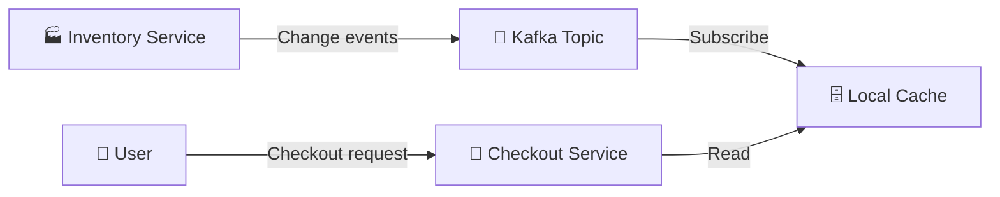
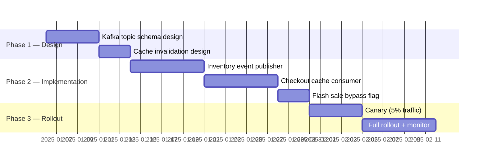

# RFC-[NUMBER]: [Title — Specific and Outcome-Oriented]

> [!NOTE]
> An RFC is required for any change that: (1) affects multiple teams, (2) introduces a new architectural pattern, (3) has significant performance or security implications, or (4) is irreversible without significant effort. For smaller changes, use an ADR instead.

| Field               | Value                                               |
| ------------------- | --------------------------------------------------- |
| **Status**          | Draft / In Review / Accepted / Rejected / Withdrawn |
| **Author**          | [Name]                                              |
| **Date**            | [YYYY-MM-DD]                                        |
| **Review deadline** | [YYYY-MM-DD]                                        |
| **Stakeholders**    | [Names or teams who must respond]                   |
| **Related RFCs**    | [RFC-NNN if supersedes or depends on another]       |

---

## 📋 Problem Statement

> [!IMPORTANT]
> The problem statement must be written before any solution is proposed. Reviewers should be able to evaluate whether the problem is real and worth solving independently of the proposed solution.

### What problem are we solving?

[2–4 sentences. Describe the pain point, gap, or opportunity. Be concrete — include metrics, incident counts, or user feedback that quantifies the problem.]

**Example:** _Our checkout service currently makes 3 synchronous calls to the inventory service per request, contributing to p99 latency of 850ms (SLA: 500ms). This caused 4 SLA breaches in Q3, affecting ~12,000 users. The inventory service team has flagged that our call pattern is their #1 source of load spikes._

### Who is affected?

- **Users:** [How many, which segments, what impact]
- **Engineers:** [Which teams, what friction]
- **Systems:** [Which services, what load or risk]

### Why now?

[What makes this urgent or timely? What happens if we don't act?]

**Example:** _Q4 traffic is projected to be 3× Q3 peak. Without this change, we expect SLA breaches to increase proportionally, risking our enterprise contract renewals._

---

## 🔍 Proposed Approaches

> [!TIP]
> Always include at least 3 approaches: your preferred solution, an alternative, and "do nothing." The comparison matrix forces you to articulate tradeoffs explicitly, which is the most valuable part of the RFC process.

### Approach A: [Name — e.g., "Async Inventory Cache with Event Sourcing"]

**Summary:** [1–2 sentences describing the approach]

**Example:** _Introduce a local cache in the checkout service, populated by inventory change events via Kafka. Checkout reads from cache; cache is invalidated on inventory updates._

**How it works:**

**Pros:**

- Eliminates synchronous dependency — checkout latency drops to ~50ms for inventory reads
- Cache absorbs inventory service load spikes
- Inventory service team benefits from reduced call volume

**Cons:**

- Cache staleness window of ~500ms — acceptable for most SKUs, not for flash sales
- Adds operational complexity: Kafka consumer, cache invalidation logic
- Requires coordination with inventory team to publish events

**Effort:** L | **Risk:** Medium

---

### Approach B: [Name — e.g., "Read-Through Cache with TTL"]

**Summary:** [1–2 sentences]

**Example:** _Add a Redis cache in front of inventory calls with a 30-second TTL. Cache miss triggers synchronous call; hit returns cached value._

**Pros:**

- Simpler implementation — no event infrastructure needed
- Reduces inventory call volume by ~80% under normal traffic

**Cons:**

- Still synchronous on cache miss — doesn't eliminate latency spikes
- 30-second staleness may cause overselling during high-demand periods
- Redis becomes a new dependency and failure point

**Effort:** M | **Risk:** Low

---

### Approach C: Do Nothing

**Pros:** No engineering cost, no risk of regression

**Cons:** SLA breaches continue; Q4 traffic will worsen the problem; enterprise contract renewals at risk (~$2.4M ARR)

---

### Comparison matrix

| Criterion              | Weight | Approach A | Approach B | Do Nothing |
| ---------------------- | ------ | ---------- | ---------- | ---------- |
| Solves the problem     | High   | ✅         | ⚠️         | ❌         |
| Implementation effort  | Medium | ⚠️         | ✅         | ✅         |
| Operational complexity | Medium | ⚠️         | ✅         | ✅         |
| Reversibility          | Low    | ⚠️         | ✅         | ✅         |
| Staleness risk         | High   | ✅         | ⚠️         | ✅         |

---

## 🎯 Recommended Decision

> [!WARNING]
> Once an RFC is accepted, it becomes the authoritative record for this decision. Changes to the accepted approach require a new RFC or an amendment. Do not modify an accepted RFC in place.

**Recommendation: Approach A — Async Inventory Cache with Event Sourcing**

Approach A is the only option that fully eliminates the synchronous dependency and meets our Q4 latency target. The 500ms staleness window is acceptable for 98% of SKUs; we will implement a "flash sale mode" flag that bypasses the cache for high-demand items. The Kafka infrastructure is already in use by 3 other services, so operational overhead is incremental.

### What we are NOT doing and why

- **Approach B (Read-Through Cache):** Reduces but does not eliminate synchronous calls. Under Q4 load, cache misses will still cause latency spikes. The simpler implementation does not justify accepting continued SLA risk.
- **Do Nothing:** Unacceptable given Q4 projections and enterprise contract exposure.

---

## ⚡ Implementation Plan

| Phase | Deliverable                        | Owner          | Target     |
| ----- | ---------------------------------- | -------------- | ---------- |
| 1     | Schema design doc + cache strategy | Checkout team  | 2025-01-10 |
| 2     | Implementation + unit tests        | Checkout team  | 2025-01-24 |
| 3     | Canary rollout + monitoring        | Checkout + SRE | 2025-02-07 |

**Success criteria:** p99 checkout latency < 300ms for 7 consecutive days post-rollout; zero inventory-related SLA breaches in Q4.

---

## 🔗 Open Questions

- [ ] **Flash sale mode:** How does the checkout service know when to bypass the cache? Does inventory service publish a "high-demand" flag, or does checkout detect it via order velocity?
- [ ] **Cache warm-up:** On service restart, how long until the cache is populated enough to serve traffic? What is the fallback during warm-up?
- [ ] **Event ordering:** What happens if inventory events arrive out of order? Do we need sequence numbers?

---

## 💬 Review Log

| Date   | Reviewer | Verdict           | Notes                                              |
| ------ | -------- | ----------------- | -------------------------------------------------- |
| [Date] | [Name]   | Changes requested | Flash sale mode needs more detail before accepting |
| [Date] | [Name]   | Approved          | Approach A is the right call for Q4                |

---

## 📚 References

- [Inventory Service Architecture](../adr/ADR-042-inventory-service.md)
- [Kafka Usage Guidelines](../../runbooks/kafka-operations.md)
- [SLA Breach Post-Mortem Q3](../../incidents/INC-2024-089-post-mortem.md)
- [Martin Fowler — Event Sourcing](https://martinfowler.com/eaaDev/EventSourcing.html)

---

_Last updated: [Date]_

---

## See Also

- [Architecture Decision Record (ADR)](./adr.md) — For documenting smaller, team-level architectural decisions
- [API Specification](./api_spec.md) — For detailed REST API design and documentation
- [Feature Specification](./../product/feature_spec.md) — For engineering implementation details of product features
- [Post-Mortem](./post_mortem.md) — For analyzing incidents after RFC implementation
- [Code Review](./code_review.md) — For peer review processes after RFC approval