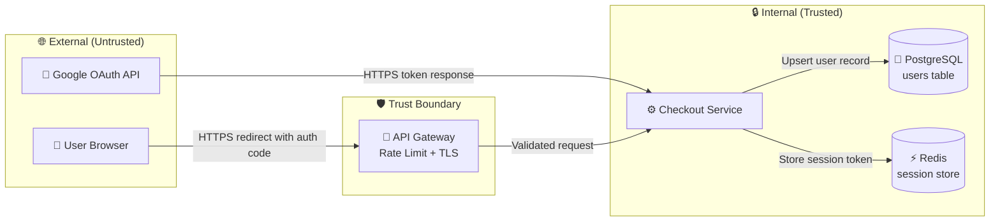

# Security Review: [Feature / Service / PR Name]

> [!NOTE]
> Complete this review before merging any change that touches authentication, authorization, data handling, external integrations, or user input. A security review is not a rubber stamp — findings must be tracked to closure.

| Field           | Value                                                  |
| --------------- | ------------------------------------------------------ |
| **Target**      | [Feature, service, or PR being reviewed]               |
| **Reviewer**    | [Name]                                                 |
| **Date**        | [YYYY-MM-DD]                                           |
| **Risk rating** | 🟢 Low / 🟡 Medium / 🔴 High / 💀 Critical             |
| **Verdict**     | ✅ Approved / ⚠️ Approved with conditions / ❌ Blocked |
| **Related PR**  | `#[NUMBER]`                                            |

**Example:**

| Field           | Value                                                 |
| --------------- | ----------------------------------------------------- |
| **Target**      | PR #847 — Add OAuth2 Google login to checkout service |
| **Reviewer**    | Marcus Webb                                           |
| **Date**        | 2025-04-02                                            |
| **Risk rating** | 🟡 Medium                                             |
| **Verdict**     | ⚠️ Approved with conditions                           |
| **Related PR**  | `#847`                                                |

---

## 📋 Scope

**What is being reviewed:**

[2–3 sentences. What system, feature, or change is under review. What data does it handle? What external systems does it interact with?]

**Example:** PR #847 adds Google OAuth2 as a login option to the checkout service. It handles OAuth authorization codes, exchanges them for access tokens via Google's API, and creates or links user accounts in the `users` table. The feature stores Google user IDs and email addresses and issues session tokens via the existing JWT infrastructure.

**In scope:**

- OAuth2 authorization code flow implementation
- Token exchange and validation with Google's API
- Session token issuance and storage
- Account linking logic (new vs. existing users)
- User data stored from Google profile (email, name, avatar URL)

**Out of scope:**

- Google API key rotation (handled by platform team — see runbook `rotate-google-oauth-keys.md`)
- General JWT infrastructure (reviewed in ADR-012)
- Frontend OAuth redirect handling (separate PR #848)

> [!TIP]
> Keep scope tight. A review that tries to cover everything covers nothing. If you discover out-of-scope issues, file separate tickets rather than blocking this review.

---

## 🗺️ Threat Model

### Assets to protect

| Asset                | Sensitivity | Location                         |
| -------------------- | ----------- | -------------------------------- |
| Google OAuth tokens  | Critical    | In-memory only (never persisted) |
| User email addresses | High        | `users.email` column (encrypted) |
| Session JWT tokens   | High        | Redis + HttpOnly cookie          |
| Google user IDs      | Medium      | `users.google_id` column         |
| User display names   | Low         | `users.display_name` column      |

### Threat actors

- **Unauthenticated external attacker:** Motivation: account takeover via CSRF or authorization code interception
- **Authenticated user attempting privilege escalation:** Motivation: link their Google account to another user's existing account
- **Compromised Google OAuth token:** Motivation: replay attack using a stolen authorization code before it's exchanged

---

## 🔍 Vulnerability Assessment

### Authentication & Authorization

- [x] All endpoints require authentication (no accidental public exposure)
- [x] Authorization checks happen server-side, not client-side
- [x] Principle of least privilege applied to service accounts and roles
- [x] JWT/session tokens have appropriate expiry (24h) and rotation
- [ ] **FAIL:** `state` parameter not validated in OAuth callback — CSRF vulnerability (SEC-001)
- [x] MFA available for sensitive operations (existing infrastructure)

**Findings:** SEC-001 — Missing `state` parameter validation in `/auth/google/callback`

---

### Input Validation & Injection

- [x] All user inputs validated before processing
- [x] SQL queries use parameterized statements (Prisma ORM)
- [x] No shell command construction from user input
- [x] HTML output is escaped (React handles this)
- [x] File uploads not applicable to this feature
- [x] JSON parsing protected (standard library)
- [ ] **FAIL:** `redirect_uri` not validated against allowlist — open redirect risk (SEC-002)

**Findings:** SEC-002 — `redirect_uri` accepts arbitrary URLs; must be validated against registered allowlist

---

### Data Handling

- [x] PII (email, name) identified and handled per privacy policy
- [x] Email addresses encrypted at rest (AES-256 via column-level encryption)
- [x] All data encrypted in transit (TLS 1.3)
- [x] Google client secret stored in AWS Secrets Manager, not env vars
- [ ] **FAIL:** Google access token logged at DEBUG level in `oauth.service.ts:142` (SEC-003)
- [x] Data retention: Google tokens not persisted; user records follow existing retention policy

**Findings:** SEC-003 — Access token appears in debug logs; must be redacted

---

### Dependencies & Supply Chain

- [x] `passport-google-oauth20@2.0.0` — no known CVEs (`npm audit` clean)
- [x] `googleapis@140.0.0` — no known CVEs
- [x] Both dependencies pinned to exact versions
- [x] Both actively maintained (last release < 3 months ago)
- [x] MIT license — compatible with project license

**Findings:** None

---

### Error Handling & Information Disclosure

- [x] Error messages do not expose stack traces to users
- [x] Generic "Authentication failed" message returned on all OAuth errors
- [x] 404 vs 403 responses do not leak resource existence
- [x] Debug endpoints disabled in production (checked `NODE_ENV` guard)

**Findings:** None

> [!WARNING]
> Even "low severity" information disclosure findings should be fixed before production. Attackers chain small leaks into larger exploits. SEC-003 (token in logs) is particularly dangerous if logs are shipped to a third-party SIEM.

---

## 🚨 Findings Summary

| ID      | Severity  | Category               | Description                                               | Status |
| ------- | --------- | ---------------------- | --------------------------------------------------------- | ------ |
| SEC-001 | 🔴 High   | Authentication / CSRF  | Missing `state` parameter validation in OAuth callback    | Open   |
| SEC-002 | 🟡 Medium | Input Validation       | `redirect_uri` not validated against registered allowlist | Open   |
| SEC-003 | 🟢 Low    | Information Disclosure | Google access token logged at DEBUG level                 | Open   |

---

### SEC-001: Missing OAuth State Parameter Validation

**Severity:** 🔴 High

**Description:** The `/auth/google/callback` endpoint does not validate the `state` parameter returned by Google. The `state` parameter is the CSRF protection mechanism for OAuth flows. Without validation, an attacker can trick a logged-in user into completing an OAuth flow initiated by the attacker, potentially linking the attacker's Google account to the victim's existing account.

**Attack scenario:**

1. Attacker initiates OAuth flow, captures the Google redirect URL with their authorization code
2. Attacker tricks victim (already logged in) into visiting the callback URL
3. Victim's session is used to complete the OAuth flow — attacker's Google account is now linked to victim's account
4. Attacker can now log in as victim using their own Google credentials

**Remediation:**

1. Generate a cryptographically random `state` value on OAuth initiation: `crypto.randomBytes(32).toString('hex')`
2. Store `state` in the user's session before redirecting to Google
3. In the callback, compare the returned `state` against the session value; reject if they don't match
4. Invalidate the `state` after use (one-time use)

**Owner:** Marcus Webb | **Due:** 2025-04-05 | **Status:** Open

---

### SEC-002: Unvalidated redirect_uri

**Severity:** 🟡 Medium

**Description:** The `redirect_uri` parameter is passed through to Google without validation against a registered allowlist. If an attacker can manipulate this value (e.g., via a phishing link), they could redirect the authorization code to an attacker-controlled server.

**Attack scenario:** Attacker crafts a login URL with `redirect_uri=https://evil.com/capture`. If the user clicks it and Google accepts the URI (because it's not validated server-side), the authorization code is sent to the attacker.

**Remediation:**

1. Define an allowlist of valid redirect URIs in configuration: `ALLOWED_REDIRECT_URIS`
2. Validate `redirect_uri` against the allowlist before initiating the OAuth flow
3. Register only the exact production callback URL with Google Cloud Console (already done — verify)

**Owner:** Sarah Kim | **Due:** 2025-04-10 | **Status:** Open

---

### SEC-003: Access Token in Debug Logs

**Severity:** 🟢 Low

**Description:** `oauth.service.ts` line 142 logs the full Google access token at DEBUG level: `logger.debug('Token exchange response', { tokens })`. If debug logging is ever enabled in production (or logs are shipped to a SIEM), the access token is exposed.

**Remediation:**

1. Replace `logger.debug('Token exchange response', { tokens })` with `logger.debug('Token exchange successful', { hasAccessToken: !!tokens.access_token })`
2. Add a lint rule to prevent logging objects named `token`, `secret`, `password`, or `key`

**Owner:** Marcus Webb | **Due:** 2025-04-05 | **Status:** Open

---

## ✅ Remediation Tracking

| Finding | Remediation                                    | Owner       | Due        | Status  |
| ------- | ---------------------------------------------- | ----------- | ---------- | ------- |
| SEC-001 | Implement `state` parameter generation + check | Marcus Webb | 2025-04-05 | Pending |
| SEC-002 | Add `redirect_uri` allowlist validation        | Sarah Kim   | 2025-04-10 | Pending |
| SEC-003 | Redact token from debug log statement          | Marcus Webb | 2025-04-05 | Pending |

---

## 🎯 Verdict

**Overall risk rating:** 🟡 Medium

**Decision:** ⚠️ Approved with conditions

**Conditions:**

- SEC-001 must be fixed and re-reviewed before production deployment (CSRF is a blocker)
- SEC-002 must be fixed within 7 days of merge
- SEC-003 must be fixed before merge (1-line change, no excuse to defer)

The OAuth implementation follows the authorization code flow correctly and uses existing secure infrastructure (JWT, Redis sessions, encrypted PII storage). The three findings are fixable without architectural changes. SEC-001 is the only blocker — the CSRF risk is real and the fix is straightforward.

---

## 🔗 References

- [OWASP Top 10](https://owasp.org/www-project-top-ten/)
- [OWASP OAuth 2.0 Security Cheat Sheet](https://cheatsheetseries.owasp.org/cheatsheets/OAuth2_Cheat_Sheet.html)
- [RFC 6749 — The OAuth 2.0 Authorization Framework](https://datatracker.ietf.org/doc/html/rfc6749)
- [ADR-012 — Auth token storage strategy](../adr/ADR-012.md)
- [Related security review: JWT refresh tokens](./security-review-jwt-refresh.md)

---

_Last updated: 2025-04-02 by Marcus Webb_
