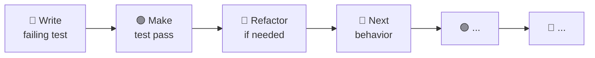

# TDD Spec: [Feature Name]

> [!NOTE]
> This template drives the mandatory TDD cycle defined in `AGENTS.md`. Each behavior is a **complete vertical slice** — RED → GREEN → REFACTOR — before the next behavior begins. Do not batch tests; do not skip phases.

| Field           | Value                                                   |
| --------------- | ------------------------------------------------------- |
| **Feature**     | [Short description of the behavior being built]         |
| **Author**      | [Name]                                                  |
| **Date**        | [YYYY-MM-DD]                                            |
| **Status**      | Specifying / 🔴 RED / 🟢 GREEN / 🔵 REFACTOR / Complete |
| **Related ADR** | [ADR-NNN if architectural decision drives this]         |

**Example:**

| Field           | Value                                 |
| --------------- | ------------------------------------- |
| **Feature**     | User password reset via email token   |
| **Author**      | Priya Nair                            |
| **Date**        | 2025-03-15                            |
| **Status**      | 🟢 GREEN                              |
| **Related ADR** | ADR-012 — Auth token storage strategy |

---

## 📋 Feature Description

### What behavior are we building?

[2–4 sentences. Describe the feature from the user's or system's perspective. What does it do? What problem does it solve? Use concrete examples.]

**Example:** Users who have forgotten their password can request a reset link via email. The system generates a time-limited, single-use token, emails a reset link, and allows the user to set a new password when they click the link. Tokens expire after 1 hour and are invalidated after use to prevent replay attacks.

### Public interface

[Describe the public API, function signature, CLI command, or HTTP endpoint that tests will exercise. Tests use ONLY this interface — no internal methods.]

```typescript
// Example: the interface under test
interface PasswordResetService {
  requestReset(email: string): Promise<{ success: boolean }>;
  validateToken(
    token: string,
  ): Promise<{ valid: boolean; userId: string | null }>;
  resetPassword(
    token: string,
    newPassword: string,
  ): Promise<{ success: boolean }>;
}
```

> [!IMPORTANT]
> Tests must exercise **only** the public interface above. Never test private methods, internal helpers, or database queries directly. If you find yourself mocking internal collaborators, the interface is leaking — redesign it.

### Out of scope

- Social login / OAuth flows (separate spec: `oauth-login-tdd-spec.md`)
- Admin-initiated password resets (separate spec)
- Password strength enforcement (handled by `PasswordValidator` — already tested)
- Email delivery confirmation (handled by email service — already tested)

---

## 🔴 RED Phase — Behaviors to Test

> [!TIP]
> Write ONE test per behavior. The test must **fail** before you write any implementation. Tests describe WHAT the system does, not HOW it does it internally.



---

### Behavior 1: Returns success when reset is requested for a known email

**Test file:** `src/auth/password-reset.test.ts`

**Test description:**

```typescript
it("should return success when reset is requested for a registered email", async () => {
  // Arrange
  const service = new PasswordResetService({ db: testDb, mailer: mockMailer });
  await testDb.users.insert({
    email: "alice@example.com",
    passwordHash: "...",
  });

  // Act
  const result = await service.requestReset("alice@example.com");

  // Assert
  expect(result.success).toBe(true);
});
```

**Expected failure output:**

```
FAIL src/auth/password-reset.test.ts
  ✕ should return success when reset is requested for a registered email (3ms)
    TypeError: PasswordResetService is not a constructor
```

**RED checkpoint:** ☐ Test confirmed failing before implementation

---

### Behavior 2: Returns success (no leak) when reset is requested for an unknown email

**Test file:** `src/auth/password-reset.test.ts`

**Test description:**

```typescript
it("should return success even for unregistered emails (no user enumeration)", async () => {
  // Arrange
  const service = new PasswordResetService({ db: testDb, mailer: mockMailer });

  // Act
  const result = await service.requestReset("nobody@example.com");

  // Assert
  // Must NOT reveal whether the email exists — security requirement
  expect(result.success).toBe(true);
  expect(mockMailer.sentEmails).toHaveLength(0); // no email sent, but no error exposed
});
```

**RED checkpoint:** ☐ Test confirmed failing before implementation

---

### Behavior 3: Token is invalid after expiry (1 hour)

**Test file:** `src/auth/password-reset.test.ts`

**Test description:**

```typescript
it("should reject a token that is older than 1 hour", async () => {
  // Arrange
  const service = new PasswordResetService({ db: testDb, mailer: mockMailer });
  const expiredToken = await testDb.resetTokens.insert({
    token: "expired-token-abc",
    userId: "user-1",
    createdAt: new Date(Date.now() - 61 * 60 * 1000), // 61 minutes ago
  });

  // Act
  const result = await service.validateToken("expired-token-abc");

  // Assert
  expect(result.valid).toBe(false);
  expect(result.userId).toBeNull();
});
```

**RED checkpoint:** ☐ Test confirmed failing before implementation

---

### Behavior 4: Token is invalidated after successful password reset

**Test file:** `src/auth/password-reset.test.ts`

**Test description:**

```typescript
it("should reject a token that has already been used", async () => {
  // Arrange
  const service = new PasswordResetService({ db: testDb, mailer: mockMailer });
  await testDb.resetTokens.insert({
    token: "valid-token-xyz",
    userId: "user-1",
    createdAt: new Date(),
    usedAt: null,
  });

  // Act — use the token once
  await service.resetPassword("valid-token-xyz", "NewSecurePass123!");

  // Act — try to use it again
  const secondAttempt = await service.validateToken("valid-token-xyz");

  // Assert
  expect(secondAttempt.valid).toBe(false);
});
```

**RED checkpoint:** ☐ Test confirmed failing before implementation

---

### Behavior 5: Throws validation error for weak new password

**Test file:** `src/auth/password-reset.test.ts`

**Test description:**

```typescript
it("should throw a validation error when new password is too weak", async () => {
  // Arrange
  const service = new PasswordResetService({ db: testDb, mailer: mockMailer });
  await testDb.resetTokens.insert({
    token: "good-token",
    userId: "user-1",
    createdAt: new Date(),
  });

  // Act & Assert
  await expect(service.resetPassword("good-token", "123")).rejects.toThrow(
    "Password must be at least 12 characters",
  );
});
```

**RED checkpoint:** ☐ Test confirmed failing before implementation

---

## 🟢 GREEN Phase — Implementation Notes

> [!IMPORTANT]
> Write **only** enough code to pass the failing test. No speculative features. No "nice to haves". No refactoring yet. Fix the implementation, never the tests.

For each behavior, record:

| Behavior   | Files modified                               | Implementation summary                                          | Test result |
| ---------- | -------------------------------------------- | --------------------------------------------------------------- | ----------- |
| Behavior 1 | `src/auth/password-reset.ts`                 | Created `PasswordResetService` class with `requestReset` method | ✅ Passing  |
| Behavior 2 | `src/auth/password-reset.ts`                 | Added early return for unknown emails without error             | ✅ Passing  |
| Behavior 3 | `src/auth/password-reset.ts`                 | Added 1-hour expiry check in `validateToken`                    | ✅ Passing  |
| Behavior 4 | `src/auth/password-reset.ts`                 | Mark token `usedAt` on reset; reject if `usedAt` is set         | ✅ Passing  |
| Behavior 5 | `src/auth/password-reset.ts`, `validator.ts` | Delegate to `PasswordValidator.check()` before resetting        | ✅ Passing  |

**GREEN checkpoint:** ☐ All tests passing before refactor begins

---

## 🔵 REFACTOR Phase — Quality Improvements

> [!WARNING]
> Only refactor when GREEN. **Never refactor when RED.** Tests must pass after every individual change. If a refactor breaks a test, revert immediately — do not "fix" the test.

### Refactoring checklist

- [ ] Extract duplication into shared functions or modules
- [ ] Deepen modules — move complexity behind simple interfaces
- [ ] Improve naming — names should reveal intent
- [ ] Apply SOLID principles where natural (not forced)
- [ ] Remove unused code or dead branches
- [ ] Ensure public interface is stable and minimal

### Changes made

| Change                                                       | Rationale                                         | Tests still passing |
| ------------------------------------------------------------ | ------------------------------------------------- | ------------------- |
| Extracted `isTokenExpired(token)` helper                     | Duplicated expiry logic in validate + reset paths | ✅                  |
| Renamed `proc()` → `markTokenUsed(tokenId)`                  | Name was ambiguous                                | ✅                  |
| Moved token generation into `TokenFactory` class             | Isolates randomness — easier to test determinism  | ✅                  |
| Removed unused `debugLog` calls left from initial GREEN pass | Dead code                                         | ✅                  |

_Or: "No refactoring needed — implementation is already clean."_

**REFACTOR checkpoint:** ☐ All tests passing after refactor

---

## 📋 Acceptance Criteria

The feature is complete when:

- [ ] All behaviors above have passing tests
- [ ] No tests were deleted or weakened to make them pass
- [ ] Public interface matches the spec above
- [ ] LSP diagnostics clean on all modified files
- [ ] Build passes (`npm run build`)
- [ ] Integration test suite passes (`npm run test:integration`)

> [!TIP]
> Run `npm run test -- --coverage` to confirm all new code paths are exercised. Aim for 100% coverage on the new module — if you can't reach it, the untested path is likely dead code.

---

## 🔗 References

- [AGENTS.md TDD rules](../../../../AGENTS.md)
- [ADR-012 — Auth token storage strategy](../adr/ADR-012.md)
- [OWASP — Forgot Password Cheat Sheet](https://cheatsheetseries.owasp.org/cheatsheets/Forgot_Password_Cheat_Sheet.html)
- [Related feature spec: OAuth Login](./oauth-login-tdd-spec.md)

---

_Last updated: 2025-03-15_
