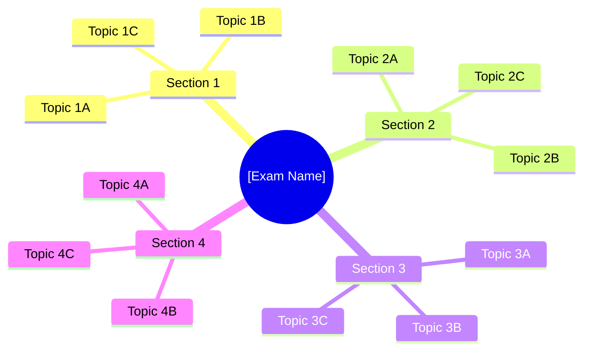
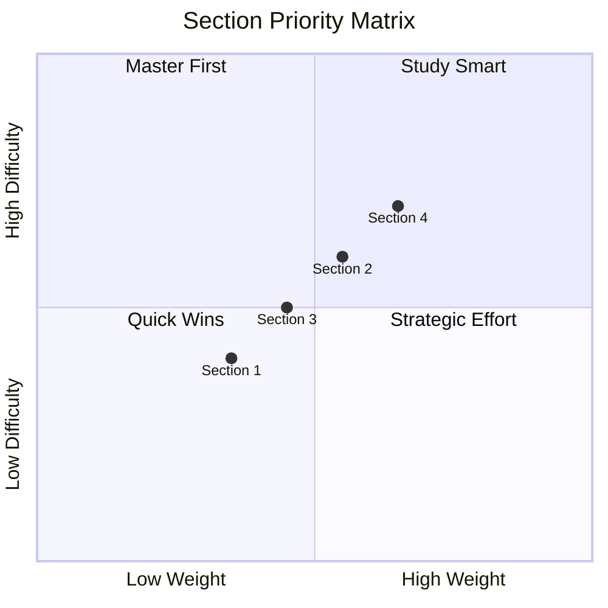

# Exam Prep Master Study Guide

<!-- Master study guide template for professional certification exams -->
<!-- Covers: exam structure, section weightings, study timeline, progress tracking -->
<!-- Example domain: Series 65 (NASAA Investment Advisers Law Examination) -->

---

## Document Control _(remove before publishing)_

| Field                  | Value                                                      |
| ---------------------- | ---------------------------------------------------------- |
| **Exam Name**          | [Full exam name, e.g., Series 65 — NASAA Uniform IAL Exam] |
| **Administering Body** | [Organization, e.g., NASAA / FINRA / CFA Institute]        |
| **Version**            | [X.X]                                                      |
| **Last Updated**       | [DD-MMM-YYYY]                                              |
| **Target Exam Date**   | [DD-MMM-YYYY]                                              |
| **Author**             | [Name]                                                     |

---

## Exam Overview

**[Exam Name]** is a [number]-question [format, e.g., multiple-choice] examination administered by [body]. The passing score is [X]% ([Y] of [Z] correct). You have [duration] to complete the exam.

| Exam Detail              | Value                                   |
| ------------------------ | --------------------------------------- |
| **Total Questions**      | [130 total, 10 pretest / 120 scored]    |
| **Passing Score**        | [72% = 87 of 120 scored]                |
| **Time Allowed**         | [180 minutes]                           |
| **Format**               | [Multiple choice, 4 answer options]     |
| **Negative Marking**     | [No / Yes — describe penalty]           |
| **Calculator Permitted** | [Yes — on-screen / No / Bring your own] |
| **Reference Materials**  | [None permitted / Open book — specify]  |
| **Testing Center**       | [Prometric / Pearson VUE / Online]      |
| **Registration Fee**     | [$XXX]                                  |
| **Retake Policy**        | [30-day wait / 3 attempts per window]   |

---

## Exam Structure & Weightings

### Section Breakdown

| #   | Section Name                                        | Questions | Weight   | Priority |
| --- | --------------------------------------------------- | --------- | -------- | -------- |
| 1   | [Economic Factors & Business Information]           | [XX]      | [XX]%    | [High]   |
| 2   | [Investment Vehicle Characteristics]                | [XX]      | [XX]%    | [High]   |
| 3   | [Client Investment Recommendations & Strategies]    | [XX]      | [XX]%    | [Medium] |
| 4   | [Laws, Regulations, & Guidelines Including Prohib.] | [XX]      | [XX]%    | [High]   |
|     | **TOTAL SCORED**                                    | **[120]** | **100%** |          |
|     | _Pretest (unscored)_                                | _[10]_    | _N/A_    |          |

> [!IMPORTANT]
> Pretest questions are indistinguishable from scored questions. Treat every question as scored.

### Topic Mind Map

### Weighting Priorities

---

## Study Timeline

### Recommended Schedule ([X]-Week Plan)

| Week      | Focus Area                          | Hours    | Activities                                  |
| --------- | ----------------------------------- | -------- | ------------------------------------------- |
| 1         | [Section 1 — Foundation Concepts]   | [10]     | Read material, take notes, initial quiz     |
| 2         | [Section 1 — Deep Dive + Section 2] | [12]     | Practice questions, flashcards              |
| 3         | [Section 2 — Complete]              | [12]     | Full section review, timed practice sets    |
| 4         | [Section 3 — Core Topics]           | [10]     | Case studies, application problems          |
| 5         | [Section 4 — Regulations]           | [12]     | Memorize rules, regulatory scenarios        |
| 6         | [Section 4 — Complete + Review]     | [12]     | Full section exam, gap analysis             |
| 7         | [Comprehensive Review]              | [15]     | Full practice exams, weak-area drill        |
| 8         | [Final Review + Exam]               | [10]     | Light review, confidence building, exam day |
| **Total** |                                     | **[93]** |                                             |

### Daily Study Plan Template

| Time Block     | Duration | Activity                                |
| -------------- | -------- | --------------------------------------- |
| Morning        | 30 min   | Review flashcards from previous session |
| Study Block    | 60 min   | New material reading + note-taking      |
| Practice Block | 30 min   | Practice questions on current topic     |
| Evening        | 15 min   | Quick quiz + mark weak areas for review |

---

## Section Summaries

### Section 1: [Section Name] — [XX]% Weight

**Key Topics:**

| Topic                                  | Subtopics                                       | Must-Know Level |
| -------------------------------------- | ----------------------------------------------- | --------------- |
| [Topic 1A, e.g., Economic Cycles]      | [GDP, inflation, interest rates, fiscal policy] | Conceptual      |
| [Topic 1B, e.g., Financial Statements] | [Balance sheet, income statement, cash flow]    | Calculation     |
| [Topic 1C, e.g., Quantitative Methods] | [Time value of money, statistical measures]     | Calculation     |

**Common Exam Traps:**

- [Trap 1: Confusing real vs. nominal GDP — exam tests both]
- [Trap 2: Leading vs. lagging indicators — know which is which]

> See: [section_guide.md](./section_guide.md) for full section deep-dive template

### Section 2: [Section Name] — [XX]% Weight

**Key Topics:**

| Topic                                | Subtopics                                    | Must-Know Level |
| ------------------------------------ | -------------------------------------------- | --------------- |
| [Topic 2A, e.g., Equity Securities]  | [Common stock, preferred stock, ADRs, REITs] | Conceptual      |
| [Topic 2B, e.g., Debt Securities]    | [Bonds, duration, yield curves, credit risk] | Calculation     |
| [Topic 2C, e.g., Pooled Investments] | [Mutual funds, ETFs, hedge funds, LPs]       | Conceptual      |

**Common Exam Traps:**

- [Trap 1: Open-end vs. closed-end fund pricing mechanics]
- [Trap 2: Bond price vs. yield inverse relationship nuances]

### Section 3: [Section Name] — [XX]% Weight

**Key Topics:**

| Topic                                  | Subtopics                                       | Must-Know Level |
| -------------------------------------- | ----------------------------------------------- | --------------- |
| [Topic 3A, e.g., Portfolio Management] | [MPT, asset allocation, rebalancing, risk mgmt] | Application     |
| [Topic 3B, e.g., Client Suitability]   | [Risk tolerance, time horizon, liquidity needs] | Application     |
| [Topic 3C, e.g., Retirement Planning]  | [IRAs, 401(k), Roth, RMDs, Social Security]     | Conceptual      |

**Common Exam Traps:**

- [Trap 1: Traditional IRA deductibility income limits vs. contribution limits]
- [Trap 2: Systematic risk vs. unsystematic risk — which is diversifiable?]

### Section 4: [Section Name] — [XX]% Weight

**Key Topics:**

| Topic                                     | Subtopics                                          | Must-Know Level |
| ----------------------------------------- | -------------------------------------------------- | --------------- |
| [Topic 4A, e.g., State Securities Regs]   | [Registration, exemptions, IA vs. IAR definitions] | Memorization    |
| [Topic 4B, e.g., Federal Securities Acts] | [1933 Act, 1934 Act, 1940 Act, Advisers Act]       | Memorization    |
| [Topic 4C, e.g., Ethical Practices]       | [Fiduciary duty, prohibited practices, disclosure] | Application     |

**Common Exam Traps:**

- [Trap 1: Federal covered adviser vs. state-registered — de minimis exemption]
- [Trap 2: Custody rule — what constitutes "custody" beyond holding assets]

---

## Must-Know Formulas

| Formula                | Expression                                           | Section |
| ---------------------- | ---------------------------------------------------- | ------- |
| [Current Ratio]        | $\text{Current Assets} / \text{Current Liabilities}$ | 1       |
| [Dividend Yield]       | $\text{Annual Dividends} / \text{Price per Share}$   | 2       |
| [Total Return]         | $(P_1 - P_0 + D) / P_0$                              | 2       |
| [Sharpe Ratio]         | $(R_p - R_f) / \sigma_p$                             | 3       |
| [Duration]             | $\sum (PV(CF_t) \times t) / \text{Bond Price}$       | 2       |
| [Standard Deviation]   | $\sqrt{\frac{\sum(x_i - \bar{x})^2}{n-1}}$           | 1       |
| [Tax-Equivalent Yield] | $\text{Muni Yield} / (1 - \text{Tax Rate})$          | 2       |
| [Rule of 72]           | $72 / \text{Interest Rate} = \text{Years to Double}$ | 1       |

---

## Progress Tracker

### Section Mastery

| Section   | Material Read | Notes Complete | Practice Done | Score | Target | Status      |
| --------- | ------------- | -------------- | ------------- | ----- | ------ | ----------- |
| Section 1 | [ ]           | [ ]            | [ ]           | [—]%  | [75]%  | Not Started |
| Section 2 | [ ]           | [ ]            | [ ]           | [—]%  | [75]%  | Not Started |
| Section 3 | [ ]           | [ ]            | [ ]           | [—]%  | [75]%  | Not Started |
| Section 4 | [ ]           | [ ]            | [ ]           | [—]%  | [80]%  | Not Started |

### Practice Exam Log

| Date   | Exam Source    | Score | Time Used | Weak Areas Identified   |
| ------ | -------------- | ----- | --------- | ----------------------- |
| [Date] | [Provider/Set] | [—]%  | [— min]   | [Topics needing review] |
| [Date] | [Provider/Set] | [—]%  | [— min]   | [Topics needing review] |
| [Date] | [Provider/Set] | [—]%  | [— min]   | [Topics needing review] |

### Readiness Assessment

| Criterion                                          | Status | Notes |
| -------------------------------------------------- | ------ | ----- |
| Consistently scoring >[passing]% on practice exams | [ ]    |       |
| All sections above target score                    | [ ]    |       |
| Completed at least [3] full practice exams         | [ ]    |       |
| Weak areas identified and drilled                  | [ ]    |       |
| Exam logistics confirmed (date, location)          | [ ]    |       |
| Timing strategy practiced                          | [ ]    |       |

---

## Exam Day Strategy

### Time Management

| Phase             | Questions     | Time Allotted | Pace               |
| ----------------- | ------------- | ------------- | ------------------ |
| **First Pass**    | All [130]     | [120 min]     | ~[55 sec]/question |
| **Flag & Review** | Flagged [~20] | [30 min]      | [90 sec]/question  |
| **Final Check**   | All           | [30 min]      | Skim + verify      |

### Test-Taking Rules

1. **Answer every question** — no penalty for guessing
2. **Flag and move** — don't spend more than [90 seconds] on any question
3. **Eliminate first** — remove 2 wrong answers, then choose between remaining
4. **Read carefully** — watch for "EXCEPT," "NOT," "LEAST," and "MOST"
5. **Trust first instinct** — only change if you find a clear error in reasoning
6. **Regulatory questions** — when in doubt, choose the most protective/conservative answer

---

## Resources

| Resource Type        | Name/Source                   | Cost       | Notes                       |
| -------------------- | ----------------------------- | ---------- | --------------------------- |
| **Primary Textbook** | [Publisher — Title]           | [$XX]      | Core study material         |
| **Question Bank**    | [Provider — # questions]      | [$XX]      | Aligned to current exam     |
| **Video Course**     | [Provider — Hours]            | [$XX]      | Supplemental                |
| **Flashcards**       | [Provider / Self-made]        | [$XX/Free] | Daily review tool           |
| **Practice Exams**   | [Provider — # exams]          | [$XX]      | Simulate test conditions    |
| **Official Guide**   | [Administering body resource] | [Free]     | Content outline + sample Qs |

---

## See Also

- [Section Guide](./section_guide.md) — Deep-dive template for individual exam sections
- [Practice Questions](./practice_questions.md) — Question bank with explanations
- [Quick Reference](./quick_reference.md) — Flashcard-style facts, mnemonics, formulas

---

_This study guide is a planning tool and does not guarantee exam results. Always verify exam content against the current official exam outline from [administering body]._
