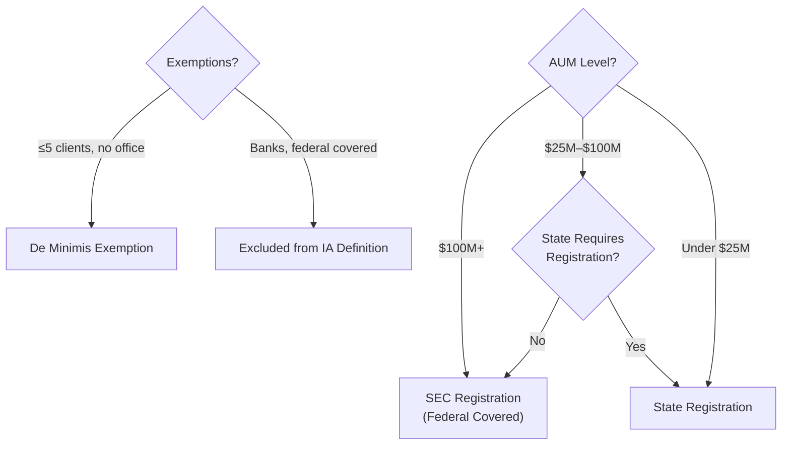

# Quick Reference: [Exam Name]

<!-- Flashcard-style quick facts, mnemonics, formulas, and key definitions -->
<!-- Designed for rapid review and last-minute exam prep -->
<!-- Example domain: Series 65 (NASAA Investment Advisers Law Examination) -->

---

## Document Control _(remove before publishing)_

| Field            | Value            |
| ---------------- | ---------------- |
| **Exam Name**    | [Full exam name] |
| **Version**      | [X.X]            |
| **Last Updated** | [DD-MMM-YYYY]    |

---

## How to Use This Reference

- **Daily review:** Flip through 1-2 sections per day during study period
- **Pre-exam cram:** Review all sections in the 24 hours before the exam
- **Weak-area drill:** Focus on sections where practice scores are lowest
- **Active recall:** Cover the right column, try to recall from the left column

---

## Formula Sheet

### Must-Know Formulas

| #   | Formula            | Expression                                                         | Notes                           |
| --- | ------------------ | ------------------------------------------------------------------ | ------------------------------- |
| 1   | [Current Ratio]    | $\frac{\text{Current Assets}}{\text{Current Liabilities}}$         | Liquidity; >1 is healthy        |
| 2   | [Quick Ratio]      | $\frac{\text{CA} - \text{Inventory}}{\text{CL}}$                   | Excludes least-liquid CA        |
| 3   | [Working Capital]  | $\text{Current Assets} - \text{Current Liabilities}$               | Absolute liquidity measure      |
| 4   | [Debt-to-Equity]   | $\frac{\text{Total Debt}}{\text{Total Equity}}$                    | Leverage; lower = less risk     |
| 5   | [Return on Equity] | $\frac{\text{Net Income}}{\text{Shareholders' Equity}}$            | Profitability per equity dollar |
| 6   | [EPS]              | $\frac{\text{Net Income} - \text{Pref. Div.}}{\text{Shares Out.}}$ | Per-share earnings              |
| 7   | [P/E Ratio]        | $\frac{\text{Market Price}}{\text{EPS}}$                           | Valuation multiple              |
| 8   | [Dividend Yield]   | $\frac{\text{Annual Dividend}}{\text{Current Price}}$              | Income return only              |
| 9   | [Total Return]     | $\frac{(P_1 - P_0) + D}{P_0}$                                      | Capital gain + income           |
| 10  | [Tax-Equiv. Yield] | $\frac{\text{Muni Yield}}{1 - \text{Tax Rate}}$                    | Compare muni to taxable         |
| 11  | [Future Value]     | $FV = PV \times (1 + r)^n$                                         | Compound growth                 |
| 12  | [Present Value]    | $PV = \frac{FV}{(1 + r)^n}$                                        | Discount to today               |
| 13  | [Rule of 72]       | $\frac{72}{r\%} = \text{Years to double}$                          | Quick doubling estimate         |
| 14  | [Sharpe Ratio]     | $\frac{R_p - R_f}{\sigma_p}$                                       | Risk-adjusted return            |
| 15  | [Alpha]            | $R_p - [R_f + \beta(R_m - R_f)]$                                   | Excess return vs. CAPM          |
| 16  | [CAPM]             | $E(R) = R_f + \beta(R_m - R_f)$                                    | Expected return model           |
| 17  | [Duration]         | $\frac{\Delta P / P}{\Delta y} \approx -D$                         | Bond price sensitivity          |

---

## Key Definitions — Flashcard Style

### Section 1: [Economic Factors & Business Information]

| Term                   | Definition                                                                            |
| ---------------------- | ------------------------------------------------------------------------------------- |
| [GDP]                  | [Total market value of all final goods and services produced domestically in a year]  |
| [Inflation]            | [General increase in price levels; decrease in purchasing power of money]             |
| [CPI]                  | [Consumer Price Index — measures average change in prices paid by consumers]          |
| [Monetary Policy]      | [Fed actions (interest rates, money supply) to manage economy]                        |
| [Fiscal Policy]        | [Government spending and taxation to influence economy]                               |
| [Leading Indicator]    | [Predicts future economic activity — e.g., building permits, stock prices]            |
| [Lagging Indicator]    | [Confirms established trends — e.g., unemployment rate, CPI]                          |
| [Coincident Indicator] | [Moves with the economy — e.g., industrial production, personal income]               |
| [Yield Curve]          | [Graph of bond yields across maturities — normal (upward), inverted (downward), flat] |
| [Fed Funds Rate]       | [Rate banks charge each other for overnight loans; primary Fed policy tool]           |

### Section 2: [Investment Vehicle Characteristics]

| Term              | Definition                                                                                    |
| ----------------- | --------------------------------------------------------------------------------------------- |
| [Common Stock]    | [Ownership in a corporation; voting rights; last claim on assets]                             |
| [Preferred Stock] | [Fixed dividend; priority over common; usually no voting rights]                              |
| [Bond]            | [Debt instrument; issuer pays periodic interest + principal at maturity]                      |
| [Municipal Bond]  | [Issued by state/local govt; interest generally federal tax-exempt]                           |
| [Open-End Fund]   | [Mutual fund; shares issued/redeemed at NAV; calculated end of day]                           |
| [Closed-End Fund] | [Fixed number of shares; trades on exchange at market price (premium/discount to NAV)]        |
| [ETF]             | [Exchange-traded fund; trades intraday; typically tracks an index]                            |
| [REIT]            | [Real Estate Investment Trust; must distribute 90%+ of income; provides real estate exposure] |
| [Option — Call]   | [Right to BUY underlying at strike price before expiration]                                   |
| [Option — Put]    | [Right to SELL underlying at strike price before expiration]                                  |
| [Duration]        | [Measure of bond price sensitivity to interest rate changes; higher = more sensitive]         |

### Section 3: [Client Recommendations & Strategies]

| Term                          | Definition                                                                                     |
| ----------------------------- | ---------------------------------------------------------------------------------------------- |
| [Modern Portfolio Theory]     | [Diversification reduces unsystematic risk; efficient frontier maximizes return per risk unit] |
| [Systematic Risk]             | [Market risk; cannot be diversified away; measured by beta]                                    |
| [Unsystematic Risk]           | [Company/industry specific; CAN be diversified away]                                           |
| [Asset Allocation]            | [Dividing portfolio among asset classes based on goals, risk, horizon]                         |
| [Rebalancing]                 | [Returning portfolio to target allocation after market movements]                              |
| [Risk Tolerance]              | [Client's willingness and ability to accept investment losses]                                 |
| [Time Horizon]                | [Expected period before funds are needed; longer = more risk capacity]                         |
| [Dollar-Cost Averaging]       | [Investing fixed amounts at regular intervals regardless of price]                             |
| [Efficient Market Hypothesis] | [Security prices reflect all available information; 3 forms: weak, semi-strong, strong]        |

### Section 4: [Laws, Regulations, & Guidelines]

| Term                              | Definition                                                                  |
| --------------------------------- | --------------------------------------------------------------------------- |
| [Investment Adviser (IA)]         | [Person/firm providing securities advice for compensation as a business]    |
| [Investment Adviser Rep. (IAR)]   | [Individual making recommendations or managing accounts on behalf of an IA] |
| [Broker-Dealer]                   | [Firm that buys/sells securities for its own account or for customers]      |
| [Fiduciary Duty]                  | [Obligation to act in client's best interest; highest standard of care]     |
| [Uniform Securities Act (USA)]    | [Model state securities law; basis for state regulation]                    |
| [Securities Act of 1933]          | [Regulates NEW issuances; requires registration/prospectus; "Paper Act"]    |
| [Securities Exchange Act of 1934] | [Regulates SECONDARY market; created SEC; "People Act"]                     |
| [Investment Advisers Act of 1940] | [Federal regulation of investment advisers; registration with SEC]          |
| [Investment Company Act of 1940]  | [Regulates investment companies (mutual funds, closed-end funds)]           |
| [Custody Rule]                    | [IAs with custody must use qualified custodian + surprise examination]      |

---

## Mnemonics & Memory Aids

| Mnemonic                      | What It Helps Remember                                                                                                                                                                   |
| ----------------------------- | ---------------------------------------------------------------------------------------------------------------------------------------------------------------------------------------- |
| **[CIG-X]**                   | [GDP = Consumption + Investment + Government + (eXports - imports)]                                                                                                                      |
| **[RULE of 72]**              | [72 / interest rate = years to double your money]                                                                                                                                        |
| **[BAD TIPS]**                | [Leading indicators: Building permits, Average weekly hours, Durable goods orders, Treasury spread, ISM new orders, Producer expectations, Stock prices]                                 |
| **[PUTT]**                    | [Bond prices: Price Up = Rates (yields) Trade lower (inverse relationship)]                                                                                                              |
| **[33 = Paper, 34 = People]** | [Securities Act of 1933 = registration of NEW securities (paper); 1934 Act = regulation of exchanges and people trading]                                                                 |
| **[DR. CRABS]**               | [Prohibited practices: Discretion without authority, Recommending unsuitable, Churning, Rebating, Allocating unfairly, Borrowing from clients, Sharing in accounts (disproportionately)] |
| **[HOMES]**                   | [Exempt securities (common): HUD bonds, Outstanding federal debt, Municipal bonds, Exchange-listed (not always), Short-term commercial paper]                                            |
| **[No = SHE]**                | [Non-systematic (unsystematic) risk: Specific company, Human capital, Event risk — diversifiable]                                                                                        |

---

## Critical Thresholds & Numbers

| Item                                   | Threshold / Number                          | Why It Matters                           |
| -------------------------------------- | ------------------------------------------- | ---------------------------------------- |
| [Federal covered adviser AUM]          | [$100M+ (must register with SEC)]           | [Below = state registration]             |
| [State IA de minimis exemption]        | [≤5 clients in state, no office]            | [Exemption from state registration]      |
| [Accredited investor — income]         | [$200K individual / $300K joint]            | [Can invest in Reg D private placements] |
| [Accredited investor — net worth]      | [$1M excluding primary residence]           | [Alternative qualification path]         |
| [Qualified purchaser]                  | [$5M in investments]                        | [Access to 3(c)(7) funds]                |
| [REIT income distribution requirement] | [90%+ of taxable income]                    | [Maintains tax-advantaged status]        |
| [Margin — Reg T initial requirement]   | [50%]                                       | [Fed Reserve Regulation T]               |
| [Margin — maintenance minimum]         | [25%]                                       | [FINRA/exchange minimum]                 |
| [Traditional IRA contribution limit]   | [$X,XXX / year (current)]                   | [Indexed for inflation]                  |
| [401(k) contribution limit]            | [$XX,XXX / year (current)]                  | [Plus catch-up if 50+]                   |
| [RMD start age]                        | [73 (as of current law)]                    | [Required Minimum Distribution age]      |
| [Securities Act Reg D — Rule 506(b)]   | [≤35 non-accredited + unlimited accredited] | [Most common private placement]          |
| [Securities Act Reg D — Rule 506(c)]   | [Accredited investors only]                 | [General solicitation permitted]         |
| [Insider — Section 16 reporting]       | [Officers, directors, 10%+ shareholders]    | [Must file Forms 3, 4, 5]                |

---

## Comparison Tables

### Investment Vehicles at a Glance

| Feature            | Open-End Fund                 | Closed-End Fund | ETF            | Hedge Fund               |
| ------------------ | ----------------------------- | --------------- | -------------- | ------------------------ |
| **Pricing**        | NAV (EOD)                     | Market price    | Market (intra) | NAV (periodic)           |
| **Shares**         | Unlimited                     | Fixed           | Unlimited\*    | Limited                  |
| **Traded On**      | Fund company                  | Exchange        | Exchange       | Private                  |
| **Liquidity**      | Daily redeem                  | Exchange hours  | Exchange hours | Lock-up periods          |
| **Minimum Invest** | Varies                        | 1 share         | 1 share        | $100K–$1M+               |
| **Fees**           | Expense ratio + possible load | Expense ratio   | Expense ratio  | 2% mgmt + 20% perf       |
| **Registration**   | 1940 Act                      | 1940 Act        | 1940 Act       | Exempt (3(c)(1)/3(c)(7)) |

### Account Types Comparison

| Feature            | Traditional IRA      | Roth IRA              | 401(k)           | Roth 401(k)                   |
| ------------------ | -------------------- | --------------------- | ---------------- | ----------------------------- |
| **Tax on Contrib** | Deductible\*         | After-tax             | Pre-tax          | After-tax                     |
| **Tax on Growth**  | Tax-deferred         | Tax-free              | Tax-deferred     | Tax-free                      |
| **Tax on Distrib** | Ordinary income      | Tax-free (qualified)  | Ordinary income  | Tax-free (qualified)          |
| **RMDs**           | Yes, at age [73]     | None (owner)          | Yes, at age [73] | Yes (unless roll to Roth IRA) |
| **Income Limits**  | Deduction phaseout\* | Contribution phaseout | None             | None                          |
| **Contrib Limit**  | [$X,XXX]             | [$X,XXX]              | [$XX,XXX]        | [$XX,XXX]                     |
| **Catch-Up (50+)** | [$X,000]             | [$X,000]              | [$X,XXX]         | [$X,XXX]                      |

### Bonds Comparison

| Feature           | Treasury                | Corporate    | Municipal            | Agency           |
| ----------------- | ----------------------- | ------------ | -------------------- | ---------------- |
| **Issuer**        | U.S. Govt               | Corporations | State/Local Govt     | GSEs (GNMA, etc) |
| **Credit Risk**   | Lowest                  | Varies       | Generally low        | Very low         |
| **Tax Treatment** | Fed taxed, state exempt | Fully taxed  | Fed exempt\*         | Varies           |
| **Yield**         | Lowest                  | Highest      | Low (tax-adj higher) | Low-moderate     |

---

## Regulatory Quick Reference

### Who Registers Where?

### Key Registration Facts

| Entity / Person    | Registers With        | Form / Filing | Key Exemptions                   |
| ------------------ | --------------------- | ------------- | -------------------------------- |
| [IA ($100M+ AUM)]  | [SEC]                 | [Form ADV]    | [Federal covered — no state reg] |
| [IA (under $100M)] | [State]               | [Form ADV]    | [De minimis if ≤5 clients/state] |
| [IAR]              | [State (always)]      | [Form U4]     | [None — always state registered] |
| [Broker-Dealer]    | [SEC + FINRA + State] | [Form BD]     | [Intrastate exemption]           |
| [Agent of BD]      | [State]               | [Form U4]     | [Limited exemptions]             |

---

## Last-Minute Exam Reminders

> [!IMPORTANT]
> **Read these the morning of the exam:**

1. **Fiduciary standard** — Investment advisers owe fiduciary duty; broker-dealers owe suitability/Reg BI
2. **Inverse relationship** — bond prices and interest rates move in opposite directions
3. **Systematic risk** — cannot be diversified away (market risk, beta)
4. **Unsystematic risk** — CAN be diversified away (company-specific)
5. **Leading indicators** — predict; lagging indicators — confirm
6. **1933 Act** = new issues (paper); **1934 Act** = secondary market (people)
7. **IA registration** — $100M+ = SEC; under = state; always file Form ADV
8. **IARs always register with the state** — no exceptions
9. **Custody** = holding client assets OR having authority to withdraw
10. **When in doubt** — choose the answer that best protects the client

---

## Self-Test: Rapid Fire

Cover the answer column and test yourself.

| #   | Question                                        | Answer                              |
| --- | ----------------------------------------------- | ----------------------------------- |
| 1   | [GDP formula?]                                  | [C + I + G + (X - M)]               |
| 2   | [Bond prices up means yields ___?]              | [Down (inverse relationship)]       |
| 3   | [Systematic risk is measured by ___?]           | [Beta]                              |
| 4   | [Which risk is diversifiable?]                  | [Unsystematic (company-specific)]   |
| 5   | [1933 Act regulates ___?]                       | [New issuances / primary market]    |
| 6   | [1934 Act created ___?]                         | [The SEC]                           |
| 7   | [Form ADV is filed by ___?]                     | [Investment Advisers]               |
| 8   | [Form U4 is filed by ___?]                      | [Associated persons (IARs, agents)] |
| 9   | [Accredited investor net worth threshold?]      | [$1M excluding primary residence]   |
| 10  | [REIT must distribute ___% of taxable income?]  | [90%]                               |
| 11  | [Quick ratio excludes ___?]                     | [Inventory]                         |
| 12  | [Sharpe ratio formula?]                         | [(Rp - Rf) / sigma]                 |
| 13  | [Rule of 72: $10K at 8%, doubles in ___ years?] | [9 years (72/8)]                    |
| 14  | [Reg T initial margin requirement?]             | [50%]                               |
| 15  | [Federal covered adviser AUM threshold?]        | [$100M+]                            |
| 16  | [Tax-equivalent yield formula?]                 | [Muni yield / (1 - tax rate)]       |
| 17  | [Call option = right to ___?]                   | [BUY at strike price]               |
| 18  | [Put option = right to ___?]                    | [SELL at strike price]              |
| 19  | [CAPM formula?]                                 | [E(R) = Rf + beta(Rm - Rf)]         |
| 20  | [Fiduciary duty applies to ___?]                | [Investment advisers]               |

---

## See Also

- [Exam Prep Master](./exam_prep_master.md) — Full exam overview, timeline, and progress tracking
- [Section Guide](./section_guide.md) — Deep-dive into individual exam sections
- [Practice Questions](./practice_questions.md) — Comprehensive question bank with explanations

---

_This quick reference is a study aid and does not guarantee exam results. Verify all thresholds and numbers against the current official exam content outline._
