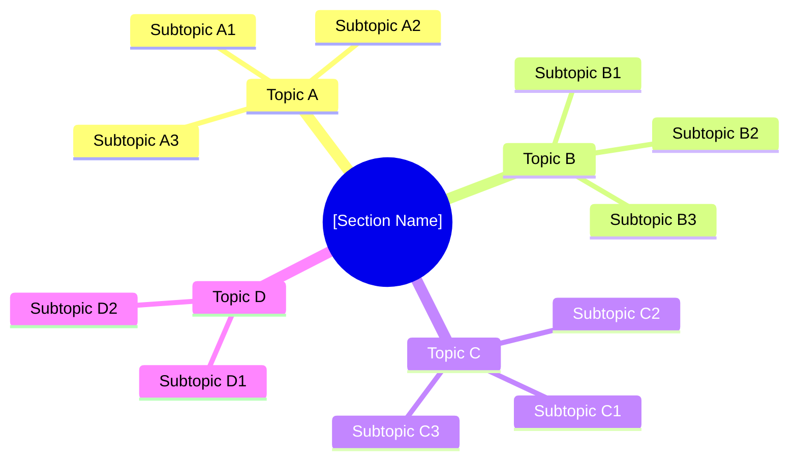
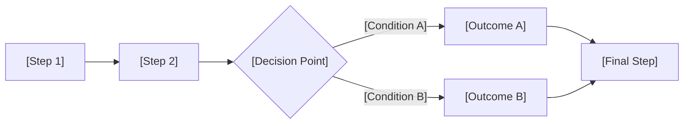

# Section Study Guide: [Section Name]

<!-- Individual exam section deep-dive template -->
<!-- Use one copy per exam section (e.g., section-1-economics/README.md) -->
<!-- Example domain: Series 65, Section 1 — Economic Factors & Business Information -->

---

## Document Control _(remove before publishing)_

| Field              | Value                                 |
| ------------------ | ------------------------------------- |
| **Exam Name**      | [Full exam name]                      |
| **Section Number** | [X of Y]                              |
| **Section Title**  | [Full section title]                  |
| **Weight**         | [XX]% — [XX] of [YY] scored questions |
| **Version**        | [X.X]                                 |
| **Last Updated**   | [DD-MMM-YYYY]                         |

---

## Section Overview

This section covers **[section title]** and accounts for **[XX]%** of the exam ([XX] scored questions). Focus areas include [list 3-5 major topic areas].

| Metric                  | Value                             |
| ----------------------- | --------------------------------- |
| **Scored Questions**    | [XX] of [YYY] total               |
| **Exam Weight**         | [XX]%                             |
| **Difficulty Rating**   | [Easy / Medium / Hard]            |
| **Study Time Estimate** | [XX] hours                        |
| **Must-Know Level**     | [Conceptual / Calculation / Both] |

> [!TIP]
> This section is [high/medium/low] yield. [Describe strategy, e.g., "Focus on conceptual understanding — calculation questions are straightforward if you know the formulas."]

---

## Topic Mind Map

---

## Topic Breakdown

### Topic A: [Topic Name]

**Weight within section:** ~[XX]% | **Difficulty:** [Easy / Medium / Hard]

#### Key Concepts

| Concept                | Definition / Rule                                                                     | Exam Relevance |
| ---------------------- | ------------------------------------------------------------------------------------- | -------------- |
| [Concept 1, e.g., GDP] | [Gross Domestic Product — total market value of goods/services produced domestically] | High           |
| [Concept 2, e.g., CPI] | [Consumer Price Index — measures changes in price level of consumer goods basket]     | High           |
| [Concept 3, e.g., PPI] | [Producer Price Index — measures wholesale price changes]                             | Medium         |
| [Concept 4]            | [Definition]                                                                          | [High/Med/Low] |

#### Must-Know Details

- **[Key fact 1]:** [Detailed explanation. E.g., "GDP includes only NEW production — resale of existing goods is excluded."]
- **[Key fact 2]:** [Detailed explanation]
- **[Key fact 3]:** [Detailed explanation]

#### Relationships & Comparisons

| Item A               | vs. | Item B               | Key Difference                                   |
| -------------------- | --- | -------------------- | ------------------------------------------------ |
| [Real GDP]           | vs. | [Nominal GDP]        | [Real adjusts for inflation; nominal does not]   |
| [Leading indicators] | vs. | [Lagging indicators] | [Leading predict; lagging confirm]               |
| [Fiscal policy]      | vs. | [Monetary policy]    | [Government spending/tax vs. Fed interest rates] |

#### Common Exam Traps

> [!WARNING]
> **Trap:** [Describe the common mistake, e.g., "Students confuse money supply measures — M1 is most liquid (cash + demand deposits), M2 = M1 + savings + small time deposits."]
>
> **Correct approach:** [How to handle it on exam day]

---

### Topic B: [Topic Name]

**Weight within section:** ~[XX]% | **Difficulty:** [Easy / Medium / Hard]

#### Key Concepts

| Concept                             | Definition / Rule                                  | Exam Relevance |
| ----------------------------------- | -------------------------------------------------- | -------------- |
| [Concept 1, e.g., Balance Sheet]    | [Assets = Liabilities + Equity at a point in time] | High           |
| [Concept 2, e.g., Income Statement] | [Revenue - Expenses = Net Income over a period]    | High           |
| [Concept 3, e.g., Cash Flow]        | [Operating, investing, financing activities]       | Medium         |

#### Formulas

| Formula            | Expression                                                                                | When to Use              |
| ------------------ | ----------------------------------------------------------------------------------------- | ------------------------ |
| [Current Ratio]    | $\frac{\text{Current Assets}}{\text{Current Liabilities}}$                                | Liquidity assessment     |
| [Quick Ratio]      | $\frac{\text{Current Assets} - \text{Inventory}}{\text{Current Liabilities}}$             | Stricter liquidity test  |
| [Debt-to-Equity]   | $\frac{\text{Total Debt}}{\text{Total Equity}}$                                           | Leverage assessment      |
| [Return on Equity] | $\frac{\text{Net Income}}{\text{Shareholders' Equity}}$                                   | Profitability assessment |
| [EPS]              | $\frac{\text{Net Income} - \text{Preferred Dividends}}{\text{Common Shares Outstanding}}$ | Per-share earnings       |
| [P/E Ratio]        | $\frac{\text{Market Price per Share}}{\text{EPS}}$                                        | Valuation comparison     |

#### Worked Example

**Problem:** [A company has current assets of $500,000 and current liabilities of $250,000. What is the current ratio?]

**Solution:**

$$\text{Current Ratio} = \frac{\$500{,}000}{\$250{,}000} = 2.0$$

**Interpretation:** [A current ratio of 2.0 means the company has $2 in current assets for every $1 in current liabilities — generally considered healthy.]

#### Common Exam Traps

> [!WARNING]
> **Trap:** [Describe trap, e.g., "Questions may give you total assets and ask for working capital — remember Working Capital = Current Assets - Current Liabilities, NOT Total Assets."]
>
> **Correct approach:** [Clarification]

---

### Topic C: [Topic Name]

**Weight within section:** ~[XX]% | **Difficulty:** [Easy / Medium / Hard]

#### Key Concepts

| Concept                          | Definition / Rule                                     | Exam Relevance |
| -------------------------------- | ----------------------------------------------------- | -------------- |
| [Concept 1, e.g., Present Value] | [Today's value of future cash flows discounted at r]  | High           |
| [Concept 2, e.g., Future Value]  | [Value of current sum at future date compounded at r] | High           |
| [Concept 3, e.g., NPV]           | [Sum of PVs of all cash flows — accept if > 0]        | Medium         |
| [Concept 4, e.g., IRR]           | [Discount rate where NPV = 0]                         | Medium         |

#### Formulas

| Formula          | Expression                                          | Variables                     |
| ---------------- | --------------------------------------------------- | ----------------------------- |
| [Future Value]   | $FV = PV \times (1 + r)^n$                          | PV, rate, periods             |
| [Present Value]  | $PV = \frac{FV}{(1 + r)^n}$                         | FV, rate, periods             |
| [Rule of 72]     | $\text{Years} = \frac{72}{r\%}$                     | Interest rate as whole number |
| [Std. Deviation] | $\sigma = \sqrt{\frac{\sum(x_i - \bar{x})^2}{n-1}}$ | Observations, mean            |

#### Worked Example

**Problem:** [If you invest $10,000 at 6% annual interest, what is it worth in 10 years?]

**Solution:**

$$FV = \$10{,}000 \times (1 + 0.06)^{10} = \$10{,}000 \times 1.7908 = \$17{,}908.48$$

**Quick check with Rule of 72:** $72 / 6 = 12$ years to double. At 10 years, the investment should be less than $20,000. $17,908 checks out.

---

### Topic D: [Topic Name]

**Weight within section:** ~[XX]% | **Difficulty:** [Easy / Medium / Hard]

#### Key Concepts

| Concept     | Definition / Rule | Exam Relevance |
| ----------- | ----------------- | -------------- |
| [Concept 1] | [Definition]      | [High/Med/Low] |
| [Concept 2] | [Definition]      | [High/Med/Low] |
| [Concept 3] | [Definition]      | [High/Med/Low] |

#### Process Flow

#### Key Rules & Thresholds

| Rule / Threshold           | Value / Condition                              | Consequence                         |
| -------------------------- | ---------------------------------------------- | ----------------------------------- |
| [Rule 1, e.g., De minimis] | [Fewer than X clients in state in prior 12 mo] | [Exemption from state registration] |
| [Rule 2]                   | [Condition]                                    | [Result]                            |
| [Rule 3]                   | [Condition]                                    | [Result]                            |

---

## Section Summary: Critical Facts

> [!IMPORTANT]
> **Top 10 must-know items for this section:**

1. [Critical fact 1 — e.g., "GDP = C + I + G + (X - M)"]
2. [Critical fact 2]
3. [Critical fact 3]
4. [Critical fact 4]
5. [Critical fact 5]
6. [Critical fact 6]
7. [Critical fact 7]
8. [Critical fact 8]
9. [Critical fact 9]
10. [Critical fact 10]

---

## Self-Assessment Checklist

| Topic           | Can Explain | Can Calculate | Can Apply to Scenario | Confidence |
| --------------- | ----------- | ------------- | --------------------- | ---------- |
| [Topic A: Name] | [ ]         | [ ]           | [ ]                   | [1-5]      |
| [Topic B: Name] | [ ]         | [ ]           | [ ]                   | [1-5]      |
| [Topic C: Name] | [ ]         | [ ]           | [ ]                   | [1-5]      |
| [Topic D: Name] | [ ]         | [ ]           | [ ]                   | [1-5]      |

**Confidence Scale:** 1 = Cannot recall, 2 = Vaguely familiar, 3 = Understand concept, 4 = Can apply, 5 = Can teach it

---

## Practice Question Preview

Test your understanding with these sample questions before moving to the full question bank.

**Q1:** [Sample question testing Topic A — conceptual]

Answer

**[B]** — [Explanation of correct answer and why other options are wrong.]

---

**Q2:** [Sample question testing Topic B — calculation]

Answer

**[C]** — [Step-by-step calculation and explanation.]

---

**Q3:** [Sample question testing Topic C — application/scenario]

Answer

**[A]** — [Explanation with reference to the specific rule or concept tested.]

---

## Study Notes

_Use this space for personal annotations, weak-area notes, and exam-day reminders._

| Date   | Topic Reviewed | Key Takeaway / Weak Spot             | Follow-Up Action      |
| ------ | -------------- | ------------------------------------ | --------------------- |
| [Date] | [Topic]        | [What you learned or struggled with] | [What to review next] |
| [Date] | [Topic]        | [Note]                               | [Action]              |
| [Date] | [Topic]        | [Note]                               | [Action]              |

---

## See Also

- [Exam Prep Master](./exam_prep_master.md) — Full exam overview, timeline, and progress tracking
- [Practice Questions](./practice_questions.md) — Comprehensive question bank for all sections
- [Quick Reference](./quick_reference.md) — Flashcard-style facts and formula sheet

---

_Verify all content against the current official exam outline. Exam content may change between testing windows._
